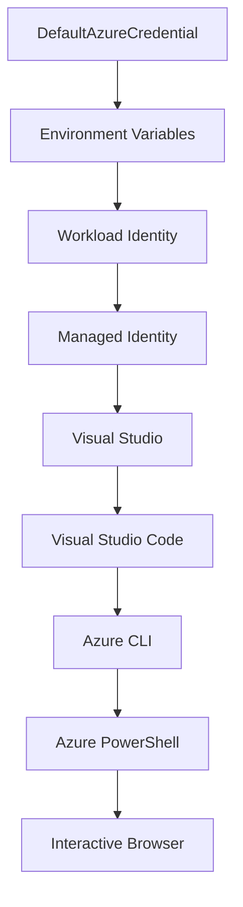

<!--
CO_OP_TRANSLATOR_METADATA:
{
  "original_hash": "fb0687bd0b166ecb0430dfeeed83487e",
  "translation_date": "2025-10-24T16:34:22+00:00",
  "source_file": "docs/getting-started/azd-basics.md",
  "language_code": "ar"
}
-->
# أساسيات AZD - فهم Azure Developer CLI

# أساسيات AZD - المفاهيم الأساسية والمبادئ

**تنقل الفصول:**
- **📚 الصفحة الرئيسية للدورة**: [AZD للمبتدئين](../../README.md)
- **📖 الفصل الحالي**: الفصل الأول - الأساسيات والبداية السريعة
- **⬅️ السابق**: [نظرة عامة على الدورة](../../README.md#-chapter-1-foundation--quick-start)
- **➡️ التالي**: [التثبيت والإعداد](installation.md)
- **🚀 الفصل التالي**: [الفصل الثاني: تطوير يعتمد على الذكاء الاصطناعي](../ai-foundry/azure-ai-foundry-integration.md)

## المقدمة

تقدم هذه الدرس أداة Azure Developer CLI (azd)، وهي أداة سطر أوامر قوية تسرّع رحلتك من التطوير المحلي إلى النشر على Azure. ستتعرف على المفاهيم الأساسية، الميزات الرئيسية، وكيفية تبسيط azd لنشر التطبيقات السحابية الأصلية.

## أهداف التعلم

بنهاية هذا الدرس، ستتمكن من:
- فهم ما هو Azure Developer CLI والغرض الأساسي منه
- التعرف على المفاهيم الأساسية مثل القوالب، البيئات، والخدمات
- استكشاف الميزات الرئيسية بما في ذلك التطوير المعتمد على القوالب والبنية التحتية ككود
- فهم هيكل مشروع azd وسير العمل
- الاستعداد لتثبيت وتكوين azd لبيئة التطوير الخاصة بك

## نتائج التعلم

بعد إكمال هذا الدرس، ستتمكن من:
- شرح دور azd في سير عمل التطوير السحابي الحديث
- تحديد مكونات هيكل مشروع azd
- وصف كيفية عمل القوالب، البيئات، والخدمات معًا
- فهم فوائد البنية التحتية ككود باستخدام azd
- التعرف على أوامر azd المختلفة وأغراضها

## ما هو Azure Developer CLI (azd)؟

Azure Developer CLI (azd) هي أداة سطر أوامر مصممة لتسريع رحلتك من التطوير المحلي إلى النشر على Azure. تبسط عملية بناء، نشر، وإدارة التطبيقات السحابية الأصلية على Azure.

## المفاهيم الأساسية

### القوالب
القوالب هي الأساس لـ azd. تحتوي على:
- **كود التطبيق** - كود المصدر والاعتماديات
- **تعريفات البنية التحتية** - موارد Azure المحددة باستخدام Bicep أو Terraform
- **ملفات التكوين** - الإعدادات والمتغيرات البيئية
- **سكربتات النشر** - سير عمل النشر الآلي

### البيئات
تمثل البيئات أهداف النشر المختلفة:
- **التطوير** - للاختبار والتطوير
- **الاختبار** - بيئة ما قبل الإنتاج
- **الإنتاج** - بيئة الإنتاج الحية

كل بيئة تحتفظ بـ:
- مجموعة موارد Azure الخاصة بها
- إعدادات التكوين
- حالة النشر

### الخدمات
الخدمات هي اللبنات الأساسية لتطبيقك:
- **الواجهة الأمامية** - تطبيقات الويب، SPAs
- **الواجهة الخلفية** - APIs، الخدمات المصغرة
- **قاعدة البيانات** - حلول تخزين البيانات
- **التخزين** - تخزين الملفات والبلوب

## الميزات الرئيسية

### 1. التطوير المعتمد على القوالب
```bash
# Browse available templates
azd template list

# Initialize from a template
azd init --template <template-name>
```

### 2. البنية التحتية ككود
- **Bicep** - لغة خاصة بمجال Azure
- **Terraform** - أداة بنية تحتية متعددة السحابات
- **ARM Templates** - قوالب مدير موارد Azure

### 3. سير العمل المتكامل
```bash
# Complete deployment workflow
azd up            # Provision + Deploy this is hands off for first time setup

# 🧪 NEW: Preview infrastructure changes before deployment (SAFE)
azd provision --preview    # Simulate infrastructure deployment without making changes

azd provision     # Create Azure resources if you update the infrastructure use this
azd deploy        # Deploy application code or redeploy application code once update
azd down          # Clean up resources
```

#### 🛡️ تخطيط البنية التحتية الآمن باستخدام المعاينة
أمر `azd provision --preview` هو تغيير كبير في عمليات النشر الآمنة:
- **تحليل التشغيل الجاف** - يعرض ما سيتم إنشاؤه، تعديله، أو حذفه
- **بدون مخاطر** - لا يتم إجراء تغييرات فعلية على بيئة Azure الخاصة بك
- **تعاون الفريق** - مشاركة نتائج المعاينة قبل النشر
- **تقدير التكلفة** - فهم تكاليف الموارد قبل الالتزام

```bash
# Example preview workflow
azd provision --preview           # See what will change
# Review the output, discuss with team
azd provision                     # Apply changes with confidence
```

### 4. إدارة البيئات
```bash
# Create and manage environments
azd env new <environment-name>
azd env select <environment-name>
azd env list
```

## 📁 هيكل المشروع

هيكل مشروع azd النموذجي:
```
my-app/
├── .azd/                    # azd configuration
│   └── config.json
├── .azure/                  # Azure deployment artifacts
├── .devcontainer/          # Development container config
├── .github/workflows/      # GitHub Actions
├── .vscode/               # VS Code settings
├── infra/                 # Infrastructure code
│   ├── main.bicep        # Main infrastructure template
│   ├── main.parameters.json
│   └── modules/          # Reusable modules
├── src/                  # Application source code
│   ├── api/             # Backend services
│   └── web/             # Frontend application
├── azure.yaml           # azd project configuration
└── README.md
```

## 🔧 ملفات التكوين

### azure.yaml
ملف التكوين الرئيسي للمشروع:
```yaml
name: my-awesome-app
metadata:
  template: my-template@1.0.0

services:
  web:
    project: ./src/web
    language: js
    host: appservice
  api:
    project: ./src/api
    language: js
    host: appservice

hooks:
  preprovision:
    shell: pwsh
    run: echo "Preparing to provision..."
```

### .azure/config.json
تكوين خاص بالبيئة:
```json
{
  "version": 1,
  "defaultEnvironment": "dev",
  "environments": {
    "dev": {
      "subscriptionId": "your-subscription-id",
      "location": "eastus"
    }
  }
}
```

## 🎪 سير العمل الشائع

### بدء مشروع جديد
```bash
# Method 1: Use existing template
azd init --template todo-nodejs-mongo

# Method 2: Start from scratch
azd init

# Method 3: Use current directory
azd init .
```

### دورة التطوير
```bash
# Set up development environment
azd auth login
azd env new dev
azd env select dev

# Deploy everything
azd up

# Make changes and redeploy
azd deploy

# Clean up when done
azd down --force --purge # command in the Azure Developer CLI is a **hard reset** for your environment—especially useful when you're troubleshooting failed deployments, cleaning up orphaned resources, or prepping for a fresh redeploy.
```

## فهم `azd down --force --purge`
أمر `azd down --force --purge` هو طريقة قوية لإزالة بيئة azd بالكامل وجميع الموارد المرتبطة بها. إليك تفصيل لما يفعله كل علم:
```
--force
```
- يتخطى مطالبات التأكيد.
- مفيد للأتمتة أو البرمجة النصية حيث لا يمكن الإدخال اليدوي.
- يضمن استمرار الإزالة دون انقطاع، حتى إذا اكتشف CLI تناقضات.

```
--purge
```
يحذف **جميع البيانات الوصفية المرتبطة**، بما في ذلك:
حالة البيئة
المجلد المحلي `.azure`
معلومات النشر المخزنة مؤقتًا
يمنع azd من "تذكر" عمليات النشر السابقة، مما قد يسبب مشاكل مثل مجموعات الموارد غير المتطابقة أو مراجع السجل القديمة.

### لماذا تستخدم كلاهما؟
عندما تواجه مشكلة مع `azd up` بسبب حالة متبقية أو عمليات نشر جزئية، يضمن هذا المزيج **بداية نظيفة**.

إنه مفيد بشكل خاص بعد حذف الموارد يدويًا في بوابة Azure أو عند تبديل القوالب، البيئات، أو اتفاقيات تسمية مجموعات الموارد.

### إدارة البيئات المتعددة
```bash
# Create staging environment
azd env new staging
azd env select staging
azd up

# Switch back to dev
azd env select dev

# Compare environments
azd env list
```

## 🔐 المصادقة والاعتمادات

فهم المصادقة أمر بالغ الأهمية لعمليات نشر azd الناجحة. تستخدم Azure طرق مصادقة متعددة، ويستفيد azd من نفس سلسلة الاعتمادات المستخدمة بواسطة أدوات Azure الأخرى.

### مصادقة Azure CLI (`az login`)

قبل استخدام azd، تحتاج إلى المصادقة مع Azure. الطريقة الأكثر شيوعًا هي استخدام Azure CLI:

```bash
# Interactive login (opens browser)
az login

# Login with specific tenant
az login --tenant <tenant-id>

# Login with service principal
az login --service-principal -u <app-id> -p <password> --tenant <tenant-id>

# Check current login status
az account show

# List available subscriptions
az account list --output table

# Set default subscription
az account set --subscription <subscription-id>
```

### تدفق المصادقة
1. **تسجيل الدخول التفاعلي**: يفتح متصفحك الافتراضي للمصادقة
2. **تدفق رمز الجهاز**: للبيئات التي لا يمكن الوصول فيها إلى المتصفح
3. **المبدأ الخدمي**: لسيناريوهات الأتمتة وCI/CD
4. **الهوية المُدارة**: للتطبيقات المستضافة على Azure

### سلسلة الاعتمادات DefaultAzureCredential

`DefaultAzureCredential` هو نوع اعتماد يوفر تجربة مصادقة مبسطة من خلال محاولة مصادر اعتماد متعددة بترتيب محدد:

#### ترتيب سلسلة الاعتمادات


#### 1. متغيرات البيئة
```bash
# Set environment variables for service principal
export AZURE_CLIENT_ID="<app-id>"
export AZURE_CLIENT_SECRET="<password>"
export AZURE_TENANT_ID="<tenant-id>"
```

#### 2. هوية العمل (Kubernetes/GitHub Actions)
تُستخدم تلقائيًا في:
- خدمة Kubernetes Azure (AKS) مع هوية العمل
- GitHub Actions مع اتحاد OIDC
- سيناريوهات الهوية الاتحادية الأخرى

#### 3. الهوية المُدارة
للموارد Azure مثل:
- الأجهزة الافتراضية
- خدمة التطبيقات
- وظائف Azure
- مثيلات الحاويات

```bash
# Check if running on Azure resource with managed identity
az account show --query "user.type" --output tsv
# Returns: "servicePrincipal" if using managed identity
```

#### 4. تكامل أدوات المطورين
- **Visual Studio**: يستخدم الحساب المسجل تلقائيًا
- **VS Code**: يستخدم اعتمادات ملحق حساب Azure
- **Azure CLI**: يستخدم اعتمادات `az login` (الأكثر شيوعًا للتطوير المحلي)

### إعداد مصادقة AZD

```bash
# Method 1: Use Azure CLI (Recommended for development)
az login
azd auth login  # Uses existing Azure CLI credentials

# Method 2: Direct azd authentication
azd auth login --use-device-code  # For headless environments

# Method 3: Check authentication status
azd auth login --check-status

# Method 4: Logout and re-authenticate
azd auth logout
azd auth login
```

### أفضل ممارسات المصادقة

#### للتطوير المحلي
```bash
# 1. Login with Azure CLI
az login

# 2. Verify correct subscription
az account show
az account set --subscription "Your Subscription Name"

# 3. Use azd with existing credentials
azd auth login
```

#### لخطوط أنابيب CI/CD
```yaml
# GitHub Actions example
- name: Azure Login
  uses: azure/login@v1
  with:
    creds: ${{ secrets.AZURE_CREDENTIALS }}

- name: Deploy with azd
  run: |
    azd auth login --client-id ${{ secrets.AZURE_CLIENT_ID }} \
                    --client-secret ${{ secrets.AZURE_CLIENT_SECRET }} \
                    --tenant-id ${{ secrets.AZURE_TENANT_ID }}
    azd up --no-prompt
```

#### لبيئات الإنتاج
- استخدم **الهوية المُدارة** عند التشغيل على موارد Azure
- استخدم **المبدأ الخدمي** لسيناريوهات الأتمتة
- تجنب تخزين الاعتمادات في الكود أو ملفات التكوين
- استخدم **Azure Key Vault** للإعدادات الحساسة

### مشاكل المصادقة الشائعة وحلولها

#### المشكلة: "لم يتم العثور على اشتراك"
```bash
# Solution: Set default subscription
az account list --output table
az account set --subscription "<subscription-id>"
azd env set AZURE_SUBSCRIPTION_ID "<subscription-id>"
```

#### المشكلة: "أذونات غير كافية"
```bash
# Solution: Check and assign required roles
az role assignment list --assignee $(az account show --query user.name --output tsv)

# Common required roles:
# - Contributor (for resource management)
# - User Access Administrator (for role assignments)
```

#### المشكلة: "انتهت صلاحية الرمز"
```bash
# Solution: Re-authenticate
az logout
az login
azd auth logout
azd auth login
```

### المصادقة في سيناريوهات مختلفة

#### التطوير المحلي
```bash
# Personal development account
az login
azd auth login
```

#### تطوير الفريق
```bash
# Use specific tenant for organization
az login --tenant contoso.onmicrosoft.com
azd auth login
```

#### سيناريوهات متعددة المستأجرين
```bash
# Switch between tenants
az login --tenant tenant1.onmicrosoft.com
# Deploy to tenant 1
azd up

az login --tenant tenant2.onmicrosoft.com  
# Deploy to tenant 2
azd up
```

### اعتبارات الأمان

1. **تخزين الاعتمادات**: لا تقم أبدًا بتخزين الاعتمادات في الكود المصدر
2. **تحديد النطاق**: استخدم مبدأ الأقل امتيازًا للمبادئ الخدمية
3. **تدوير الرموز**: قم بتدوير أسرار المبادئ الخدمية بانتظام
4. **سجل التدقيق**: راقب أنشطة المصادقة والنشر
5. **أمان الشبكة**: استخدم نقاط النهاية الخاصة عندما يكون ذلك ممكنًا

### استكشاف مشاكل المصادقة

```bash
# Debug authentication issues
azd auth login --check-status
az account show
az account get-access-token

# Common diagnostic commands
whoami                          # Current user context
az ad signed-in-user show      # Azure AD user details
az group list                  # Test resource access
```

## فهم `azd down --force --purge`

### الاكتشاف
```bash
azd template list              # Browse templates
azd template show <template>   # Template details
azd init --help               # Initialization options
```

### إدارة المشروع
```bash
azd show                     # Project overview
azd env show                 # Current environment
azd config list             # Configuration settings
```

### المراقبة
```bash
azd monitor                  # Open Azure portal
azd pipeline config          # Set up CI/CD
azd logs                     # View application logs
```

## أفضل الممارسات

### 1. استخدام أسماء ذات معنى
```bash
# Good
azd env new production-east
azd init --template web-app-secure

# Avoid
azd env new env1
azd init --template template1
```

### 2. الاستفادة من القوالب
- ابدأ بالقوالب الموجودة
- خصصها لاحتياجاتك
- أنشئ قوالب قابلة لإعادة الاستخدام لمؤسستك

### 3. عزل البيئات
- استخدم بيئات منفصلة للتطوير/الاختبار/الإنتاج
- لا تقم بالنشر مباشرة إلى الإنتاج من الجهاز المحلي
- استخدم خطوط أنابيب CI/CD للنشر في الإنتاج

### 4. إدارة التكوين
- استخدم المتغيرات البيئية للبيانات الحساسة
- احتفظ بالتكوين تحت التحكم في الإصدار
- وثّق الإعدادات الخاصة بالبيئة

## تقدم التعلم

### مبتدئ (الأسبوع 1-2)
1. تثبيت azd والمصادقة
2. نشر قالب بسيط
3. فهم هيكل المشروع
4. تعلم الأوامر الأساسية (up، down، deploy)

### متوسط (الأسبوع 3-4)
1. تخصيص القوالب
2. إدارة البيئات المتعددة
3. فهم كود البنية التحتية
4. إعداد خطوط أنابيب CI/CD

### متقدم (الأسبوع 5+)
1. إنشاء قوالب مخصصة
2. أنماط البنية التحتية المتقدمة
3. عمليات النشر متعددة المناطق
4. تكوينات على مستوى المؤسسات

## الخطوات التالية

**📖 استمر في تعلم الفصل الأول:**
- [التثبيت والإعداد](installation.md) - تثبيت azd وتكوينه
- [مشروعك الأول](first-project.md) - إكمال البرنامج التعليمي العملي
- [دليل التكوين](configuration.md) - خيارات التكوين المتقدمة

**🎯 جاهز للفصل التالي؟**
- [الفصل الثاني: تطوير يعتمد على الذكاء الاصطناعي](../ai-foundry/azure-ai-foundry-integration.md) - ابدأ في بناء تطبيقات الذكاء الاصطناعي

## موارد إضافية

- [نظرة عامة على Azure Developer CLI](https://learn.microsoft.com/en-us/azure/developer/azure-developer-cli/)
- [معرض القوالب](https://azure.github.io/awesome-azd/)
- [نماذج المجتمع](https://github.com/Azure-Samples)

---

**تنقل الفصول:**
- **📚 الصفحة الرئيسية للدورة**: [AZD للمبتدئين](../../README.md)
- **📖 الفصل الحالي**: الفصل الأول - الأساسيات والبداية السريعة  
- **⬅️ السابق**: [نظرة عامة على الدورة](../../README.md#-chapter-1-foundation--quick-start)
- **➡️ التالي**: [التثبيت والإعداد](installation.md)
- **🚀 الفصل التالي**: [الفصل الثاني: تطوير يعتمد على الذكاء الاصطناعي](../ai-foundry/azure-ai-foundry-integration.md)

---

**إخلاء المسؤولية**:  
تم ترجمة هذا المستند باستخدام خدمة الترجمة بالذكاء الاصطناعي [Co-op Translator](https://github.com/Azure/co-op-translator). بينما نسعى لتحقيق الدقة، يرجى العلم أن الترجمات الآلية قد تحتوي على أخطاء أو عدم دقة. يجب اعتبار المستند الأصلي بلغته الأصلية المصدر الرسمي. للحصول على معلومات حاسمة، يُوصى بالترجمة البشرية الاحترافية. نحن غير مسؤولين عن أي سوء فهم أو تفسير خاطئ ينشأ عن استخدام هذه الترجمة.