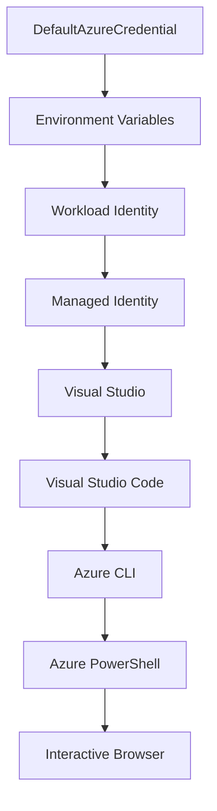

<!--
CO_OP_TRANSLATOR_METADATA:
{
  "original_hash": "fb0687bd0b166ecb0430dfeeed83487e",
  "translation_date": "2025-10-24T18:06:16+00:00",
  "source_file": "docs/getting-started/azd-basics.md",
  "language_code": "bg"
}
-->
# AZD Основи - Разбиране на Azure Developer CLI

# AZD Основи - Основни концепции и принципи

**Навигация по главата:**
- **📚 Начало на курса**: [AZD За начинаещи](../../README.md)
- **📖 Текуща глава**: Глава 1 - Основи и бърз старт
- **⬅️ Предишна**: [Преглед на курса](../../README.md#-chapter-1-foundation--quick-start)
- **➡️ Следваща**: [Инсталация и настройка](installation.md)
- **🚀 Следваща глава**: [Глава 2: Разработка с приоритет на AI](../ai-foundry/azure-ai-foundry-integration.md)

## Въведение

Този урок ви запознава с Azure Developer CLI (azd), мощен инструмент за команден ред, който ускорява вашето преминаване от локална разработка към внедряване в Azure. Ще научите основните концепции, ключовите функции и как azd опростява внедряването на облачни приложения.

## Цели на обучението

До края на този урок ще:
- Разберете какво представлява Azure Developer CLI и основната му цел
- Научите основните концепции за шаблони, среди и услуги
- Изследвате ключови функции, включително разработка, базирана на шаблони, и инфраструктура като код
- Разберете структурата и работния процес на проектите в azd
- Бъдете готови да инсталирате и конфигурирате azd за вашата среда за разработка

## Резултати от обучението

След завършване на този урок ще можете:
- Да обясните ролята на azd в съвременните работни процеси за облачна разработка
- Да идентифицирате компонентите на структурата на проектите в azd
- Да опишете как шаблоните, средите и услугите работят заедно
- Да разберете предимствата на инфраструктурата като код с azd
- Да разпознаете различни команди на azd и техните цели

## Какво е Azure Developer CLI (azd)?

Azure Developer CLI (azd) е инструмент за команден ред, създаден да ускори вашето преминаване от локална разработка към внедряване в Azure. Той опростява процеса на изграждане, внедряване и управление на облачни приложения в Azure.

## Основни концепции

### Шаблони
Шаблоните са основата на azd. Те съдържат:
- **Код на приложението** - Вашият изходен код и зависимости
- **Определения на инфраструктурата** - Ресурси в Azure, дефинирани с Bicep или Terraform
- **Конфигурационни файлове** - Настройки и променливи на средата
- **Скриптове за внедряване** - Автоматизирани работни процеси за внедряване

### Среда
Средите представляват различни цели за внедряване:
- **Разработка** - За тестване и разработка
- **Стадиране** - Предпроизводствена среда
- **Производство** - Жива производствена среда

Всяка среда поддържа свои собствени:
- Група ресурси в Azure
- Конфигурационни настройки
- Състояние на внедряване

### Услуги
Услугите са градивните елементи на вашето приложение:
- **Фронтенд** - Уеб приложения, SPAs
- **Бекенд** - API-та, микросървиси
- **База данни** - Решения за съхранение на данни
- **Съхранение** - Файлово и blob съхранение

## Ключови функции

### 1. Разработка, базирана на шаблони
```bash
# Browse available templates
azd template list

# Initialize from a template
azd init --template <template-name>
```

### 2. Инфраструктура като код
- **Bicep** - Специфичен език за Azure
- **Terraform** - Инструмент за инфраструктура за много облаци
- **ARM Templates** - Шаблони за Azure Resource Manager

### 3. Интегрирани работни процеси
```bash
# Complete deployment workflow
azd up            # Provision + Deploy this is hands off for first time setup

# 🧪 NEW: Preview infrastructure changes before deployment (SAFE)
azd provision --preview    # Simulate infrastructure deployment without making changes

azd provision     # Create Azure resources if you update the infrastructure use this
azd deploy        # Deploy application code or redeploy application code once update
azd down          # Clean up resources
```

#### 🛡️ Безопасно планиране на инфраструктура с Preview
Командата `azd provision --preview` е революционна за безопасни внедрявания:
- **Анализ на сухо изпълнение** - Показва какво ще бъде създадено, модифицирано или изтрито
- **Нулев риск** - Не се правят реални промени в средата на Azure
- **Сътрудничество в екип** - Споделяйте резултати от предварителен преглед преди внедряване
- **Оценка на разходите** - Разберете разходите за ресурси преди ангажимент

```bash
# Example preview workflow
azd provision --preview           # See what will change
# Review the output, discuss with team
azd provision                     # Apply changes with confidence
```

### 4. Управление на средите
```bash
# Create and manage environments
azd env new <environment-name>
azd env select <environment-name>
azd env list
```

## 📁 Структура на проекта

Типична структура на проект в azd:
```
my-app/
├── .azd/                    # azd configuration
│   └── config.json
├── .azure/                  # Azure deployment artifacts
├── .devcontainer/          # Development container config
├── .github/workflows/      # GitHub Actions
├── .vscode/               # VS Code settings
├── infra/                 # Infrastructure code
│   ├── main.bicep        # Main infrastructure template
│   ├── main.parameters.json
│   └── modules/          # Reusable modules
├── src/                  # Application source code
│   ├── api/             # Backend services
│   └── web/             # Frontend application
├── azure.yaml           # azd project configuration
└── README.md
```

## 🔧 Конфигурационни файлове

### azure.yaml
Основният конфигурационен файл на проекта:
```yaml
name: my-awesome-app
metadata:
  template: my-template@1.0.0

services:
  web:
    project: ./src/web
    language: js
    host: appservice
  api:
    project: ./src/api
    language: js
    host: appservice

hooks:
  preprovision:
    shell: pwsh
    run: echo "Preparing to provision..."
```

### .azure/config.json
Конфигурация, специфична за средата:
```json
{
  "version": 1,
  "defaultEnvironment": "dev",
  "environments": {
    "dev": {
      "subscriptionId": "your-subscription-id",
      "location": "eastus"
    }
  }
}
```

## 🎪 Общи работни процеси

### Започване на нов проект
```bash
# Method 1: Use existing template
azd init --template todo-nodejs-mongo

# Method 2: Start from scratch
azd init

# Method 3: Use current directory
azd init .
```

### Цикъл на разработка
```bash
# Set up development environment
azd auth login
azd env new dev
azd env select dev

# Deploy everything
azd up

# Make changes and redeploy
azd deploy

# Clean up when done
azd down --force --purge # command in the Azure Developer CLI is a **hard reset** for your environment—especially useful when you're troubleshooting failed deployments, cleaning up orphaned resources, or prepping for a fresh redeploy.
```

## Разбиране на `azd down --force --purge`
Командата `azd down --force --purge` е мощен начин за пълно премахване на вашата среда в azd и всички свързани ресурси. Ето разбивка на това какво прави всеки флаг:
```
--force
```
- Пропуска потвърждаващи подкани.
- Полезно за автоматизация или скриптове, където ръчното въвеждане не е възможно.
- Гарантира, че премахването продължава без прекъсване, дори ако CLI открие несъответствия.

```
--purge
```
Изтрива **всички свързани метаданни**, включително:
Състояние на средата
Локална папка `.azure`
Кеширана информация за внедряване
Предотвратява "запомнянето" на предишни внедрявания от azd, което може да причини проблеми като несъответстващи групи ресурси или остарели препратки към регистри.

### Защо да използвате и двете?
Когато сте срещнали проблем с `azd up` поради останало състояние или частични внедрявания, тази комбинация гарантира **чиста страница**.

Това е особено полезно след ръчно изтриване на ресурси в портала на Azure или при смяна на шаблони, среди или конвенции за именуване на групи ресурси.

### Управление на множество среди
```bash
# Create staging environment
azd env new staging
azd env select staging
azd up

# Switch back to dev
azd env select dev

# Compare environments
azd env list
```

## 🔐 Автентикация и идентификационни данни

Разбирането на автентикацията е от съществено значение за успешни внедрявания с azd. Azure използва множество методи за автентикация, а azd използва същата верига за идентификационни данни, която се използва от други инструменти на Azure.

### Автентикация с Azure CLI (`az login`)

Преди да използвате azd, трябва да се автентикирате с Azure. Най-често използваният метод е чрез Azure CLI:

```bash
# Interactive login (opens browser)
az login

# Login with specific tenant
az login --tenant <tenant-id>

# Login with service principal
az login --service-principal -u <app-id> -p <password> --tenant <tenant-id>

# Check current login status
az account show

# List available subscriptions
az account list --output table

# Set default subscription
az account set --subscription <subscription-id>
```

### Поток на автентикация
1. **Интерактивно влизане**: Отваря вашия браузър за автентикация
2. **Поток с код на устройство**: За среди без достъп до браузър
3. **Служебен принципал**: За автоматизация и сценарии с CI/CD
4. **Управлявана идентичност**: За приложения, хоствани в Azure

### Верига за идентификационни данни DefaultAzureCredential

`DefaultAzureCredential` е тип идентификационни данни, който предоставя опростено изживяване за автентикация, като автоматично опитва множество източници на идентификационни данни в определен ред:

#### Ред на веригата за идентификационни данни


#### 1. Променливи на средата
```bash
# Set environment variables for service principal
export AZURE_CLIENT_ID="<app-id>"
export AZURE_CLIENT_SECRET="<password>"
export AZURE_TENANT_ID="<tenant-id>"
```

#### 2. Workload Identity (Kubernetes/GitHub Actions)
Използва се автоматично в:
- Azure Kubernetes Service (AKS) с Workload Identity
- GitHub Actions с OIDC федерация
- Други сценарии с федеративна идентичност

#### 3. Управлявана идентичност
За ресурси в Azure като:
- Виртуални машини
- App Service
- Azure Functions
- Container Instances

```bash
# Check if running on Azure resource with managed identity
az account show --query "user.type" --output tsv
# Returns: "servicePrincipal" if using managed identity
```

#### 4. Интеграция с инструменти за разработка
- **Visual Studio**: Автоматично използва акаунта, с който сте влезли
- **VS Code**: Използва идентификационните данни от разширението Azure Account
- **Azure CLI**: Използва идентификационните данни от `az login` (най-често за локална разработка)

### Настройка на автентикация в AZD

```bash
# Method 1: Use Azure CLI (Recommended for development)
az login
azd auth login  # Uses existing Azure CLI credentials

# Method 2: Direct azd authentication
azd auth login --use-device-code  # For headless environments

# Method 3: Check authentication status
azd auth login --check-status

# Method 4: Logout and re-authenticate
azd auth logout
azd auth login
```

### Най-добри практики за автентикация

#### За локална разработка
```bash
# 1. Login with Azure CLI
az login

# 2. Verify correct subscription
az account show
az account set --subscription "Your Subscription Name"

# 3. Use azd with existing credentials
azd auth login
```

#### За CI/CD тръбопроводи
```yaml
# GitHub Actions example
- name: Azure Login
  uses: azure/login@v1
  with:
    creds: ${{ secrets.AZURE_CREDENTIALS }}

- name: Deploy with azd
  run: |
    azd auth login --client-id ${{ secrets.AZURE_CLIENT_ID }} \
                    --client-secret ${{ secrets.AZURE_CLIENT_SECRET }} \
                    --tenant-id ${{ secrets.AZURE_TENANT_ID }}
    azd up --no-prompt
```

#### За производствени среди
- Използвайте **управлявана идентичност**, когато работите с ресурси в Azure
- Използвайте **служебен принципал** за сценарии с автоматизация
- Избягвайте съхраняването на идентификационни данни в код или конфигурационни файлове
- Използвайте **Azure Key Vault** за чувствителна конфигурация

### Чести проблеми с автентикацията и решения

#### Проблем: "Не е намерен абонамент"
```bash
# Solution: Set default subscription
az account list --output table
az account set --subscription "<subscription-id>"
azd env set AZURE_SUBSCRIPTION_ID "<subscription-id>"
```

#### Проблем: "Недостатъчни права"
```bash
# Solution: Check and assign required roles
az role assignment list --assignee $(az account show --query user.name --output tsv)

# Common required roles:
# - Contributor (for resource management)
# - User Access Administrator (for role assignments)
```

#### Проблем: "Токенът е изтекъл"
```bash
# Solution: Re-authenticate
az logout
az login
azd auth logout
azd auth login
```

### Автентикация в различни сценарии

#### Локална разработка
```bash
# Personal development account
az login
azd auth login
```

#### Екипна разработка
```bash
# Use specific tenant for organization
az login --tenant contoso.onmicrosoft.com
azd auth login
```

#### Сценарии с много наематели
```bash
# Switch between tenants
az login --tenant tenant1.onmicrosoft.com
# Deploy to tenant 1
azd up

az login --tenant tenant2.onmicrosoft.com  
# Deploy to tenant 2
azd up
```

### Съображения за сигурност

1. **Съхранение на идентификационни данни**: Никога не съхранявайте идентификационни данни в изходния код
2. **Ограничение на обхвата**: Използвайте принципа на най-малките привилегии за служебни принципали
3. **Ротация на токени**: Редовно сменяйте тайните на служебните принципали
4. **Одитна следа**: Наблюдавайте дейностите по автентикация и внедряване
5. **Мрежова сигурност**: Използвайте частни крайни точки, когато е възможно

### Отстраняване на проблеми с автентикацията

```bash
# Debug authentication issues
azd auth login --check-status
az account show
az account get-access-token

# Common diagnostic commands
whoami                          # Current user context
az ad signed-in-user show      # Azure AD user details
az group list                  # Test resource access
```

## Разбиране на `azd down --force --purge`

### Откриване
```bash
azd template list              # Browse templates
azd template show <template>   # Template details
azd init --help               # Initialization options
```

### Управление на проекти
```bash
azd show                     # Project overview
azd env show                 # Current environment
azd config list             # Configuration settings
```

### Мониторинг
```bash
azd monitor                  # Open Azure portal
azd pipeline config          # Set up CI/CD
azd logs                     # View application logs
```

## Най-добри практики

### 1. Използвайте значими имена
```bash
# Good
azd env new production-east
azd init --template web-app-secure

# Avoid
azd env new env1
azd init --template template1
```

### 2. Използвайте шаблони
- Започнете с налични шаблони
- Персонализирайте според вашите нужди
- Създавайте повторно използваеми шаблони за вашата организация

### 3. Изолация на средите
- Използвайте отделни среди за разработка/стадиране/производство
- Никога не внедрявайте директно в производството от локална машина
- Използвайте CI/CD тръбопроводи за внедряване в производството

### 4. Управление на конфигурацията
- Използвайте променливи на средата за чувствителни данни
- Поддържайте конфигурацията в система за контрол на версиите
- Документирайте настройки, специфични за средата

## Прогресия на обучението

### Начинаещи (Седмица 1-2)
1. Инсталирайте azd и се автентикирайте
2. Внедрете прост шаблон
3. Разберете структурата на проекта
4. Научете основни команди (up, down, deploy)

### Средно напреднали (Седмица 3-4)
1. Персонализирайте шаблони
2. Управлявайте множество среди
3. Разберете кода за инфраструктурата
4. Настройте CI/CD тръбопроводи

### Напреднали (Седмица 5+)
1. Създайте персонализирани шаблони
2. Напреднали инфраструктурни модели
3. Внедряване в множество региони
4. Конфигурации за корпоративно ниво

## Следващи стъпки

**📖 Продължете обучението в Глава 1:**
- [Инсталация и настройка](installation.md) - Инсталирайте и конфигурирайте azd
- [Вашият първи проект](first-project.md) - Завършете практическо ръководство
- [Ръководство за конфигурация](configuration.md) - Разширени опции за конфигурация

**🎯 Готови за следващата глава?**
- [Глава 2: Разработка с приоритет на AI](../ai-foundry/azure-ai-foundry-integration.md) - Започнете изграждането на AI приложения

## Допълнителни ресурси

- [Преглед на Azure Developer CLI](https://learn.microsoft.com/en-us/azure/developer/azure-developer-cli/)
- [Галерия с шаблони](https://azure.github.io/awesome-azd/)
- [Примери от общността](https://github.com/Azure-Samples)

---

**Навигация по главата:**
- **📚 Начало на курса**: [AZD За начинаещи](../../README.md)
- **📖 Текуща глава**: Глава 1 - Основи и бърз старт  
- **⬅️ Предишна**: [Преглед на курса](../../README.md#-chapter-1-foundation--quick-start)
- **➡️ Следваща**: [Инсталация и настройка](installation.md)
- **🚀 Следваща глава**: [Глава 2: Разработка с приоритет на AI](../ai-foundry/azure-ai-foundry-integration.md)

---

**Отказ от отговорност**:  
Този документ е преведен с помощта на AI услуга за превод [Co-op Translator](https://github.com/Azure/co-op-translator). Въпреки че се стремим към точност, моля, имайте предвид, че автоматизираните преводи може да съдържат грешки или неточности. Оригиналният документ на неговия роден език трябва да се счита за авторитетен източник. За критична информация се препоръчва професионален човешки превод. Ние не носим отговорност за каквито и да е недоразумения или погрешни интерпретации, произтичащи от използването на този превод.