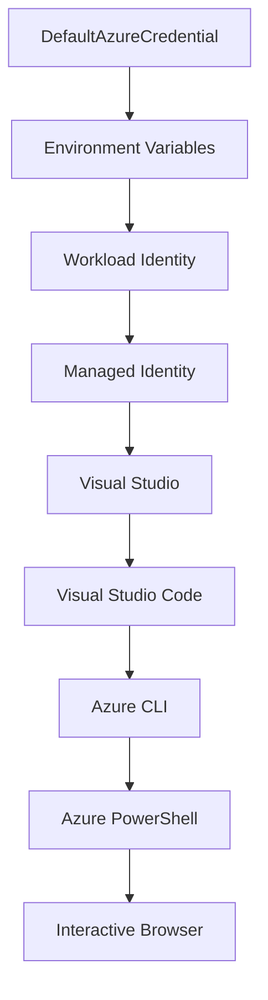

<!--
CO_OP_TRANSLATOR_METADATA:
{
  "original_hash": "fb0687bd0b166ecb0430dfeeed83487e",
  "translation_date": "2025-10-24T16:57:22+00:00",
  "source_file": "docs/getting-started/azd-basics.md",
  "language_code": "bn"
}
-->
# AZD বেসিকস - Azure Developer CLI সম্পর্কে বোঝা

# AZD বেসিকস - মূল ধারণা এবং ভিত্তি

**অধ্যায় নেভিগেশন:**
- **📚 কোর্স হোম**: [AZD For Beginners](../../README.md)
- **📖 বর্তমান অধ্যায়**: অধ্যায় ১ - ভিত্তি ও দ্রুত শুরু
- **⬅️ পূর্ববর্তী**: [কোর্স ওভারভিউ](../../README.md#-chapter-1-foundation--quick-start)
- **➡️ পরবর্তী**: [ইনস্টলেশন ও সেটআপ](installation.md)
- **🚀 পরবর্তী অধ্যায়**: [অধ্যায় ২: AI-প্রথম ডেভেলপমেন্ট](../ai-foundry/azure-ai-foundry-integration.md)

## পরিচিতি

এই পাঠে Azure Developer CLI (azd) এর সাথে পরিচিত হওয়া যাবে, যা একটি শক্তিশালী কমান্ড-লাইন টুল যা স্থানীয় ডেভেলপমেন্ট থেকে Azure-এ ডেপ্লয়মেন্টের যাত্রাকে ত্বরান্বিত করে। আপনি মৌলিক ধারণা, মূল বৈশিষ্ট্যগুলি শিখবেন এবং বুঝবেন কীভাবে azd ক্লাউড-নেটিভ অ্যাপ্লিকেশন ডেপ্লয়মেন্টকে সহজ করে তোলে।

## শেখার লক্ষ্য

এই পাঠ শেষে, আপনি:
- Azure Developer CLI কী এবং এর প্রধান উদ্দেশ্য বুঝতে পারবেন
- টেমপ্লেট, এনভায়রনমেন্ট এবং সার্ভিসের মূল ধারণাগুলি শিখবেন
- টেমপ্লেট-চালিত ডেভেলপমেন্ট এবং Infrastructure as Code এর মূল বৈশিষ্ট্যগুলি অন্বেষণ করবেন
- azd প্রকল্পের গঠন এবং কর্মপ্রবাহ বুঝতে পারবেন
- আপনার ডেভেলপমেন্ট এনভায়রনমেন্টের জন্য azd ইনস্টল এবং কনফিগার করতে প্রস্তুত হবেন

## শেখার ফলাফল

এই পাঠ সম্পন্ন করার পরে, আপনি:
- আধুনিক ক্লাউড ডেভেলপমেন্ট কর্মপ্রবাহে azd এর ভূমিকা ব্যাখ্যা করতে পারবেন
- একটি azd প্রকল্পের গঠনের উপাদানগুলি চিহ্নিত করতে পারবেন
- টেমপ্লেট, এনভায়রনমেন্ট এবং সার্ভিস কীভাবে একসাথে কাজ করে তা বর্ণনা করতে পারবেন
- azd এর সাথে Infrastructure as Code এর সুবিধাগুলি বুঝতে পারবেন
- বিভিন্ন azd কমান্ড এবং তাদের উদ্দেশ্যগুলি চিনতে পারবেন

## Azure Developer CLI (azd) কী?

Azure Developer CLI (azd) একটি কমান্ড-লাইন টুল যা স্থানীয় ডেভেলপমেন্ট থেকে Azure-এ ডেপ্লয়মেন্টের যাত্রাকে ত্বরান্বিত করার জন্য ডিজাইন করা হয়েছে। এটি Azure-এ ক্লাউড-নেটিভ অ্যাপ্লিকেশন তৈরি, ডেপ্লয় এবং পরিচালনা করার প্রক্রিয়াকে সহজ করে তোলে।

## মূল ধারণা

### টেমপ্লেট
টেমপ্লেটগুলি azd এর ভিত্তি। এগুলিতে অন্তর্ভুক্ত থাকে:
- **অ্যাপ্লিকেশন কোড** - আপনার সোর্স কোড এবং ডিপেনডেন্সি
- **ইনফ্রাস্ট্রাকচার ডেফিনিশন** - Bicep বা Terraform-এ সংজ্ঞায়িত Azure রিসোর্স
- **কনফিগারেশন ফাইল** - সেটিংস এবং এনভায়রনমেন্ট ভেরিয়েবল
- **ডেপ্লয়মেন্ট স্ক্রিপ্ট** - স্বয়ংক্রিয় ডেপ্লয়মেন্ট কর্মপ্রবাহ

### এনভায়রনমেন্ট
এনভায়রনমেন্টগুলি বিভিন্ন ডেপ্লয়মেন্ট টার্গেটকে উপস্থাপন করে:
- **ডেভেলপমেন্ট** - টেস্টিং এবং ডেভেলপমেন্টের জন্য
- **স্টেজিং** - প্রি-প্রোডাকশন এনভায়রনমেন্ট
- **প্রোডাকশন** - লাইভ প্রোডাকশন এনভায়রনমেন্ট

প্রতিটি এনভায়রনমেন্টের নিজস্ব:
- Azure রিসোর্স গ্রুপ
- কনফিগারেশন সেটিংস
- ডেপ্লয়মেন্ট স্টেট থাকে

### সার্ভিস
সার্ভিসগুলি আপনার অ্যাপ্লিকেশনের বিল্ডিং ব্লক:
- **ফ্রন্টএন্ড** - ওয়েব অ্যাপ্লিকেশন, SPAs
- **ব্যাকএন্ড** - APIs, মাইক্রোসার্ভিস
- **ডাটাবেস** - ডেটা স্টোরেজ সলিউশন
- **স্টোরেজ** - ফাইল এবং ব্লব স্টোরেজ

## মূল বৈশিষ্ট্য

### ১. টেমপ্লেট-চালিত ডেভেলপমেন্ট
```bash
# Browse available templates
azd template list

# Initialize from a template
azd init --template <template-name>
```

### ২. Infrastructure as Code
- **Bicep** - Azure এর ডোমেইন-স্পেসিফিক ল্যাঙ্গুয়েজ
- **Terraform** - মাল্টি-ক্লাউড ইনফ্রাস্ট্রাকচার টুল
- **ARM টেমপ্লেট** - Azure Resource Manager টেমপ্লেট

### ৩. ইন্টিগ্রেটেড কর্মপ্রবাহ
```bash
# Complete deployment workflow
azd up            # Provision + Deploy this is hands off for first time setup

# 🧪 NEW: Preview infrastructure changes before deployment (SAFE)
azd provision --preview    # Simulate infrastructure deployment without making changes

azd provision     # Create Azure resources if you update the infrastructure use this
azd deploy        # Deploy application code or redeploy application code once update
azd down          # Clean up resources
```

#### 🛡️ নিরাপদ ইনফ্রাস্ট্রাকচার পরিকল্পনা প্রিভিউ সহ
`azd provision --preview` কমান্ডটি নিরাপদ ডেপ্লয়মেন্টের জন্য একটি গেম-চেঞ্জার:
- **ড্রাই-রান বিশ্লেষণ** - কী তৈরি, পরিবর্তন বা মুছে ফেলা হবে তা দেখায়
- **শূন্য ঝুঁকি** - আপনার Azure এনভায়রনমেন্টে কোনো প্রকৃত পরিবর্তন করা হয় না
- **টিম সহযোগিতা** - ডেপ্লয়মেন্টের আগে প্রিভিউ ফলাফল শেয়ার করুন
- **খরচ অনুমান** - প্রতিশ্রুতির আগে রিসোর্স খরচ বুঝুন

```bash
# Example preview workflow
azd provision --preview           # See what will change
# Review the output, discuss with team
azd provision                     # Apply changes with confidence
```

### ৪. এনভায়রনমেন্ট ম্যানেজমেন্ট
```bash
# Create and manage environments
azd env new <environment-name>
azd env select <environment-name>
azd env list
```

## 📁 প্রকল্পের গঠন

একটি সাধারণ azd প্রকল্পের গঠন:
```
my-app/
├── .azd/                    # azd configuration
│   └── config.json
├── .azure/                  # Azure deployment artifacts
├── .devcontainer/          # Development container config
├── .github/workflows/      # GitHub Actions
├── .vscode/               # VS Code settings
├── infra/                 # Infrastructure code
│   ├── main.bicep        # Main infrastructure template
│   ├── main.parameters.json
│   └── modules/          # Reusable modules
├── src/                  # Application source code
│   ├── api/             # Backend services
│   └── web/             # Frontend application
├── azure.yaml           # azd project configuration
└── README.md
```

## 🔧 কনফিগারেশন ফাইল

### azure.yaml
প্রধান প্রকল্প কনফিগারেশন ফাইল:
```yaml
name: my-awesome-app
metadata:
  template: my-template@1.0.0

services:
  web:
    project: ./src/web
    language: js
    host: appservice
  api:
    project: ./src/api
    language: js
    host: appservice

hooks:
  preprovision:
    shell: pwsh
    run: echo "Preparing to provision..."
```

### .azure/config.json
এনভায়রনমেন্ট-স্পেসিফিক কনফিগারেশন:
```json
{
  "version": 1,
  "defaultEnvironment": "dev",
  "environments": {
    "dev": {
      "subscriptionId": "your-subscription-id",
      "location": "eastus"
    }
  }
}
```

## 🎪 সাধারণ কর্মপ্রবাহ

### একটি নতুন প্রকল্প শুরু করা
```bash
# Method 1: Use existing template
azd init --template todo-nodejs-mongo

# Method 2: Start from scratch
azd init

# Method 3: Use current directory
azd init .
```

### ডেভেলপমেন্ট চক্র
```bash
# Set up development environment
azd auth login
azd env new dev
azd env select dev

# Deploy everything
azd up

# Make changes and redeploy
azd deploy

# Clean up when done
azd down --force --purge # command in the Azure Developer CLI is a **hard reset** for your environment—especially useful when you're troubleshooting failed deployments, cleaning up orphaned resources, or prepping for a fresh redeploy.
```

## `azd down --force --purge` বুঝতে

`azd down --force --purge` কমান্ডটি আপনার azd এনভায়রনমেন্ট এবং সমস্ত সংশ্লিষ্ট রিসোর্স সম্পূর্ণরূপে মুছে ফেলার একটি শক্তিশালী উপায়। প্রতিটি ফ্ল্যাগ কী করে তার বিশ্লেষণ এখানে:
```
--force
```
- নিশ্চিতকরণ প্রম্পটগুলি এড়িয়ে যায়।
- অটোমেশন বা স্ক্রিপ্টিংয়ের জন্য উপযোগী যেখানে ম্যানুয়াল ইনপুট সম্ভব নয়।
- CLI কোনো অসঙ্গতি সনাক্ত করলেও টিয়ারডাউন বাধাহীনভাবে এগিয়ে যায়।

```
--purge
```
**সমস্ত সংশ্লিষ্ট মেটাডেটা** মুছে দেয়, যার মধ্যে রয়েছে:
এনভায়রনমেন্ট স্টেট
স্থানীয় `.azure` ফোল্ডার
ক্যাশড ডেপ্লয়মেন্ট তথ্য
azd কে পূর্ববর্তী ডেপ্লয়মেন্ট "মনে রাখা" থেকে বাধা দেয়, যা মিসম্যাচড রিসোর্স গ্রুপ বা পুরনো রেজিস্ট্রি রেফারেন্সের মতো সমস্যার কারণ হতে পারে।

### কেন উভয় ব্যবহার করবেন?
যখন `azd up` এর সাথে লেগে থাকেন পূর্ববর্তী স্টেট বা আংশিক ডেপ্লয়মেন্টের কারণে, এই কম্বো একটি **পরিষ্কার স্লেট** নিশ্চিত করে।

এটি বিশেষভাবে সহায়ক যখন Azure পোর্টালে ম্যানুয়াল রিসোর্স মুছে ফেলার পরে বা টেমপ্লেট, এনভায়রনমেন্ট বা রিসোর্স গ্রুপ নামকরণ কনভেনশন পরিবর্তন করার সময়।

### একাধিক এনভায়রনমেন্ট পরিচালনা
```bash
# Create staging environment
azd env new staging
azd env select staging
azd up

# Switch back to dev
azd env select dev

# Compare environments
azd env list
```

## 🔐 প্রমাণীকরণ এবং ক্রেডেনশিয়াল

সফল azd ডেপ্লয়মেন্টের জন্য প্রমাণীকরণ বোঝা গুরুত্বপূর্ণ। Azure একাধিক প্রমাণীকরণ পদ্ধতি ব্যবহার করে এবং azd অন্যান্য Azure টুল দ্বারা ব্যবহৃত একই ক্রেডেনশিয়াল চেইন ব্যবহার করে।

### Azure CLI প্রমাণীকরণ (`az login`)

azd ব্যবহার করার আগে, আপনাকে Azure-এ প্রমাণীকরণ করতে হবে। সবচেয়ে সাধারণ পদ্ধতি হল Azure CLI ব্যবহার করা:

```bash
# Interactive login (opens browser)
az login

# Login with specific tenant
az login --tenant <tenant-id>

# Login with service principal
az login --service-principal -u <app-id> -p <password> --tenant <tenant-id>

# Check current login status
az account show

# List available subscriptions
az account list --output table

# Set default subscription
az account set --subscription <subscription-id>
```

### প্রমাণীকরণ প্রবাহ
1. **ইন্টারঅ্যাকটিভ লগইন**: প্রমাণীকরণের জন্য আপনার ডিফল্ট ব্রাউজার খুলবে
2. **ডিভাইস কোড প্রবাহ**: ব্রাউজার অ্যাক্সেস ছাড়া এনভায়রনমেন্টের জন্য
3. **সার্ভিস প্রিন্সিপাল**: অটোমেশন এবং CI/CD পরিস্থিতির জন্য
4. **ম্যানেজড আইডেন্টিটি**: Azure-হোস্টেড অ্যাপ্লিকেশনের জন্য

### DefaultAzureCredential চেইন

`DefaultAzureCredential` একটি ক্রেডেনশিয়াল টাইপ যা নির্দিষ্ট ক্রমে একাধিক ক্রেডেনশিয়াল সোর্স স্বয়ংক্রিয়ভাবে চেষ্টা করে একটি সরলীকৃত প্রমাণীকরণ অভিজ্ঞতা প্রদান করে:

#### ক্রেডেনশিয়াল চেইন ক্রম


#### ১. এনভায়রনমেন্ট ভেরিয়েবল
```bash
# Set environment variables for service principal
export AZURE_CLIENT_ID="<app-id>"
export AZURE_CLIENT_SECRET="<password>"
export AZURE_TENANT_ID="<tenant-id>"
```

#### ২. ওয়ার্কলোড আইডেন্টিটি (Kubernetes/GitHub Actions)
স্বয়ংক্রিয়ভাবে ব্যবহৃত হয়:
- Azure Kubernetes Service (AKS) ওয়ার্কলোড আইডেন্টিটির সাথে
- GitHub Actions OIDC ফেডারেশনের সাথে
- অন্যান্য ফেডারেটেড আইডেন্টিটি পরিস্থিতিতে

#### ৩. ম্যানেজড আইডেন্টিটি
Azure রিসোর্সের জন্য যেমন:
- ভার্চুয়াল মেশিন
- অ্যাপ সার্ভিস
- Azure ফাংশন
- কন্টেইনার ইনস্ট্যান্স

```bash
# Check if running on Azure resource with managed identity
az account show --query "user.type" --output tsv
# Returns: "servicePrincipal" if using managed identity
```

#### ৪. ডেভেলপার টুল ইন্টিগ্রেশন
- **ভিজ্যুয়াল স্টুডিও**: স্বয়ংক্রিয়ভাবে সাইন-ইন করা অ্যাকাউন্ট ব্যবহার করে
- **VS কোড**: Azure Account এক্সটেনশন ক্রেডেনশিয়াল ব্যবহার করে
- **Azure CLI**: `az login` ক্রেডেনশিয়াল ব্যবহার করে (স্থানীয় ডেভেলপমেন্টের জন্য সবচেয়ে সাধারণ)

### AZD প্রমাণীকরণ সেটআপ

```bash
# Method 1: Use Azure CLI (Recommended for development)
az login
azd auth login  # Uses existing Azure CLI credentials

# Method 2: Direct azd authentication
azd auth login --use-device-code  # For headless environments

# Method 3: Check authentication status
azd auth login --check-status

# Method 4: Logout and re-authenticate
azd auth logout
azd auth login
```

### প্রমাণীকরণ সেরা অনুশীলন

#### স্থানীয় ডেভেলপমেন্টের জন্য
```bash
# 1. Login with Azure CLI
az login

# 2. Verify correct subscription
az account show
az account set --subscription "Your Subscription Name"

# 3. Use azd with existing credentials
azd auth login
```

#### CI/CD পাইপলাইনের জন্য
```yaml
# GitHub Actions example
- name: Azure Login
  uses: azure/login@v1
  with:
    creds: ${{ secrets.AZURE_CREDENTIALS }}

- name: Deploy with azd
  run: |
    azd auth login --client-id ${{ secrets.AZURE_CLIENT_ID }} \
                    --client-secret ${{ secrets.AZURE_CLIENT_SECRET }} \
                    --tenant-id ${{ secrets.AZURE_TENANT_ID }}
    azd up --no-prompt
```

#### প্রোডাকশন এনভায়রনমেন্টের জন্য
- Azure রিসোর্সে চালানোর সময় **ম্যানেজড আইডেন্টিটি** ব্যবহার করুন
- অটোমেশন পরিস্থিতির জন্য **সার্ভিস প্রিন্সিপাল** ব্যবহার করুন
- কোড বা কনফিগারেশন ফাইলে ক্রেডেনশিয়াল সংরক্ষণ এড়িয়ে চলুন
- সংবেদনশীল কনফিগারেশনের জন্য **Azure Key Vault** ব্যবহার করুন

### সাধারণ প্রমাণীকরণ সমস্যা এবং সমাধান

#### সমস্যা: "কোনো সাবস্ক্রিপশন পাওয়া যায়নি"
```bash
# Solution: Set default subscription
az account list --output table
az account set --subscription "<subscription-id>"
azd env set AZURE_SUBSCRIPTION_ID "<subscription-id>"
```

#### সমস্যা: "অপর্যাপ্ত অনুমতি"
```bash
# Solution: Check and assign required roles
az role assignment list --assignee $(az account show --query user.name --output tsv)

# Common required roles:
# - Contributor (for resource management)
# - User Access Administrator (for role assignments)
```

#### সমস্যা: "টোকেন মেয়াদোত্তীর্ণ"
```bash
# Solution: Re-authenticate
az logout
az login
azd auth logout
azd auth login
```

### বিভিন্ন পরিস্থিতিতে প্রমাণীকরণ

#### স্থানীয় ডেভেলপমেন্ট
```bash
# Personal development account
az login
azd auth login
```

#### টিম ডেভেলপমেন্ট
```bash
# Use specific tenant for organization
az login --tenant contoso.onmicrosoft.com
azd auth login
```

#### মাল্টি-টেন্যান্ট পরিস্থিতি
```bash
# Switch between tenants
az login --tenant tenant1.onmicrosoft.com
# Deploy to tenant 1
azd up

az login --tenant tenant2.onmicrosoft.com  
# Deploy to tenant 2
azd up
```

### নিরাপত্তা বিবেচনা

1. **ক্রেডেনশিয়াল সংরক্ষণ**: কখনোই সোর্স কোডে ক্রেডেনশিয়াল সংরক্ষণ করবেন না
2. **স্কোপ সীমাবদ্ধতা**: সার্ভিস প্রিন্সিপালের জন্য সর্বনিম্ন-অধিকার নীতি ব্যবহার করুন
3. **টোকেন রোটেশন**: নিয়মিত সার্ভিস প্রিন্সিপাল সিক্রেট রোটেট করুন
4. **অডিট ট্রেইল**: প্রমাণীকরণ এবং ডেপ্লয়মেন্ট কার্যক্রম পর্যবেক্ষণ করুন
5. **নেটওয়ার্ক নিরাপত্তা**: সম্ভব হলে প্রাইভেট এন্ডপয়েন্ট ব্যবহার করুন

### প্রমাণীকরণ সমস্যা সমাধান

```bash
# Debug authentication issues
azd auth login --check-status
az account show
az account get-access-token

# Common diagnostic commands
whoami                          # Current user context
az ad signed-in-user show      # Azure AD user details
az group list                  # Test resource access
```

## `azd down --force --purge` বুঝতে

### আবিষ্কার
```bash
azd template list              # Browse templates
azd template show <template>   # Template details
azd init --help               # Initialization options
```

### প্রকল্প ব্যবস্থাপনা
```bash
azd show                     # Project overview
azd env show                 # Current environment
azd config list             # Configuration settings
```

### পর্যবেক্ষণ
```bash
azd monitor                  # Open Azure portal
azd pipeline config          # Set up CI/CD
azd logs                     # View application logs
```

## সেরা অনুশীলন

### ১. অর্থবহ নাম ব্যবহার করুন
```bash
# Good
azd env new production-east
azd init --template web-app-secure

# Avoid
azd env new env1
azd init --template template1
```

### ২. টেমপ্লেট ব্যবহার করুন
- বিদ্যমান টেমপ্লেট দিয়ে শুরু করুন
- আপনার প্রয়োজন অনুযায়ী কাস্টমাইজ করুন
- আপনার সংস্থার জন্য পুনরায় ব্যবহারযোগ্য টেমপ্লেট তৈরি করুন

### ৩. এনভায়রনমেন্ট আইসোলেশন
- ডেভ/স্টেজিং/প্রোডের জন্য পৃথক এনভায়রনমেন্ট ব্যবহার করুন
- স্থানীয় মেশিন থেকে সরাসরি প্রোডাকশনে ডেপ্লয় করবেন না
- প্রোডাকশন ডেপ্লয়মেন্টের জন্য CI/CD পাইপলাইন ব্যবহার করুন

### ৪. কনফিগারেশন ব্যবস্থাপনা
- সংবেদনশীল ডেটার জন্য এনভায়রনমেন্ট ভেরিয়েবল ব্যবহার করুন
- কনফিগারেশন ভার্সন কন্ট্রোলে রাখুন
- এনভায়রনমেন্ট-স্পেসিফিক সেটিংস ডকুমেন্ট করুন

## শেখার অগ্রগতি

### বিগিনার (সপ্তাহ ১-২)
1. azd ইনস্টল করুন এবং প্রমাণীকরণ করুন
2. একটি সাধারণ টেমপ্লেট ডেপ্লয় করুন
3. প্রকল্পের গঠন বুঝুন
4. মৌলিক কমান্ড শিখুন (up, down, deploy)

### ইন্টারমিডিয়েট (সপ্তাহ ৩-৪)
1. টেমপ্লেট কাস্টমাইজ করুন
2. একাধিক এনভায়রনমেন্ট পরিচালনা করুন
3. ইনফ্রাস্ট্রাকচার কোড বুঝুন
4. CI/CD পাইপলাইন সেট আপ করুন

### অ্যাডভান্সড (সপ্তাহ ৫+)
1. কাস্টম টেমপ্লেট তৈরি করুন
2. উন্নত ইনফ্রাস্ট্রাকচার প্যাটার্ন
3. মাল্টি-রিজিয়ন ডেপ্লয়মেন্ট
4. এন্টারপ্রাইজ-গ্রেড কনফিগারেশন

## পরবর্তী পদক্ষেপ

**📖 অধ্যায় ১ শেখা চালিয়ে যান:**
- [ইনস্টলেশন ও সেটআপ](installation.md) - azd ইনস্টল এবং কনফিগার করুন
- [আপনার প্রথম প্রকল্প](first-project.md) - হাতে-কলমে টিউটোরিয়াল সম্পন্ন করুন
- [কনফিগারেশন গাইড](configuration.md) - উন্নত কনফিগারেশন অপশন

**🎯 পরবর্তী অধ্যায়ের জন্য প্রস্তুত?**
- [অধ্যায় ২: AI-প্রথম ডেভেলপমেন্ট](../ai-foundry/azure-ai-foundry-integration.md) - AI অ্যাপ্লিকেশন তৈরি শুরু করুন

## অতিরিক্ত সম্পদ

- [Azure Developer CLI ওভারভিউ](https://learn.microsoft.com/en-us/azure/developer/azure-developer-cli/)
- [টেমপ্লেট গ্যালারি](https://azure.github.io/awesome-azd/)
- [কমিউনিটি স্যাম্পল](https://github.com/Azure-Samples)

---

**অধ্যায় নেভিগেশন:**
- **📚 কোর্স হোম**: [AZD For Beginners](../../README.md)
- **📖 বর্তমান অধ্যায়**: অধ্যায় ১ - ভিত্তি ও দ্রুত শুরু  
- **⬅️ পূর্ববর্তী**: [কোর্স ওভারভিউ](../../README.md#-chapter-1-foundation--quick-start)
- **➡️ পরবর্তী**: [ইনস্টলেশন ও সেটআপ](installation.md)
- **🚀 পরবর্তী অধ্যায়**: [অধ্যায় ২: AI-প্রথম ডেভেলপমেন্ট](../ai-foundry/azure-ai-foundry-integration.md)

---

**অস্বীকৃতি**:  
এই নথিটি AI অনুবাদ পরিষেবা [Co-op Translator](https://github.com/Azure/co-op-translator) ব্যবহার করে অনুবাদ করা হয়েছে। আমরা যথাসাধ্য সঠিকতার জন্য চেষ্টা করি, তবে অনুগ্রহ করে মনে রাখবেন যে স্বয়ংক্রিয় অনুবাদে ত্রুটি বা অসঙ্গতি থাকতে পারে। মূল ভাষায় থাকা নথিটিকে প্রামাণিক উৎস হিসেবে বিবেচনা করা উচিত। গুরুত্বপূর্ণ তথ্যের জন্য, পেশাদার মানব অনুবাদ সুপারিশ করা হয়। এই অনুবাদ ব্যবহারের ফলে কোনো ভুল বোঝাবুঝি বা ভুল ব্যাখ্যার জন্য আমরা দায়ী থাকব না।