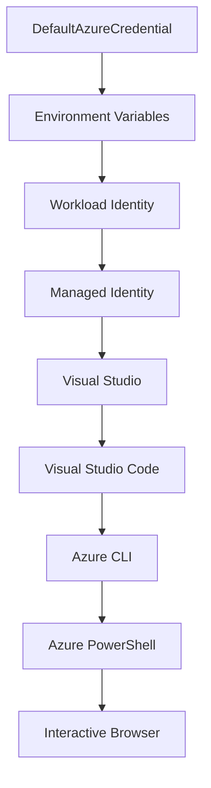

<!--
CO_OP_TRANSLATOR_METADATA:
{
  "original_hash": "fb0687bd0b166ecb0430dfeeed83487e",
  "translation_date": "2025-10-24T17:11:51+00:00",
  "source_file": "docs/getting-started/azd-basics.md",
  "language_code": "br"
}
-->
# Noções Básicas do AZD - Entendendo o Azure Developer CLI

# Noções Básicas do AZD - Conceitos e Fundamentos Principais

**Navegação do Capítulo:**
- **📚 Página Inicial do Curso**: [AZD Para Iniciantes](../../README.md)
- **📖 Capítulo Atual**: Capítulo 1 - Fundamentos e Início Rápido
- **⬅️ Anterior**: [Visão Geral do Curso](../../README.md#-chapter-1-foundation--quick-start)
- **➡️ Próximo**: [Instalação e Configuração](installation.md)
- **🚀 Próximo Capítulo**: [Capítulo 2: Desenvolvimento com Foco em IA](../ai-foundry/azure-ai-foundry-integration.md)

## Introdução

Esta lição apresenta o Azure Developer CLI (azd), uma poderosa ferramenta de linha de comando que acelera sua jornada do desenvolvimento local para a implantação no Azure. Você aprenderá os conceitos fundamentais, os recursos principais e entenderá como o azd simplifica a implantação de aplicações nativas da nuvem.

## Objetivos de Aprendizado

Ao final desta lição, você será capaz de:
- Entender o que é o Azure Developer CLI e seu propósito principal
- Aprender os conceitos principais de templates, ambientes e serviços
- Explorar recursos importantes, incluindo desenvolvimento baseado em templates e Infraestrutura como Código
- Compreender a estrutura de projetos do azd e seu fluxo de trabalho
- Estar preparado para instalar e configurar o azd para seu ambiente de desenvolvimento

## Resultados de Aprendizado

Após concluir esta lição, você será capaz de:
- Explicar o papel do azd nos fluxos de trabalho modernos de desenvolvimento em nuvem
- Identificar os componentes da estrutura de um projeto azd
- Descrever como templates, ambientes e serviços trabalham juntos
- Entender os benefícios da Infraestrutura como Código com o azd
- Reconhecer diferentes comandos do azd e seus propósitos

## O que é o Azure Developer CLI (azd)?

Azure Developer CLI (azd) é uma ferramenta de linha de comando projetada para acelerar sua jornada do desenvolvimento local para a implantação no Azure. Ela simplifica o processo de construção, implantação e gerenciamento de aplicações nativas da nuvem no Azure.

## Conceitos Principais

### Templates
Os templates são a base do azd. Eles contêm:
- **Código da aplicação** - Seu código-fonte e dependências
- **Definições de infraestrutura** - Recursos do Azure definidos em Bicep ou Terraform
- **Arquivos de configuração** - Configurações e variáveis de ambiente
- **Scripts de implantação** - Fluxos de trabalho automatizados de implantação

### Ambientes
Os ambientes representam diferentes alvos de implantação:
- **Desenvolvimento** - Para testes e desenvolvimento
- **Staging** - Ambiente de pré-produção
- **Produção** - Ambiente de produção ao vivo

Cada ambiente mantém seu próprio:
- Grupo de recursos do Azure
- Configurações de configuração
- Estado de implantação

### Serviços
Os serviços são os blocos de construção da sua aplicação:
- **Frontend** - Aplicações web, SPAs
- **Backend** - APIs, microsserviços
- **Banco de Dados** - Soluções de armazenamento de dados
- **Armazenamento** - Armazenamento de arquivos e blobs

## Recursos Principais

### 1. Desenvolvimento Baseado em Templates
```bash
# Browse available templates
azd template list

# Initialize from a template
azd init --template <template-name>
```

### 2. Infraestrutura como Código
- **Bicep** - Linguagem específica de domínio do Azure
- **Terraform** - Ferramenta de infraestrutura multi-nuvem
- **Templates ARM** - Templates do Azure Resource Manager

### 3. Fluxos de Trabalho Integrados
```bash
# Complete deployment workflow
azd up            # Provision + Deploy this is hands off for first time setup

# 🧪 NEW: Preview infrastructure changes before deployment (SAFE)
azd provision --preview    # Simulate infrastructure deployment without making changes

azd provision     # Create Azure resources if you update the infrastructure use this
azd deploy        # Deploy application code or redeploy application code once update
azd down          # Clean up resources
```

#### 🛡️ Planejamento Seguro de Infraestrutura com Preview
O comando `azd provision --preview` é revolucionário para implantações seguras:
- **Análise de simulação** - Mostra o que será criado, modificado ou excluído
- **Risco zero** - Nenhuma alteração real é feita no seu ambiente Azure
- **Colaboração em equipe** - Compartilhe os resultados do preview antes da implantação
- **Estimativa de custos** - Entenda os custos dos recursos antes de se comprometer

```bash
# Example preview workflow
azd provision --preview           # See what will change
# Review the output, discuss with team
azd provision                     # Apply changes with confidence
```

### 4. Gerenciamento de Ambientes
```bash
# Create and manage environments
azd env new <environment-name>
azd env select <environment-name>
azd env list
```

## 📁 Estrutura do Projeto

Uma estrutura típica de projeto azd:
```
my-app/
├── .azd/                    # azd configuration
│   └── config.json
├── .azure/                  # Azure deployment artifacts
├── .devcontainer/          # Development container config
├── .github/workflows/      # GitHub Actions
├── .vscode/               # VS Code settings
├── infra/                 # Infrastructure code
│   ├── main.bicep        # Main infrastructure template
│   ├── main.parameters.json
│   └── modules/          # Reusable modules
├── src/                  # Application source code
│   ├── api/             # Backend services
│   └── web/             # Frontend application
├── azure.yaml           # azd project configuration
└── README.md
```

## 🔧 Arquivos de Configuração

### azure.yaml
O principal arquivo de configuração do projeto:
```yaml
name: my-awesome-app
metadata:
  template: my-template@1.0.0

services:
  web:
    project: ./src/web
    language: js
    host: appservice
  api:
    project: ./src/api
    language: js
    host: appservice

hooks:
  preprovision:
    shell: pwsh
    run: echo "Preparing to provision..."
```

### .azure/config.json
Configuração específica do ambiente:
```json
{
  "version": 1,
  "defaultEnvironment": "dev",
  "environments": {
    "dev": {
      "subscriptionId": "your-subscription-id",
      "location": "eastus"
    }
  }
}
```

## 🎪 Fluxos de Trabalho Comuns

### Iniciando um Novo Projeto
```bash
# Method 1: Use existing template
azd init --template todo-nodejs-mongo

# Method 2: Start from scratch
azd init

# Method 3: Use current directory
azd init .
```

### Ciclo de Desenvolvimento
```bash
# Set up development environment
azd auth login
azd env new dev
azd env select dev

# Deploy everything
azd up

# Make changes and redeploy
azd deploy

# Clean up when done
azd down --force --purge # command in the Azure Developer CLI is a **hard reset** for your environment—especially useful when you're troubleshooting failed deployments, cleaning up orphaned resources, or prepping for a fresh redeploy.
```

## Entendendo `azd down --force --purge`
O comando `azd down --force --purge` é uma maneira poderosa de desmontar completamente seu ambiente azd e todos os recursos associados. Aqui está um resumo do que cada parâmetro faz:
```
--force
```
- Ignora os prompts de confirmação.
- Útil para automação ou scripts onde a entrada manual não é viável.
- Garante que o processo de desmontagem ocorra sem interrupções, mesmo que o CLI detecte inconsistências.

```
--purge
```
Exclui **todos os metadados associados**, incluindo:
Estado do ambiente  
Pasta local `.azure`  
Informações de implantação em cache  
Impede que o azd "lembre" implantações anteriores, o que pode causar problemas como grupos de recursos incompatíveis ou referências de registro obsoletas.

### Por que usar ambos?
Quando você encontra problemas com `azd up` devido a estado persistente ou implantações parciais, essa combinação garante um **novo começo**.

É especialmente útil após exclusões manuais de recursos no portal do Azure ou ao trocar templates, ambientes ou convenções de nomenclatura de grupos de recursos.

### Gerenciando Múltiplos Ambientes
```bash
# Create staging environment
azd env new staging
azd env select staging
azd up

# Switch back to dev
azd env select dev

# Compare environments
azd env list
```

## 🔐 Autenticação e Credenciais

Entender a autenticação é crucial para implantações bem-sucedidas com azd. O Azure utiliza vários métodos de autenticação, e o azd aproveita a mesma cadeia de credenciais usada por outras ferramentas do Azure.

### Autenticação com Azure CLI (`az login`)

Antes de usar o azd, você precisa se autenticar com o Azure. O método mais comum é usando o Azure CLI:

```bash
# Interactive login (opens browser)
az login

# Login with specific tenant
az login --tenant <tenant-id>

# Login with service principal
az login --service-principal -u <app-id> -p <password> --tenant <tenant-id>

# Check current login status
az account show

# List available subscriptions
az account list --output table

# Set default subscription
az account set --subscription <subscription-id>
```

### Fluxo de Autenticação
1. **Login Interativo**: Abre seu navegador padrão para autenticação
2. **Fluxo de Código de Dispositivo**: Para ambientes sem acesso ao navegador
3. **Principal de Serviço**: Para cenários de automação e CI/CD
4. **Identidade Gerenciada**: Para aplicações hospedadas no Azure

### Cadeia de Credenciais DefaultAzureCredential

`DefaultAzureCredential` é um tipo de credencial que oferece uma experiência de autenticação simplificada ao tentar automaticamente várias fontes de credenciais em uma ordem específica:

#### Ordem da Cadeia de Credenciais


#### 1. Variáveis de Ambiente
```bash
# Set environment variables for service principal
export AZURE_CLIENT_ID="<app-id>"
export AZURE_CLIENT_SECRET="<password>"
export AZURE_TENANT_ID="<tenant-id>"
```

#### 2. Identidade de Trabalho (Kubernetes/Ações do GitHub)
Usado automaticamente em:
- Azure Kubernetes Service (AKS) com Identidade de Trabalho
- Ações do GitHub com federação OIDC
- Outros cenários de identidade federada

#### 3. Identidade Gerenciada
Para recursos do Azure como:
- Máquinas Virtuais
- App Service
- Funções do Azure
- Instâncias de Contêiner

```bash
# Check if running on Azure resource with managed identity
az account show --query "user.type" --output tsv
# Returns: "servicePrincipal" if using managed identity
```

#### 4. Integração com Ferramentas de Desenvolvimento
- **Visual Studio**: Usa automaticamente a conta conectada
- **VS Code**: Usa credenciais da extensão Azure Account
- **Azure CLI**: Usa credenciais do `az login` (mais comum para desenvolvimento local)

### Configuração de Autenticação do AZD

```bash
# Method 1: Use Azure CLI (Recommended for development)
az login
azd auth login  # Uses existing Azure CLI credentials

# Method 2: Direct azd authentication
azd auth login --use-device-code  # For headless environments

# Method 3: Check authentication status
azd auth login --check-status

# Method 4: Logout and re-authenticate
azd auth logout
azd auth login
```

### Melhores Práticas de Autenticação

#### Para Desenvolvimento Local
```bash
# 1. Login with Azure CLI
az login

# 2. Verify correct subscription
az account show
az account set --subscription "Your Subscription Name"

# 3. Use azd with existing credentials
azd auth login
```

#### Para Pipelines de CI/CD
```yaml
# GitHub Actions example
- name: Azure Login
  uses: azure/login@v1
  with:
    creds: ${{ secrets.AZURE_CREDENTIALS }}

- name: Deploy with azd
  run: |
    azd auth login --client-id ${{ secrets.AZURE_CLIENT_ID }} \
                    --client-secret ${{ secrets.AZURE_CLIENT_SECRET }} \
                    --tenant-id ${{ secrets.AZURE_TENANT_ID }}
    azd up --no-prompt
```

#### Para Ambientes de Produção
- Use **Identidade Gerenciada** ao executar em recursos do Azure
- Use **Principal de Serviço** para cenários de automação
- Evite armazenar credenciais em código ou arquivos de configuração
- Use **Azure Key Vault** para configurações sensíveis

### Problemas Comuns de Autenticação e Soluções

#### Problema: "Nenhuma assinatura encontrada"
```bash
# Solution: Set default subscription
az account list --output table
az account set --subscription "<subscription-id>"
azd env set AZURE_SUBSCRIPTION_ID "<subscription-id>"
```

#### Problema: "Permissões insuficientes"
```bash
# Solution: Check and assign required roles
az role assignment list --assignee $(az account show --query user.name --output tsv)

# Common required roles:
# - Contributor (for resource management)
# - User Access Administrator (for role assignments)
```

#### Problema: "Token expirado"
```bash
# Solution: Re-authenticate
az logout
az login
azd auth logout
azd auth login
```

### Autenticação em Diferentes Cenários

#### Desenvolvimento Local
```bash
# Personal development account
az login
azd auth login
```

#### Desenvolvimento em Equipe
```bash
# Use specific tenant for organization
az login --tenant contoso.onmicrosoft.com
azd auth login
```

#### Cenários Multi-tenant
```bash
# Switch between tenants
az login --tenant tenant1.onmicrosoft.com
# Deploy to tenant 1
azd up

az login --tenant tenant2.onmicrosoft.com  
# Deploy to tenant 2
azd up
```

### Considerações de Segurança

1. **Armazenamento de Credenciais**: Nunca armazene credenciais no código-fonte
2. **Limitação de Escopo**: Use o princípio de menor privilégio para principais de serviço
3. **Rotação de Tokens**: Gire regularmente os segredos dos principais de serviço
4. **Rastro de Auditoria**: Monitore atividades de autenticação e implantação
5. **Segurança de Rede**: Use endpoints privados sempre que possível

### Solução de Problemas de Autenticação

```bash
# Debug authentication issues
azd auth login --check-status
az account show
az account get-access-token

# Common diagnostic commands
whoami                          # Current user context
az ad signed-in-user show      # Azure AD user details
az group list                  # Test resource access
```

## Entendendo `azd down --force --purge`

### Descoberta
```bash
azd template list              # Browse templates
azd template show <template>   # Template details
azd init --help               # Initialization options
```

### Gerenciamento de Projetos
```bash
azd show                     # Project overview
azd env show                 # Current environment
azd config list             # Configuration settings
```

### Monitoramento
```bash
azd monitor                  # Open Azure portal
azd pipeline config          # Set up CI/CD
azd logs                     # View application logs
```

## Melhores Práticas

### 1. Use Nomes Significativos
```bash
# Good
azd env new production-east
azd init --template web-app-secure

# Avoid
azd env new env1
azd init --template template1
```

### 2. Aproveite os Templates
- Comece com templates existentes
- Personalize conforme suas necessidades
- Crie templates reutilizáveis para sua organização

### 3. Isolamento de Ambientes
- Use ambientes separados para dev/staging/prod
- Nunca implante diretamente na produção a partir da máquina local
- Use pipelines de CI/CD para implantações em produção

### 4. Gerenciamento de Configuração
- Use variáveis de ambiente para dados sensíveis
- Mantenha a configuração no controle de versão
- Documente configurações específicas de ambiente

## Progressão de Aprendizado

### Iniciante (Semana 1-2)
1. Instale o azd e autentique-se
2. Implante um template simples
3. Compreenda a estrutura do projeto
4. Aprenda comandos básicos (up, down, deploy)

### Intermediário (Semana 3-4)
1. Personalize templates
2. Gerencie múltiplos ambientes
3. Entenda o código de infraestrutura
4. Configure pipelines de CI/CD

### Avançado (Semana 5+)
1. Crie templates personalizados
2. Padrões avançados de infraestrutura
3. Implantações em múltiplas regiões
4. Configurações de nível empresarial

## Próximos Passos

**📖 Continue o Aprendizado do Capítulo 1:**
- [Instalação e Configuração](installation.md) - Instale e configure o azd
- [Seu Primeiro Projeto](first-project.md) - Complete o tutorial prático
- [Guia de Configuração](configuration.md) - Opções avançadas de configuração

**🎯 Pronto para o Próximo Capítulo?**
- [Capítulo 2: Desenvolvimento com Foco em IA](../ai-foundry/azure-ai-foundry-integration.md) - Comece a construir aplicações de IA

## Recursos Adicionais

- [Visão Geral do Azure Developer CLI](https://learn.microsoft.com/en-us/azure/developer/azure-developer-cli/)
- [Galeria de Templates](https://azure.github.io/awesome-azd/)
- [Exemplos da Comunidade](https://github.com/Azure-Samples)

---

**Navegação do Capítulo:**
- **📚 Página Inicial do Curso**: [AZD Para Iniciantes](../../README.md)
- **📖 Capítulo Atual**: Capítulo 1 - Fundamentos e Início Rápido  
- **⬅️ Anterior**: [Visão Geral do Curso](../../README.md#-chapter-1-foundation--quick-start)
- **➡️ Próximo**: [Instalação e Configuração](installation.md)
- **🚀 Próximo Capítulo**: [Capítulo 2: Desenvolvimento com Foco em IA](../ai-foundry/azure-ai-foundry-integration.md)

---

**Aviso Legal**:  
Este documento foi traduzido utilizando o serviço de tradução por IA [Co-op Translator](https://github.com/Azure/co-op-translator). Embora nos esforcemos para garantir a precisão, esteja ciente de que traduções automatizadas podem conter erros ou imprecisões. O documento original em seu idioma nativo deve ser considerado a fonte autoritativa. Para informações críticas, recomenda-se a tradução profissional humana. Não nos responsabilizamos por quaisquer mal-entendidos ou interpretações incorretas decorrentes do uso desta tradução.