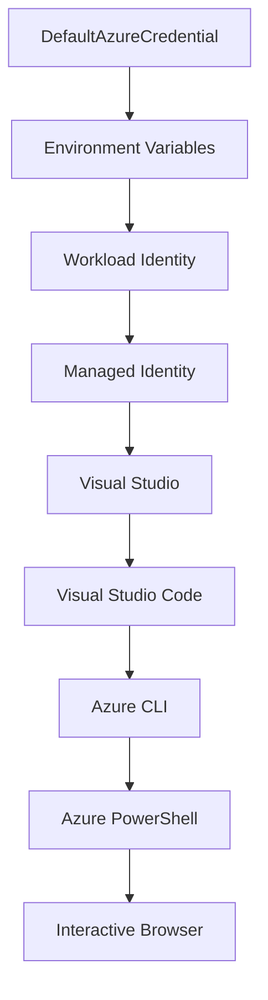

<!--
CO_OP_TRANSLATOR_METADATA:
{
  "original_hash": "fb0687bd0b166ecb0430dfeeed83487e",
  "translation_date": "2025-10-24T17:57:23+00:00",
  "source_file": "docs/getting-started/azd-basics.md",
  "language_code": "cs"
}
-->
# Základy AZD - Porozumění Azure Developer CLI

# Základy AZD - Klíčové koncepty a základy

**Navigace kapitolou:**
- **📚 Domov kurzu**: [AZD pro začátečníky](../../README.md)
- **📖 Aktuální kapitola**: Kapitola 1 - Základy & Rychlý start
- **⬅️ Předchozí**: [Přehled kurzu](../../README.md#-chapter-1-foundation--quick-start)
- **➡️ Další**: [Instalace & Nastavení](installation.md)
- **🚀 Další kapitola**: [Kapitola 2: AI-First Development](../ai-foundry/azure-ai-foundry-integration.md)

## Úvod

Tato lekce vás seznámí s Azure Developer CLI (azd), výkonným nástrojem příkazového řádku, který urychluje cestu od lokálního vývoje k nasazení na Azure. Naučíte se základní koncepty, klíčové funkce a pochopíte, jak azd zjednodušuje nasazení cloudových aplikací.

## Cíle učení

Na konci této lekce budete:
- Rozumět tomu, co je Azure Developer CLI a jeho hlavní účel
- Naučíte se základní koncepty šablon, prostředí a služeb
- Prozkoumáte klíčové funkce, včetně vývoje na základě šablon a infrastruktury jako kódu
- Pochopíte strukturu projektu azd a pracovní postupy
- Připraveni na instalaci a konfiguraci azd pro vaše vývojové prostředí

## Výsledky učení

Po dokončení této lekce budete schopni:
- Vysvětlit roli azd v moderních pracovních postupech cloudového vývoje
- Identifikovat komponenty struktury projektu azd
- Popsat, jak šablony, prostředí a služby spolupracují
- Pochopit výhody infrastruktury jako kódu s azd
- Rozpoznat různé příkazy azd a jejich účely

## Co je Azure Developer CLI (azd)?

Azure Developer CLI (azd) je nástroj příkazového řádku navržený k urychlení vaší cesty od lokálního vývoje k nasazení na Azure. Zjednodušuje proces vytváření, nasazení a správy cloudových aplikací na Azure.

## Základní koncepty

### Šablony
Šablony jsou základem azd. Obsahují:
- **Kód aplikace** - váš zdrojový kód a závislosti
- **Definice infrastruktury** - Azure zdroje definované v Bicep nebo Terraform
- **Konfigurační soubory** - nastavení a proměnné prostředí
- **Skripty nasazení** - automatizované pracovní postupy nasazení

### Prostředí
Prostředí představují různé cíle nasazení:
- **Vývoj** - pro testování a vývoj
- **Staging** - předprodukční prostředí
- **Produkce** - živé produkční prostředí

Každé prostředí si udržuje vlastní:
- Skupinu zdrojů Azure
- Konfigurační nastavení
- Stav nasazení

### Služby
Služby jsou stavebními bloky vaší aplikace:
- **Frontend** - webové aplikace, SPAs
- **Backend** - API, mikroslužby
- **Databáze** - řešení pro ukládání dat
- **Úložiště** - souborové a blobové úložiště

## Klíčové funkce

### 1. Vývoj na základě šablon
```bash
# Browse available templates
azd template list

# Initialize from a template
azd init --template <template-name>
```

### 2. Infrastruktura jako kód
- **Bicep** - doménově specifický jazyk Azure
- **Terraform** - nástroj pro infrastrukturu napříč cloudy
- **ARM Templates** - šablony Azure Resource Manager

### 3. Integrované pracovní postupy
```bash
# Complete deployment workflow
azd up            # Provision + Deploy this is hands off for first time setup

# 🧪 NEW: Preview infrastructure changes before deployment (SAFE)
azd provision --preview    # Simulate infrastructure deployment without making changes

azd provision     # Create Azure resources if you update the infrastructure use this
azd deploy        # Deploy application code or redeploy application code once update
azd down          # Clean up resources
```

#### 🛡️ Bezpečné plánování infrastruktury s náhledem
Příkaz `azd provision --preview` je revoluční pro bezpečné nasazení:
- **Analýza na sucho** - ukazuje, co bude vytvořeno, upraveno nebo smazáno
- **Žádné riziko** - žádné skutečné změny nejsou provedeny ve vašem prostředí Azure
- **Spolupráce týmu** - sdílejte výsledky náhledu před nasazením
- **Odhad nákladů** - pochopte náklady na zdroje před závazkem

```bash
# Example preview workflow
azd provision --preview           # See what will change
# Review the output, discuss with team
azd provision                     # Apply changes with confidence
```

### 4. Správa prostředí
```bash
# Create and manage environments
azd env new <environment-name>
azd env select <environment-name>
azd env list
```

## 📁 Struktura projektu

Typická struktura projektu azd:
```
my-app/
├── .azd/                    # azd configuration
│   └── config.json
├── .azure/                  # Azure deployment artifacts
├── .devcontainer/          # Development container config
├── .github/workflows/      # GitHub Actions
├── .vscode/               # VS Code settings
├── infra/                 # Infrastructure code
│   ├── main.bicep        # Main infrastructure template
│   ├── main.parameters.json
│   └── modules/          # Reusable modules
├── src/                  # Application source code
│   ├── api/             # Backend services
│   └── web/             # Frontend application
├── azure.yaml           # azd project configuration
└── README.md
```

## 🔧 Konfigurační soubory

### azure.yaml
Hlavní konfigurační soubor projektu:
```yaml
name: my-awesome-app
metadata:
  template: my-template@1.0.0

services:
  web:
    project: ./src/web
    language: js
    host: appservice
  api:
    project: ./src/api
    language: js
    host: appservice

hooks:
  preprovision:
    shell: pwsh
    run: echo "Preparing to provision..."
```

### .azure/config.json
Konfigurace specifická pro prostředí:
```json
{
  "version": 1,
  "defaultEnvironment": "dev",
  "environments": {
    "dev": {
      "subscriptionId": "your-subscription-id",
      "location": "eastus"
    }
  }
}
```

## 🎪 Běžné pracovní postupy

### Zahájení nového projektu
```bash
# Method 1: Use existing template
azd init --template todo-nodejs-mongo

# Method 2: Start from scratch
azd init

# Method 3: Use current directory
azd init .
```

### Vývojový cyklus
```bash
# Set up development environment
azd auth login
azd env new dev
azd env select dev

# Deploy everything
azd up

# Make changes and redeploy
azd deploy

# Clean up when done
azd down --force --purge # command in the Azure Developer CLI is a **hard reset** for your environment—especially useful when you're troubleshooting failed deployments, cleaning up orphaned resources, or prepping for a fresh redeploy.
```

## Pochopení `azd down --force --purge`
Příkaz `azd down --force --purge` je mocný způsob, jak kompletně odstranit vaše prostředí azd a všechny související zdroje. Zde je rozpis, co jednotlivé příznaky znamenají:
```
--force
```
- Přeskakuje potvrzovací výzvy.
- Užitečné pro automatizaci nebo skriptování, kde manuální vstup není možný.
- Zajišťuje, že odstranění proběhne bez přerušení, i když CLI detekuje nesrovnalosti.

```
--purge
```
Maže **veškerá související metadata**, včetně:
Stavu prostředí
Lokální složky `.azure`
Informací o uloženém nasazení
Zabraňuje azd "pamatovat si" předchozí nasazení, což může způsobit problémy, jako jsou nesprávné skupiny zdrojů nebo zastaralé registry.

### Proč používat obojí?
Když narazíte na problémy s `azd up` kvůli přetrvávajícímu stavu nebo částečným nasazením, tato kombinace zajistí **čistý start**.

Je obzvláště užitečné po manuálním odstranění zdrojů v portálu Azure nebo při přepínání šablon, prostředí nebo konvencí pojmenování skupin zdrojů.

### Správa více prostředí
```bash
# Create staging environment
azd env new staging
azd env select staging
azd up

# Switch back to dev
azd env select dev

# Compare environments
azd env list
```

## 🔐 Autentizace a přihlašovací údaje

Porozumění autentizaci je klíčové pro úspěšná nasazení azd. Azure používá různé metody autentizace a azd využívá stejný řetězec přihlašovacích údajů jako ostatní nástroje Azure.

### Autentizace Azure CLI (`az login`)

Před použitím azd se musíte autentizovat s Azure. Nejčastější metodou je použití Azure CLI:

```bash
# Interactive login (opens browser)
az login

# Login with specific tenant
az login --tenant <tenant-id>

# Login with service principal
az login --service-principal -u <app-id> -p <password> --tenant <tenant-id>

# Check current login status
az account show

# List available subscriptions
az account list --output table

# Set default subscription
az account set --subscription <subscription-id>
```

### Tok autentizace
1. **Interaktivní přihlášení**: Otevře váš výchozí prohlížeč pro autentizaci
2. **Tok kódu zařízení**: Pro prostředí bez přístupu k prohlížeči
3. **Service Principal**: Pro automatizaci a scénáře CI/CD
4. **Spravovaná identita**: Pro aplikace hostované na Azure

### DefaultAzureCredential Chain

`DefaultAzureCredential` je typ přihlašovacích údajů, který poskytuje zjednodušený zážitek z autentizace automatickým zkoušením více zdrojů přihlašovacích údajů v konkrétním pořadí:

#### Pořadí řetězce přihlašovacích údajů


#### 1. Proměnné prostředí
```bash
# Set environment variables for service principal
export AZURE_CLIENT_ID="<app-id>"
export AZURE_CLIENT_SECRET="<password>"
export AZURE_TENANT_ID="<tenant-id>"
```

#### 2. Workload Identity (Kubernetes/GitHub Actions)
Používá se automaticky v:
- Azure Kubernetes Service (AKS) s Workload Identity
- GitHub Actions s OIDC federací
- Další scénáře federované identity

#### 3. Spravovaná identita
Pro Azure zdroje jako:
- Virtuální stroje
- App Service
- Azure Functions
- Container Instances

```bash
# Check if running on Azure resource with managed identity
az account show --query "user.type" --output tsv
# Returns: "servicePrincipal" if using managed identity
```

#### 4. Integrace vývojářských nástrojů
- **Visual Studio**: Automaticky používá přihlášený účet
- **VS Code**: Používá přihlašovací údaje rozšíření Azure Account
- **Azure CLI**: Používá přihlašovací údaje `az login` (nejběžnější pro lokální vývoj)

### Nastavení autentizace AZD

```bash
# Method 1: Use Azure CLI (Recommended for development)
az login
azd auth login  # Uses existing Azure CLI credentials

# Method 2: Direct azd authentication
azd auth login --use-device-code  # For headless environments

# Method 3: Check authentication status
azd auth login --check-status

# Method 4: Logout and re-authenticate
azd auth logout
azd auth login
```

### Nejlepší praktiky autentizace

#### Pro lokální vývoj
```bash
# 1. Login with Azure CLI
az login

# 2. Verify correct subscription
az account show
az account set --subscription "Your Subscription Name"

# 3. Use azd with existing credentials
azd auth login
```

#### Pro CI/CD pipelines
```yaml
# GitHub Actions example
- name: Azure Login
  uses: azure/login@v1
  with:
    creds: ${{ secrets.AZURE_CREDENTIALS }}

- name: Deploy with azd
  run: |
    azd auth login --client-id ${{ secrets.AZURE_CLIENT_ID }} \
                    --client-secret ${{ secrets.AZURE_CLIENT_SECRET }} \
                    --tenant-id ${{ secrets.AZURE_TENANT_ID }}
    azd up --no-prompt
```

#### Pro produkční prostředí
- Používejte **Spravovanou identitu** při běhu na Azure zdrojích
- Používejte **Service Principal** pro automatizační scénáře
- Vyhněte se ukládání přihlašovacích údajů do kódu nebo konfiguračních souborů
- Používejte **Azure Key Vault** pro citlivou konfiguraci

### Běžné problémy s autentizací a jejich řešení

#### Problém: "Není nalezen žádný předplatný"
```bash
# Solution: Set default subscription
az account list --output table
az account set --subscription "<subscription-id>"
azd env set AZURE_SUBSCRIPTION_ID "<subscription-id>"
```

#### Problém: "Nedostatečná oprávnění"
```bash
# Solution: Check and assign required roles
az role assignment list --assignee $(az account show --query user.name --output tsv)

# Common required roles:
# - Contributor (for resource management)
# - User Access Administrator (for role assignments)
```

#### Problém: "Token vypršel"
```bash
# Solution: Re-authenticate
az logout
az login
azd auth logout
azd auth login
```

### Autentizace v různých scénářích

#### Lokální vývoj
```bash
# Personal development account
az login
azd auth login
```

#### Týmový vývoj
```bash
# Use specific tenant for organization
az login --tenant contoso.onmicrosoft.com
azd auth login
```

#### Scénáře s více nájemci
```bash
# Switch between tenants
az login --tenant tenant1.onmicrosoft.com
# Deploy to tenant 1
azd up

az login --tenant tenant2.onmicrosoft.com  
# Deploy to tenant 2
azd up
```

### Bezpečnostní úvahy

1. **Ukládání přihlašovacích údajů**: Nikdy neukládejte přihlašovací údaje do zdrojového kódu
2. **Omezení rozsahu**: Používejte princip nejmenšího oprávnění pro service principals
3. **Rotace tokenů**: Pravidelně měňte tajné klíče service principal
4. **Auditní stopa**: Sledujte aktivity autentizace a nasazení
5. **Síťová bezpečnost**: Používejte soukromé koncové body, kdykoli je to možné

### Řešení problémů s autentizací

```bash
# Debug authentication issues
azd auth login --check-status
az account show
az account get-access-token

# Common diagnostic commands
whoami                          # Current user context
az ad signed-in-user show      # Azure AD user details
az group list                  # Test resource access
```

## Pochopení `azd down --force --purge`

### Objevování
```bash
azd template list              # Browse templates
azd template show <template>   # Template details
azd init --help               # Initialization options
```

### Správa projektů
```bash
azd show                     # Project overview
azd env show                 # Current environment
azd config list             # Configuration settings
```

### Monitorování
```bash
azd monitor                  # Open Azure portal
azd pipeline config          # Set up CI/CD
azd logs                     # View application logs
```

## Nejlepší praktiky

### 1. Používejte smysluplné názvy
```bash
# Good
azd env new production-east
azd init --template web-app-secure

# Avoid
azd env new env1
azd init --template template1
```

### 2. Využívejte šablony
- Začněte s existujícími šablonami
- Přizpůsobte je svým potřebám
- Vytvářejte opakovaně použitelné šablony pro vaši organizaci

### 3. Izolace prostředí
- Používejte samostatná prostředí pro vývoj/staging/produkci
- Nikdy nenasazujte přímo do produkce z lokálního stroje
- Používejte CI/CD pipelines pro nasazení do produkce

### 4. Správa konfigurace
- Používejte proměnné prostředí pro citlivá data
- Udržujte konfiguraci ve verzovacím systému
- Dokumentujte nastavení specifická pro prostředí

## Postup učení

### Začátečník (1.-2. týden)
1. Nainstalujte azd a autentizujte se
2. Nasazení jednoduché šablony
3. Pochopte strukturu projektu
4. Naučte se základní příkazy (up, down, deploy)

### Středně pokročilý (3.-4. týden)
1. Přizpůsobte šablony
2. Spravujte více prostředí
3. Pochopte infrastrukturu jako kód
4. Nastavte CI/CD pipelines

### Pokročilý (5. týden a dále)
1. Vytvářejte vlastní šablony
2. Pokročilé vzory infrastruktury
3. Nasazení do více regionů
4. Konfigurace na úrovni podniku

## Další kroky

**📖 Pokračujte v učení kapitoly 1:**
- [Instalace & Nastavení](installation.md) - Nainstalujte a nakonfigurujte azd
- [Váš první projekt](first-project.md) - Dokončete praktický tutoriál
- [Průvodce konfigurací](configuration.md) - Pokročilé možnosti konfigurace

**🎯 Připraveni na další kapitolu?**
- [Kapitola 2: AI-First Development](../ai-foundry/azure-ai-foundry-integration.md) - Začněte vytvářet AI aplikace

## Další zdroje

- [Přehled Azure Developer CLI](https://learn.microsoft.com/en-us/azure/developer/azure-developer-cli/)
- [Galerie šablon](https://azure.github.io/awesome-azd/)
- [Ukázky od komunity](https://github.com/Azure-Samples)

---

**Navigace kapitolou:**
- **📚 Domov kurzu**: [AZD pro začátečníky](../../README.md)
- **📖 Aktuální kapitola**: Kapitola 1 - Základy & Rychlý start  
- **⬅️ Předchozí**: [Přehled kurzu](../../README.md#-chapter-1-foundation--quick-start)
- **➡️ Další**: [Instalace & Nastavení](installation.md)
- **🚀 Další kapitola**: [Kapitola 2: AI-First Development](../ai-foundry/azure-ai-foundry-integration.md)

---

**Prohlášení**:  
Tento dokument byl přeložen pomocí služby AI pro překlady [Co-op Translator](https://github.com/Azure/co-op-translator). Ačkoli se snažíme o přesnost, mějte prosím na paměti, že automatizované překlady mohou obsahovat chyby nebo nepřesnosti. Původní dokument v jeho původním jazyce by měl být považován za autoritativní zdroj. Pro důležité informace se doporučuje profesionální lidský překlad. Neodpovídáme za žádná nedorozumění nebo nesprávné interpretace vyplývající z použití tohoto překladu.