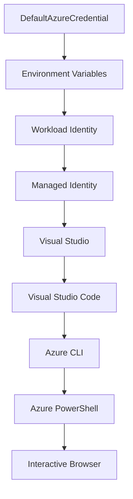

<!--
CO_OP_TRANSLATOR_METADATA:
{
  "original_hash": "fb0687bd0b166ecb0430dfeeed83487e",
  "translation_date": "2025-10-24T17:30:14+00:00",
  "source_file": "docs/getting-started/azd-basics.md",
  "language_code": "da"
}
-->
# AZD Grundlæggende - Forstå Azure Developer CLI

# AZD Grundlæggende - Kernekoncepter og fundament

**Kapitelnavigation:**
- **📚 Kursushjem**: [AZD For Begyndere](../../README.md)
- **📖 Nuværende Kapitel**: Kapitel 1 - Fundament & Hurtig Start
- **⬅️ Forrige**: [Kursusoversigt](../../README.md#-chapter-1-foundation--quick-start)
- **➡️ Næste**: [Installation & Opsætning](installation.md)
- **🚀 Næste Kapitel**: [Kapitel 2: AI-First Udvikling](../ai-foundry/azure-ai-foundry-integration.md)

## Introduktion

Denne lektion introducerer dig til Azure Developer CLI (azd), et kraftfuldt kommandolinjeværktøj, der fremskynder din rejse fra lokal udvikling til Azure-implementering. Du vil lære de grundlæggende koncepter, kernefunktioner og forstå, hvordan azd forenkler implementeringen af cloud-native applikationer.

## Læringsmål

Ved afslutningen af denne lektion vil du:
- Forstå, hvad Azure Developer CLI er, og dets primære formål
- Lære de grundlæggende koncepter om skabeloner, miljøer og tjenester
- Udforske nøglefunktioner, herunder skabelonbaseret udvikling og Infrastructure as Code
- Forstå azd-projektstrukturen og arbejdsgangen
- Være klar til at installere og konfigurere azd til dit udviklingsmiljø

## Læringsresultater

Efter at have gennemført denne lektion vil du kunne:
- Forklare azd's rolle i moderne cloud-udviklingsarbejdsgange
- Identificere komponenterne i en azd-projektstruktur
- Beskrive, hvordan skabeloner, miljøer og tjenester arbejder sammen
- Forstå fordelene ved Infrastructure as Code med azd
- Genkende forskellige azd-kommandoer og deres formål

## Hvad er Azure Developer CLI (azd)?

Azure Developer CLI (azd) er et kommandolinjeværktøj designet til at fremskynde din rejse fra lokal udvikling til Azure-implementering. Det forenkler processen med at bygge, implementere og administrere cloud-native applikationer på Azure.

## Kernekoncepter

### Skabeloner
Skabeloner er fundamentet for azd. De indeholder:
- **Applikationskode** - Din kildekode og afhængigheder
- **Infrastrukturbeskrivelser** - Azure-ressourcer defineret i Bicep eller Terraform
- **Konfigurationsfiler** - Indstillinger og miljøvariabler
- **Implementeringsscripts** - Automatiserede implementeringsarbejdsgange

### Miljøer
Miljøer repræsenterer forskellige implementeringsmål:
- **Udvikling** - Til test og udvikling
- **Staging** - Pre-produktionsmiljø
- **Produktion** - Live produktionsmiljø

Hvert miljø opretholder sin egen:
- Azure ressourcegruppe
- Konfigurationsindstillinger
- Implementeringstilstand

### Tjenester
Tjenester er byggestenene i din applikation:
- **Frontend** - Webapplikationer, SPAs
- **Backend** - API'er, mikrotjenester
- **Database** - Databaseløsninger
- **Lagring** - Fil- og bloblagring

## Nøglefunktioner

### 1. Skabelonbaseret Udvikling
```bash
# Browse available templates
azd template list

# Initialize from a template
azd init --template <template-name>
```

### 2. Infrastructure as Code
- **Bicep** - Azures domænespecifikke sprog
- **Terraform** - Multi-cloud infrastrukturværktøj
- **ARM Templates** - Azure Resource Manager skabeloner

### 3. Integrerede Arbejdsgange
```bash
# Complete deployment workflow
azd up            # Provision + Deploy this is hands off for first time setup

# 🧪 NEW: Preview infrastructure changes before deployment (SAFE)
azd provision --preview    # Simulate infrastructure deployment without making changes

azd provision     # Create Azure resources if you update the infrastructure use this
azd deploy        # Deploy application code or redeploy application code once update
azd down          # Clean up resources
```

#### 🛡️ Sikker Infrastrukturplanlægning med Preview
Kommandoen `azd provision --preview` er en gamechanger for sikre implementeringer:
- **Tørkørselsanalyse** - Viser, hvad der vil blive oprettet, ændret eller slettet
- **Ingen risiko** - Ingen faktiske ændringer foretages i dit Azure-miljø
- **Teamsamarbejde** - Del preview-resultater før implementering
- **Omkostningsestimering** - Forstå ressourceomkostninger før forpligtelse

```bash
# Example preview workflow
azd provision --preview           # See what will change
# Review the output, discuss with team
azd provision                     # Apply changes with confidence
```

### 4. Miljøstyring
```bash
# Create and manage environments
azd env new <environment-name>
azd env select <environment-name>
azd env list
```

## 📁 Projektstruktur

En typisk azd-projektstruktur:
```
my-app/
├── .azd/                    # azd configuration
│   └── config.json
├── .azure/                  # Azure deployment artifacts
├── .devcontainer/          # Development container config
├── .github/workflows/      # GitHub Actions
├── .vscode/               # VS Code settings
├── infra/                 # Infrastructure code
│   ├── main.bicep        # Main infrastructure template
│   ├── main.parameters.json
│   └── modules/          # Reusable modules
├── src/                  # Application source code
│   ├── api/             # Backend services
│   └── web/             # Frontend application
├── azure.yaml           # azd project configuration
└── README.md
```

## 🔧 Konfigurationsfiler

### azure.yaml
Den primære projektkonfigurationsfil:
```yaml
name: my-awesome-app
metadata:
  template: my-template@1.0.0

services:
  web:
    project: ./src/web
    language: js
    host: appservice
  api:
    project: ./src/api
    language: js
    host: appservice

hooks:
  preprovision:
    shell: pwsh
    run: echo "Preparing to provision..."
```

### .azure/config.json
Miljøspecifik konfiguration:
```json
{
  "version": 1,
  "defaultEnvironment": "dev",
  "environments": {
    "dev": {
      "subscriptionId": "your-subscription-id",
      "location": "eastus"
    }
  }
}
```

## 🎪 Almindelige Arbejdsgange

### Start af et Nyt Projekt
```bash
# Method 1: Use existing template
azd init --template todo-nodejs-mongo

# Method 2: Start from scratch
azd init

# Method 3: Use current directory
azd init .
```

### Udviklingscyklus
```bash
# Set up development environment
azd auth login
azd env new dev
azd env select dev

# Deploy everything
azd up

# Make changes and redeploy
azd deploy

# Clean up when done
azd down --force --purge # command in the Azure Developer CLI is a **hard reset** for your environment—especially useful when you're troubleshooting failed deployments, cleaning up orphaned resources, or prepping for a fresh redeploy.
```

## Forstå `azd down --force --purge`
Kommandoen `azd down --force --purge` er en kraftfuld måde at fuldstændigt nedlægge dit azd-miljø og alle tilknyttede ressourcer. Her er en oversigt over, hvad hver flag gør:
```
--force
```
- Springer bekræftelsesprompter over.
- Nyttig til automatisering eller scripting, hvor manuel input ikke er mulig.
- Sikrer, at nedlæggelsen fortsætter uden afbrydelse, selv hvis CLI registrerer uoverensstemmelser.

```
--purge
```
Sletter **alle tilknyttede metadata**, inklusive:
Miljøtilstand
Lokal `.azure` mappe
Cachelagret implementeringsinfo
Forhindrer azd i at "huske" tidligere implementeringer, hvilket kan forårsage problemer som uoverensstemmende ressourcegrupper eller forældede registreringsreferencer.

### Hvorfor bruge begge dele?
Når du er stødt på problemer med `azd up` på grund af resterende tilstand eller delvise implementeringer, sikrer denne kombination en **ren start**.

Det er især nyttigt efter manuelle ressource-sletninger i Azure-portalen eller ved skift af skabeloner, miljøer eller ressourcegruppe-navnekonventioner.

### Håndtering af Flere Miljøer
```bash
# Create staging environment
azd env new staging
azd env select staging
azd up

# Switch back to dev
azd env select dev

# Compare environments
azd env list
```

## 🔐 Autentifikation og Legitimationer

Forståelse af autentifikation er afgørende for succesfulde azd-implementeringer. Azure bruger flere autentifikationsmetoder, og azd udnytter den samme legitimationskæde, som bruges af andre Azure-værktøjer.

### Azure CLI Autentifikation (`az login`)

Før du bruger azd, skal du autentificere med Azure. Den mest almindelige metode er ved hjælp af Azure CLI:

```bash
# Interactive login (opens browser)
az login

# Login with specific tenant
az login --tenant <tenant-id>

# Login with service principal
az login --service-principal -u <app-id> -p <password> --tenant <tenant-id>

# Check current login status
az account show

# List available subscriptions
az account list --output table

# Set default subscription
az account set --subscription <subscription-id>
```

### Autentifikationsflow
1. **Interaktiv Login**: Åbner din standardbrowser til autentifikation
2. **Enhedskodeflow**: Til miljøer uden browseradgang
3. **Service Principal**: Til automatisering og CI/CD-scenarier
4. **Managed Identity**: Til Azure-hostede applikationer

### DefaultAzureCredential Kæde

`DefaultAzureCredential` er en legitimations-type, der giver en forenklet autentifikationsoplevelse ved automatisk at prøve flere legitimationskilder i en specifik rækkefølge:

#### Legitimationskæde Rækkefølge


#### 1. Miljøvariabler
```bash
# Set environment variables for service principal
export AZURE_CLIENT_ID="<app-id>"
export AZURE_CLIENT_SECRET="<password>"
export AZURE_TENANT_ID="<tenant-id>"
```

#### 2. Workload Identity (Kubernetes/GitHub Actions)
Bruges automatisk i:
- Azure Kubernetes Service (AKS) med Workload Identity
- GitHub Actions med OIDC-federation
- Andre federerede identitetsscenarier

#### 3. Managed Identity
Til Azure-ressourcer som:
- Virtuelle Maskiner
- App Service
- Azure Functions
- Container Instances

```bash
# Check if running on Azure resource with managed identity
az account show --query "user.type" --output tsv
# Returns: "servicePrincipal" if using managed identity
```

#### 4. Integration med Udviklingsværktøjer
- **Visual Studio**: Bruger automatisk den indloggede konto
- **VS Code**: Bruger Azure Account-udvidelsens legitimationsoplysninger
- **Azure CLI**: Bruger `az login` legitimationsoplysninger (mest almindeligt til lokal udvikling)

### AZD Autentifikationsopsætning

```bash
# Method 1: Use Azure CLI (Recommended for development)
az login
azd auth login  # Uses existing Azure CLI credentials

# Method 2: Direct azd authentication
azd auth login --use-device-code  # For headless environments

# Method 3: Check authentication status
azd auth login --check-status

# Method 4: Logout and re-authenticate
azd auth logout
azd auth login
```

### Bedste Praksis for Autentifikation

#### Til Lokal Udvikling
```bash
# 1. Login with Azure CLI
az login

# 2. Verify correct subscription
az account show
az account set --subscription "Your Subscription Name"

# 3. Use azd with existing credentials
azd auth login
```

#### Til CI/CD Pipelines
```yaml
# GitHub Actions example
- name: Azure Login
  uses: azure/login@v1
  with:
    creds: ${{ secrets.AZURE_CREDENTIALS }}

- name: Deploy with azd
  run: |
    azd auth login --client-id ${{ secrets.AZURE_CLIENT_ID }} \
                    --client-secret ${{ secrets.AZURE_CLIENT_SECRET }} \
                    --tenant-id ${{ secrets.AZURE_TENANT_ID }}
    azd up --no-prompt
```

#### Til Produktionsmiljøer
- Brug **Managed Identity**, når du kører på Azure-ressourcer
- Brug **Service Principal** til automatiseringsscenarier
- Undgå at gemme legitimationsoplysninger i kode eller konfigurationsfiler
- Brug **Azure Key Vault** til følsom konfiguration

### Almindelige Autentifikationsproblemer og Løsninger

#### Problem: "Ingen abonnement fundet"
```bash
# Solution: Set default subscription
az account list --output table
az account set --subscription "<subscription-id>"
azd env set AZURE_SUBSCRIPTION_ID "<subscription-id>"
```

#### Problem: "Utilstrækkelige tilladelser"
```bash
# Solution: Check and assign required roles
az role assignment list --assignee $(az account show --query user.name --output tsv)

# Common required roles:
# - Contributor (for resource management)
# - User Access Administrator (for role assignments)
```

#### Problem: "Token udløbet"
```bash
# Solution: Re-authenticate
az logout
az login
azd auth logout
azd auth login
```

### Autentifikation i Forskellige Scenarier

#### Lokal Udvikling
```bash
# Personal development account
az login
azd auth login
```

#### Teamudvikling
```bash
# Use specific tenant for organization
az login --tenant contoso.onmicrosoft.com
azd auth login
```

#### Multi-tenant Scenarier
```bash
# Switch between tenants
az login --tenant tenant1.onmicrosoft.com
# Deploy to tenant 1
azd up

az login --tenant tenant2.onmicrosoft.com  
# Deploy to tenant 2
azd up
```

### Sikkerhedsovervejelser

1. **Opbevaring af Legitimationer**: Gem aldrig legitimationsoplysninger i kildekode
2. **Begrænsning af Omfang**: Brug mindst privilegium-princippet for service principals
3. **Tokenrotation**: Roter regelmæssigt service principal hemmeligheder
4. **Audit Trail**: Overvåg autentifikations- og implementeringsaktiviteter
5. **Netværkssikkerhed**: Brug private endpoints, når det er muligt

### Fejlfinding af Autentifikation

```bash
# Debug authentication issues
azd auth login --check-status
az account show
az account get-access-token

# Common diagnostic commands
whoami                          # Current user context
az ad signed-in-user show      # Azure AD user details
az group list                  # Test resource access
```

## Forstå `azd down --force --purge`

### Opdagelse
```bash
azd template list              # Browse templates
azd template show <template>   # Template details
azd init --help               # Initialization options
```

### Projektstyring
```bash
azd show                     # Project overview
azd env show                 # Current environment
azd config list             # Configuration settings
```

### Overvågning
```bash
azd monitor                  # Open Azure portal
azd pipeline config          # Set up CI/CD
azd logs                     # View application logs
```

## Bedste Praksis

### 1. Brug Meningsfulde Navne
```bash
# Good
azd env new production-east
azd init --template web-app-secure

# Avoid
azd env new env1
azd init --template template1
```

### 2. Udnyt Skabeloner
- Start med eksisterende skabeloner
- Tilpas til dine behov
- Opret genanvendelige skabeloner til din organisation

### 3. Miljøisolering
- Brug separate miljøer til udvikling/staging/produktion
- Implementer aldrig direkte til produktion fra lokal maskine
- Brug CI/CD pipelines til produktionsimplementeringer

### 4. Konfigurationsstyring
- Brug miljøvariabler til følsomme data
- Hold konfiguration i versionskontrol
- Dokumenter miljøspecifikke indstillinger

## Læringsprogression

### Begynder (Uge 1-2)
1. Installer azd og autentificer
2. Implementer en simpel skabelon
3. Forstå projektstruktur
4. Lær grundlæggende kommandoer (up, down, deploy)

### Mellemstadie (Uge 3-4)
1. Tilpas skabeloner
2. Administrer flere miljøer
3. Forstå infrastrukturkode
4. Opsæt CI/CD pipelines

### Avanceret (Uge 5+)
1. Opret brugerdefinerede skabeloner
2. Avancerede infrastrukturmønstre
3. Multi-region implementeringer
4. Konfigurationer på virksomhedsniveau

## Næste Skridt

**📖 Fortsæt Kapitel 1 Læring:**
- [Installation & Opsætning](installation.md) - Få azd installeret og konfigureret
- [Dit Første Projekt](first-project.md) - Fuldfør praktisk tutorial
- [Konfigurationsguide](configuration.md) - Avancerede konfigurationsmuligheder

**🎯 Klar til Næste Kapitel?**
- [Kapitel 2: AI-First Udvikling](../ai-foundry/azure-ai-foundry-integration.md) - Begynd at bygge AI-applikationer

## Yderligere Ressourcer

- [Azure Developer CLI Oversigt](https://learn.microsoft.com/en-us/azure/developer/azure-developer-cli/)
- [Skabelongalleri](https://azure.github.io/awesome-azd/)
- [Community Eksempler](https://github.com/Azure-Samples)

---

**Kapitelnavigation:**
- **📚 Kursushjem**: [AZD For Begyndere](../../README.md)
- **📖 Nuværende Kapitel**: Kapitel 1 - Fundament & Hurtig Start  
- **⬅️ Forrige**: [Kursusoversigt](../../README.md#-chapter-1-foundation--quick-start)
- **➡️ Næste**: [Installation & Opsætning](installation.md)
- **🚀 Næste Kapitel**: [Kapitel 2: AI-First Udvikling](../ai-foundry/azure-ai-foundry-integration.md)

---

**Ansvarsfraskrivelse**:  
Dette dokument er blevet oversat ved hjælp af AI-oversættelsestjenesten [Co-op Translator](https://github.com/Azure/co-op-translator). Selvom vi bestræber os på nøjagtighed, skal det bemærkes, at automatiserede oversættelser kan indeholde fejl eller unøjagtigheder. Det originale dokument på dets oprindelige sprog bør betragtes som den autoritative kilde. For kritisk information anbefales professionel menneskelig oversættelse. Vi er ikke ansvarlige for eventuelle misforståelser eller fejltolkninger, der opstår som følge af brugen af denne oversættelse.