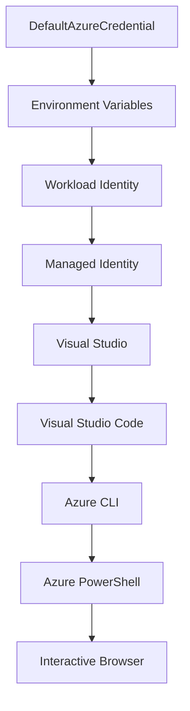

<!--
CO_OP_TRANSLATOR_METADATA:
{
  "original_hash": "fb0687bd0b166ecb0430dfeeed83487e",
  "translation_date": "2025-10-24T16:29:48+00:00",
  "source_file": "docs/getting-started/azd-basics.md",
  "language_code": "de"
}
-->
# AZD Grundlagen - Einführung in die Azure Developer CLI

# AZD Grundlagen - Kernkonzepte und Grundlagen

**Kapitelübersicht:**
- **📚 Kursübersicht**: [AZD für Anfänger](../../README.md)
- **📖 Aktuelles Kapitel**: Kapitel 1 - Grundlagen & Schnellstart
- **⬅️ Vorheriges Kapitel**: [Kursübersicht](../../README.md#-chapter-1-foundation--quick-start)
- **➡️ Nächstes Kapitel**: [Installation & Einrichtung](installation.md)
- **🚀 Nächstes Kapitel**: [Kapitel 2: KI-gestützte Entwicklung](../ai-foundry/azure-ai-foundry-integration.md)

## Einführung

In dieser Lektion lernen Sie die Azure Developer CLI (azd) kennen, ein leistungsstarkes Kommandozeilen-Tool, das Ihre Reise von der lokalen Entwicklung zur Azure-Bereitstellung beschleunigt. Sie erfahren die grundlegenden Konzepte, die Kernfunktionen und wie azd die Bereitstellung von cloud-nativen Anwendungen vereinfacht.

## Lernziele

Am Ende dieser Lektion werden Sie:
- Verstehen, was die Azure Developer CLI ist und welchen Hauptzweck sie erfüllt
- Die Kernkonzepte von Templates, Umgebungen und Diensten kennenlernen
- Wichtige Funktionen wie templatebasierte Entwicklung und Infrastructure as Code erkunden
- Die azd-Projektstruktur und den Workflow verstehen
- Bereit sein, azd für Ihre Entwicklungsumgebung zu installieren und zu konfigurieren

## Lernergebnisse

Nach Abschluss dieser Lektion werden Sie in der Lage sein:
- Die Rolle von azd in modernen Cloud-Entwicklungs-Workflows zu erklären
- Die Komponenten einer azd-Projektstruktur zu identifizieren
- Beschreiben, wie Templates, Umgebungen und Dienste zusammenarbeiten
- Die Vorteile von Infrastructure as Code mit azd verstehen
- Verschiedene azd-Befehle und deren Zwecke erkennen

## Was ist die Azure Developer CLI (azd)?

Die Azure Developer CLI (azd) ist ein Kommandozeilen-Tool, das entwickelt wurde, um Ihre Reise von der lokalen Entwicklung zur Azure-Bereitstellung zu beschleunigen. Es vereinfacht den Prozess des Erstellens, Bereitstellens und Verwalten von cloud-nativen Anwendungen auf Azure.

## Kernkonzepte

### Templates
Templates bilden die Grundlage von azd. Sie enthalten:
- **Anwendungscode** - Ihren Quellcode und Abhängigkeiten
- **Infrastrukturdefinitionen** - Azure-Ressourcen, definiert in Bicep oder Terraform
- **Konfigurationsdateien** - Einstellungen und Umgebungsvariablen
- **Bereitstellungsskripte** - Automatisierte Bereitstellungs-Workflows

### Umgebungen
Umgebungen repräsentieren verschiedene Bereitstellungsziele:
- **Entwicklung** - Für Tests und Entwicklung
- **Staging** - Vorproduktionsumgebung
- **Produktion** - Live-Produktionsumgebung

Jede Umgebung hat ihre eigenen:
- Azure-Ressourcengruppe
- Konfigurationseinstellungen
- Bereitstellungsstatus

### Dienste
Dienste sind die Bausteine Ihrer Anwendung:
- **Frontend** - Webanwendungen, SPAs
- **Backend** - APIs, Microservices
- **Datenbank** - Datenlösungen
- **Speicher** - Datei- und Blob-Speicher

## Wichtige Funktionen

### 1. Templatebasierte Entwicklung
```bash
# Browse available templates
azd template list

# Initialize from a template
azd init --template <template-name>
```

### 2. Infrastructure as Code
- **Bicep** - Azure-spezifische Sprache
- **Terraform** - Multi-Cloud-Infrastruktur-Tool
- **ARM Templates** - Azure Resource Manager Templates

### 3. Integrierte Workflows
```bash
# Complete deployment workflow
azd up            # Provision + Deploy this is hands off for first time setup

# 🧪 NEW: Preview infrastructure changes before deployment (SAFE)
azd provision --preview    # Simulate infrastructure deployment without making changes

azd provision     # Create Azure resources if you update the infrastructure use this
azd deploy        # Deploy application code or redeploy application code once update
azd down          # Clean up resources
```

#### 🛡️ Sichere Infrastrukturplanung mit Vorschau
Der Befehl `azd provision --preview` ist ein Gamechanger für sichere Bereitstellungen:
- **Analyse im Trockendurchlauf** - Zeigt, was erstellt, geändert oder gelöscht wird
- **Kein Risiko** - Es werden keine tatsächlichen Änderungen an Ihrer Azure-Umgebung vorgenommen
- **Teamzusammenarbeit** - Teilen Sie Vorschauergebnisse vor der Bereitstellung
- **Kostenabschätzung** - Verstehen Sie die Ressourcenkosten vor der Verpflichtung

```bash
# Example preview workflow
azd provision --preview           # See what will change
# Review the output, discuss with team
azd provision                     # Apply changes with confidence
```

### 4. Umweltmanagement
```bash
# Create and manage environments
azd env new <environment-name>
azd env select <environment-name>
azd env list
```

## 📁 Projektstruktur

Eine typische azd-Projektstruktur:
```
my-app/
├── .azd/                    # azd configuration
│   └── config.json
├── .azure/                  # Azure deployment artifacts
├── .devcontainer/          # Development container config
├── .github/workflows/      # GitHub Actions
├── .vscode/               # VS Code settings
├── infra/                 # Infrastructure code
│   ├── main.bicep        # Main infrastructure template
│   ├── main.parameters.json
│   └── modules/          # Reusable modules
├── src/                  # Application source code
│   ├── api/             # Backend services
│   └── web/             # Frontend application
├── azure.yaml           # azd project configuration
└── README.md
```

## 🔧 Konfigurationsdateien

### azure.yaml
Die Hauptkonfigurationsdatei des Projekts:
```yaml
name: my-awesome-app
metadata:
  template: my-template@1.0.0

services:
  web:
    project: ./src/web
    language: js
    host: appservice
  api:
    project: ./src/api
    language: js
    host: appservice

hooks:
  preprovision:
    shell: pwsh
    run: echo "Preparing to provision..."
```

### .azure/config.json
Umgebungsspezifische Konfiguration:
```json
{
  "version": 1,
  "defaultEnvironment": "dev",
  "environments": {
    "dev": {
      "subscriptionId": "your-subscription-id",
      "location": "eastus"
    }
  }
}
```

## 🎪 Häufige Workflows

### Ein neues Projekt starten
```bash
# Method 1: Use existing template
azd init --template todo-nodejs-mongo

# Method 2: Start from scratch
azd init

# Method 3: Use current directory
azd init .
```

### Entwicklungszyklus
```bash
# Set up development environment
azd auth login
azd env new dev
azd env select dev

# Deploy everything
azd up

# Make changes and redeploy
azd deploy

# Clean up when done
azd down --force --purge # command in the Azure Developer CLI is a **hard reset** for your environment—especially useful when you're troubleshooting failed deployments, cleaning up orphaned resources, or prepping for a fresh redeploy.
```

## Verständnis von `azd down --force --purge`
Der Befehl `azd down --force --purge` ist eine leistungsstarke Möglichkeit, Ihre azd-Umgebung und alle zugehörigen Ressourcen vollständig abzubauen. Hier ist eine Aufschlüsselung der einzelnen Flags:
```
--force
```
- Überspringt Bestätigungsaufforderungen.
- Nützlich für Automatisierung oder Skripte, bei denen manuelle Eingaben nicht möglich sind.
- Stellt sicher, dass der Abbau ohne Unterbrechung fortgesetzt wird, auch wenn die CLI Inkonsistenzen erkennt.

```
--purge
```
Löscht **alle zugehörigen Metadaten**, einschließlich:
Umgebungsstatus
Lokaler `.azure`-Ordner
Zwischengespeicherte Bereitstellungsinformationen
Verhindert, dass azd "frühere Bereitstellungen" speichert, was Probleme wie nicht übereinstimmende Ressourcengruppen oder veraltete Registrierungsreferenzen verursachen kann.

### Warum beide verwenden?
Wenn Sie mit `azd up` aufgrund verbleibender Zustände oder teilweiser Bereitstellungen nicht weiterkommen, sorgt diese Kombination für einen **Neustart**.

Es ist besonders hilfreich nach manuellen Ressourcendeaktivierungen im Azure-Portal oder beim Wechsel von Templates, Umgebungen oder Namenskonventionen für Ressourcengruppen.

### Verwaltung mehrerer Umgebungen
```bash
# Create staging environment
azd env new staging
azd env select staging
azd up

# Switch back to dev
azd env select dev

# Compare environments
azd env list
```

## 🔐 Authentifizierung und Zugangsdaten

Das Verständnis der Authentifizierung ist entscheidend für erfolgreiche azd-Bereitstellungen. Azure verwendet mehrere Authentifizierungsmethoden, und azd nutzt dieselbe Anmeldekette wie andere Azure-Tools.

### Azure CLI-Authentifizierung (`az login`)

Bevor Sie azd verwenden, müssen Sie sich bei Azure authentifizieren. Die häufigste Methode ist die Verwendung der Azure CLI:

```bash
# Interactive login (opens browser)
az login

# Login with specific tenant
az login --tenant <tenant-id>

# Login with service principal
az login --service-principal -u <app-id> -p <password> --tenant <tenant-id>

# Check current login status
az account show

# List available subscriptions
az account list --output table

# Set default subscription
az account set --subscription <subscription-id>
```

### Authentifizierungsablauf
1. **Interaktives Login**: Öffnet Ihren Standardbrowser zur Authentifizierung
2. **Gerätecode-Flow**: Für Umgebungen ohne Browserzugriff
3. **Service Principal**: Für Automatisierung und CI/CD-Szenarien
4. **Managed Identity**: Für auf Azure gehostete Anwendungen

### DefaultAzureCredential-Kette

`DefaultAzureCredential` ist ein Anmeldetyp, der eine vereinfachte Authentifizierungserfahrung bietet, indem automatisch mehrere Anmeldequellen in einer bestimmten Reihenfolge ausprobiert werden:

#### Reihenfolge der Anmeldekette


#### 1. Umgebungsvariablen
```bash
# Set environment variables for service principal
export AZURE_CLIENT_ID="<app-id>"
export AZURE_CLIENT_SECRET="<password>"
export AZURE_TENANT_ID="<tenant-id>"
```

#### 2. Workload Identity (Kubernetes/GitHub Actions)
Wird automatisch verwendet in:
- Azure Kubernetes Service (AKS) mit Workload Identity
- GitHub Actions mit OIDC-Föderation
- Andere föderierte Identitätsszenarien

#### 3. Managed Identity
Für Azure-Ressourcen wie:
- Virtuelle Maschinen
- App Service
- Azure Functions
- Container Instances

```bash
# Check if running on Azure resource with managed identity
az account show --query "user.type" --output tsv
# Returns: "servicePrincipal" if using managed identity
```

#### 4. Integration von Entwickler-Tools
- **Visual Studio**: Verwendet automatisch das angemeldete Konto
- **VS Code**: Verwendet Anmeldedaten der Azure Account-Erweiterung
- **Azure CLI**: Verwendet `az login`-Anmeldedaten (am häufigsten für lokale Entwicklung)

### Einrichtung der AZD-Authentifizierung

```bash
# Method 1: Use Azure CLI (Recommended for development)
az login
azd auth login  # Uses existing Azure CLI credentials

# Method 2: Direct azd authentication
azd auth login --use-device-code  # For headless environments

# Method 3: Check authentication status
azd auth login --check-status

# Method 4: Logout and re-authenticate
azd auth logout
azd auth login
```

### Best Practices für Authentifizierung

#### Für lokale Entwicklung
```bash
# 1. Login with Azure CLI
az login

# 2. Verify correct subscription
az account show
az account set --subscription "Your Subscription Name"

# 3. Use azd with existing credentials
azd auth login
```

#### Für CI/CD-Pipelines
```yaml
# GitHub Actions example
- name: Azure Login
  uses: azure/login@v1
  with:
    creds: ${{ secrets.AZURE_CREDENTIALS }}

- name: Deploy with azd
  run: |
    azd auth login --client-id ${{ secrets.AZURE_CLIENT_ID }} \
                    --client-secret ${{ secrets.AZURE_CLIENT_SECRET }} \
                    --tenant-id ${{ secrets.AZURE_TENANT_ID }}
    azd up --no-prompt
```

#### Für Produktionsumgebungen
- Verwenden Sie **Managed Identity**, wenn Sie auf Azure-Ressourcen laufen
- Verwenden Sie **Service Principal** für Automatisierungsszenarien
- Vermeiden Sie das Speichern von Zugangsdaten im Code oder in Konfigurationsdateien
- Verwenden Sie **Azure Key Vault** für sensible Konfigurationen

### Häufige Authentifizierungsprobleme und Lösungen

#### Problem: "Kein Abonnement gefunden"
```bash
# Solution: Set default subscription
az account list --output table
az account set --subscription "<subscription-id>"
azd env set AZURE_SUBSCRIPTION_ID "<subscription-id>"
```

#### Problem: "Unzureichende Berechtigungen"
```bash
# Solution: Check and assign required roles
az role assignment list --assignee $(az account show --query user.name --output tsv)

# Common required roles:
# - Contributor (for resource management)
# - User Access Administrator (for role assignments)
```

#### Problem: "Token abgelaufen"
```bash
# Solution: Re-authenticate
az logout
az login
azd auth logout
azd auth login
```

### Authentifizierung in verschiedenen Szenarien

#### Lokale Entwicklung
```bash
# Personal development account
az login
azd auth login
```

#### Teamentwicklung
```bash
# Use specific tenant for organization
az login --tenant contoso.onmicrosoft.com
azd auth login
```

#### Multi-Tenant-Szenarien
```bash
# Switch between tenants
az login --tenant tenant1.onmicrosoft.com
# Deploy to tenant 1
azd up

az login --tenant tenant2.onmicrosoft.com  
# Deploy to tenant 2
azd up
```

### Sicherheitsüberlegungen

1. **Speicherung von Zugangsdaten**: Speichern Sie niemals Zugangsdaten im Quellcode
2. **Einschränkung des Umfangs**: Verwenden Sie das Prinzip der minimalen Rechte für Service Principals
3. **Token-Rotation**: Drehen Sie regelmäßig Service Principal-Geheimnisse
4. **Audit-Trail**: Überwachen Sie Authentifizierungs- und Bereitstellungsaktivitäten
5. **Netzwerksicherheit**: Verwenden Sie nach Möglichkeit private Endpunkte

### Fehlerbehebung bei der Authentifizierung

```bash
# Debug authentication issues
azd auth login --check-status
az account show
az account get-access-token

# Common diagnostic commands
whoami                          # Current user context
az ad signed-in-user show      # Azure AD user details
az group list                  # Test resource access
```

## Verständnis von `azd down --force --purge`

### Entdeckung
```bash
azd template list              # Browse templates
azd template show <template>   # Template details
azd init --help               # Initialization options
```

### Projektmanagement
```bash
azd show                     # Project overview
azd env show                 # Current environment
azd config list             # Configuration settings
```

### Überwachung
```bash
azd monitor                  # Open Azure portal
azd pipeline config          # Set up CI/CD
azd logs                     # View application logs
```

## Best Practices

### 1. Verwenden Sie aussagekräftige Namen
```bash
# Good
azd env new production-east
azd init --template web-app-secure

# Avoid
azd env new env1
azd init --template template1
```

### 2. Nutzen Sie Templates
- Beginnen Sie mit vorhandenen Templates
- Passen Sie sie an Ihre Bedürfnisse an
- Erstellen Sie wiederverwendbare Templates für Ihre Organisation

### 3. Isolierung von Umgebungen
- Verwenden Sie separate Umgebungen für Entwicklung/Staging/Produktion
- Stellen Sie niemals direkt von der lokalen Maschine in die Produktion bereit
- Verwenden Sie CI/CD-Pipelines für Produktionsbereitstellungen

### 4. Konfigurationsmanagement
- Verwenden Sie Umgebungsvariablen für sensible Daten
- Halten Sie Konfigurationen unter Versionskontrolle
- Dokumentieren Sie umgebungsspezifische Einstellungen

## Lernfortschritt

### Anfänger (Woche 1-2)
1. Installieren Sie azd und authentifizieren Sie sich
2. Stellen Sie ein einfaches Template bereit
3. Verstehen Sie die Projektstruktur
4. Lernen Sie grundlegende Befehle (up, down, deploy)

### Fortgeschrittene (Woche 3-4)
1. Passen Sie Templates an
2. Verwalten Sie mehrere Umgebungen
3. Verstehen Sie Infrastrukturcode
4. Richten Sie CI/CD-Pipelines ein

### Experten (Woche 5+)
1. Erstellen Sie benutzerdefinierte Templates
2. Fortgeschrittene Infrastrukturmuster
3. Bereitstellungen in mehreren Regionen
4. Konfigurationen auf Unternehmensniveau

## Nächste Schritte

**📖 Weiterlernen in Kapitel 1:**
- [Installation & Einrichtung](installation.md) - azd installieren und konfigurieren
- [Ihr erstes Projekt](first-project.md) - Praktisches Tutorial abschließen
- [Konfigurationsleitfaden](configuration.md) - Erweiterte Konfigurationsoptionen

**🎯 Bereit für das nächste Kapitel?**
- [Kapitel 2: KI-gestützte Entwicklung](../ai-foundry/azure-ai-foundry-integration.md) - Beginnen Sie mit der Entwicklung von KI-Anwendungen

## Zusätzliche Ressourcen

- [Azure Developer CLI Übersicht](https://learn.microsoft.com/en-us/azure/developer/azure-developer-cli/)
- [Template-Galerie](https://azure.github.io/awesome-azd/)
- [Community-Beispiele](https://github.com/Azure-Samples)

---

**Kapitelübersicht:**
- **📚 Kursübersicht**: [AZD für Anfänger](../../README.md)
- **📖 Aktuelles Kapitel**: Kapitel 1 - Grundlagen & Schnellstart  
- **⬅️ Vorheriges Kapitel**: [Kursübersicht](../../README.md#-chapter-1-foundation--quick-start)
- **➡️ Nächstes Kapitel**: [Installation & Einrichtung](installation.md)
- **🚀 Nächstes Kapitel**: [Kapitel 2: KI-gestützte Entwicklung](../ai-foundry/azure-ai-foundry-integration.md)

---

**Haftungsausschluss**:  
Dieses Dokument wurde mit dem KI-Übersetzungsdienst [Co-op Translator](https://github.com/Azure/co-op-translator) übersetzt. Obwohl wir uns um Genauigkeit bemühen, beachten Sie bitte, dass automatisierte Übersetzungen Fehler oder Ungenauigkeiten enthalten können. Das Originaldokument in seiner ursprünglichen Sprache sollte als maßgebliche Quelle betrachtet werden. Für kritische Informationen wird eine professionelle menschliche Übersetzung empfohlen. Wir übernehmen keine Haftung für Missverständnisse oder Fehlinterpretationen, die sich aus der Nutzung dieser Übersetzung ergeben.