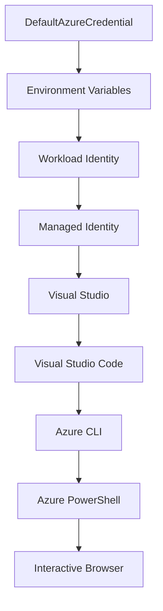

<!--
CO_OP_TRANSLATOR_METADATA:
{
  "original_hash": "fb0687bd0b166ecb0430dfeeed83487e",
  "translation_date": "2025-10-24T17:23:03+00:00",
  "source_file": "docs/getting-started/azd-basics.md",
  "language_code": "el"
}
-->
# AZD Βασικά - Κατανόηση του Azure Developer CLI

# AZD Βασικά - Κύριες Έννοιες και Θεμελιώδη Στοιχεία

**Πλοήγηση Κεφαλαίου:**
- **📚 Αρχική Μαθήματος**: [AZD Για Αρχάριους](../../README.md)
- **📖 Τρέχον Κεφάλαιο**: Κεφάλαιο 1 - Βάσεις & Γρήγορη Εκκίνηση
- **⬅️ Προηγούμενο**: [Επισκόπηση Μαθήματος](../../README.md#-chapter-1-foundation--quick-start)
- **➡️ Επόμενο**: [Εγκατάσταση & Ρύθμιση](installation.md)
- **🚀 Επόμενο Κεφάλαιο**: [Κεφάλαιο 2: Ανάπτυξη με AI](../ai-foundry/azure-ai-foundry-integration.md)

## Εισαγωγή

Αυτό το μάθημα σας εισάγει στο Azure Developer CLI (azd), ένα ισχυρό εργαλείο γραμμής εντολών που επιταχύνει τη μετάβαση από την τοπική ανάπτυξη στην ανάπτυξη στο Azure. Θα μάθετε τις βασικές έννοιες, τα κύρια χαρακτηριστικά και πώς το azd απλοποιεί την ανάπτυξη εφαρμογών που βασίζονται στο cloud.

## Στόχοι Μάθησης

Μέχρι το τέλος αυτού του μαθήματος, θα:
- Κατανοήσετε τι είναι το Azure Developer CLI και τον κύριο σκοπό του
- Μάθετε τις βασικές έννοιες των προτύπων, περιβαλλόντων και υπηρεσιών
- Εξερευνήσετε βασικά χαρακτηριστικά όπως η ανάπτυξη με πρότυπα και το Infrastructure as Code
- Κατανοήσετε τη δομή και τη ροή εργασίας ενός έργου azd
- Είστε έτοιμοι να εγκαταστήσετε και να ρυθμίσετε το azd για το περιβάλλον ανάπτυξής σας

## Αποτελέσματα Μάθησης

Μετά την ολοκλήρωση αυτού του μαθήματος, θα μπορείτε να:
- Εξηγήσετε τον ρόλο του azd στις σύγχρονες ροές εργασίας ανάπτυξης cloud
- Αναγνωρίσετε τα στοιχεία της δομής ενός έργου azd
- Περιγράψετε πώς τα πρότυπα, τα περιβάλλοντα και οι υπηρεσίες συνεργάζονται
- Κατανοήσετε τα οφέλη του Infrastructure as Code με το azd
- Αναγνωρίσετε διαφορετικές εντολές του azd και τους σκοπούς τους

## Τι είναι το Azure Developer CLI (azd);

Το Azure Developer CLI (azd) είναι ένα εργαλείο γραμμής εντολών σχεδιασμένο να επιταχύνει τη μετάβαση από την τοπική ανάπτυξη στην ανάπτυξη στο Azure. Απλοποιεί τη διαδικασία δημιουργίας, ανάπτυξης και διαχείρισης εφαρμογών που βασίζονται στο cloud στο Azure.

## Βασικές Έννοιες

### Πρότυπα
Τα πρότυπα αποτελούν τη βάση του azd. Περιλαμβάνουν:
- **Κώδικα εφαρμογής** - Τον πηγαίο κώδικα και τις εξαρτήσεις σας
- **Ορισμούς υποδομής** - Πόρους του Azure που ορίζονται σε Bicep ή Terraform
- **Αρχεία ρυθμίσεων** - Ρυθμίσεις και μεταβλητές περιβάλλοντος
- **Σενάρια ανάπτυξης** - Αυτοματοποιημένες ροές εργασίας ανάπτυξης

### Περιβάλλοντα
Τα περιβάλλοντα αντιπροσωπεύουν διαφορετικούς στόχους ανάπτυξης:
- **Ανάπτυξη** - Για δοκιμές και ανάπτυξη
- **Δοκιμαστικό** - Περιβάλλον προπαραγωγής
- **Παραγωγή** - Ζωντανό περιβάλλον παραγωγής

Κάθε περιβάλλον διατηρεί το δικό του:
- Ομάδα πόρων Azure
- Ρυθμίσεις παραμέτρων
- Κατάσταση ανάπτυξης

### Υπηρεσίες
Οι υπηρεσίες είναι τα δομικά στοιχεία της εφαρμογής σας:
- **Frontend** - Εφαρμογές ιστού, SPAs
- **Backend** - APIs, μικροϋπηρεσίες
- **Βάση δεδομένων** - Λύσεις αποθήκευσης δεδομένων
- **Αποθήκευση** - Αποθήκευση αρχείων και blob

## Κύρια Χαρακτηριστικά

### 1. Ανάπτυξη με Πρότυπα
```bash
# Browse available templates
azd template list

# Initialize from a template
azd init --template <template-name>
```

### 2. Infrastructure as Code
- **Bicep** - Ειδική γλώσσα του Azure
- **Terraform** - Εργαλείο υποδομής πολλαπλών cloud
- **ARM Templates** - Πρότυπα Azure Resource Manager

### 3. Ενσωματωμένες Ροές Εργασίας
```bash
# Complete deployment workflow
azd up            # Provision + Deploy this is hands off for first time setup

# 🧪 NEW: Preview infrastructure changes before deployment (SAFE)
azd provision --preview    # Simulate infrastructure deployment without making changes

azd provision     # Create Azure resources if you update the infrastructure use this
azd deploy        # Deploy application code or redeploy application code once update
azd down          # Clean up resources
```

#### 🛡️ Ασφαλής Σχεδιασμός Υποδομής με Προεπισκόπηση
Η εντολή `azd provision --preview` είναι επαναστατική για ασφαλείς αναπτύξεις:
- **Ανάλυση dry-run** - Δείχνει τι θα δημιουργηθεί, τροποποιηθεί ή διαγραφεί
- **Μηδενικός κίνδυνος** - Δεν γίνονται πραγματικές αλλαγές στο περιβάλλον Azure
- **Συνεργασία ομάδας** - Μοιραστείτε τα αποτελέσματα της προεπισκόπησης πριν την ανάπτυξη
- **Εκτίμηση κόστους** - Κατανοήστε το κόστος των πόρων πριν τη δέσμευση

```bash
# Example preview workflow
azd provision --preview           # See what will change
# Review the output, discuss with team
azd provision                     # Apply changes with confidence
```

### 4. Διαχείριση Περιβάλλοντος
```bash
# Create and manage environments
azd env new <environment-name>
azd env select <environment-name>
azd env list
```

## 📁 Δομή Έργου

Μια τυπική δομή έργου azd:
```
my-app/
├── .azd/                    # azd configuration
│   └── config.json
├── .azure/                  # Azure deployment artifacts
├── .devcontainer/          # Development container config
├── .github/workflows/      # GitHub Actions
├── .vscode/               # VS Code settings
├── infra/                 # Infrastructure code
│   ├── main.bicep        # Main infrastructure template
│   ├── main.parameters.json
│   └── modules/          # Reusable modules
├── src/                  # Application source code
│   ├── api/             # Backend services
│   └── web/             # Frontend application
├── azure.yaml           # azd project configuration
└── README.md
```

## 🔧 Αρχεία Ρύθμισης

### azure.yaml
Το κύριο αρχείο ρύθμισης του έργου:
```yaml
name: my-awesome-app
metadata:
  template: my-template@1.0.0

services:
  web:
    project: ./src/web
    language: js
    host: appservice
  api:
    project: ./src/api
    language: js
    host: appservice

hooks:
  preprovision:
    shell: pwsh
    run: echo "Preparing to provision..."
```

### .azure/config.json
Ρύθμιση συγκεκριμένη για το περιβάλλον:
```json
{
  "version": 1,
  "defaultEnvironment": "dev",
  "environments": {
    "dev": {
      "subscriptionId": "your-subscription-id",
      "location": "eastus"
    }
  }
}
```

## 🎪 Συνήθεις Ροές Εργασίας

### Ξεκινώντας ένα Νέο Έργο
```bash
# Method 1: Use existing template
azd init --template todo-nodejs-mongo

# Method 2: Start from scratch
azd init

# Method 3: Use current directory
azd init .
```

### Κύκλος Ανάπτυξης
```bash
# Set up development environment
azd auth login
azd env new dev
azd env select dev

# Deploy everything
azd up

# Make changes and redeploy
azd deploy

# Clean up when done
azd down --force --purge # command in the Azure Developer CLI is a **hard reset** for your environment—especially useful when you're troubleshooting failed deployments, cleaning up orphaned resources, or prepping for a fresh redeploy.
```

## Κατανόηση της εντολής `azd down --force --purge`
Η εντολή `azd down --force --purge` είναι ένας ισχυρός τρόπος για να καταργήσετε πλήρως το περιβάλλον azd και όλους τους σχετικούς πόρους. Ακολουθεί μια ανάλυση του τι κάνει κάθε σημαία:
```
--force
```
- Παρακάμπτει τις επιβεβαιώσεις.
- Χρήσιμο για αυτοματοποίηση ή σενάρια όπου η χειροκίνητη εισαγωγή δεν είναι εφικτή.
- Εξασφαλίζει ότι η κατάργηση προχωρά χωρίς διακοπή, ακόμα και αν η CLI εντοπίσει ασυνέπειες.

```
--purge
```
Διαγράφει **όλα τα σχετικά μεταδεδομένα**, συμπεριλαμβανομένων:
Κατάσταση περιβάλλοντος
Τοπικός φάκελος `.azure`
Πληροφορίες προσωρινής αποθήκευσης ανάπτυξης
Αποτρέπει το azd από το να "θυμάται" προηγούμενες αναπτύξεις, που μπορεί να προκαλέσουν προβλήματα όπως ασυμφωνίες ομάδων πόρων ή παλιές αναφορές μητρώου.

### Γιατί να χρησιμοποιήσετε και τα δύο;
Όταν αντιμετωπίζετε προβλήματα με το `azd up` λόγω υπολειμμάτων κατάστασης ή μερικών αναπτύξεων, αυτός ο συνδυασμός εξασφαλίζει ένα **καθαρό ξεκίνημα**.

Είναι ιδιαίτερα χρήσιμο μετά από χειροκίνητες διαγραφές πόρων στο Azure portal ή όταν αλλάζετε πρότυπα, περιβάλλοντα ή συμβάσεις ονοματοδοσίας ομάδων πόρων.

### Διαχείριση Πολλαπλών Περιβαλλόντων
```bash
# Create staging environment
azd env new staging
azd env select staging
azd up

# Switch back to dev
azd env select dev

# Compare environments
azd env list
```

## 🔐 Αυθεντικοποίηση και Διαπιστευτήρια

Η κατανόηση της αυθεντικοποίησης είναι κρίσιμη για επιτυχημένες αναπτύξεις azd. Το Azure χρησιμοποιεί πολλαπλές μεθόδους αυθεντικοποίησης, και το azd αξιοποιεί την ίδια αλυσίδα διαπιστευτηρίων που χρησιμοποιούν και άλλα εργαλεία του Azure.

### Αυθεντικοποίηση Azure CLI (`az login`)

Πριν χρησιμοποιήσετε το azd, πρέπει να αυθεντικοποιηθείτε με το Azure. Η πιο κοινή μέθοδος είναι μέσω του Azure CLI:

```bash
# Interactive login (opens browser)
az login

# Login with specific tenant
az login --tenant <tenant-id>

# Login with service principal
az login --service-principal -u <app-id> -p <password> --tenant <tenant-id>

# Check current login status
az account show

# List available subscriptions
az account list --output table

# Set default subscription
az account set --subscription <subscription-id>
```

### Ροή Αυθεντικοποίησης
1. **Διαδραστική Είσοδος**: Ανοίγει τον προεπιλεγμένο περιηγητή σας για αυθεντικοποίηση
2. **Ροή Κωδικού Συσκευής**: Για περιβάλλοντα χωρίς πρόσβαση σε περιηγητή
3. **Service Principal**: Για αυτοματοποίηση και σενάρια CI/CD
4. **Managed Identity**: Για εφαρμογές που φιλοξενούνται στο Azure

### DefaultAzureCredential Chain

Το `DefaultAzureCredential` είναι ένας τύπος διαπιστευτηρίου που παρέχει μια απλοποιημένη εμπειρία αυθεντικοποίησης δοκιμάζοντας αυτόματα πολλαπλές πηγές διαπιστευτηρίων με συγκεκριμένη σειρά:

#### Σειρά Αλυσίδας Διαπιστευτηρίων


#### 1. Μεταβλητές Περιβάλλοντος
```bash
# Set environment variables for service principal
export AZURE_CLIENT_ID="<app-id>"
export AZURE_CLIENT_SECRET="<password>"
export AZURE_TENANT_ID="<tenant-id>"
```

#### 2. Workload Identity (Kubernetes/GitHub Actions)
Χρησιμοποιείται αυτόματα σε:
- Azure Kubernetes Service (AKS) με Workload Identity
- GitHub Actions με OIDC federation
- Άλλα σενάρια ταυτότητας με ομοσπονδία

#### 3. Managed Identity
Για πόρους Azure όπως:
- Εικονικές Μηχανές
- App Service
- Azure Functions
- Container Instances

```bash
# Check if running on Azure resource with managed identity
az account show --query "user.type" --output tsv
# Returns: "servicePrincipal" if using managed identity
```

#### 4. Ενσωμάτωση Εργαλείων Ανάπτυξης
- **Visual Studio**: Χρησιμοποιεί αυτόματα τον λογαριασμό που έχει συνδεθεί
- **VS Code**: Χρησιμοποιεί τα διαπιστευτήρια του Azure Account extension
- **Azure CLI**: Χρησιμοποιεί τα διαπιστευτήρια του `az login` (πιο κοινό για τοπική ανάπτυξη)

### Ρύθμιση Αυθεντικοποίησης AZD

```bash
# Method 1: Use Azure CLI (Recommended for development)
az login
azd auth login  # Uses existing Azure CLI credentials

# Method 2: Direct azd authentication
azd auth login --use-device-code  # For headless environments

# Method 3: Check authentication status
azd auth login --check-status

# Method 4: Logout and re-authenticate
azd auth logout
azd auth login
```

### Βέλτιστες Πρακτικές Αυθεντικοποίησης

#### Για Τοπική Ανάπτυξη
```bash
# 1. Login with Azure CLI
az login

# 2. Verify correct subscription
az account show
az account set --subscription "Your Subscription Name"

# 3. Use azd with existing credentials
azd auth login
```

#### Για Σενάρια CI/CD
```yaml
# GitHub Actions example
- name: Azure Login
  uses: azure/login@v1
  with:
    creds: ${{ secrets.AZURE_CREDENTIALS }}

- name: Deploy with azd
  run: |
    azd auth login --client-id ${{ secrets.AZURE_CLIENT_ID }} \
                    --client-secret ${{ secrets.AZURE_CLIENT_SECRET }} \
                    --tenant-id ${{ secrets.AZURE_TENANT_ID }}
    azd up --no-prompt
```

#### Για Περιβάλλοντα Παραγωγής
- Χρησιμοποιήστε **Managed Identity** όταν εκτελείτε σε πόρους Azure
- Χρησιμοποιήστε **Service Principal** για σενάρια αυτοματοποίησης
- Αποφύγετε την αποθήκευση διαπιστευτηρίων σε κώδικα ή αρχεία ρυθμίσεων
- Χρησιμοποιήστε **Azure Key Vault** για ευαίσθητες ρυθμίσεις

### Συνήθη Προβλήματα Αυθεντικοποίησης και Λύσεις

#### Πρόβλημα: "Δεν βρέθηκε συνδρομή"
```bash
# Solution: Set default subscription
az account list --output table
az account set --subscription "<subscription-id>"
azd env set AZURE_SUBSCRIPTION_ID "<subscription-id>"
```

#### Πρόβλημα: "Ανεπαρκή δικαιώματα"
```bash
# Solution: Check and assign required roles
az role assignment list --assignee $(az account show --query user.name --output tsv)

# Common required roles:
# - Contributor (for resource management)
# - User Access Administrator (for role assignments)
```

#### Πρόβλημα: "Έληξε το διακριτικό"
```bash
# Solution: Re-authenticate
az logout
az login
azd auth logout
azd auth login
```

### Αυθεντικοποίηση σε Διάφορα Σενάρια

#### Τοπική Ανάπτυξη
```bash
# Personal development account
az login
azd auth login
```

#### Ομαδική Ανάπτυξη
```bash
# Use specific tenant for organization
az login --tenant contoso.onmicrosoft.com
azd auth login
```

#### Σενάρια Πολλαπλών Ενοικιαστών
```bash
# Switch between tenants
az login --tenant tenant1.onmicrosoft.com
# Deploy to tenant 1
azd up

az login --tenant tenant2.onmicrosoft.com  
# Deploy to tenant 2
azd up
```

### Σκέψεις Ασφαλείας

1. **Αποθήκευση Διαπιστευτηρίων**: Μην αποθηκεύετε ποτέ διαπιστευτήρια στον πηγαίο κώδικα
2. **Περιορισμός Εμβέλειας**: Χρησιμοποιήστε την αρχή των ελάχιστων δικαιωμάτων για service principals
3. **Περιστροφή Διακριτικών**: Περιστρέψτε τα μυστικά των service principals τακτικά
4. **Ίχνος Ελέγχου**: Παρακολουθήστε δραστηριότητες αυθεντικοποίησης και ανάπτυξης
5. **Ασφάλεια Δικτύου**: Χρησιμοποιήστε ιδιωτικά endpoints όπου είναι δυνατόν

### Αντιμετώπιση Προβλημάτων Αυθεντικοποίησης

```bash
# Debug authentication issues
azd auth login --check-status
az account show
az account get-access-token

# Common diagnostic commands
whoami                          # Current user context
az ad signed-in-user show      # Azure AD user details
az group list                  # Test resource access
```

## Κατανόηση της εντολής `azd down --force --purge`

### Ανακάλυψη
```bash
azd template list              # Browse templates
azd template show <template>   # Template details
azd init --help               # Initialization options
```

### Διαχείριση Έργου
```bash
azd show                     # Project overview
azd env show                 # Current environment
azd config list             # Configuration settings
```

### Παρακολούθηση
```bash
azd monitor                  # Open Azure portal
azd pipeline config          # Set up CI/CD
azd logs                     # View application logs
```

## Βέλτιστες Πρακτικές

### 1. Χρησιμοποιήστε Σημαντικά Ονόματα
```bash
# Good
azd env new production-east
azd init --template web-app-secure

# Avoid
azd env new env1
azd init --template template1
```

### 2. Αξιοποιήστε τα Πρότυπα
- Ξεκινήστε με υπάρχοντα πρότυπα
- Προσαρμόστε τα στις ανάγκες σας
- Δημιουργήστε επαναχρησιμοποιήσιμα πρότυπα για τον οργανισμό σας

### 3. Απομόνωση Περιβάλλοντος
- Χρησιμοποιήστε ξεχωριστά περιβάλλοντα για ανάπτυξη/δοκιμαστικό/παραγωγή
- Μην αναπτύσσετε απευθείας στην παραγωγή από τοπικό μηχάνημα
- Χρησιμοποιήστε CI/CD pipelines για αναπτύξεις παραγωγής

### 4. Διαχείριση Ρυθμίσεων
- Χρησιμοποιήστε μεταβλητές περιβάλλοντος για ευαίσθητα δεδομένα
- Διατηρήστε τις ρυθμίσεις υπό έλεγχο έκδοσης
- Τεκμηριώστε τις ρυθμίσεις που είναι συγκεκριμένες για κάθε περιβάλλον

## Πρόοδος Μάθησης

### Αρχάριος (Εβδομάδα 1-2)
1. Εγκαταστήστε το azd και αυθεντικοποιηθείτε
2. Αναπτύξτε ένα απλό πρότυπο
3. Κατανοήστε τη δομή του έργου
4. Μάθετε βασικές εντολές (up, down, deploy)

### Ενδιάμεσος (Εβδομάδα 3-4)
1. Προσαρμόστε πρότυπα
2. Διαχειριστείτε πολλαπλά περιβάλλοντα
3. Κατανοήστε τον κώδικα υποδομής
4. Ρυθμίστε CI/CD pipelines

### Προχωρημένος (Εβδομάδα 5+)
1. Δημιουργήστε προσαρμοσμένα πρότυπα
2. Προηγμένα μοτίβα υποδομής
3. Αναπτύξεις πολλαπλών περιοχών
4. Ρυθμίσεις επιπέδου επιχείρησης

## Επόμενα Βήματα

**📖 Συνεχίστε τη Μάθηση στο Κεφάλαιο 1:**
- [Εγκατάσταση & Ρύθμιση](installation.md) - Εγκαταστήστε και ρυθμίστε το azd
- [Το Πρώτο σας Έργο](first-project.md) - Ολοκληρώστε το πρακτικό σεμινάριο
- [Οδηγός Ρυθμίσεων](configuration.md) - Προχωρημένες επιλογές ρύθμισης

**🎯 Έτοιμοι για το Επόμενο Κεφάλαιο;**
- [Κεφάλαιο 2: Ανάπτυξη με AI](../ai-foundry/azure-ai-foundry-integration.md) - Ξεκινήστε να δημιουργείτε εφαρμογές AI

## Πρόσθετοι Πόροι

- [Επισκόπηση Azure Developer CLI](https://learn.microsoft.com/en-us/azure/developer/azure-developer-cli/)
- [Γκαλερί Προτύπων](https://azure.github.io/awesome-azd/)
- [Δείγματα Κοινότητας](https://github.com/Azure-Samples)

---

**Πλοήγηση Κεφαλαίου:**
- **📚 Αρχική Μαθήματος**: [AZD Για Αρχάριους](../../README.md)
- **📖 Τρέχον Κεφάλαιο**: Κεφάλαιο 1 - Βάσεις & Γρήγορη Εκκίνηση  
- **⬅️ Προηγούμενο**: [Επισκόπηση Μαθήματος](../../README.md#-chapter-1-foundation--quick-start)
- **➡️ Επόμενο**: [Εγκατάσταση & Ρύθμιση](installation.md)
- **🚀 Επόμενο Κεφάλαιο**: [Κεφάλαιο 2: Ανάπτυξη με AI](../ai-foundry/azure-ai-foundry-integration.md)

---

**Αποποίηση ευθύνης**:  
Αυτό το έγγραφο έχει μεταφραστεί χρησιμοποιώντας την υπηρεσία αυτόματης μετάφρασης [Co-op Translator](https://github.com/Azure/co-op-translator). Παρόλο που καταβάλλουμε προσπάθειες για ακρίβεια, παρακαλούμε να έχετε υπόψη ότι οι αυτόματες μεταφράσεις ενδέχεται να περιέχουν λάθη ή ανακρίβειες. Το πρωτότυπο έγγραφο στη μητρική του γλώσσα θα πρέπει να θεωρείται η αυθεντική πηγή. Για κρίσιμες πληροφορίες, συνιστάται επαγγελματική ανθρώπινη μετάφραση. Δεν φέρουμε ευθύνη για τυχόν παρεξηγήσεις ή εσφαλμένες ερμηνείες που προκύπτουν από τη χρήση αυτής της μετάφρασης.