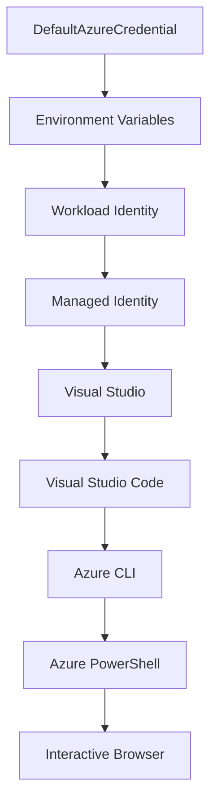

<!--
CO_OP_TRANSLATOR_METADATA:
{
  "original_hash": "fb0687bd0b166ecb0430dfeeed83487e",
  "translation_date": "2025-10-24T16:28:04+00:00",
  "source_file": "docs/getting-started/azd-basics.md",
  "language_code": "es"
}
-->
# Conceptos b√°sicos de AZD - Comprendiendo Azure Developer CLI

# Conceptos b√°sicos de AZD - Conceptos fundamentales

**Navegación del capítulo:**
- **üìö Inicio del curso**: [AZD para principiantes](../../README.md)
- **📖 Capítulo actual**: Capítulo 1 - Fundamentos y comienzo rápido
- **⬅️ Anterior**: [Descripción general del curso](../../README.md#-chapter-1-foundation--quick-start)
- **➡️ Siguiente**: [Instalación y configuración](installation.md)
- **🚀 Próximo capítulo**: [Capítulo 2: Desarrollo centrado en IA](../ai-foundry/azure-ai-foundry-integration.md)

## Introducción

Esta lección te presenta Azure Developer CLI (azd), una herramienta de línea de comandos poderosa que acelera tu transición del desarrollo local al despliegue en Azure. Aprenderás los conceptos fundamentales, las características principales y cómo azd simplifica el despliegue de aplicaciones nativas en la nube.

## Objetivos de aprendizaje

Al final de esta lección, podrás:
- Comprender qué es Azure Developer CLI y su propósito principal
- Aprender los conceptos clave de plantillas, entornos y servicios
- Explorar características clave como desarrollo basado en plantillas e Infraestructura como Código
- Entender la estructura y el flujo de trabajo de los proyectos azd
- Estar preparado para instalar y configurar azd en tu entorno de desarrollo

## Resultados de aprendizaje

Después de completar esta lección, serás capaz de:
- Explicar el papel de azd en los flujos de trabajo modernos de desarrollo en la nube
- Identificar los componentes de la estructura de un proyecto azd
- Describir cómo las plantillas, entornos y servicios trabajan juntos
- Comprender los beneficios de la Infraestructura como Código con azd
- Reconocer diferentes comandos de azd y sus propósitos

## ¿Qué es Azure Developer CLI (azd)?

Azure Developer CLI (azd) es una herramienta de línea de comandos diseñada para acelerar tu transición del desarrollo local al despliegue en Azure. Simplifica el proceso de construir, desplegar y gestionar aplicaciones nativas en la nube en Azure.

## Conceptos clave

### Plantillas
Las plantillas son la base de azd. Contienen:
- **Código de la aplicación** - Tu código fuente y dependencias
- **Definiciones de infraestructura** - Recursos de Azure definidos en Bicep o Terraform
- **Archivos de configuración** - Configuraciones y variables de entorno
- **Scripts de despliegue** - Flujos de trabajo automatizados de despliegue

### Entornos
Los entornos representan diferentes objetivos de despliegue:
- **Desarrollo** - Para pruebas y desarrollo
- **Staging** - Entorno de preproducción
- **Producción** - Entorno de producción en vivo

Cada entorno mantiene su propio:
- Grupo de recursos de Azure
- Configuración
- Estado de despliegue

### Servicios
Los servicios son los bloques de construcción de tu aplicación:
- **Frontend** - Aplicaciones web, SPAs
- **Backend** - APIs, microservicios
- **Base de datos** - Soluciones de almacenamiento de datos
- **Almacenamiento** - Almacenamiento de archivos y blobs

## Características principales

### 1. Desarrollo basado en plantillas
```bash
# Browse available templates
azd template list

# Initialize from a template
azd init --template <template-name>
```

### 2. Infraestructura como Código
- **Bicep** - Lenguaje específico de dominio de Azure
- **Terraform** - Herramienta de infraestructura multicloud
- **Plantillas ARM** - Plantillas de Azure Resource Manager

### 3. Flujos de trabajo integrados
```bash
# Complete deployment workflow
azd up            # Provision + Deploy this is hands off for first time setup

# üß™ NEW: Preview infrastructure changes before deployment (SAFE)
azd provision --preview    # Simulate infrastructure deployment without making changes

azd provision     # Create Azure resources if you update the infrastructure use this
azd deploy        # Deploy application code or redeploy application code once update
azd down          # Clean up resources
```

#### 🛡️ Planificación segura de infraestructura con vista previa
El comando `azd provision --preview` es revolucionario para despliegues seguros:
- **An√°lisis de prueba** - Muestra lo que se crear√°, modificar√° o eliminar√°
- **Riesgo cero** - No se realizan cambios reales en tu entorno de Azure
- **Colaboración en equipo** - Comparte resultados de vista previa antes del despliegue
- **Estimación de costos** - Comprende los costos de recursos antes de comprometerte

```bash
# Example preview workflow
azd provision --preview           # See what will change
# Review the output, discuss with team
azd provision                     # Apply changes with confidence
```

### 4. Gestión de entornos
```bash
# Create and manage environments
azd env new <environment-name>
azd env select <environment-name>
azd env list
```

## 📁 Estructura del proyecto

Una estructura típica de proyecto azd:
```
my-app/
├── .azd/                    # azd configuration
│   └── config.json
├── .azure/                  # Azure deployment artifacts
├── .devcontainer/          # Development container config
├── .github/workflows/      # GitHub Actions
├── .vscode/               # VS Code settings
├── infra/                 # Infrastructure code
│   ├── main.bicep        # Main infrastructure template
│   ├── main.parameters.json
│   └── modules/          # Reusable modules
├── src/                  # Application source code
│   ├── api/             # Backend services
│   └── web/             # Frontend application
├── azure.yaml           # azd project configuration
└── README.md
```

## 🔧 Archivos de configuración

### azure.yaml
El archivo principal de configuración del proyecto:
```yaml
name: my-awesome-app
metadata:
  template: my-template@1.0.0

services:
  web:
    project: ./src/web
    language: js
    host: appservice
  api:
    project: ./src/api
    language: js
    host: appservice

hooks:
  preprovision:
    shell: pwsh
    run: echo "Preparing to provision..."
```

### .azure/config.json
Configuración específica del entorno:
```json
{
  "version": 1,
  "defaultEnvironment": "dev",
  "environments": {
    "dev": {
      "subscriptionId": "your-subscription-id",
      "location": "eastus"
    }
  }
}
```

## üé™ Flujos de trabajo comunes

### Iniciar un nuevo proyecto
```bash
# Method 1: Use existing template
azd init --template todo-nodejs-mongo

# Method 2: Start from scratch
azd init

# Method 3: Use current directory
azd init .
```

### Ciclo de desarrollo
```bash
# Set up development environment
azd auth login
azd env new dev
azd env select dev

# Deploy everything
azd up

# Make changes and redeploy
azd deploy

# Clean up when done
azd down --force --purge # command in the Azure Developer CLI is a **hard reset** for your environment—especially useful when you're troubleshooting failed deployments, cleaning up orphaned resources, or prepping for a fresh redeploy.
```

## Comprendiendo `azd down --force --purge`
El comando `azd down --force --purge` es una forma poderosa de desmantelar completamente tu entorno azd y todos los recursos asociados. Aquí tienes un desglose de lo que hace cada bandera:
```
--force
```
- Omite las solicitudes de confirmación.
- Útil para automatización o scripts donde la entrada manual no es factible.
- Asegura que el desmantelamiento proceda sin interrupciones, incluso si la CLI detecta inconsistencias.

```
--purge
```
Elimina **todos los metadatos asociados**, incluyendo:
Estado del entorno
Carpeta local `.azure`
Información de despliegue en caché
Evita que azd "recuerde" despliegues anteriores, lo que puede causar problemas como grupos de recursos desajustados o referencias obsoletas de registros.


### ¿Por qué usar ambos?
Cuando te encuentras con problemas con `azd up` debido a estados persistentes o despliegues parciales, esta combinación asegura un **nuevo comienzo**.

Es especialmente útil después de eliminaciones manuales de recursos en el portal de Azure o al cambiar plantillas, entornos o convenciones de nombres de grupos de recursos.


### Gestión de múltiples entornos
```bash
# Create staging environment
azd env new staging
azd env select staging
azd up

# Switch back to dev
azd env select dev

# Compare environments
azd env list
```

## 🔐 Autenticación y credenciales

Comprender la autenticación es crucial para despliegues exitosos con azd. Azure utiliza múltiples métodos de autenticación, y azd aprovecha la misma cadena de credenciales utilizada por otras herramientas de Azure.

### Autenticación con Azure CLI (`az login`)

Antes de usar azd, necesitas autenticarte con Azure. El método más común es usar Azure CLI:

```bash
# Interactive login (opens browser)
az login

# Login with specific tenant
az login --tenant <tenant-id>

# Login with service principal
az login --service-principal -u <app-id> -p <password> --tenant <tenant-id>

# Check current login status
az account show

# List available subscriptions
az account list --output table

# Set default subscription
az account set --subscription <subscription-id>
```

### Flujo de autenticación
1. **Inicio de sesión interactivo**: Abre tu navegador predeterminado para autenticación
2. **Flujo de código de dispositivo**: Para entornos sin acceso a navegador
3. **Principal de servicio**: Para escenarios de automatización y CI/CD
4. **Identidad administrada**: Para aplicaciones alojadas en Azure

### Cadena de credenciales DefaultAzureCredential

`DefaultAzureCredential` es un tipo de credencial que proporciona una experiencia de autenticación simplificada al intentar automáticamente múltiples fuentes de credenciales en un orden específico:

#### Orden de la cadena de credenciales

```mermaid
graph TD
    A[DefaultAzureCredential] --> B[Environment Variables]
    B --> C[Workload Identity]
    C --> D[Managed Identity]
    D --> E[Visual Studio]
    E --> F[Visual Studio Code]
    F --> G[Azure CLI]
    G --> H[Azure PowerShell]
    H --> I[Interactive Browser]
```

#### 1. Variables de entorno
```bash
# Set environment variables for service principal
export AZURE_CLIENT_ID="<app-id>"
export AZURE_CLIENT_SECRET="<password>"
export AZURE_TENANT_ID="<tenant-id>"
```

#### 2. Identidad de carga de trabajo (Kubernetes/Acciones de GitHub)
Usado autom√°ticamente en:
- Azure Kubernetes Service (AKS) con Identidad de carga de trabajo
- Acciones de GitHub con federación OIDC
- Otros escenarios de identidad federada

#### 3. Identidad administrada
Para recursos de Azure como:
- M√°quinas virtuales
- App Service
- Azure Functions
- Instancias de contenedor

```bash
# Check if running on Azure resource with managed identity
az account show --query "user.type" --output tsv
# Returns: "servicePrincipal" if using managed identity
```

#### 4. Integración con herramientas de desarrollo
- **Visual Studio**: Usa autom√°ticamente la cuenta iniciada
- **VS Code**: Usa las credenciales de la extensión de cuenta de Azure
- **Azure CLI**: Usa las credenciales de `az login` (m√°s com√∫n para desarrollo local)

### Configuración de autenticación de AZD

```bash
# Method 1: Use Azure CLI (Recommended for development)
az login
azd auth login  # Uses existing Azure CLI credentials

# Method 2: Direct azd authentication
azd auth login --use-device-code  # For headless environments

# Method 3: Check authentication status
azd auth login --check-status

# Method 4: Logout and re-authenticate
azd auth logout
azd auth login
```

### Mejores prácticas de autenticación

#### Para desarrollo local
```bash
# 1. Login with Azure CLI
az login

# 2. Verify correct subscription
az account show
az account set --subscription "Your Subscription Name"

# 3. Use azd with existing credentials
azd auth login
```

#### Para pipelines de CI/CD
```yaml
# GitHub Actions example
- name: Azure Login
  uses: azure/login@v1
  with:
    creds: ${{ secrets.AZURE_CREDENTIALS }}

- name: Deploy with azd
  run: |
    azd auth login --client-id ${{ secrets.AZURE_CLIENT_ID }} \
                    --client-secret ${{ secrets.AZURE_CLIENT_SECRET }} \
                    --tenant-id ${{ secrets.AZURE_TENANT_ID }}
    azd up --no-prompt
```

#### Para entornos de producción
- Usa **Identidad administrada** cuando se ejecuta en recursos de Azure
- Usa **Principal de servicio** para escenarios de automatización
- Evita almacenar credenciales en código o archivos de configuración
- Usa **Azure Key Vault** para configuraciones sensibles

### Problemas comunes de autenticación y soluciones

#### Problema: "No se encontró suscripción"
```bash
# Solution: Set default subscription
az account list --output table
az account set --subscription "<subscription-id>"
azd env set AZURE_SUBSCRIPTION_ID "<subscription-id>"
```

#### Problema: "Permisos insuficientes"
```bash
# Solution: Check and assign required roles
az role assignment list --assignee $(az account show --query user.name --output tsv)

# Common required roles:
# - Contributor (for resource management)
# - User Access Administrator (for role assignments)
```

#### Problema: "Token expirado"
```bash
# Solution: Re-authenticate
az logout
az login
azd auth logout
azd auth login
```

### Autenticación en diferentes escenarios

#### Desarrollo local
```bash
# Personal development account
az login
azd auth login
```

#### Desarrollo en equipo
```bash
# Use specific tenant for organization
az login --tenant contoso.onmicrosoft.com
azd auth login
```

#### Escenarios multi-tenant
```bash
# Switch between tenants
az login --tenant tenant1.onmicrosoft.com
# Deploy to tenant 1
azd up

az login --tenant tenant2.onmicrosoft.com  
# Deploy to tenant 2
azd up
```

### Consideraciones de seguridad

1. **Almacenamiento de credenciales**: Nunca almacenes credenciales en el código fuente
2. **Limitación de alcance**: Usa el principio de privilegio mínimo para principales de servicio
3. **Rotación de tokens**: Rota regularmente los secretos de principales de servicio
4. **Rastro de auditoría**: Monitorea actividades de autenticación y despliegue
5. **Seguridad de red**: Usa puntos finales privados cuando sea posible

### Solución de problemas de autenticación

```bash
# Debug authentication issues
azd auth login --check-status
az account show
az account get-access-token

# Common diagnostic commands
whoami                          # Current user context
az ad signed-in-user show      # Azure AD user details
az group list                  # Test resource access
```

## Comprendiendo `azd down --force --purge`

### Descubrimiento
```bash
azd template list              # Browse templates
azd template show <template>   # Template details
azd init --help               # Initialization options
```

### Gestión de proyectos
```bash
azd show                     # Project overview
azd env show                 # Current environment
azd config list             # Configuration settings
```

### Monitoreo
```bash
azd monitor                  # Open Azure portal
azd pipeline config          # Set up CI/CD
azd logs                     # View application logs
```

## Mejores pr√°cticas

### 1. Usa nombres significativos
```bash
# Good
azd env new production-east
azd init --template web-app-secure

# Avoid
azd env new env1
azd init --template template1
```

### 2. Aprovecha las plantillas
- Comienza con plantillas existentes
- Personaliza seg√∫n tus necesidades
- Crea plantillas reutilizables para tu organización

### 3. Aislamiento de entornos
- Usa entornos separados para desarrollo/staging/producción
- Nunca despliegues directamente en producción desde tu máquina local
- Usa pipelines de CI/CD para despliegues en producción

### 4. Gestión de configuración
- Usa variables de entorno para datos sensibles
- Mantén la configuración bajo control de versiones
- Documenta configuraciones específicas de cada entorno

## Progresión de aprendizaje

### Principiante (Semana 1-2)
1. Instala azd y autentícate
2. Despliega una plantilla simple
3. Comprende la estructura del proyecto
4. Aprende comandos b√°sicos (up, down, deploy)

### Intermedio (Semana 3-4)
1. Personaliza plantillas
2. Gestiona m√∫ltiples entornos
3. Comprende el código de infraestructura
4. Configura pipelines de CI/CD

### Avanzado (Semana 5+)
1. Crea plantillas personalizadas
2. Patrones avanzados de infraestructura
3. Despliegues en m√∫ltiples regiones
4. Configuraciones de nivel empresarial

## Próximos pasos

**📖 Continúa aprendiendo en el Capítulo 1:**
- [Instalación y configuración](installation.md) - Instala y configura azd
- [Tu primer proyecto](first-project.md) - Completa el tutorial pr√°ctico
- [Guía de configuración](configuration.md) - Opciones avanzadas de configuración

**🎯 ¿Listo para el próximo capítulo?**
- [Capítulo 2: Desarrollo centrado en IA](../ai-foundry/azure-ai-foundry-integration.md) - Comienza a construir aplicaciones de IA

## Recursos adicionales

- [Descripción general de Azure Developer CLI](https://learn.microsoft.com/en-us/azure/developer/azure-developer-cli/)
- [Galería de plantillas](https://azure.github.io/awesome-azd/)
- [Ejemplos de la comunidad](https://github.com/Azure-Samples)

---

**Navegación del capítulo:**
- **üìö Inicio del curso**: [AZD para principiantes](../../README.md)
- **📖 Capítulo actual**: Capítulo 1 - Fundamentos y comienzo rápido  
- **⬅️ Anterior**: [Descripción general del curso](../../README.md#-chapter-1-foundation--quick-start)
- **➡️ Siguiente**: [Instalación y configuración](installation.md)
- **🚀 Próximo capítulo**: [Capítulo 2: Desarrollo centrado en IA](../ai-foundry/azure-ai-foundry-integration.md)

---

**Descargo de responsabilidad**:  
Este documento ha sido traducido utilizando el servicio de traducción automática [Co-op Translator](https://github.com/Azure/co-op-translator). Aunque nos esforzamos por lograr precisión, tenga en cuenta que las traducciones automáticas pueden contener errores o imprecisiones. El documento original en su idioma nativo debe considerarse la fuente autorizada. Para información crítica, se recomienda una traducción profesional realizada por humanos. No nos hacemos responsables de malentendidos o interpretaciones erróneas que surjan del uso de esta traducción.