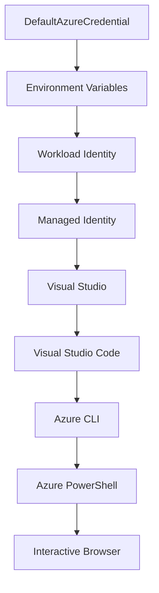

<!--
CO_OP_TRANSLATOR_METADATA:
{
  "original_hash": "fb0687bd0b166ecb0430dfeeed83487e",
  "translation_date": "2025-10-24T18:30:40+00:00",
  "source_file": "docs/getting-started/azd-basics.md",
  "language_code": "et"
}
-->
# AZD Põhitõed - Azure Developer CLI mõistmine

# AZD Põhitõed - Põhimõtted ja alused

**Peatüki navigeerimine:**
- **📚 Kursuse avaleht**: [AZD Algajatele](../../README.md)
- **📖 Käesolev peatükk**: Peatükk 1 - Alused ja kiirstart
- **⬅️ Eelmine**: [Kursuse ülevaade](../../README.md#-chapter-1-foundation--quick-start)
- **➡️ Järgmine**: [Paigaldamine ja seadistamine](installation.md)
- **🚀 Järgmine peatükk**: [Peatükk 2: AI-põhine arendus](../ai-foundry/azure-ai-foundry-integration.md)

## Sissejuhatus

Selles õppetükis tutvustatakse Azure Developer CLI-d (azd), võimsat käsurea tööriista, mis kiirendab teie teekonda kohalikust arendusest Azure'i juurutamiseni. Õpite tundma põhimõisteid, põhifunktsioone ja mõistate, kuidas azd lihtsustab pilvepõhiste rakenduste juurutamist.

## Õppeeesmärgid

Selle õppetüki lõpuks:
- Mõistate, mis on Azure Developer CLI ja selle peamine eesmärk
- Õpite tundma põhimõisteid nagu mallid, keskkonnad ja teenused
- Avastate peamised funktsioonid, sealhulgas mallipõhine arendus ja infrastruktuur kui kood
- Mõistate azd projekti struktuuri ja töövoogu
- Olete valmis azd-i oma arenduskeskkonnas paigaldama ja seadistama

## Õpitulemused

Pärast õppetüki läbimist suudate:
- Selgitada azd rolli kaasaegsetes pilvearenduse töövoogudes
- Tuvastada azd projekti struktuuri komponente
- Kirjeldada, kuidas mallid, keskkonnad ja teenused koos toimivad
- Mõista infrastruktuuri kui koodi eeliseid azd abil
- Tunda erinevaid azd käske ja nende eesmärke

## Mis on Azure Developer CLI (azd)?

Azure Developer CLI (azd) on käsurea tööriist, mis on loodud kiirendama teie teekonda kohalikust arendusest Azure'i juurutamiseni. See lihtsustab pilvepõhiste rakenduste loomise, juurutamise ja haldamise protsessi Azure'is.

## Põhimõisted

### Mallid
Mallid on azd aluseks. Need sisaldavad:
- **Rakenduse koodi** - Teie lähtekood ja sõltuvused
- **Infrastruktuuri määratlusi** - Azure'i ressursid, mis on määratletud Bicep või Terraformi abil
- **Konfiguratsioonifailid** - Seaded ja keskkonnamuutujad
- **Juurutusskriptid** - Automatiseeritud juurutustöövood

### Keskkonnad
Keskkonnad esindavad erinevaid juurutamise sihtmärke:
- **Arendus** - Testimiseks ja arenduseks
- **Staging** - Eeltootmise keskkond
- **Tootmine** - Live tootmiskeskkond

Igal keskkonnal on oma:
- Azure'i ressursigrupp
- Konfiguratsiooniseaded
- Juurutamise olek

### Teenused
Teenused on teie rakenduse ehituskivid:
- **Frontend** - Veebirakendused, SPA-d
- **Backend** - API-d, mikroteenused
- **Andmebaas** - Andmesalvestuslahendused
- **Salvestus** - Faili- ja blobisalvestus

## Põhifunktsioonid

### 1. Mallipõhine arendus
```bash
# Browse available templates
azd template list

# Initialize from a template
azd init --template <template-name>
```

### 2. Infrastruktuur kui kood
- **Bicep** - Azure'i domeenispetsiifiline keel
- **Terraform** - Mitme pilve infrastruktuuri tööriist
- **ARM Mallid** - Azure Resource Manager mallid

### 3. Integreeritud töövood
```bash
# Complete deployment workflow
azd up            # Provision + Deploy this is hands off for first time setup

# 🧪 NEW: Preview infrastructure changes before deployment (SAFE)
azd provision --preview    # Simulate infrastructure deployment without making changes

azd provision     # Create Azure resources if you update the infrastructure use this
azd deploy        # Deploy application code or redeploy application code once update
azd down          # Clean up resources
```

#### 🛡️ Turvaline infrastruktuuri planeerimine eelvaatega
`azd provision --preview` käsk on murranguline turvaliste juurutuste jaoks:
- **Kuivkäivitusanalüüs** - Näitab, mida luuakse, muudetakse või kustutatakse
- **Nullrisk** - Azure'i keskkonnas ei tehta tegelikke muudatusi
- **Meeskonnatöö** - Jagage eelvaate tulemusi enne juurutamist
- **Kulude hindamine** - Mõistke ressursikulud enne kohustuste võtmist

```bash
# Example preview workflow
azd provision --preview           # See what will change
# Review the output, discuss with team
azd provision                     # Apply changes with confidence
```

### 4. Keskkonna haldamine
```bash
# Create and manage environments
azd env new <environment-name>
azd env select <environment-name>
azd env list
```

## 📁 Projekti struktuur

Tüüpiline azd projekti struktuur:
```
my-app/
├── .azd/                    # azd configuration
│   └── config.json
├── .azure/                  # Azure deployment artifacts
├── .devcontainer/          # Development container config
├── .github/workflows/      # GitHub Actions
├── .vscode/               # VS Code settings
├── infra/                 # Infrastructure code
│   ├── main.bicep        # Main infrastructure template
│   ├── main.parameters.json
│   └── modules/          # Reusable modules
├── src/                  # Application source code
│   ├── api/             # Backend services
│   └── web/             # Frontend application
├── azure.yaml           # azd project configuration
└── README.md
```

## 🔧 Konfiguratsioonifailid

### azure.yaml
Peamine projekti konfiguratsioonifail:
```yaml
name: my-awesome-app
metadata:
  template: my-template@1.0.0

services:
  web:
    project: ./src/web
    language: js
    host: appservice
  api:
    project: ./src/api
    language: js
    host: appservice

hooks:
  preprovision:
    shell: pwsh
    run: echo "Preparing to provision..."
```

### .azure/config.json
Keskkonnaspetsiifiline konfiguratsioon:
```json
{
  "version": 1,
  "defaultEnvironment": "dev",
  "environments": {
    "dev": {
      "subscriptionId": "your-subscription-id",
      "location": "eastus"
    }
  }
}
```

## 🎪 Tavalised töövood

### Uue projekti alustamine
```bash
# Method 1: Use existing template
azd init --template todo-nodejs-mongo

# Method 2: Start from scratch
azd init

# Method 3: Use current directory
azd init .
```

### Arendustsükkel
```bash
# Set up development environment
azd auth login
azd env new dev
azd env select dev

# Deploy everything
azd up

# Make changes and redeploy
azd deploy

# Clean up when done
azd down --force --purge # command in the Azure Developer CLI is a **hard reset** for your environment—especially useful when you're troubleshooting failed deployments, cleaning up orphaned resources, or prepping for a fresh redeploy.
```

## `azd down --force --purge` mõistmine
`azd down --force --purge` käsk on võimas viis azd keskkonna ja kõigi seotud ressursside täielikuks eemaldamiseks. Siin on ülevaade, mida iga lipp teeb:
```
--force
```
- Jätab vahele kinnitusküsimused.
- Kasulik automatiseerimisel või skriptimisel, kus käsitsi sisestamine pole võimalik.
- Tagab, et eemaldamine toimub katkestusteta, isegi kui CLI tuvastab ebakõlasid.

```
--purge
```
Kustutab **kogu seotud metaandmed**, sealhulgas:
Keskkonna olek
Kohalik `.azure` kaust
Vahemällu salvestatud juurutusinfo
Vältib azd-i "mäletamist" varasematest juurutustest, mis võivad põhjustada probleeme, nagu ressursigruppide sobimatus või vananenud registriviited.

### Miks kasutada mõlemat?
Kui `azd up` ei tööta jääkseisu või osaliste juurutuste tõttu, tagab see kombinatsioon **puhta alguse**.

See on eriti kasulik pärast käsitsi ressurside kustutamist Azure'i portaalis või mallide, keskkondade või ressursigruppide nimemustrite vahetamisel.

### Mitme keskkonna haldamine
```bash
# Create staging environment
azd env new staging
azd env select staging
azd up

# Switch back to dev
azd env select dev

# Compare environments
azd env list
```

## 🔐 Autentimine ja volitused

Autentimise mõistmine on azd edukaks juurutamiseks ülioluline. Azure kasutab mitmeid autentimismeetodeid ja azd kasutab sama volituste ahelat, mida teised Azure'i tööriistad.

### Azure CLI autentimine (`az login`)

Enne azd kasutamist peate Azure'iga autentima. Kõige tavalisem meetod on Azure CLI kasutamine:

```bash
# Interactive login (opens browser)
az login

# Login with specific tenant
az login --tenant <tenant-id>

# Login with service principal
az login --service-principal -u <app-id> -p <password> --tenant <tenant-id>

# Check current login status
az account show

# List available subscriptions
az account list --output table

# Set default subscription
az account set --subscription <subscription-id>
```

### Autentimise voog
1. **Interaktiivne sisselogimine**: Avab teie vaikimisi brauseri autentimiseks
2. **Seadme koodi voog**: Keskkondade jaoks, kus brauseri kasutamine pole võimalik
3. **Teenusepõhimõte**: Automatiseerimise ja CI/CD stsenaariumide jaoks
4. **Hallatud identiteet**: Azure'is hostitud rakenduste jaoks

### DefaultAzureCredential ahel

`DefaultAzureCredential` on volituste tüüp, mis pakub lihtsustatud autentimiskogemust, proovides automaatselt mitmeid volituste allikaid kindlas järjekorras:

#### Volituste ahela järjekord


#### 1. Keskkonnamuutujad
```bash
# Set environment variables for service principal
export AZURE_CLIENT_ID="<app-id>"
export AZURE_CLIENT_SECRET="<password>"
export AZURE_TENANT_ID="<tenant-id>"
```

#### 2. Töökoormuse identiteet (Kubernetes/GitHub Actions)
Kasutatakse automaatselt:
- Azure Kubernetes Service (AKS) koos töökoormuse identiteediga
- GitHub Actions koos OIDC federatsiooniga
- Muud federatiivse identiteedi stsenaariumid

#### 3. Hallatud identiteet
Azure'i ressursside jaoks, nagu:
- Virtuaalmasinad
- Rakendusteenus
- Azure Functions
- Konteineriteenused

```bash
# Check if running on Azure resource with managed identity
az account show --query "user.type" --output tsv
# Returns: "servicePrincipal" if using managed identity
```

#### 4. Arendustööriistade integreerimine
- **Visual Studio**: Kasutab automaatselt sisse logitud kontot
- **VS Code**: Kasutab Azure Account laienduse volitusi
- **Azure CLI**: Kasutab `az login` volitusi (kõige tavalisem kohalikuks arenduseks)

### AZD autentimise seadistamine

```bash
# Method 1: Use Azure CLI (Recommended for development)
az login
azd auth login  # Uses existing Azure CLI credentials

# Method 2: Direct azd authentication
azd auth login --use-device-code  # For headless environments

# Method 3: Check authentication status
azd auth login --check-status

# Method 4: Logout and re-authenticate
azd auth logout
azd auth login
```

### Autentimise parimad praktikad

#### Kohaliku arenduse jaoks
```bash
# 1. Login with Azure CLI
az login

# 2. Verify correct subscription
az account show
az account set --subscription "Your Subscription Name"

# 3. Use azd with existing credentials
azd auth login
```

#### CI/CD torujuhtmete jaoks
```yaml
# GitHub Actions example
- name: Azure Login
  uses: azure/login@v1
  with:
    creds: ${{ secrets.AZURE_CREDENTIALS }}

- name: Deploy with azd
  run: |
    azd auth login --client-id ${{ secrets.AZURE_CLIENT_ID }} \
                    --client-secret ${{ secrets.AZURE_CLIENT_SECRET }} \
                    --tenant-id ${{ secrets.AZURE_TENANT_ID }}
    azd up --no-prompt
```

#### Tootmiskeskkondade jaoks
- Kasutage **hallatud identiteeti**, kui töötate Azure'i ressurssidel
- Kasutage **teenusepõhimõtet** automatiseerimise stsenaariumide jaoks
- Vältige volituste salvestamist koodi või konfiguratsioonifailidesse
- Kasutage **Azure Key Vaulti** tundliku konfiguratsiooni jaoks

### Tavalised autentimise probleemid ja lahendused

#### Probleem: "Tellimust ei leitud"
```bash
# Solution: Set default subscription
az account list --output table
az account set --subscription "<subscription-id>"
azd env set AZURE_SUBSCRIPTION_ID "<subscription-id>"
```

#### Probleem: "Ebapiisavad õigused"
```bash
# Solution: Check and assign required roles
az role assignment list --assignee $(az account show --query user.name --output tsv)

# Common required roles:
# - Contributor (for resource management)
# - User Access Administrator (for role assignments)
```

#### Probleem: "Token aegunud"
```bash
# Solution: Re-authenticate
az logout
az login
azd auth logout
azd auth login
```

### Autentimine erinevates stsenaariumides

#### Kohalik arendus
```bash
# Personal development account
az login
azd auth login
```

#### Meeskonna arendus
```bash
# Use specific tenant for organization
az login --tenant contoso.onmicrosoft.com
azd auth login
```

#### Mitme rentniku stsenaariumid
```bash
# Switch between tenants
az login --tenant tenant1.onmicrosoft.com
# Deploy to tenant 1
azd up

az login --tenant tenant2.onmicrosoft.com  
# Deploy to tenant 2
azd up
```

### Turvalisuse kaalutlused

1. **Volituste salvestamine**: Ärge kunagi salvestage volitusi lähtekoodi
2. **Ulatuspiirang**: Kasutage teenusepõhimõtete puhul minimaalseid õigusi
3. **Tokenite uuendamine**: Uuendage regulaarselt teenusepõhimõtete paroole
4. **Auditijälg**: Jälgige autentimise ja juurutamise tegevusi
5. **Võrguturvalisus**: Kasutage võimalusel privaatseid lõpp-punkte

### Autentimise tõrkeotsing

```bash
# Debug authentication issues
azd auth login --check-status
az account show
az account get-access-token

# Common diagnostic commands
whoami                          # Current user context
az ad signed-in-user show      # Azure AD user details
az group list                  # Test resource access
```

## `azd down --force --purge` mõistmine

### Avastamine
```bash
azd template list              # Browse templates
azd template show <template>   # Template details
azd init --help               # Initialization options
```

### Projekti haldamine
```bash
azd show                     # Project overview
azd env show                 # Current environment
azd config list             # Configuration settings
```

### Jälgimine
```bash
azd monitor                  # Open Azure portal
azd pipeline config          # Set up CI/CD
azd logs                     # View application logs
```

## Parimad praktikad

### 1. Kasutage tähenduslikke nimesid
```bash
# Good
azd env new production-east
azd init --template web-app-secure

# Avoid
azd env new env1
azd init --template template1
```

### 2. Kasutage malle
- Alustage olemasolevate mallidega
- Kohandage vastavalt oma vajadustele
- Looge oma organisatsioonile korduvkasutatavad mallid

### 3. Keskkonna eraldamine
- Kasutage eraldi keskkondi arenduseks/staginguks/tootmiseks
- Ärge kunagi juurutage otse tootmisesse kohalikust masinast
- Kasutage tootmise juurutamiseks CI/CD torujuhtmeid

### 4. Konfiguratsiooni haldamine
- Kasutage tundlike andmete jaoks keskkonnamuutujaid
- Hoidke konfiguratsiooni versioonihalduses
- Dokumenteerige keskkonnaspetsiifilised seaded

## Õppeprogressioon

### Algaja (1-2 nädalat)
1. Paigaldage azd ja autentige
2. Juurutage lihtne mall
3. Mõistke projekti struktuuri
4. Õppige põhikäske (up, down, deploy)

### Kesktase (3-4 nädalat)
1. Kohandage malle
2. Hallake mitut keskkonda
3. Mõistke infrastruktuuri koodi
4. Seadistage CI/CD torujuhtmeid

### Edasijõudnud (5+ nädalat)
1. Looge kohandatud mallid
2. Täiustatud infrastruktuuri mustrid
3. Mitme piirkonna juurutused
4. Ettevõtte tasemel konfiguratsioonid

## Järgmised sammud

**📖 Jätkake 1. peatüki õppimist:**
- [Paigaldamine ja seadistamine](installation.md) - Paigaldage ja seadistage azd
- [Teie esimene projekt](first-project.md) - Täitke praktiline juhend
- [Konfiguratsiooni juhend](configuration.md) - Täiustatud konfiguratsiooni valikud

**🎯 Valmis järgmise peatüki jaoks?**
- [Peatükk 2: AI-põhine arendus](../ai-foundry/azure-ai-foundry-integration.md) - Alustage AI rakenduste loomist

## Täiendavad ressursid

- [Azure Developer CLI ülevaade](https://learn.microsoft.com/en-us/azure/developer/azure-developer-cli/)
- [Mallide galerii](https://azure.github.io/awesome-azd/)
- [Kogukonna näidised](https://github.com/Azure-Samples)

---

**Peatüki navigeerimine:**
- **📚 Kursuse avaleht**: [AZD Algajatele](../../README.md)
- **📖 Käesolev peatükk**: Peatükk 1 - Alused ja kiirstart  
- **⬅️ Eelmine**: [Kursuse ülevaade](../../README.md#-chapter-1-foundation--quick-start)
- **➡️ Järgmine**: [Paigaldamine ja seadistamine](installation.md)
- **🚀 Järgmine peatükk**: [Peatükk 2: AI-põhine arendus](../ai-foundry/azure-ai-foundry-integration.md)

---

**Lahtiütlus**:  
See dokument on tõlgitud AI tõlketeenuse [Co-op Translator](https://github.com/Azure/co-op-translator) abil. Kuigi püüame tagada täpsust, palume arvestada, et automaatsed tõlked võivad sisaldada vigu või ebatäpsusi. Algne dokument selle algses keeles tuleks pidada autoriteetseks allikaks. Olulise teabe puhul soovitame kasutada professionaalset inimtõlget. Me ei vastuta arusaamatuste või valesti tõlgenduste eest, mis võivad tekkida selle tõlke kasutamise tõttu.