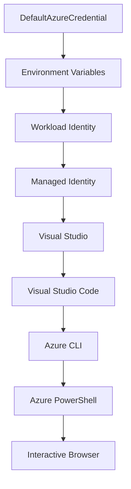

<!--
CO_OP_TRANSLATOR_METADATA:
{
  "original_hash": "fb0687bd0b166ecb0430dfeeed83487e",
  "translation_date": "2025-10-24T16:36:22+00:00",
  "source_file": "docs/getting-started/azd-basics.md",
  "language_code": "fa"
}
-->
# اصول اولیه AZD - آشنایی با Azure Developer CLI

# اصول اولیه AZD - مفاهیم اصلی و پایه

**راهنمای فصل:**
- **📚 صفحه اصلی دوره**: [AZD برای مبتدیان](../../README.md)
- **📖 فصل فعلی**: فصل 1 - پایه و شروع سریع
- **⬅️ قبلی**: [بررسی کلی دوره](../../README.md#-chapter-1-foundation--quick-start)
- **➡️ بعدی**: [نصب و تنظیمات](installation.md)
- **🚀 فصل بعدی**: [فصل 2: توسعه مبتنی بر هوش مصنوعی](../ai-foundry/azure-ai-foundry-integration.md)

## مقدمه

این درس شما را با Azure Developer CLI (azd) آشنا می‌کند، ابزاری قدرتمند خط فرمان که مسیر شما را از توسعه محلی به استقرار در Azure تسریع می‌کند. شما مفاهیم پایه، ویژگی‌های اصلی و نحوه ساده‌سازی استقرار برنامه‌های ابری توسط azd را خواهید آموخت.

## اهداف یادگیری

در پایان این درس، شما:
- با Azure Developer CLI و هدف اصلی آن آشنا خواهید شد
- مفاهیم اصلی مانند قالب‌ها، محیط‌ها و سرویس‌ها را یاد خواهید گرفت
- ویژگی‌های کلیدی از جمله توسعه مبتنی بر قالب و زیرساخت به عنوان کد را بررسی خواهید کرد
- ساختار پروژه azd و جریان کاری آن را درک خواهید کرد
- آماده نصب و پیکربندی azd برای محیط توسعه خود خواهید بود

## نتایج یادگیری

پس از تکمیل این درس، شما قادر خواهید بود:
- نقش azd در جریان‌های کاری توسعه ابری مدرن را توضیح دهید
- اجزای ساختار پروژه azd را شناسایی کنید
- نحوه همکاری قالب‌ها، محیط‌ها و سرویس‌ها را شرح دهید
- مزایای زیرساخت به عنوان کد با azd را درک کنید
- دستورات مختلف azd و اهداف آن‌ها را بشناسید

## Azure Developer CLI (azd) چیست؟

Azure Developer CLI (azd) یک ابزار خط فرمان است که برای تسریع مسیر شما از توسعه محلی به استقرار در Azure طراحی شده است. این ابزار فرآیند ساخت، استقرار و مدیریت برنامه‌های ابری در Azure را ساده می‌کند.

## مفاهیم اصلی

### قالب‌ها
قالب‌ها پایه و اساس azd هستند. آن‌ها شامل موارد زیر می‌شوند:
- **کد برنامه** - کد منبع و وابستگی‌های شما
- **تعاریف زیرساخت** - منابع Azure تعریف شده در Bicep یا Terraform
- **فایل‌های پیکربندی** - تنظیمات و متغیرهای محیطی
- **اسکریپت‌های استقرار** - جریان‌های کاری استقرار خودکار

### محیط‌ها
محیط‌ها نمایانگر اهداف مختلف استقرار هستند:
- **توسعه** - برای آزمایش و توسعه
- **آزمایشی** - محیط پیش‌تولید
- **تولید** - محیط تولید زنده

هر محیط شامل موارد زیر است:
- گروه منابع Azure
- تنظیمات پیکربندی
- وضعیت استقرار

### سرویس‌ها
سرویس‌ها اجزای سازنده برنامه شما هستند:
- **فرانت‌اند** - برنامه‌های وب، SPAs
- **بک‌اند** - APIها، میکروسرویس‌ها
- **پایگاه داده** - راه‌حل‌های ذخیره‌سازی داده
- **ذخیره‌سازی** - ذخیره‌سازی فایل و blob

## ویژگی‌های کلیدی

### 1. توسعه مبتنی بر قالب
```bash
# Browse available templates
azd template list

# Initialize from a template
azd init --template <template-name>
```

### 2. زیرساخت به عنوان کد
- **Bicep** - زبان خاص دامنه Azure
- **Terraform** - ابزار زیرساخت چند ابری
- **ARM Templates** - قالب‌های Azure Resource Manager

### 3. جریان‌های کاری یکپارچه
```bash
# Complete deployment workflow
azd up            # Provision + Deploy this is hands off for first time setup

# 🧪 NEW: Preview infrastructure changes before deployment (SAFE)
azd provision --preview    # Simulate infrastructure deployment without making changes

azd provision     # Create Azure resources if you update the infrastructure use this
azd deploy        # Deploy application code or redeploy application code once update
azd down          # Clean up resources
```

#### 🛡️ برنامه‌ریزی ایمن زیرساخت با پیش‌نمایش
دستور `azd provision --preview` برای استقرار ایمن بسیار مفید است:
- **تحلیل اجرای خشک** - نشان می‌دهد چه چیزی ایجاد، تغییر یا حذف خواهد شد
- **بدون ریسک** - هیچ تغییری واقعی در محیط Azure شما ایجاد نمی‌شود
- **همکاری تیمی** - نتایج پیش‌نمایش را قبل از استقرار به اشتراک بگذارید
- **برآورد هزینه** - هزینه‌های منابع را قبل از تعهد درک کنید

```bash
# Example preview workflow
azd provision --preview           # See what will change
# Review the output, discuss with team
azd provision                     # Apply changes with confidence
```

### 4. مدیریت محیط‌ها
```bash
# Create and manage environments
azd env new <environment-name>
azd env select <environment-name>
azd env list
```

## 📁 ساختار پروژه

یک ساختار معمولی پروژه azd:
```
my-app/
├── .azd/                    # azd configuration
│   └── config.json
├── .azure/                  # Azure deployment artifacts
├── .devcontainer/          # Development container config
├── .github/workflows/      # GitHub Actions
├── .vscode/               # VS Code settings
├── infra/                 # Infrastructure code
│   ├── main.bicep        # Main infrastructure template
│   ├── main.parameters.json
│   └── modules/          # Reusable modules
├── src/                  # Application source code
│   ├── api/             # Backend services
│   └── web/             # Frontend application
├── azure.yaml           # azd project configuration
└── README.md
```

## 🔧 فایل‌های پیکربندی

### azure.yaml
فایل اصلی پیکربندی پروژه:
```yaml
name: my-awesome-app
metadata:
  template: my-template@1.0.0

services:
  web:
    project: ./src/web
    language: js
    host: appservice
  api:
    project: ./src/api
    language: js
    host: appservice

hooks:
  preprovision:
    shell: pwsh
    run: echo "Preparing to provision..."
```

### .azure/config.json
پیکربندی مخصوص محیط:
```json
{
  "version": 1,
  "defaultEnvironment": "dev",
  "environments": {
    "dev": {
      "subscriptionId": "your-subscription-id",
      "location": "eastus"
    }
  }
}
```

## 🎪 جریان‌های کاری رایج

### شروع یک پروژه جدید
```bash
# Method 1: Use existing template
azd init --template todo-nodejs-mongo

# Method 2: Start from scratch
azd init

# Method 3: Use current directory
azd init .
```

### چرخه توسعه
```bash
# Set up development environment
azd auth login
azd env new dev
azd env select dev

# Deploy everything
azd up

# Make changes and redeploy
azd deploy

# Clean up when done
azd down --force --purge # command in the Azure Developer CLI is a **hard reset** for your environment—especially useful when you're troubleshooting failed deployments, cleaning up orphaned resources, or prepping for a fresh redeploy.
```

## درک `azd down --force --purge`
دستور `azd down --force --purge` راهی قدرتمند برای حذف کامل محیط azd و تمام منابع مرتبط است. در اینجا توضیحی از هر پرچم آورده شده است:
```
--force
```
- از درخواست‌های تأیید صرف‌نظر می‌کند.
- برای اتوماسیون یا اسکریپت‌نویسی که ورودی دستی امکان‌پذیر نیست، مفید است.
- تضمین می‌کند که فرآیند حذف بدون وقفه ادامه یابد، حتی اگر CLI ناسازگاری‌هایی را تشخیص دهد.

```
--purge
```
تمام **اطلاعات متادیتای مرتبط** از جمله موارد زیر را حذف می‌کند:
وضعیت محیط
پوشه محلی `.azure`
اطلاعات استقرار ذخیره‌شده
از "به یاد آوردن" استقرارهای قبلی توسط azd جلوگیری می‌کند، که می‌تواند مشکلاتی مانند گروه‌های منابع ناسازگار یا ارجاعات قدیمی به رجیستری ایجاد کند.

### چرا از هر دو استفاده کنیم؟
وقتی با `azd up` به دلیل وضعیت باقی‌مانده یا استقرارهای جزئی به مشکل برخوردید، این ترکیب یک **شروع تازه** را تضمین می‌کند.

این روش به‌ویژه پس از حذف دستی منابع در پورتال Azure یا هنگام تغییر قالب‌ها، محیط‌ها یا کنوانسیون‌های نام‌گذاری گروه منابع مفید است.

### مدیریت چندین محیط
```bash
# Create staging environment
azd env new staging
azd env select staging
azd up

# Switch back to dev
azd env select dev

# Compare environments
azd env list
```

## 🔐 احراز هویت و اعتبارنامه‌ها

درک احراز هویت برای استقرار موفقیت‌آمیز azd بسیار مهم است. Azure از روش‌های مختلف احراز هویت استفاده می‌کند و azd از همان زنجیره اعتبارنامه‌ای که توسط ابزارهای دیگر Azure استفاده می‌شود، بهره می‌برد.

### احراز هویت Azure CLI (`az login`)

قبل از استفاده از azd، باید با Azure احراز هویت کنید. رایج‌ترین روش استفاده از Azure CLI است:

```bash
# Interactive login (opens browser)
az login

# Login with specific tenant
az login --tenant <tenant-id>

# Login with service principal
az login --service-principal -u <app-id> -p <password> --tenant <tenant-id>

# Check current login status
az account show

# List available subscriptions
az account list --output table

# Set default subscription
az account set --subscription <subscription-id>
```

### جریان احراز هویت
1. **ورود تعاملی**: مرورگر پیش‌فرض شما برای احراز هویت باز می‌شود
2. **جریان کد دستگاه**: برای محیط‌هایی که دسترسی به مرورگر ندارند
3. **Service Principal**: برای سناریوهای اتوماسیون و CI/CD
4. **Managed Identity**: برای برنامه‌های میزبانی شده در Azure

### زنجیره اعتبارنامه DefaultAzureCredential

`DefaultAzureCredential` نوعی اعتبارنامه است که تجربه احراز هویت ساده‌ای را با تلاش خودکار برای منابع مختلف اعتبارنامه به ترتیب خاص فراهم می‌کند:

#### ترتیب زنجیره اعتبارنامه


#### 1. متغیرهای محیطی
```bash
# Set environment variables for service principal
export AZURE_CLIENT_ID="<app-id>"
export AZURE_CLIENT_SECRET="<password>"
export AZURE_TENANT_ID="<tenant-id>"
```

#### 2. Workload Identity (Kubernetes/GitHub Actions)
به‌طور خودکار استفاده می‌شود در:
- Azure Kubernetes Service (AKS) با Workload Identity
- GitHub Actions با OIDC federation
- سایر سناریوهای هویت فدرال

#### 3. Managed Identity
برای منابع Azure مانند:
- ماشین‌های مجازی
- App Service
- Azure Functions
- Container Instances

```bash
# Check if running on Azure resource with managed identity
az account show --query "user.type" --output tsv
# Returns: "servicePrincipal" if using managed identity
```

#### 4. یکپارچگی ابزارهای توسعه
- **Visual Studio**: به‌طور خودکار از حساب وارد شده استفاده می‌کند
- **VS Code**: از اعتبارنامه‌های افزونه Azure Account استفاده می‌کند
- **Azure CLI**: از اعتبارنامه‌های `az login` استفاده می‌کند (رایج‌ترین برای توسعه محلی)

### تنظیم احراز هویت AZD

```bash
# Method 1: Use Azure CLI (Recommended for development)
az login
azd auth login  # Uses existing Azure CLI credentials

# Method 2: Direct azd authentication
azd auth login --use-device-code  # For headless environments

# Method 3: Check authentication status
azd auth login --check-status

# Method 4: Logout and re-authenticate
azd auth logout
azd auth login
```

### بهترین روش‌های احراز هویت

#### برای توسعه محلی
```bash
# 1. Login with Azure CLI
az login

# 2. Verify correct subscription
az account show
az account set --subscription "Your Subscription Name"

# 3. Use azd with existing credentials
azd auth login
```

#### برای خطوط لوله CI/CD
```yaml
# GitHub Actions example
- name: Azure Login
  uses: azure/login@v1
  with:
    creds: ${{ secrets.AZURE_CREDENTIALS }}

- name: Deploy with azd
  run: |
    azd auth login --client-id ${{ secrets.AZURE_CLIENT_ID }} \
                    --client-secret ${{ secrets.AZURE_CLIENT_SECRET }} \
                    --tenant-id ${{ secrets.AZURE_TENANT_ID }}
    azd up --no-prompt
```

#### برای محیط‌های تولید
- هنگام اجرا بر روی منابع Azure از **Managed Identity** استفاده کنید
- برای سناریوهای اتوماسیون از **Service Principal** استفاده کنید
- از ذخیره اعتبارنامه‌ها در کد یا فایل‌های پیکربندی خودداری کنید
- برای پیکربندی حساس از **Azure Key Vault** استفاده کنید

### مشکلات رایج احراز هویت و راه‌حل‌ها

#### مشکل: "اشتراکی یافت نشد"
```bash
# Solution: Set default subscription
az account list --output table
az account set --subscription "<subscription-id>"
azd env set AZURE_SUBSCRIPTION_ID "<subscription-id>"
```

#### مشکل: "مجوزهای ناکافی"
```bash
# Solution: Check and assign required roles
az role assignment list --assignee $(az account show --query user.name --output tsv)

# Common required roles:
# - Contributor (for resource management)
# - User Access Administrator (for role assignments)
```

#### مشکل: "توکن منقضی شده"
```bash
# Solution: Re-authenticate
az logout
az login
azd auth logout
azd auth login
```

### احراز هویت در سناریوهای مختلف

#### توسعه محلی
```bash
# Personal development account
az login
azd auth login
```

#### توسعه تیمی
```bash
# Use specific tenant for organization
az login --tenant contoso.onmicrosoft.com
azd auth login
```

#### سناریوهای چند مستاجر
```bash
# Switch between tenants
az login --tenant tenant1.onmicrosoft.com
# Deploy to tenant 1
azd up

az login --tenant tenant2.onmicrosoft.com  
# Deploy to tenant 2
azd up
```

### ملاحظات امنیتی

1. **ذخیره اعتبارنامه‌ها**: هرگز اعتبارنامه‌ها را در کد منبع ذخیره نکنید
2. **محدودیت دامنه**: از اصل حداقل امتیاز برای Service Principal استفاده کنید
3. **چرخش توکن**: رمزهای Service Principal را به‌طور منظم تغییر دهید
4. **ردیابی حسابرسی**: فعالیت‌های احراز هویت و استقرار را نظارت کنید
5. **امنیت شبکه**: در صورت امکان از نقاط پایانی خصوصی استفاده کنید

### رفع مشکلات احراز هویت

```bash
# Debug authentication issues
azd auth login --check-status
az account show
az account get-access-token

# Common diagnostic commands
whoami                          # Current user context
az ad signed-in-user show      # Azure AD user details
az group list                  # Test resource access
```

## درک `azd down --force --purge`

### کشف
```bash
azd template list              # Browse templates
azd template show <template>   # Template details
azd init --help               # Initialization options
```

### مدیریت پروژه
```bash
azd show                     # Project overview
azd env show                 # Current environment
azd config list             # Configuration settings
```

### نظارت
```bash
azd monitor                  # Open Azure portal
azd pipeline config          # Set up CI/CD
azd logs                     # View application logs
```

## بهترین روش‌ها

### 1. استفاده از نام‌های معنادار
```bash
# Good
azd env new production-east
azd init --template web-app-secure

# Avoid
azd env new env1
azd init --template template1
```

### 2. استفاده از قالب‌ها
- با قالب‌های موجود شروع کنید
- آن‌ها را برای نیازهای خود سفارشی کنید
- قالب‌های قابل استفاده مجدد برای سازمان خود ایجاد کنید

### 3. جداسازی محیط‌ها
- از محیط‌های جداگانه برای توسعه/آزمایشی/تولید استفاده کنید
- هرگز مستقیماً از ماشین محلی به تولید استقرار ندهید
- برای استقرارهای تولید از خطوط لوله CI/CD استفاده کنید

### 4. مدیریت پیکربندی
- برای داده‌های حساس از متغیرهای محیطی استفاده کنید
- پیکربندی را در کنترل نسخه نگه دارید
- تنظیمات مخصوص محیط را مستند کنید

## پیشرفت یادگیری

### مبتدی (هفته 1-2)
1. نصب azd و احراز هویت
2. استقرار یک قالب ساده
3. درک ساختار پروژه
4. یادگیری دستورات پایه (up، down، deploy)

### متوسط (هفته 3-4)
1. سفارشی‌سازی قالب‌ها
2. مدیریت چندین محیط
3. درک کد زیرساخت
4. تنظیم خطوط لوله CI/CD

### پیشرفته (هفته 5+)
1. ایجاد قالب‌های سفارشی
2. الگوهای پیشرفته زیرساخت
3. استقرارهای چند منطقه‌ای
4. پیکربندی‌های سطح سازمانی

## مراحل بعدی

**📖 ادامه یادگیری فصل 1:**
- [نصب و تنظیمات](installation.md) - نصب و پیکربندی azd
- [پروژه اول شما](first-project.md) - تکمیل آموزش عملی
- [راهنمای پیکربندی](configuration.md) - گزینه‌های پیشرفته پیکربندی

**🎯 آماده برای فصل بعدی؟**
- [فصل 2: توسعه مبتنی بر هوش مصنوعی](../ai-foundry/azure-ai-foundry-integration.md) - شروع به ساخت برنامه‌های هوش مصنوعی کنید

## منابع اضافی

- [بررسی کلی Azure Developer CLI](https://learn.microsoft.com/en-us/azure/developer/azure-developer-cli/)
- [گالری قالب‌ها](https://azure.github.io/awesome-azd/)
- [نمونه‌های جامعه](https://github.com/Azure-Samples)

---

**راهنمای فصل:**
- **📚 صفحه اصلی دوره**: [AZD برای مبتدیان](../../README.md)
- **📖 فصل فعلی**: فصل 1 - پایه و شروع سریع  
- **⬅️ قبلی**: [بررسی کلی دوره](../../README.md#-chapter-1-foundation--quick-start)
- **➡️ بعدی**: [نصب و تنظیمات](installation.md)
- **🚀 فصل بعدی**: [فصل 2: توسعه مبتنی بر هوش مصنوعی](../ai-foundry/azure-ai-foundry-integration.md)

---

**سلب مسئولیت**:  
این سند با استفاده از سرویس ترجمه هوش مصنوعی [Co-op Translator](https://github.com/Azure/co-op-translator) ترجمه شده است. در حالی که ما تلاش می‌کنیم دقت را حفظ کنیم، لطفاً توجه داشته باشید که ترجمه‌های خودکار ممکن است شامل خطاها یا نادرستی‌ها باشند. سند اصلی به زبان اصلی آن باید به عنوان منبع معتبر در نظر گرفته شود. برای اطلاعات حیاتی، ترجمه حرفه‌ای انسانی توصیه می‌شود. ما مسئولیتی در قبال سوء تفاهم‌ها یا تفسیرهای نادرست ناشی از استفاده از این ترجمه نداریم.