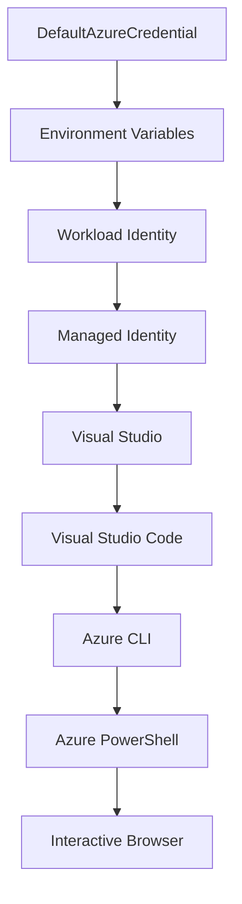

<!--
CO_OP_TRANSLATOR_METADATA:
{
  "original_hash": "fb0687bd0b166ecb0430dfeeed83487e",
  "translation_date": "2025-10-24T17:35:28+00:00",
  "source_file": "docs/getting-started/azd-basics.md",
  "language_code": "fi"
}
-->
# AZD Perusteet - Ymmärrä Azure Developer CLI

# AZD Perusteet - Keskeiset käsitteet ja perusteet

**Luvun navigointi:**
- **📚 Kurssin kotisivu**: [AZD Aloittelijoille](../../README.md)
- **📖 Nykyinen luku**: Luku 1 - Perusta & Nopea aloitus
- **⬅️ Edellinen**: [Kurssin yleiskatsaus](../../README.md#-chapter-1-foundation--quick-start)
- **➡️ Seuraava**: [Asennus & Määritys](installation.md)
- **🚀 Seuraava luku**: [Luku 2: AI-Ensisijainen kehitys](../ai-foundry/azure-ai-foundry-integration.md)

## Johdanto

Tässä luvussa tutustut Azure Developer CLI:hin (azd), tehokkaaseen komentorivityökaluun, joka nopeuttaa siirtymistä paikallisesta kehityksestä Azure-järjestelmien käyttöönottoon. Opit keskeiset käsitteet, tärkeimmät ominaisuudet ja ymmärrät, kuinka azd yksinkertaistaa pilvipohjaisten sovellusten käyttöönottoa.

## Oppimistavoitteet

Tämän luvun lopussa:
- Ymmärrät, mitä Azure Developer CLI on ja sen pääasiallisen tarkoituksen
- Opit keskeiset käsitteet, kuten mallipohjat, ympäristöt ja palvelut
- Tutustut tärkeimpiin ominaisuuksiin, kuten mallipohjaiseen kehitykseen ja Infrastructure as Code -lähestymistapaan
- Ymmärrät azd-projektin rakenteen ja työnkulun
- Olet valmis asentamaan ja määrittämään azd:n kehitysympäristöäsi varten

## Oppimistulokset

Luvun suorittamisen jälkeen pystyt:
- Selittämään azd:n roolin modernissa pilvikehityksen työnkulussa
- Tunnistamaan azd-projektin rakenteen osat
- Kuvaamaan, kuinka mallipohjat, ympäristöt ja palvelut toimivat yhdessä
- Ymmärtämään Infrastructure as Code -lähestymistavan hyödyt azd:n avulla
- Tunnistamaan eri azd-komennot ja niiden tarkoitukset

## Mikä on Azure Developer CLI (azd)?

Azure Developer CLI (azd) on komentorivityökalu, joka on suunniteltu nopeuttamaan siirtymistä paikallisesta kehityksestä Azure-järjestelmien käyttöönottoon. Se yksinkertaistaa pilvipohjaisten sovellusten rakentamista, käyttöönottoa ja hallintaa Azure-alustalla.

## Keskeiset käsitteet

### Mallipohjat
Mallipohjat ovat azd:n perusta. Ne sisältävät:
- **Sovelluskoodi** - Lähdekoodisi ja riippuvuudet
- **Infrastruktuurin määritelmät** - Azure-resurssit, jotka on määritelty Bicepillä tai Terraformilla
- **Määritystiedostot** - Asetukset ja ympäristömuuttujat
- **Käyttöönoton skriptit** - Automatisoidut käyttöönoton työnkulut

### Ympäristöt
Ympäristöt edustavat eri käyttöönoton kohteita:
- **Kehitys** - Testausta ja kehitystä varten
- **Välivaihe** - Esituotantoympäristö
- **Tuotanto** - Käytössä oleva tuotantoympäristö

Jokainen ympäristö ylläpitää omaa:
- Azure-resurssiryhmää
- Määritysasetuksia
- Käyttöönoton tilaa

### Palvelut
Palvelut ovat sovelluksesi rakennuspalikoita:
- **Käyttöliittymä** - Verkkosovellukset, yksisivuiset sovellukset
- **Taustajärjestelmä** - API:t, mikropalvelut
- **Tietokanta** - Tietojen tallennusratkaisut
- **Tallennus** - Tiedosto- ja blob-tallennus

## Tärkeimmät ominaisuudet

### 1. Mallipohjainen kehitys
```bash
# Browse available templates
azd template list

# Initialize from a template
azd init --template <template-name>
```

### 2. Infrastructure as Code
- **Bicep** - Azuren oma kieli
- **Terraform** - Monipilvi-infrastruktuurityökalu
- **ARM-mallipohjat** - Azure Resource Manager -mallipohjat

### 3. Integroitu työnkulku
```bash
# Complete deployment workflow
azd up            # Provision + Deploy this is hands off for first time setup

# 🧪 NEW: Preview infrastructure changes before deployment (SAFE)
azd provision --preview    # Simulate infrastructure deployment without making changes

azd provision     # Create Azure resources if you update the infrastructure use this
azd deploy        # Deploy application code or redeploy application code once update
azd down          # Clean up resources
```

#### 🛡️ Turvallinen infrastruktuurin suunnittelu esikatselulla
`azd provision --preview` -komento on mullistava työkalu turvallisiin käyttöönottoihin:
- **Kuivakäyntianalyysi** - Näyttää, mitä luodaan, muokataan tai poistetaan
- **Nollariski** - Azure-ympäristöön ei tehdä todellisia muutoksia
- **Tiimityö** - Jaa esikatselutulokset ennen käyttöönottoa
- **Kustannusarviointi** - Ymmärrä resurssikustannukset ennen sitoutumista

```bash
# Example preview workflow
azd provision --preview           # See what will change
# Review the output, discuss with team
azd provision                     # Apply changes with confidence
```

### 4. Ympäristön hallinta
```bash
# Create and manage environments
azd env new <environment-name>
azd env select <environment-name>
azd env list
```

## 📁 Projektin rakenne

Tyypillinen azd-projektin rakenne:
```
my-app/
├── .azd/                    # azd configuration
│   └── config.json
├── .azure/                  # Azure deployment artifacts
├── .devcontainer/          # Development container config
├── .github/workflows/      # GitHub Actions
├── .vscode/               # VS Code settings
├── infra/                 # Infrastructure code
│   ├── main.bicep        # Main infrastructure template
│   ├── main.parameters.json
│   └── modules/          # Reusable modules
├── src/                  # Application source code
│   ├── api/             # Backend services
│   └── web/             # Frontend application
├── azure.yaml           # azd project configuration
└── README.md
```

## 🔧 Määritystiedostot

### azure.yaml
Pääprojektin määritystiedosto:
```yaml
name: my-awesome-app
metadata:
  template: my-template@1.0.0

services:
  web:
    project: ./src/web
    language: js
    host: appservice
  api:
    project: ./src/api
    language: js
    host: appservice

hooks:
  preprovision:
    shell: pwsh
    run: echo "Preparing to provision..."
```

### .azure/config.json
Ympäristökohtainen määritys:
```json
{
  "version": 1,
  "defaultEnvironment": "dev",
  "environments": {
    "dev": {
      "subscriptionId": "your-subscription-id",
      "location": "eastus"
    }
  }
}
```

## 🎪 Yleiset työnkulut

### Uuden projektin aloittaminen
```bash
# Method 1: Use existing template
azd init --template todo-nodejs-mongo

# Method 2: Start from scratch
azd init

# Method 3: Use current directory
azd init .
```

### Kehityssykli
```bash
# Set up development environment
azd auth login
azd env new dev
azd env select dev

# Deploy everything
azd up

# Make changes and redeploy
azd deploy

# Clean up when done
azd down --force --purge # command in the Azure Developer CLI is a **hard reset** for your environment—especially useful when you're troubleshooting failed deployments, cleaning up orphaned resources, or prepping for a fresh redeploy.
```

## Ymmärrä `azd down --force --purge`
`azd down --force --purge` -komento on tehokas tapa purkaa kokonaan azd-ympäristösi ja kaikki siihen liittyvät resurssit. Tässä on erittely siitä, mitä kukin lippu tekee:
```
--force
```
- Ohittaa vahvistuskehotteet.
- Kätevä automaatiossa tai skriptauksessa, jossa manuaalinen syöttö ei ole mahdollista.
- Varmistaa purkamisen keskeytyksettä, vaikka CLI havaitsee epäjohdonmukaisuuksia.

```
--purge
```
Poistaa **kaiken siihen liittyvän metadatan**, mukaan lukien:
Ympäristön tila
Paikallinen `.azure`-kansio
Välimuistissa oleva käyttöönoton tieto
Estää azd:tä "muistamasta" aiempia käyttöönottoja, mikä voi aiheuttaa ongelmia, kuten ristiriitaisia resurssiryhmiä tai vanhentuneita rekisteriviittauksia.

### Miksi käyttää molempia?
Kun `azd up` -komento ei toimi jäljellä olevan tilan tai osittaisten käyttöönottojen vuoksi, tämä yhdistelmä varmistaa **puhtaan aloituksen**.

Se on erityisen hyödyllinen manuaalisten resurssien poistamisen jälkeen Azure-portaalissa tai vaihdettaessa mallipohjia, ympäristöjä tai resurssiryhmien nimeämiskäytäntöjä.

### Useiden ympäristöjen hallinta
```bash
# Create staging environment
azd env new staging
azd env select staging
azd up

# Switch back to dev
azd env select dev

# Compare environments
azd env list
```

## 🔐 Todennus ja tunnistetiedot

Todennuksen ymmärtäminen on ratkaisevan tärkeää onnistuneille azd-käyttöönottoille. Azure käyttää useita todennusmenetelmiä, ja azd hyödyntää samoja tunnistetietoketjuja kuin muut Azure-työkalut.

### Azure CLI -todennus (`az login`)

Ennen azd:n käyttöä sinun on kirjauduttava Azureen. Yleisin menetelmä on Azure CLI:n käyttö:

```bash
# Interactive login (opens browser)
az login

# Login with specific tenant
az login --tenant <tenant-id>

# Login with service principal
az login --service-principal -u <app-id> -p <password> --tenant <tenant-id>

# Check current login status
az account show

# List available subscriptions
az account list --output table

# Set default subscription
az account set --subscription <subscription-id>
```

### Todennusprosessi
1. **Interaktiivinen kirjautuminen**: Avaa oletusselaimesi todennusta varten
2. **Laitteen kooditodennus**: Ympäristöille, joissa ei ole selaimen käyttömahdollisuutta
3. **Palveluperiaate**: Automaatio- ja CI/CD-skenaarioita varten
4. **Hallittu identiteetti**: Azure-isännöidyille sovelluksille

### DefaultAzureCredential-ketju

`DefaultAzureCredential` on tunnistetyyppi, joka tarjoaa yksinkertaistetun todennuskokemuksen kokeilemalla automaattisesti useita tunnistetyyppilähteitä tietyssä järjestyksessä:

#### Tunnistetyyppiketjun järjestys


#### 1. Ympäristömuuttujat
```bash
# Set environment variables for service principal
export AZURE_CLIENT_ID="<app-id>"
export AZURE_CLIENT_SECRET="<password>"
export AZURE_TENANT_ID="<tenant-id>"
```

#### 2. Työkuorman identiteetti (Kubernetes/GitHub Actions)
Käytetään automaattisesti:
- Azure Kubernetes Service (AKS) työkuorman identiteetillä
- GitHub Actions OIDC-federaatiolla
- Muut federoidun identiteetin skenaariot

#### 3. Hallittu identiteetti
Azure-resursseille, kuten:
- Virtuaalikoneet
- Sovelluspalvelu
- Azure Functions
- Kontti-instanssit

```bash
# Check if running on Azure resource with managed identity
az account show --query "user.type" --output tsv
# Returns: "servicePrincipal" if using managed identity
```

#### 4. Kehitystyökalujen integrointi
- **Visual Studio**: Käyttää automaattisesti sisäänkirjautunutta tiliä
- **VS Code**: Käyttää Azure Account -laajennuksen tunnistetietoja
- **Azure CLI**: Käyttää `az login` -tunnistetietoja (yleisin paikallisessa kehityksessä)

### AZD-todennuksen määritys

```bash
# Method 1: Use Azure CLI (Recommended for development)
az login
azd auth login  # Uses existing Azure CLI credentials

# Method 2: Direct azd authentication
azd auth login --use-device-code  # For headless environments

# Method 3: Check authentication status
azd auth login --check-status

# Method 4: Logout and re-authenticate
azd auth logout
azd auth login
```

### Todennuksen parhaat käytännöt

#### Paikallista kehitystä varten
```bash
# 1. Login with Azure CLI
az login

# 2. Verify correct subscription
az account show
az account set --subscription "Your Subscription Name"

# 3. Use azd with existing credentials
azd auth login
```

#### CI/CD-putkistoja varten
```yaml
# GitHub Actions example
- name: Azure Login
  uses: azure/login@v1
  with:
    creds: ${{ secrets.AZURE_CREDENTIALS }}

- name: Deploy with azd
  run: |
    azd auth login --client-id ${{ secrets.AZURE_CLIENT_ID }} \
                    --client-secret ${{ secrets.AZURE_CLIENT_SECRET }} \
                    --tenant-id ${{ secrets.AZURE_TENANT_ID }}
    azd up --no-prompt
```

#### Tuotantoympäristöjä varten
- Käytä **hallittua identiteettiä** Azure-resursseilla
- Käytä **palveluperiaatetta** automaatioskenaarioissa
- Vältä tunnistetietojen tallentamista koodiin tai määritystiedostoihin
- Käytä **Azure Key Vaultia** arkaluontoisten määritysten tallentamiseen

### Yleiset todennusongelmat ja ratkaisut

#### Ongelma: "Ei tilausta löydetty"
```bash
# Solution: Set default subscription
az account list --output table
az account set --subscription "<subscription-id>"
azd env set AZURE_SUBSCRIPTION_ID "<subscription-id>"
```

#### Ongelma: "Riittämättömät oikeudet"
```bash
# Solution: Check and assign required roles
az role assignment list --assignee $(az account show --query user.name --output tsv)

# Common required roles:
# - Contributor (for resource management)
# - User Access Administrator (for role assignments)
```

#### Ongelma: "Token vanhentunut"
```bash
# Solution: Re-authenticate
az logout
az login
azd auth logout
azd auth login
```

### Todennus eri skenaarioissa

#### Paikallinen kehitys
```bash
# Personal development account
az login
azd auth login
```

#### Tiimikehitys
```bash
# Use specific tenant for organization
az login --tenant contoso.onmicrosoft.com
azd auth login
```

#### Monivuokraajaskenaariot
```bash
# Switch between tenants
az login --tenant tenant1.onmicrosoft.com
# Deploy to tenant 1
azd up

az login --tenant tenant2.onmicrosoft.com  
# Deploy to tenant 2
azd up
```

### Turvallisuushuomiot

1. **Tunnistetietojen tallennus**: Älä koskaan tallenna tunnistetietoja lähdekoodiin
2. **Käyttöoikeuksien rajoittaminen**: Käytä vähimmäisoikeusperiaatetta palveluperiaatteille
3. **Tokenin kierrätys**: Kierrätä palveluperiaatteiden salaisuudet säännöllisesti
4. **Auditointijälki**: Seuraa todennus- ja käyttöönottoaktiviteetteja
5. **Verkkoturvallisuus**: Käytä yksityisiä päätepisteitä aina kun mahdollista

### Todennuksen vianmääritys

```bash
# Debug authentication issues
azd auth login --check-status
az account show
az account get-access-token

# Common diagnostic commands
whoami                          # Current user context
az ad signed-in-user show      # Azure AD user details
az group list                  # Test resource access
```

## Ymmärrä `azd down --force --purge`

### Löytäminen
```bash
azd template list              # Browse templates
azd template show <template>   # Template details
azd init --help               # Initialization options
```

### Projektinhallinta
```bash
azd show                     # Project overview
azd env show                 # Current environment
azd config list             # Configuration settings
```

### Seuranta
```bash
azd monitor                  # Open Azure portal
azd pipeline config          # Set up CI/CD
azd logs                     # View application logs
```

## Parhaat käytännöt

### 1. Käytä merkityksellisiä nimiä
```bash
# Good
azd env new production-east
azd init --template web-app-secure

# Avoid
azd env new env1
azd init --template template1
```

### 2. Hyödynnä mallipohjia
- Aloita olemassa olevilla mallipohjilla
- Mukauta tarpeidesi mukaan
- Luo organisaatiollesi uudelleenkäytettäviä mallipohjia

### 3. Ympäristöjen eristäminen
- Käytä erillisiä ympäristöjä kehitys/välivaihe/tuotanto
- Älä koskaan ota käyttöön suoraan tuotantoon paikalliselta koneelta
- Käytä CI/CD-putkistoja tuotantokäyttöönottoihin

### 4. Määritysten hallinta
- Käytä ympäristömuuttujia arkaluontoisille tiedoille
- Pidä määritykset versionhallinnassa
- Dokumentoi ympäristökohtaiset asetukset

## Oppimisen eteneminen

### Aloittelija (Viikot 1-2)
1. Asenna azd ja kirjaudu sisään
2. Ota käyttöön yksinkertainen mallipohja
3. Ymmärrä projektin rakenne
4. Opettele peruskomennot (up, down, deploy)

### Keskitaso (Viikot 3-4)
1. Mukauta mallipohjia
2. Hallitse useita ympäristöjä
3. Ymmärrä infrastruktuurikoodi
4. Määritä CI/CD-putkistot

### Edistynyt (Viikot 5+)
1. Luo omia mallipohjia
2. Kehittyneet infrastruktuurimallit
3. Monialueiset käyttöönotot
4. Yritystason määritykset

## Seuraavat askeleet

**📖 Jatka luvun 1 oppimista:**
- [Asennus & Määritys](installation.md) - Asenna ja määritä azd
- [Ensimmäinen projektisi](first-project.md) - Käytännön opetusohjelma
- [Määritysopas](configuration.md) - Edistyneet määritysvaihtoehdot

**🎯 Valmis seuraavaan lukuun?**
- [Luku 2: AI-Ensisijainen kehitys](../ai-foundry/azure-ai-foundry-integration.md) - Aloita AI-sovellusten rakentaminen

## Lisäresurssit

- [Azure Developer CLI Yleiskatsaus](https://learn.microsoft.com/en-us/azure/developer/azure-developer-cli/)
- [Mallipohjagalleria](https://azure.github.io/awesome-azd/)
- [Yhteisön esimerkit](https://github.com/Azure-Samples)

---

**Luvun navigointi:**
- **📚 Kurssin kotisivu**: [AZD Aloittelijoille](../../README.md)
- **📖 Nykyinen luku**: Luku 1 - Perusta & Nopea aloitus  
- **⬅️ Edellinen**: [Kurssin yleiskatsaus](../../README.md#-chapter-1-foundation--quick-start)
- **➡️ Seuraava**: [Asennus & Määritys](installation.md)
- **🚀 Seuraava luku**: [Luku 2: AI-Ensisijainen kehitys](../ai-foundry/azure-ai-foundry-integration.md)

---

**Vastuuvapauslauseke**:  
Tämä asiakirja on käännetty käyttämällä tekoälypohjaista käännöspalvelua [Co-op Translator](https://github.com/Azure/co-op-translator). Vaikka pyrimme tarkkuuteen, huomioithan, että automaattiset käännökset voivat sisältää virheitä tai epätarkkuuksia. Alkuperäinen asiakirja sen alkuperäisellä kielellä tulisi katsoa ensisijaiseksi lähteeksi. Kriittisen tiedon osalta suositellaan ammattimaista ihmiskäännöstä. Emme ole vastuussa väärinkäsityksistä tai virhetulkinnoista, jotka johtuvat tämän käännöksen käytöstä.