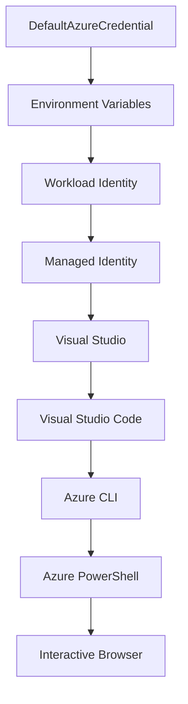

<!--
CO_OP_TRANSLATOR_METADATA:
{
  "original_hash": "fb0687bd0b166ecb0430dfeeed83487e",
  "translation_date": "2025-10-24T16:26:21+00:00",
  "source_file": "docs/getting-started/azd-basics.md",
  "language_code": "fr"
}
-->
# Notions de base sur AZD - Comprendre Azure Developer CLI

# Notions de base sur AZD - Concepts clés et fondamentaux

**Navigation du chapitre :**
- **📚 Accueil du cours** : [AZD pour les débutants](../../README.md)
- **📖 Chapitre actuel** : Chapitre 1 - Fondations & Démarrage rapide
- **⬅️ Précédent** : [Aperçu du cours](../../README.md#-chapter-1-foundation--quick-start)
- **➡️ Suivant** : [Installation & Configuration](installation.md)
- **🚀 Chapitre suivant** : [Chapitre 2 : Développement axé sur l'IA](../ai-foundry/azure-ai-foundry-integration.md)

## Introduction

Cette leçon vous présente Azure Developer CLI (azd), un outil en ligne de commande puissant qui accélère votre transition du développement local au déploiement sur Azure. Vous apprendrez les concepts fondamentaux, les fonctionnalités principales et comprendrez comment azd simplifie le déploiement d'applications cloud natives.

## Objectifs d'apprentissage

À la fin de cette leçon, vous serez capable de :
- Comprendre ce qu'est Azure Developer CLI et son objectif principal
- Découvrir les concepts clés des modèles, des environnements et des services
- Explorer les fonctionnalités principales, notamment le développement basé sur des modèles et l'infrastructure en tant que code
- Comprendre la structure et le flux de travail d'un projet azd
- Être prêt à installer et configurer azd pour votre environnement de développement

## Résultats d'apprentissage

Après avoir terminé cette leçon, vous serez capable de :
- Expliquer le rôle d'azd dans les flux de travail modernes de développement cloud
- Identifier les composants de la structure d'un projet azd
- Décrire comment les modèles, les environnements et les services fonctionnent ensemble
- Comprendre les avantages de l'infrastructure en tant que code avec azd
- Reconnaître les différentes commandes azd et leurs objectifs

## Qu'est-ce qu'Azure Developer CLI (azd) ?

Azure Developer CLI (azd) est un outil en ligne de commande conçu pour accélérer votre transition du développement local au déploiement sur Azure. Il simplifie le processus de création, de déploiement et de gestion des applications cloud natives sur Azure.

## Concepts clés

### Modèles
Les modèles sont la base d'azd. Ils contiennent :
- **Code de l'application** - Votre code source et ses dépendances
- **Définitions d'infrastructure** - Ressources Azure définies en Bicep ou Terraform
- **Fichiers de configuration** - Paramètres et variables d'environnement
- **Scripts de déploiement** - Flux de travail de déploiement automatisés

### Environnements
Les environnements représentent différents cibles de déploiement :
- **Développement** - Pour les tests et le développement
- **Préproduction** - Environnement avant la mise en production
- **Production** - Environnement de production en direct

Chaque environnement conserve ses propres :
- Groupe de ressources Azure
- Paramètres de configuration
- État de déploiement

### Services
Les services sont les blocs de construction de votre application :
- **Frontend** - Applications web, SPAs
- **Backend** - APIs, microservices
- **Base de données** - Solutions de stockage de données
- **Stockage** - Stockage de fichiers et de blobs

## Fonctionnalités principales

### 1. Développement basé sur des modèles
```bash
# Browse available templates
azd template list

# Initialize from a template
azd init --template <template-name>
```

### 2. Infrastructure en tant que code
- **Bicep** - Langage spécifique à Azure
- **Terraform** - Outil d'infrastructure multi-cloud
- **Modèles ARM** - Modèles Azure Resource Manager

### 3. Flux de travail intégrés
```bash
# Complete deployment workflow
azd up            # Provision + Deploy this is hands off for first time setup

# 🧪 NEW: Preview infrastructure changes before deployment (SAFE)
azd provision --preview    # Simulate infrastructure deployment without making changes

azd provision     # Create Azure resources if you update the infrastructure use this
azd deploy        # Deploy application code or redeploy application code once update
azd down          # Clean up resources
```

#### 🛡️ Planification sécurisée de l'infrastructure avec Preview
La commande `azd provision --preview` est révolutionnaire pour des déploiements sécurisés :
- **Analyse en mode simulation** - Montre ce qui sera créé, modifié ou supprimé
- **Aucun risque** - Aucun changement réel n'est effectué dans votre environnement Azure
- **Collaboration en équipe** - Partagez les résultats de la simulation avant le déploiement
- **Estimation des coûts** - Comprenez les coûts des ressources avant de vous engager

```bash
# Example preview workflow
azd provision --preview           # See what will change
# Review the output, discuss with team
azd provision                     # Apply changes with confidence
```

### 4. Gestion des environnements
```bash
# Create and manage environments
azd env new <environment-name>
azd env select <environment-name>
azd env list
```

## 📁 Structure du projet

Structure typique d'un projet azd :
```
my-app/
├── .azd/                    # azd configuration
│   └── config.json
├── .azure/                  # Azure deployment artifacts
├── .devcontainer/          # Development container config
├── .github/workflows/      # GitHub Actions
├── .vscode/               # VS Code settings
├── infra/                 # Infrastructure code
│   ├── main.bicep        # Main infrastructure template
│   ├── main.parameters.json
│   └── modules/          # Reusable modules
├── src/                  # Application source code
│   ├── api/             # Backend services
│   └── web/             # Frontend application
├── azure.yaml           # azd project configuration
└── README.md
```

## 🔧 Fichiers de configuration

### azure.yaml
Le fichier principal de configuration du projet :
```yaml
name: my-awesome-app
metadata:
  template: my-template@1.0.0

services:
  web:
    project: ./src/web
    language: js
    host: appservice
  api:
    project: ./src/api
    language: js
    host: appservice

hooks:
  preprovision:
    shell: pwsh
    run: echo "Preparing to provision..."
```

### .azure/config.json
Configuration spécifique à l'environnement :
```json
{
  "version": 1,
  "defaultEnvironment": "dev",
  "environments": {
    "dev": {
      "subscriptionId": "your-subscription-id",
      "location": "eastus"
    }
  }
}
```

## 🎪 Flux de travail courants

### Démarrer un nouveau projet
```bash
# Method 1: Use existing template
azd init --template todo-nodejs-mongo

# Method 2: Start from scratch
azd init

# Method 3: Use current directory
azd init .
```

### Cycle de développement
```bash
# Set up development environment
azd auth login
azd env new dev
azd env select dev

# Deploy everything
azd up

# Make changes and redeploy
azd deploy

# Clean up when done
azd down --force --purge # command in the Azure Developer CLI is a **hard reset** for your environment—especially useful when you're troubleshooting failed deployments, cleaning up orphaned resources, or prepping for a fresh redeploy.
```

## Comprendre `azd down --force --purge`
La commande `azd down --force --purge` est un moyen puissant de démanteler complètement votre environnement azd et toutes les ressources associées. Voici une explication de chaque option :
```
--force
```
- Ignore les invites de confirmation.
- Utile pour l'automatisation ou les scripts où une saisie manuelle n'est pas possible.
- Assure que le démantèlement se poursuit sans interruption, même si le CLI détecte des incohérences.

```
--purge
```
Supprime **toutes les métadonnées associées**, y compris :
État de l'environnement
Dossier local `.azure`
Informations de déploiement mises en cache
Empêche azd de "se souvenir" des déploiements précédents, ce qui peut causer des problèmes comme des groupes de ressources non correspondants ou des références de registre obsolètes.

### Pourquoi utiliser les deux ?
Lorsque vous êtes bloqué avec `azd up` en raison d'un état persistant ou de déploiements partiels, cette combinaison garantit un **nouveau départ**.

C'est particulièrement utile après des suppressions manuelles de ressources dans le portail Azure ou lors du changement de modèles, d'environnements ou de conventions de nommage des groupes de ressources.

### Gestion de plusieurs environnements
```bash
# Create staging environment
azd env new staging
azd env select staging
azd up

# Switch back to dev
azd env select dev

# Compare environments
azd env list
```

## 🔐 Authentification et identifiants

Comprendre l'authentification est crucial pour des déploiements azd réussis. Azure utilise plusieurs méthodes d'authentification, et azd s'appuie sur la même chaîne d'identifiants utilisée par d'autres outils Azure.

### Authentification Azure CLI (`az login`)

Avant d'utiliser azd, vous devez vous authentifier auprès d'Azure. La méthode la plus courante est d'utiliser Azure CLI :

```bash
# Interactive login (opens browser)
az login

# Login with specific tenant
az login --tenant <tenant-id>

# Login with service principal
az login --service-principal -u <app-id> -p <password> --tenant <tenant-id>

# Check current login status
az account show

# List available subscriptions
az account list --output table

# Set default subscription
az account set --subscription <subscription-id>
```

### Flux d'authentification
1. **Connexion interactive** : Ouvre votre navigateur par défaut pour l'authentification
2. **Code de périphérique** : Pour les environnements sans accès au navigateur
3. **Principal de service** : Pour les scénarios d'automatisation et CI/CD
4. **Identité gérée** : Pour les applications hébergées sur Azure

### Chaîne DefaultAzureCredential

`DefaultAzureCredential` est un type d'identifiant qui offre une expérience d'authentification simplifiée en essayant automatiquement plusieurs sources d'identifiants dans un ordre spécifique :

#### Ordre de la chaîne d'identifiants


#### 1. Variables d'environnement
```bash
# Set environment variables for service principal
export AZURE_CLIENT_ID="<app-id>"
export AZURE_CLIENT_SECRET="<password>"
export AZURE_TENANT_ID="<tenant-id>"
```

#### 2. Identité de charge de travail (Kubernetes/GitHub Actions)
Utilisé automatiquement dans :
- Azure Kubernetes Service (AKS) avec Workload Identity
- GitHub Actions avec fédération OIDC
- Autres scénarios d'identité fédérée

#### 3. Identité gérée
Pour les ressources Azure telles que :
- Machines virtuelles
- App Service
- Azure Functions
- Instances de conteneurs

```bash
# Check if running on Azure resource with managed identity
az account show --query "user.type" --output tsv
# Returns: "servicePrincipal" if using managed identity
```

#### 4. Intégration des outils de développement
- **Visual Studio** : Utilise automatiquement le compte connecté
- **VS Code** : Utilise les identifiants de l'extension Azure Account
- **Azure CLI** : Utilise les identifiants de `az login` (le plus courant pour le développement local)

### Configuration de l'authentification AZD

```bash
# Method 1: Use Azure CLI (Recommended for development)
az login
azd auth login  # Uses existing Azure CLI credentials

# Method 2: Direct azd authentication
azd auth login --use-device-code  # For headless environments

# Method 3: Check authentication status
azd auth login --check-status

# Method 4: Logout and re-authenticate
azd auth logout
azd auth login
```

### Meilleures pratiques d'authentification

#### Pour le développement local
```bash
# 1. Login with Azure CLI
az login

# 2. Verify correct subscription
az account show
az account set --subscription "Your Subscription Name"

# 3. Use azd with existing credentials
azd auth login
```

#### Pour les pipelines CI/CD
```yaml
# GitHub Actions example
- name: Azure Login
  uses: azure/login@v1
  with:
    creds: ${{ secrets.AZURE_CREDENTIALS }}

- name: Deploy with azd
  run: |
    azd auth login --client-id ${{ secrets.AZURE_CLIENT_ID }} \
                    --client-secret ${{ secrets.AZURE_CLIENT_SECRET }} \
                    --tenant-id ${{ secrets.AZURE_TENANT_ID }}
    azd up --no-prompt
```

#### Pour les environnements de production
- Utilisez **Identité gérée** lorsque vous exécutez des ressources Azure
- Utilisez **Principal de service** pour les scénarios d'automatisation
- Évitez de stocker les identifiants dans le code ou les fichiers de configuration
- Utilisez **Azure Key Vault** pour les configurations sensibles

### Problèmes courants d'authentification et solutions

#### Problème : "Aucun abonnement trouvé"
```bash
# Solution: Set default subscription
az account list --output table
az account set --subscription "<subscription-id>"
azd env set AZURE_SUBSCRIPTION_ID "<subscription-id>"
```

#### Problème : "Permissions insuffisantes"
```bash
# Solution: Check and assign required roles
az role assignment list --assignee $(az account show --query user.name --output tsv)

# Common required roles:
# - Contributor (for resource management)
# - User Access Administrator (for role assignments)
```

#### Problème : "Jeton expiré"
```bash
# Solution: Re-authenticate
az logout
az login
azd auth logout
azd auth login
```

### Authentification dans différents scénarios

#### Développement local
```bash
# Personal development account
az login
azd auth login
```

#### Développement en équipe
```bash
# Use specific tenant for organization
az login --tenant contoso.onmicrosoft.com
azd auth login
```

#### Scénarios multi-locataires
```bash
# Switch between tenants
az login --tenant tenant1.onmicrosoft.com
# Deploy to tenant 1
azd up

az login --tenant tenant2.onmicrosoft.com  
# Deploy to tenant 2
azd up
```

### Considérations de sécurité

1. **Stockage des identifiants** : Ne stockez jamais les identifiants dans le code source
2. **Limitation de la portée** : Utilisez le principe du moindre privilège pour les principaux de service
3. **Rotation des jetons** : Faites régulièrement tourner les secrets des principaux de service
4. **Traçabilité** : Surveillez les activités d'authentification et de déploiement
5. **Sécurité réseau** : Utilisez des points de terminaison privés lorsque cela est possible

### Dépannage de l'authentification

```bash
# Debug authentication issues
azd auth login --check-status
az account show
az account get-access-token

# Common diagnostic commands
whoami                          # Current user context
az ad signed-in-user show      # Azure AD user details
az group list                  # Test resource access
```

## Comprendre `azd down --force --purge`

### Découverte
```bash
azd template list              # Browse templates
azd template show <template>   # Template details
azd init --help               # Initialization options
```

### Gestion de projet
```bash
azd show                     # Project overview
azd env show                 # Current environment
azd config list             # Configuration settings
```

### Surveillance
```bash
azd monitor                  # Open Azure portal
azd pipeline config          # Set up CI/CD
azd logs                     # View application logs
```

## Meilleures pratiques

### 1. Utilisez des noms significatifs
```bash
# Good
azd env new production-east
azd init --template web-app-secure

# Avoid
azd env new env1
azd init --template template1
```

### 2. Exploitez les modèles
- Commencez avec des modèles existants
- Personnalisez-les selon vos besoins
- Créez des modèles réutilisables pour votre organisation

### 3. Isolation des environnements
- Utilisez des environnements séparés pour dev/staging/prod
- Ne déployez jamais directement en production depuis une machine locale
- Utilisez des pipelines CI/CD pour les déploiements en production

### 4. Gestion de la configuration
- Utilisez des variables d'environnement pour les données sensibles
- Conservez la configuration dans le contrôle de version
- Documentez les paramètres spécifiques à l'environnement

## Progression de l'apprentissage

### Débutant (Semaines 1-2)
1. Installez azd et authentifiez-vous
2. Déployez un modèle simple
3. Comprenez la structure du projet
4. Apprenez les commandes de base (up, down, deploy)

### Intermédiaire (Semaines 3-4)
1. Personnalisez les modèles
2. Gérez plusieurs environnements
3. Comprenez le code d'infrastructure
4. Configurez des pipelines CI/CD

### Avancé (5 semaines et plus)
1. Créez des modèles personnalisés
2. Modèles d'infrastructure avancés
3. Déploiements multi-régions
4. Configurations de niveau entreprise

## Prochaines étapes

**📖 Continuez l'apprentissage du chapitre 1 :**
- [Installation & Configuration](installation.md) - Installez et configurez azd
- [Votre premier projet](first-project.md) - Tutoriel pratique complet
- [Guide de configuration](configuration.md) - Options de configuration avancées

**🎯 Prêt pour le chapitre suivant ?**
- [Chapitre 2 : Développement axé sur l'IA](../ai-foundry/azure-ai-foundry-integration.md) - Commencez à créer des applications IA

## Ressources supplémentaires

- [Présentation d'Azure Developer CLI](https://learn.microsoft.com/en-us/azure/developer/azure-developer-cli/)
- [Galerie de modèles](https://azure.github.io/awesome-azd/)
- [Exemples communautaires](https://github.com/Azure-Samples)

---

**Navigation du chapitre :**
- **📚 Accueil du cours** : [AZD pour les débutants](../../README.md)
- **📖 Chapitre actuel** : Chapitre 1 - Fondations & Démarrage rapide  
- **⬅️ Précédent** : [Aperçu du cours](../../README.md#-chapter-1-foundation--quick-start)
- **➡️ Suivant** : [Installation & Configuration](installation.md)
- **🚀 Chapitre suivant** : [Chapitre 2 : Développement axé sur l'IA](../ai-foundry/azure-ai-foundry-integration.md)

---

**Avertissement** :  
Ce document a été traduit à l'aide du service de traduction automatique [Co-op Translator](https://github.com/Azure/co-op-translator). Bien que nous nous efforcions d'assurer l'exactitude, veuillez noter que les traductions automatisées peuvent contenir des erreurs ou des inexactitudes. Le document original dans sa langue d'origine doit être considéré comme la source faisant autorité. Pour des informations critiques, il est recommandé de recourir à une traduction humaine professionnelle. Nous ne sommes pas responsables des malentendus ou des interprétations erronées résultant de l'utilisation de cette traduction.