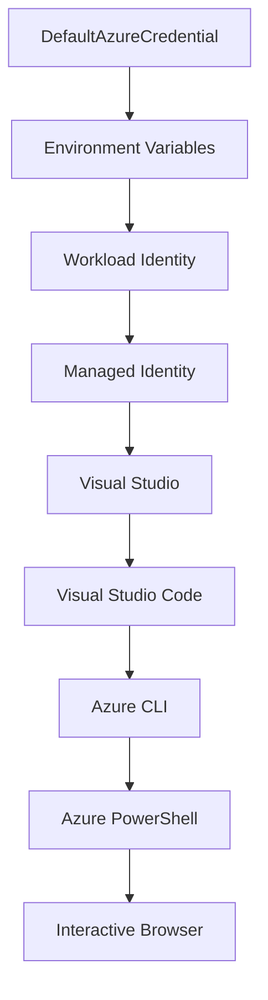

<!--
CO_OP_TRANSLATOR_METADATA:
{
  "original_hash": "fb0687bd0b166ecb0430dfeeed83487e",
  "translation_date": "2025-10-24T17:39:33+00:00",
  "source_file": "docs/getting-started/azd-basics.md",
  "language_code": "he"
}
-->
# יסודות AZD - הבנת Azure Developer CLI

# יסודות AZD - מושגים ועקרונות מרכזיים

**ניווט פרקים:**
- **📚 דף הבית של הקורס**: [AZD למתחילים](../../README.md)
- **📖 פרק נוכחי**: פרק 1 - יסודות והתחלה מהירה
- **⬅️ קודם**: [סקירת הקורס](../../README.md#-chapter-1-foundation--quick-start)
- **➡️ הבא**: [התקנה והגדרה](installation.md)
- **🚀 פרק הבא**: [פרק 2: פיתוח מבוסס AI](../ai-foundry/azure-ai-foundry-integration.md)

## מבוא

השיעור הזה מציג את Azure Developer CLI (azd), כלי שורת פקודה עוצמתי שמאיץ את המעבר שלך מפיתוח מקומי לפריסה ב-Azure. תלמד את המושגים הבסיסיים, התכונות המרכזיות, ותבין כיצד azd מפשט את תהליך הפריסה של יישומים מבוססי ענן.

## מטרות למידה

בסיום השיעור הזה, תוכל:
- להבין מהו Azure Developer CLI ומה מטרתו העיקרית
- ללמוד את המושגים המרכזיים של תבניות, סביבות ושירותים
- לחקור תכונות מרכזיות כמו פיתוח מבוסס תבניות ותשתית כקוד
- להבין את מבנה הפרויקט של azd ואת זרימת העבודה
- להיות מוכן להתקין ולהגדיר את azd בסביבת הפיתוח שלך

## תוצאות למידה

לאחר השלמת השיעור, תוכל:
- להסביר את תפקיד azd בתהליכי פיתוח ענן מודרניים
- לזהות את הרכיבים של מבנה פרויקט azd
- לתאר כיצד תבניות, סביבות ושירותים עובדים יחד
- להבין את היתרונות של תשתית כקוד עם azd
- לזהות פקודות שונות של azd ואת מטרותיהן

## מהו Azure Developer CLI (azd)?

Azure Developer CLI (azd) הוא כלי שורת פקודה שנועד להאיץ את המעבר שלך מפיתוח מקומי לפריסה ב-Azure. הוא מפשט את תהליך הבנייה, הפריסה והניהול של יישומים מבוססי ענן ב-Azure.

## מושגים מרכזיים

### תבניות
תבניות הן הבסיס של azd. הן כוללות:
- **קוד יישום** - קוד המקור שלך ותלויות
- **הגדרות תשתית** - משאבי Azure המוגדרים ב-Bicep או Terraform
- **קבצי תצורה** - הגדרות ומשתני סביבה
- **סקריפטים לפריסה** - זרימות עבודה אוטומטיות לפריסה

### סביבות
סביבות מייצגות יעדי פריסה שונים:
- **פיתוח** - לבדיקות ופיתוח
- **שלב ביניים** - סביבה לפני ייצור
- **ייצור** - סביבה פעילה

כל סביבה שומרת על:
- קבוצת משאבים ב-Azure
- הגדרות תצורה
- מצב פריסה

### שירותים
שירותים הם אבני הבניין של היישום שלך:
- **חזית** - יישומי אינטרנט, SPAs
- **עורף** - APIs, מיקרו-שירותים
- **מסד נתונים** - פתרונות אחסון נתונים
- **אחסון** - אחסון קבצים ובלובים

## תכונות מרכזיות

### 1. פיתוח מבוסס תבניות
```bash
# Browse available templates
azd template list

# Initialize from a template
azd init --template <template-name>
```

### 2. תשתית כקוד
- **Bicep** - שפת תחום ספציפית של Azure
- **Terraform** - כלי תשתית רב-ענני
- **ARM Templates** - תבניות Azure Resource Manager

### 3. זרימות עבודה משולבות
```bash
# Complete deployment workflow
azd up            # Provision + Deploy this is hands off for first time setup

# 🧪 NEW: Preview infrastructure changes before deployment (SAFE)
azd provision --preview    # Simulate infrastructure deployment without making changes

azd provision     # Create Azure resources if you update the infrastructure use this
azd deploy        # Deploy application code or redeploy application code once update
azd down          # Clean up resources
```

#### 🛡️ תכנון תשתית בטוח עם תצוגה מקדימה
הפקודה `azd provision --preview` היא שינוי משחק לפריסות בטוחות:
- **ניתוח יבש** - מציג מה ייווצר, ישונה או יימחק
- **ללא סיכון** - אין שינויים בפועל בסביבת Azure שלך
- **שיתוף פעולה צוותי** - שתף תוצאות תצוגה מקדימה לפני פריסה
- **הערכת עלויות** - הבן את עלויות המשאבים לפני התחייבות

```bash
# Example preview workflow
azd provision --preview           # See what will change
# Review the output, discuss with team
azd provision                     # Apply changes with confidence
```

### 4. ניהול סביבות
```bash
# Create and manage environments
azd env new <environment-name>
azd env select <environment-name>
azd env list
```

## 📁 מבנה פרויקט

מבנה פרויקט טיפוסי של azd:
```
my-app/
├── .azd/                    # azd configuration
│   └── config.json
├── .azure/                  # Azure deployment artifacts
├── .devcontainer/          # Development container config
├── .github/workflows/      # GitHub Actions
├── .vscode/               # VS Code settings
├── infra/                 # Infrastructure code
│   ├── main.bicep        # Main infrastructure template
│   ├── main.parameters.json
│   └── modules/          # Reusable modules
├── src/                  # Application source code
│   ├── api/             # Backend services
│   └── web/             # Frontend application
├── azure.yaml           # azd project configuration
└── README.md
```

## 🔧 קבצי תצורה

### azure.yaml
קובץ התצורה הראשי של הפרויקט:
```yaml
name: my-awesome-app
metadata:
  template: my-template@1.0.0

services:
  web:
    project: ./src/web
    language: js
    host: appservice
  api:
    project: ./src/api
    language: js
    host: appservice

hooks:
  preprovision:
    shell: pwsh
    run: echo "Preparing to provision..."
```

### .azure/config.json
תצורה ספציפית לסביבה:
```json
{
  "version": 1,
  "defaultEnvironment": "dev",
  "environments": {
    "dev": {
      "subscriptionId": "your-subscription-id",
      "location": "eastus"
    }
  }
}
```

## 🎪 זרימות עבודה נפוצות

### התחלת פרויקט חדש
```bash
# Method 1: Use existing template
azd init --template todo-nodejs-mongo

# Method 2: Start from scratch
azd init

# Method 3: Use current directory
azd init .
```

### מחזור פיתוח
```bash
# Set up development environment
azd auth login
azd env new dev
azd env select dev

# Deploy everything
azd up

# Make changes and redeploy
azd deploy

# Clean up when done
azd down --force --purge # command in the Azure Developer CLI is a **hard reset** for your environment—especially useful when you're troubleshooting failed deployments, cleaning up orphaned resources, or prepping for a fresh redeploy.
```

## הבנת `azd down --force --purge`
הפקודה `azd down --force --purge` היא דרך עוצמתית לפרק לחלוטין את סביבת azd שלך ואת כל המשאבים הקשורים. הנה פירוט של מה שכל דגל עושה:
```
--force
```
- מדלג על בקשות אישור.
- שימושי לאוטומציה או סקריפטים שבהם קלט ידני אינו אפשרי.
- מבטיח שהפירוק יתקדם ללא הפרעה, גם אם CLI מזהה אי-התאמות.

```
--purge
```
מוחק **את כל המטא-נתונים הקשורים**, כולל:
מצב סביבה
תיקיית `.azure` המקומית
מידע פריסה במטמון
מונע מ-azd "לזכור" פריסות קודמות, מה שיכול לגרום לבעיות כמו קבוצות משאבים לא תואמות או הפניות רישום ישנות.

### למה להשתמש בשניהם?
כשנתקלת בקשיים עם `azd up` עקב מצב מתמשך או פריסות חלקיות, השילוב הזה מבטיח **דף נקי**.

זה מועיל במיוחד לאחר מחיקות משאבים ידניות בפורטל Azure או בעת מעבר בין תבניות, סביבות או מוסכמות שמות של קבוצות משאבים.

### ניהול סביבות מרובות
```bash
# Create staging environment
azd env new staging
azd env select staging
azd up

# Switch back to dev
azd env select dev

# Compare environments
azd env list
```

## 🔐 אימות ואישורים

הבנת האימות היא קריטית לפריסות azd מוצלחות. Azure משתמש בשיטות אימות מרובות, ו-azd מנצל את שרשרת האישורים שבה משתמשים כלים אחרים של Azure.

### אימות Azure CLI (`az login`)

לפני השימוש ב-azd, עליך לאמת מול Azure. השיטה הנפוצה ביותר היא באמצעות Azure CLI:

```bash
# Interactive login (opens browser)
az login

# Login with specific tenant
az login --tenant <tenant-id>

# Login with service principal
az login --service-principal -u <app-id> -p <password> --tenant <tenant-id>

# Check current login status
az account show

# List available subscriptions
az account list --output table

# Set default subscription
az account set --subscription <subscription-id>
```

### זרימת אימות
1. **כניסה אינטראקטיבית**: פותח את הדפדפן המוגדר כברירת מחדל לאימות
2. **זרימת קוד מכשיר**: לסביבות ללא גישה לדפדפן
3. **Service Principal**: לאוטומציה ותסריטי CI/CD
4. **Managed Identity**: ליישומים המתארחים ב-Azure

### שרשרת DefaultAzureCredential

`DefaultAzureCredential` הוא סוג אישור שמספק חוויית אימות פשוטה על ידי ניסיון אוטומטי של מקורות אישור מרובים בסדר מסוים:

#### סדר שרשרת האישורים


#### 1. משתני סביבה
```bash
# Set environment variables for service principal
export AZURE_CLIENT_ID="<app-id>"
export AZURE_CLIENT_SECRET="<password>"
export AZURE_TENANT_ID="<tenant-id>"
```

#### 2. Workload Identity (Kubernetes/GitHub Actions)
משמש אוטומטית ב:
- Azure Kubernetes Service (AKS) עם Workload Identity
- GitHub Actions עם OIDC federation
- תרחישי זהות פדרטיבית אחרים

#### 3. Managed Identity
למשאבי Azure כמו:
- מכונות וירטואליות
- שירותי אפליקציות
- פונקציות Azure
- מופעי קונטיינר

```bash
# Check if running on Azure resource with managed identity
az account show --query "user.type" --output tsv
# Returns: "servicePrincipal" if using managed identity
```

#### 4. אינטגרציה עם כלי פיתוח
- **Visual Studio**: משתמש אוטומטית בחשבון מחובר
- **VS Code**: משתמש באישורי הרחבת חשבון Azure
- **Azure CLI**: משתמש באישורי `az login` (הנפוץ ביותר לפיתוח מקומי)

### הגדרת אימות AZD

```bash
# Method 1: Use Azure CLI (Recommended for development)
az login
azd auth login  # Uses existing Azure CLI credentials

# Method 2: Direct azd authentication
azd auth login --use-device-code  # For headless environments

# Method 3: Check authentication status
azd auth login --check-status

# Method 4: Logout and re-authenticate
azd auth logout
azd auth login
```

### שיטות עבודה מומלצות לאימות

#### לפיתוח מקומי
```bash
# 1. Login with Azure CLI
az login

# 2. Verify correct subscription
az account show
az account set --subscription "Your Subscription Name"

# 3. Use azd with existing credentials
azd auth login
```

#### לצינורות CI/CD
```yaml
# GitHub Actions example
- name: Azure Login
  uses: azure/login@v1
  with:
    creds: ${{ secrets.AZURE_CREDENTIALS }}

- name: Deploy with azd
  run: |
    azd auth login --client-id ${{ secrets.AZURE_CLIENT_ID }} \
                    --client-secret ${{ secrets.AZURE_CLIENT_SECRET }} \
                    --tenant-id ${{ secrets.AZURE_TENANT_ID }}
    azd up --no-prompt
```

#### לסביבות ייצור
- השתמש ב-**Managed Identity** בעת הפעלה על משאבי Azure
- השתמש ב-**Service Principal** לתרחישי אוטומציה
- הימנע מאחסון אישורים בקוד או בקבצי תצורה
- השתמש ב-**Azure Key Vault** להגדרות רגישות

### בעיות אימות נפוצות ופתרונות

#### בעיה: "לא נמצאה מנוי"
```bash
# Solution: Set default subscription
az account list --output table
az account set --subscription "<subscription-id>"
azd env set AZURE_SUBSCRIPTION_ID "<subscription-id>"
```

#### בעיה: "הרשאות לא מספיקות"
```bash
# Solution: Check and assign required roles
az role assignment list --assignee $(az account show --query user.name --output tsv)

# Common required roles:
# - Contributor (for resource management)
# - User Access Administrator (for role assignments)
```

#### בעיה: "תוקף אסימון פג"
```bash
# Solution: Re-authenticate
az logout
az login
azd auth logout
azd auth login
```

### אימות בתרחישים שונים

#### פיתוח מקומי
```bash
# Personal development account
az login
azd auth login
```

#### פיתוח צוותי
```bash
# Use specific tenant for organization
az login --tenant contoso.onmicrosoft.com
azd auth login
```

#### תרחישים רב-דיירים
```bash
# Switch between tenants
az login --tenant tenant1.onmicrosoft.com
# Deploy to tenant 1
azd up

az login --tenant tenant2.onmicrosoft.com  
# Deploy to tenant 2
azd up
```

### שיקולי אבטחה

1. **אחסון אישורים**: לעולם אל תאחסן אישורים בקוד מקור
2. **הגבלת טווח**: השתמש בעקרון המינימום הרשאות ל-Service Principals
3. **סיבוב אסימונים**: סובב סודות Service Principal באופן קבוע
4. **עקבות ביקורת**: עקוב אחר פעילויות אימות ופריסה
5. **אבטחת רשת**: השתמש בנקודות קצה פרטיות כשאפשר

### פתרון בעיות אימות

```bash
# Debug authentication issues
azd auth login --check-status
az account show
az account get-access-token

# Common diagnostic commands
whoami                          # Current user context
az ad signed-in-user show      # Azure AD user details
az group list                  # Test resource access
```

## הבנת `azd down --force --purge`

### גילוי
```bash
azd template list              # Browse templates
azd template show <template>   # Template details
azd init --help               # Initialization options
```

### ניהול פרויקטים
```bash
azd show                     # Project overview
azd env show                 # Current environment
azd config list             # Configuration settings
```

### ניטור
```bash
azd monitor                  # Open Azure portal
azd pipeline config          # Set up CI/CD
azd logs                     # View application logs
```

## שיטות עבודה מומלצות

### 1. השתמש בשמות משמעותיים
```bash
# Good
azd env new production-east
azd init --template web-app-secure

# Avoid
azd env new env1
azd init --template template1
```

### 2. נצל תבניות
- התחל עם תבניות קיימות
- התאם אישית לצרכים שלך
- צור תבניות לשימוש חוזר עבור הארגון שלך

### 3. בידוד סביבות
- השתמש בסביבות נפרדות לפיתוח/שלב ביניים/ייצור
- לעולם אל תפרוס ישירות לייצור מהמחשב המקומי
- השתמש בצינורות CI/CD לפריסות ייצור

### 4. ניהול תצורה
- השתמש במשתני סביבה לנתונים רגישים
- שמור תצורה בבקרת גרסאות
- תעד הגדרות ספציפיות לסביבה

## התקדמות למידה

### מתחילים (שבוע 1-2)
1. התקן את azd ואמת
2. פרוס תבנית פשוטה
3. הבן את מבנה הפרויקט
4. למד פקודות בסיסיות (up, down, deploy)

### בינוניים (שבוע 3-4)
1. התאם אישית תבניות
2. נהל סביבות מרובות
3. הבן קוד תשתית
4. הגדר צינורות CI/CD

### מתקדמים (שבוע 5+)
1. צור תבניות מותאמות אישית
2. דפוסי תשתית מתקדמים
3. פריסות רב-אזוריות
4. תצורות ברמה ארגונית

## צעדים הבאים

**📖 המשך לימוד פרק 1:**
- [התקנה והגדרה](installation.md) - התקן והגדר את azd
- [הפרויקט הראשון שלך](first-project.md) - סיים הדרכה מעשית
- [מדריך תצורה](configuration.md) - אפשרויות תצורה מתקדמות

**🎯 מוכן לפרק הבא?**
- [פרק 2: פיתוח מבוסס AI](../ai-foundry/azure-ai-foundry-integration.md) - התחל לבנות יישומי AI

## משאבים נוספים

- [סקירת Azure Developer CLI](https://learn.microsoft.com/en-us/azure/developer/azure-developer-cli/)
- [גלריית תבניות](https://azure.github.io/awesome-azd/)
- [דוגמאות קהילתיות](https://github.com/Azure-Samples)

---

**ניווט פרקים:**
- **📚 דף הבית של הקורס**: [AZD למתחילים](../../README.md)
- **📖 פרק נוכחי**: פרק 1 - יסודות והתחלה מהירה  
- **⬅️ קודם**: [סקירת הקורס](../../README.md#-chapter-1-foundation--quick-start)
- **➡️ הבא**: [התקנה והגדרה](installation.md)
- **🚀 פרק הבא**: [פרק 2: פיתוח מבוסס AI](../ai-foundry/azure-ai-foundry-integration.md)

---

**הצהרת אחריות**:  
מסמך זה תורגם באמצעות שירות תרגום AI [Co-op Translator](https://github.com/Azure/co-op-translator). למרות שאנו שואפים לדיוק, יש להיות מודעים לכך שתרגומים אוטומטיים עשויים להכיל שגיאות או אי דיוקים. המסמך המקורי בשפתו המקורית צריך להיחשב כמקור סמכותי. עבור מידע קריטי, מומלץ להשתמש בתרגום מקצועי אנושי. איננו אחראים לאי הבנות או פירושים שגויים הנובעים משימוש בתרגום זה.