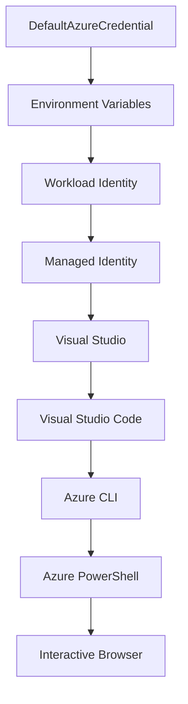

<!--
CO_OP_TRANSLATOR_METADATA:
{
  "original_hash": "fb0687bd0b166ecb0430dfeeed83487e",
  "translation_date": "2025-10-24T16:54:18+00:00",
  "source_file": "docs/getting-started/azd-basics.md",
  "language_code": "hi"
}
-->
# AZD की मूल बातें - Azure Developer CLI को समझना

# AZD की मूल बातें - मुख्य अवधारणाएँ और मूलभूत बातें

**अध्याय नेविगेशन:**
- **📚 कोर्स होम**: [AZD फॉर बिगिनर्स](../../README.md)
- **📖 वर्तमान अध्याय**: अध्याय 1 - नींव और त्वरित शुरुआत
- **⬅️ पिछला**: [कोर्स ओवरव्यू](../../README.md#-chapter-1-foundation--quick-start)
- **➡️ अगला**: [इंस्टॉलेशन और सेटअप](installation.md)
- **🚀 अगला अध्याय**: [अध्याय 2: AI-प्रथम विकास](../ai-foundry/azure-ai-foundry-integration.md)

## परिचय

इस पाठ में आपको Azure Developer CLI (azd) से परिचित कराया जाएगा, जो एक शक्तिशाली कमांड-लाइन टूल है जो स्थानीय विकास से Azure पर तैनाती तक की यात्रा को तेज करता है। आप मौलिक अवधारणाओं, मुख्य विशेषताओं को सीखेंगे और समझेंगे कि azd क्लाउड-नेटिव एप्लिकेशन तैनाती को कैसे सरल बनाता है।

## सीखने के लक्ष्य

इस पाठ के अंत तक, आप:
- समझेंगे कि Azure Developer CLI क्या है और इसका मुख्य उद्देश्य
- टेम्पलेट्स, एनवायरनमेंट्स और सेवाओं की मुख्य अवधारणाओं को जानेंगे
- टेम्पलेट-ड्रिवन विकास और इंफ्रास्ट्रक्चर ऐज़ कोड सहित प्रमुख विशेषताओं का पता लगाएंगे
- azd प्रोजेक्ट संरचना और वर्कफ़्लो को समझेंगे
- अपने विकास पर्यावरण के लिए azd को इंस्टॉल और कॉन्फ़िगर करने के लिए तैयार होंगे

## सीखने के परिणाम

इस पाठ को पूरा करने के बाद, आप:
- आधुनिक क्लाउड विकास वर्कफ़्लो में azd की भूमिका को समझा पाएंगे
- azd प्रोजेक्ट संरचना के घटकों की पहचान कर पाएंगे
- समझा पाएंगे कि टेम्पलेट्स, एनवायरनमेंट्स और सेवाएँ कैसे एक साथ काम करती हैं
- azd के साथ इंफ्रास्ट्रक्चर ऐज़ कोड के लाभों को समझेंगे
- विभिन्न azd कमांड्स और उनके उद्देश्यों को पहचान पाएंगे

## Azure Developer CLI (azd) क्या है?

Azure Developer CLI (azd) एक कमांड-लाइन टूल है जिसे स्थानीय विकास से Azure पर तैनाती तक की यात्रा को तेज करने के लिए डिज़ाइन किया गया है। यह Azure पर क्लाउड-नेटिव एप्लिकेशन बनाने, तैनात करने और प्रबंधित करने की प्रक्रिया को सरल बनाता है।

## मुख्य अवधारणाएँ

### टेम्पलेट्स
टेम्पलेट्स azd की नींव हैं। इनमें शामिल हैं:
- **एप्लिकेशन कोड** - आपका सोर्स कोड और डिपेंडेंसीज़
- **इंफ्रास्ट्रक्चर परिभाषाएँ** - Bicep या Terraform में परिभाषित Azure संसाधन
- **कॉन्फ़िगरेशन फाइलें** - सेटिंग्स और एनवायरनमेंट वेरिएबल्स
- **तैनाती स्क्रिप्ट्स** - स्वचालित तैनाती वर्कफ़्लो

### एनवायरनमेंट्स
एनवायरनमेंट्स विभिन्न तैनाती लक्ष्यों का प्रतिनिधित्व करते हैं:
- **डेवलपमेंट** - परीक्षण और विकास के लिए
- **स्टेजिंग** - प्री-प्रोडक्शन एनवायरनमेंट
- **प्रोडक्शन** - लाइव प्रोडक्शन एनवायरनमेंट

प्रत्येक एनवायरनमेंट का अपना:
- Azure संसाधन समूह
- कॉन्फ़िगरेशन सेटिंग्स
- तैनाती स्थिति होती है

### सेवाएँ
सेवाएँ आपके एप्लिकेशन के निर्माण खंड हैं:
- **फ्रंटएंड** - वेब एप्लिकेशन, SPAs
- **बैकएंड** - APIs, माइक्रोसर्विसेज
- **डेटाबेस** - डेटा स्टोरेज समाधान
- **स्टोरेज** - फाइल और ब्लॉब स्टोरेज

## मुख्य विशेषताएँ

### 1. टेम्पलेट-ड्रिवन विकास
```bash
# Browse available templates
azd template list

# Initialize from a template
azd init --template <template-name>
```

### 2. इंफ्रास्ट्रक्चर ऐज़ कोड
- **Bicep** - Azure की डोमेन-विशिष्ट भाषा
- **Terraform** - मल्टी-क्लाउड इंफ्रास्ट्रक्चर टूल
- **ARM टेम्पलेट्स** - Azure रिसोर्स मैनेजर टेम्पलेट्स

### 3. इंटीग्रेटेड वर्कफ़्लो
```bash
# Complete deployment workflow
azd up            # Provision + Deploy this is hands off for first time setup

# 🧪 NEW: Preview infrastructure changes before deployment (SAFE)
azd provision --preview    # Simulate infrastructure deployment without making changes

azd provision     # Create Azure resources if you update the infrastructure use this
azd deploy        # Deploy application code or redeploy application code once update
azd down          # Clean up resources
```

#### 🛡️ सुरक्षित इंफ्रास्ट्रक्चर योजना प्रीव्यू के साथ
`azd provision --preview` कमांड सुरक्षित तैनाती के लिए गेम-चेंजर है:
- **ड्राई-रन विश्लेषण** - दिखाता है कि क्या बनाया जाएगा, संशोधित किया जाएगा, या हटाया जाएगा
- **शून्य जोखिम** - आपके Azure एनवायरनमेंट में कोई वास्तविक परिवर्तन नहीं होता
- **टीम सहयोग** - तैनाती से पहले प्रीव्यू परिणाम साझा करें
- **लागत अनुमान** - प्रतिबद्धता से पहले संसाधन लागत को समझें

```bash
# Example preview workflow
azd provision --preview           # See what will change
# Review the output, discuss with team
azd provision                     # Apply changes with confidence
```

### 4. एनवायरनमेंट प्रबंधन
```bash
# Create and manage environments
azd env new <environment-name>
azd env select <environment-name>
azd env list
```

## 📁 प्रोजेक्ट संरचना

एक सामान्य azd प्रोजेक्ट संरचना:
```
my-app/
├── .azd/                    # azd configuration
│   └── config.json
├── .azure/                  # Azure deployment artifacts
├── .devcontainer/          # Development container config
├── .github/workflows/      # GitHub Actions
├── .vscode/               # VS Code settings
├── infra/                 # Infrastructure code
│   ├── main.bicep        # Main infrastructure template
│   ├── main.parameters.json
│   └── modules/          # Reusable modules
├── src/                  # Application source code
│   ├── api/             # Backend services
│   └── web/             # Frontend application
├── azure.yaml           # azd project configuration
└── README.md
```

## 🔧 कॉन्फ़िगरेशन फाइलें

### azure.yaml
मुख्य प्रोजेक्ट कॉन्फ़िगरेशन फाइल:
```yaml
name: my-awesome-app
metadata:
  template: my-template@1.0.0

services:
  web:
    project: ./src/web
    language: js
    host: appservice
  api:
    project: ./src/api
    language: js
    host: appservice

hooks:
  preprovision:
    shell: pwsh
    run: echo "Preparing to provision..."
```

### .azure/config.json
एनवायरनमेंट-विशिष्ट कॉन्फ़िगरेशन:
```json
{
  "version": 1,
  "defaultEnvironment": "dev",
  "environments": {
    "dev": {
      "subscriptionId": "your-subscription-id",
      "location": "eastus"
    }
  }
}
```

## 🎪 सामान्य वर्कफ़्लो

### एक नया प्रोजेक्ट शुरू करना
```bash
# Method 1: Use existing template
azd init --template todo-nodejs-mongo

# Method 2: Start from scratch
azd init

# Method 3: Use current directory
azd init .
```

### विकास चक्र
```bash
# Set up development environment
azd auth login
azd env new dev
azd env select dev

# Deploy everything
azd up

# Make changes and redeploy
azd deploy

# Clean up when done
azd down --force --purge # command in the Azure Developer CLI is a **hard reset** for your environment—especially useful when you're troubleshooting failed deployments, cleaning up orphaned resources, or prepping for a fresh redeploy.
```

## `azd down --force --purge` को समझना
`azd down --force --purge` कमांड आपके azd एनवायरनमेंट और सभी संबंधित संसाधनों को पूरी तरह से समाप्त करने का एक शक्तिशाली तरीका है। यहाँ प्रत्येक फ्लैग का विवरण है:
```
--force
```
- पुष्टि संकेतों को छोड़ता है।
- स्वचालन या स्क्रिप्टिंग के लिए उपयोगी है जहाँ मैनुअल इनपुट संभव नहीं है।
- सुनिश्चित करता है कि CLI द्वारा असंगतता का पता लगाने पर भी टियरडाउन बिना रुकावट के आगे बढ़े।

```
--purge
```
सभी संबंधित मेटाडेटा को हटाता है, जिसमें शामिल हैं:
एनवायरनमेंट स्थिति
स्थानीय `.azure` फ़ोल्डर
कैश्ड तैनाती जानकारी
azd को "पिछली तैनातियों को याद रखने" से रोकता है, जो संसाधन समूहों या पुराने रजिस्ट्री संदर्भों जैसे मुद्दों का कारण बन सकता है।

### दोनों का उपयोग क्यों करें?
जब आप `azd up` के साथ किसी समस्या का सामना करते हैं, जैसे कि शेष स्थिति या आंशिक तैनातियाँ, यह संयोजन एक **स्वच्छ शुरुआत** सुनिश्चित करता है।

यह विशेष रूप से उपयोगी है जब Azure पोर्टल में मैन्युअल संसाधन हटाने के बाद या टेम्पलेट्स, एनवायरनमेंट्स, या संसाधन समूह नामकरण सम्मेलनों को बदलते समय।

### कई एनवायरनमेंट्स का प्रबंधन
```bash
# Create staging environment
azd env new staging
azd env select staging
azd up

# Switch back to dev
azd env select dev

# Compare environments
azd env list
```

## 🔐 प्रमाणीकरण और क्रेडेंशियल्स

सफल azd तैनातियों के लिए प्रमाणीकरण को समझना महत्वपूर्ण है। Azure कई प्रमाणीकरण विधियों का उपयोग करता है, और azd अन्य Azure टूल्स द्वारा उपयोग किए जाने वाले समान क्रेडेंशियल चेन का लाभ उठाता है।

### Azure CLI प्रमाणीकरण (`az login`)

azd का उपयोग करने से पहले, आपको Azure के साथ प्रमाणीकरण करना होगा। सबसे सामान्य विधि Azure CLI का उपयोग करना है:

```bash
# Interactive login (opens browser)
az login

# Login with specific tenant
az login --tenant <tenant-id>

# Login with service principal
az login --service-principal -u <app-id> -p <password> --tenant <tenant-id>

# Check current login status
az account show

# List available subscriptions
az account list --output table

# Set default subscription
az account set --subscription <subscription-id>
```

### प्रमाणीकरण प्रवाह
1. **इंटरएक्टिव लॉगिन**: प्रमाणीकरण के लिए आपका डिफ़ॉल्ट ब्राउज़र खोलता है
2. **डिवाइस कोड फ्लो**: उन एनवायरनमेंट्स के लिए जहाँ ब्राउज़र एक्सेस नहीं है
3. **सर्विस प्रिंसिपल**: स्वचालन और CI/CD परिदृश्यों के लिए
4. **मैनेज्ड आइडेंटिटी**: Azure-होस्टेड एप्लिकेशन के लिए

### DefaultAzureCredential चेन

`DefaultAzureCredential` एक क्रेडेंशियल प्रकार है जो कई क्रेडेंशियल स्रोतों को एक विशिष्ट क्रम में स्वचालित रूप से आज़माकर एक सरल प्रमाणीकरण अनुभव प्रदान करता है:

#### क्रेडेंशियल चेन क्रम


#### 1. एनवायरनमेंट वेरिएबल्स
```bash
# Set environment variables for service principal
export AZURE_CLIENT_ID="<app-id>"
export AZURE_CLIENT_SECRET="<password>"
export AZURE_TENANT_ID="<tenant-id>"
```

#### 2. वर्कलोड आइडेंटिटी (Kubernetes/GitHub Actions)
स्वचालित रूप से उपयोग किया जाता है:
- Azure Kubernetes Service (AKS) के साथ वर्कलोड आइडेंटिटी
- GitHub Actions के साथ OIDC फेडरेशन
- अन्य फेडरेटेड आइडेंटिटी परिदृश्य

#### 3. मैनेज्ड आइडेंटिटी
Azure संसाधनों के लिए जैसे:
- वर्चुअल मशीन
- ऐप सर्विस
- Azure फंक्शन्स
- कंटेनर इंस्टेंस

```bash
# Check if running on Azure resource with managed identity
az account show --query "user.type" --output tsv
# Returns: "servicePrincipal" if using managed identity
```

#### 4. डेवलपर टूल्स इंटीग्रेशन
- **Visual Studio**: स्वचालित रूप से साइन-इन अकाउंट का उपयोग करता है
- **VS Code**: Azure अकाउंट एक्सटेंशन क्रेडेंशियल्स का उपयोग करता है
- **Azure CLI**: `az login` क्रेडेंशियल्स का उपयोग करता है (स्थानीय विकास के लिए सबसे सामान्य)

### AZD प्रमाणीकरण सेटअप

```bash
# Method 1: Use Azure CLI (Recommended for development)
az login
azd auth login  # Uses existing Azure CLI credentials

# Method 2: Direct azd authentication
azd auth login --use-device-code  # For headless environments

# Method 3: Check authentication status
azd auth login --check-status

# Method 4: Logout and re-authenticate
azd auth logout
azd auth login
```

### प्रमाणीकरण सर्वोत्तम प्रथाएँ

#### स्थानीय विकास के लिए
```bash
# 1. Login with Azure CLI
az login

# 2. Verify correct subscription
az account show
az account set --subscription "Your Subscription Name"

# 3. Use azd with existing credentials
azd auth login
```

#### CI/CD पाइपलाइनों के लिए
```yaml
# GitHub Actions example
- name: Azure Login
  uses: azure/login@v1
  with:
    creds: ${{ secrets.AZURE_CREDENTIALS }}

- name: Deploy with azd
  run: |
    azd auth login --client-id ${{ secrets.AZURE_CLIENT_ID }} \
                    --client-secret ${{ secrets.AZURE_CLIENT_SECRET }} \
                    --tenant-id ${{ secrets.AZURE_TENANT_ID }}
    azd up --no-prompt
```

#### प्रोडक्शन एनवायरनमेंट्स के लिए
- Azure संसाधनों पर चलने पर **मैनेज्ड आइडेंटिटी** का उपयोग करें
- स्वचालन परिदृश्यों के लिए **सर्विस प्रिंसिपल** का उपयोग करें
- कोड या कॉन्फ़िगरेशन फाइलों में क्रेडेंशियल्स को स्टोर करने से बचें
- संवेदनशील कॉन्फ़िगरेशन के लिए **Azure Key Vault** का उपयोग करें

### सामान्य प्रमाणीकरण समस्याएँ और समाधान

#### समस्या: "कोई सब्सक्रिप्शन नहीं मिला"
```bash
# Solution: Set default subscription
az account list --output table
az account set --subscription "<subscription-id>"
azd env set AZURE_SUBSCRIPTION_ID "<subscription-id>"
```

#### समस्या: "पर्याप्त अनुमतियाँ नहीं"
```bash
# Solution: Check and assign required roles
az role assignment list --assignee $(az account show --query user.name --output tsv)

# Common required roles:
# - Contributor (for resource management)
# - User Access Administrator (for role assignments)
```

#### समस्या: "टोकन समाप्त हो गया"
```bash
# Solution: Re-authenticate
az logout
az login
azd auth logout
azd auth login
```

### विभिन्न परिदृश्यों में प्रमाणीकरण

#### स्थानीय विकास
```bash
# Personal development account
az login
azd auth login
```

#### टीम विकास
```bash
# Use specific tenant for organization
az login --tenant contoso.onmicrosoft.com
azd auth login
```

#### मल्टी-टेनेंट परिदृश्य
```bash
# Switch between tenants
az login --tenant tenant1.onmicrosoft.com
# Deploy to tenant 1
azd up

az login --tenant tenant2.onmicrosoft.com  
# Deploy to tenant 2
azd up
```

### सुरक्षा विचार

1. **क्रेडेंशियल स्टोरेज**: क्रेडेंशियल्स को सोर्स कोड में कभी स्टोर न करें
2. **स्कोप लिमिटेशन**: सर्विस प्रिंसिपल के लिए न्यूनतम-विशेषाधिकार सिद्धांत का उपयोग करें
3. **टोकन रोटेशन**: सर्विस प्रिंसिपल सीक्रेट्स को नियमित रूप से रोटेट करें
4. **ऑडिट ट्रेल**: प्रमाणीकरण और तैनाती गतिविधियों की निगरानी करें
5. **नेटवर्क सुरक्षा**: संभव हो तो निजी एंडपॉइंट्स का उपयोग करें

### प्रमाणीकरण समस्या निवारण

```bash
# Debug authentication issues
azd auth login --check-status
az account show
az account get-access-token

# Common diagnostic commands
whoami                          # Current user context
az ad signed-in-user show      # Azure AD user details
az group list                  # Test resource access
```

## `azd down --force --purge` को समझना

### खोज
```bash
azd template list              # Browse templates
azd template show <template>   # Template details
azd init --help               # Initialization options
```

### प्रोजेक्ट प्रबंधन
```bash
azd show                     # Project overview
azd env show                 # Current environment
azd config list             # Configuration settings
```

### निगरानी
```bash
azd monitor                  # Open Azure portal
azd pipeline config          # Set up CI/CD
azd logs                     # View application logs
```

## सर्वोत्तम प्रथाएँ

### 1. सार्थक नामों का उपयोग करें
```bash
# Good
azd env new production-east
azd init --template web-app-secure

# Avoid
azd env new env1
azd init --template template1
```

### 2. टेम्पलेट्स का लाभ उठाएँ
- मौजूदा टेम्पलेट्स से शुरुआत करें
- अपनी आवश्यकताओं के लिए अनुकूलित करें
- अपने संगठन के लिए पुन: उपयोग योग्य टेम्पलेट्स बनाएं

### 3. एनवायरनमेंट आइसोलेशन
- dev/staging/prod के लिए अलग-अलग एनवायरनमेंट्स का उपयोग करें
- स्थानीय मशीन से सीधे प्रोडक्शन में तैनात न करें
- प्रोडक्शन तैनातियों के लिए CI/CD पाइपलाइनों का उपयोग करें

### 4. कॉन्फ़िगरेशन प्रबंधन
- संवेदनशील डेटा के लिए एनवायरनमेंट वेरिएबल्स का उपयोग करें
- कॉन्फ़िगरेशन को वर्शन कंट्रोल में रखें
- एनवायरनमेंट-विशिष्ट सेटिंग्स का दस्तावेज़ीकरण करें

## सीखने की प्रगति

### शुरुआती (सप्ताह 1-2)
1. azd को इंस्टॉल करें और प्रमाणीकरण करें
2. एक साधारण टेम्पलेट तैनात करें
3. प्रोजेक्ट संरचना को समझें
4. बुनियादी कमांड्स सीखें (up, down, deploy)

### मध्यवर्ती (सप्ताह 3-4)
1. टेम्पलेट्स को अनुकूलित करें
2. कई एनवायरनमेंट्स का प्रबंधन करें
3. इंफ्रास्ट्रक्चर कोड को समझें
4. CI/CD पाइपलाइनों को सेट करें

### उन्नत (सप्ताह 5+)
1. कस्टम टेम्पलेट्स बनाएं
2. उन्नत इंफ्रास्ट्रक्चर पैटर्न
3. मल्टी-रीजन तैनातियाँ
4. एंटरप्राइज-ग्रेड कॉन्फ़िगरेशन

## अगले कदम

**📖 अध्याय 1 सीखना जारी रखें:**
- [इंस्टॉलेशन और सेटअप](installation.md) - azd को इंस्टॉल और कॉन्फ़िगर करें
- [आपका पहला प्रोजेक्ट](first-project.md) - हैंड्स-ऑन ट्यूटोरियल पूरा करें
- [कॉन्फ़िगरेशन गाइड](configuration.md) - उन्नत कॉन्फ़िगरेशन विकल्प

**🎯 अगले अध्याय के लिए तैयार?**
- [अध्याय 2: AI-प्रथम विकास](../ai-foundry/azure-ai-foundry-integration.md) - AI एप्लिकेशन बनाना शुरू करें

## अतिरिक्त संसाधन

- [Azure Developer CLI ओवरव्यू](https://learn.microsoft.com/en-us/azure/developer/azure-developer-cli/)
- [टेम्पलेट गैलरी](https://azure.github.io/awesome-azd/)
- [कम्युनिटी सैंपल्स](https://github.com/Azure-Samples)

---

**अध्याय नेविगेशन:**
- **📚 कोर्स होम**: [AZD फॉर बिगिनर्स](../../README.md)
- **📖 वर्तमान अध्याय**: अध्याय 1 - नींव और त्वरित शुरुआत  
- **⬅️ पिछला**: [कोर्स ओवरव्यू](../../README.md#-chapter-1-foundation--quick-start)
- **➡️ अगला**: [इंस्टॉलेशन और सेटअप](installation.md)
- **🚀 अगला अध्याय**: [अध्याय 2: AI-प्रथम विकास](../ai-foundry/azure-ai-foundry-integration.md)

---

**अस्वीकरण**:  
यह दस्तावेज़ AI अनुवाद सेवा [Co-op Translator](https://github.com/Azure/co-op-translator) का उपयोग करके अनुवादित किया गया है। जबकि हम सटीकता के लिए प्रयास करते हैं, कृपया ध्यान दें कि स्वचालित अनुवाद में त्रुटियां या अशुद्धियां हो सकती हैं। मूल भाषा में दस्तावेज़ को आधिकारिक स्रोत माना जाना चाहिए। महत्वपूर्ण जानकारी के लिए, पेशेवर मानव अनुवाद की सिफारिश की जाती है। इस अनुवाद के उपयोग से उत्पन्न किसी भी गलतफहमी या गलत व्याख्या के लिए हम उत्तरदायी नहीं हैं।