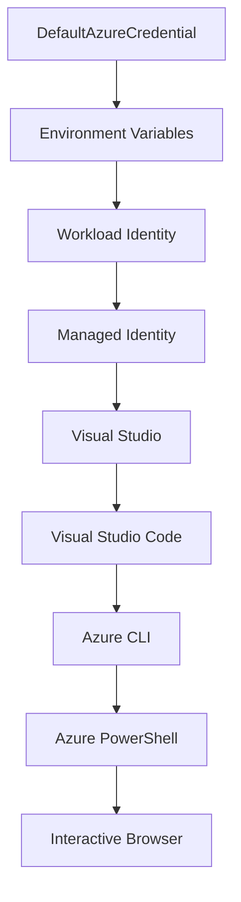

<!--
CO_OP_TRANSLATOR_METADATA:
{
  "original_hash": "fb0687bd0b166ecb0430dfeeed83487e",
  "translation_date": "2025-10-24T18:11:42+00:00",
  "source_file": "docs/getting-started/azd-basics.md",
  "language_code": "hr"
}
-->
# AZD Osnove - Razumijevanje Azure Developer CLI

# AZD Osnove - Ključni pojmovi i temelji

**Navigacija kroz poglavlja:**
- **📚 Početna stranica tečaja**: [AZD za početnike](../../README.md)
- **📖 Trenutno poglavlje**: Poglavlje 1 - Temelji i brzi početak
- **⬅️ Prethodno**: [Pregled tečaja](../../README.md#-chapter-1-foundation--quick-start)
- **➡️ Sljedeće**: [Instalacija i postavljanje](installation.md)
- **🚀 Sljedeće poglavlje**: [Poglavlje 2: Razvoj temeljen na umjetnoj inteligenciji](../ai-foundry/azure-ai-foundry-integration.md)

## Uvod

Ova lekcija uvodi vas u Azure Developer CLI (azd), moćan alat naredbenog retka koji ubrzava vaš put od lokalnog razvoja do implementacije na Azure. Naučit ćete osnovne pojmove, ključne značajke i razumjeti kako azd pojednostavljuje implementaciju aplikacija temeljenih na oblaku.

## Ciljevi učenja

Na kraju ove lekcije, moći ćete:
- Razumjeti što je Azure Developer CLI i njegovu primarnu svrhu
- Naučiti osnovne pojmove poput predložaka, okruženja i usluga
- Istražiti ključne značajke, uključujući razvoj temeljen na predlošcima i infrastrukturu kao kod
- Razumjeti strukturu projekta azd i tijek rada
- Biti spremni instalirati i konfigurirati azd za vaš razvojni okoliš

## Ishodi učenja

Nakon završetka ove lekcije, moći ćete:
- Objasniti ulogu azd-a u modernim radnim tijekovima razvoja oblaka
- Identificirati komponente strukture projekta azd
- Opisati kako predlošci, okruženja i usluge međusobno djeluju
- Razumjeti prednosti infrastrukture kao kod s azd-om
- Prepoznati različite azd naredbe i njihove svrhe

## Što je Azure Developer CLI (azd)?

Azure Developer CLI (azd) je alat naredbenog retka dizajniran za ubrzavanje vašeg puta od lokalnog razvoja do implementacije na Azure. Pojednostavljuje proces izrade, implementacije i upravljanja aplikacijama temeljenim na oblaku na Azureu.

## Osnovni pojmovi

### Predlošci
Predlošci su temelj azd-a. Sadrže:
- **Kod aplikacije** - Vaš izvorni kod i ovisnosti
- **Definicije infrastrukture** - Azure resurse definirane u Bicep ili Terraformu
- **Konfiguracijske datoteke** - Postavke i varijable okruženja
- **Skripte za implementaciju** - Automatizirani tijekovi rada implementacije

### Okruženja
Okruženja predstavljaju različite ciljeve implementacije:
- **Razvoj** - Za testiranje i razvoj
- **Staging** - Okruženje prije produkcije
- **Produkcija** - Aktivno produkcijsko okruženje

Svako okruženje održava vlastite:
- Azure resursne grupe
- Konfiguracijske postavke
- Stanje implementacije

### Usluge
Usluge su gradivni blokovi vaše aplikacije:
- **Frontend** - Web aplikacije, SPAs
- **Backend** - API-jevi, mikroservisi
- **Baza podataka** - Rješenja za pohranu podataka
- **Pohrana** - Pohrana datoteka i blobova

## Ključne značajke

### 1. Razvoj temeljen na predlošcima
```bash
# Browse available templates
azd template list

# Initialize from a template
azd init --template <template-name>
```

### 2. Infrastruktura kao kod
- **Bicep** - Jezik specifičan za Azure
- **Terraform** - Alat za infrastrukturu na više oblaka
- **ARM predlošci** - Predlošci za upravljanje resursima na Azureu

### 3. Integrirani tijekovi rada
```bash
# Complete deployment workflow
azd up            # Provision + Deploy this is hands off for first time setup

# 🧪 NEW: Preview infrastructure changes before deployment (SAFE)
azd provision --preview    # Simulate infrastructure deployment without making changes

azd provision     # Create Azure resources if you update the infrastructure use this
azd deploy        # Deploy application code or redeploy application code once update
azd down          # Clean up resources
```

#### 🛡️ Sigurno planiranje infrastrukture s pregledom
Naredba `azd provision --preview` mijenja pravila igre za sigurne implementacije:
- **Analiza probnog pokretanja** - Prikazuje što će biti stvoreno, izmijenjeno ili izbrisano
- **Nema rizika** - Nema stvarnih promjena u vašem Azure okruženju
- **Suradnja tima** - Dijeljenje rezultata pregleda prije implementacije
- **Procjena troškova** - Razumijevanje troškova resursa prije obveze

```bash
# Example preview workflow
azd provision --preview           # See what will change
# Review the output, discuss with team
azd provision                     # Apply changes with confidence
```

### 4. Upravljanje okruženjima
```bash
# Create and manage environments
azd env new <environment-name>
azd env select <environment-name>
azd env list
```

## 📁 Struktura projekta

Tipična struktura azd projekta:
```
my-app/
├── .azd/                    # azd configuration
│   └── config.json
├── .azure/                  # Azure deployment artifacts
├── .devcontainer/          # Development container config
├── .github/workflows/      # GitHub Actions
├── .vscode/               # VS Code settings
├── infra/                 # Infrastructure code
│   ├── main.bicep        # Main infrastructure template
│   ├── main.parameters.json
│   └── modules/          # Reusable modules
├── src/                  # Application source code
│   ├── api/             # Backend services
│   └── web/             # Frontend application
├── azure.yaml           # azd project configuration
└── README.md
```

## 🔧 Konfiguracijske datoteke

### azure.yaml
Glavna konfiguracijska datoteka projekta:
```yaml
name: my-awesome-app
metadata:
  template: my-template@1.0.0

services:
  web:
    project: ./src/web
    language: js
    host: appservice
  api:
    project: ./src/api
    language: js
    host: appservice

hooks:
  preprovision:
    shell: pwsh
    run: echo "Preparing to provision..."
```

### .azure/config.json
Konfiguracija specifična za okruženje:
```json
{
  "version": 1,
  "defaultEnvironment": "dev",
  "environments": {
    "dev": {
      "subscriptionId": "your-subscription-id",
      "location": "eastus"
    }
  }
}
```

## 🎪 Uobičajeni tijekovi rada

### Pokretanje novog projekta
```bash
# Method 1: Use existing template
azd init --template todo-nodejs-mongo

# Method 2: Start from scratch
azd init

# Method 3: Use current directory
azd init .
```

### Razvojni ciklus
```bash
# Set up development environment
azd auth login
azd env new dev
azd env select dev

# Deploy everything
azd up

# Make changes and redeploy
azd deploy

# Clean up when done
azd down --force --purge # command in the Azure Developer CLI is a **hard reset** for your environment—especially useful when you're troubleshooting failed deployments, cleaning up orphaned resources, or prepping for a fresh redeploy.
```

## Razumijevanje `azd down --force --purge`
Naredba `azd down --force --purge` moćan je način za potpuno uklanjanje vašeg azd okruženja i svih povezanih resursa. Evo pregleda što svaka opcija radi:
```
--force
```
- Preskače upite za potvrdu.
- Korisno za automatizaciju ili skriptiranje gdje ručni unos nije izvediv.
- Osigurava da se uklanjanje nastavi bez prekida, čak i ako CLI otkrije nedosljednosti.

```
--purge
```
Briše **sve povezane metapodatke**, uključujući:
Stanje okruženja
Lokalnu `.azure` mapu
Predmemorirane informacije o implementaciji
Sprječava azd da "pamti" prethodne implementacije, što može uzrokovati probleme poput neusklađenih resursnih grupa ili zastarjelih referenci na registre.


### Zašto koristiti oboje?
Kada naiđete na probleme s `azd up` zbog preostalog stanja ili djelomičnih implementacija, ova kombinacija osigurava **čistu ploču**.

Posebno je korisno nakon ručnog brisanja resursa u Azure portalu ili prilikom promjene predložaka, okruženja ili konvencija imenovanja resursnih grupa.


### Upravljanje višestrukim okruženjima
```bash
# Create staging environment
azd env new staging
azd env select staging
azd up

# Switch back to dev
azd env select dev

# Compare environments
azd env list
```

## 🔐 Autentifikacija i vjerodajnice

Razumijevanje autentifikacije ključno je za uspješne azd implementacije. Azure koristi više metoda autentifikacije, a azd koristi isti lanac vjerodajnica koji koriste i drugi Azure alati.

### Autentifikacija putem Azure CLI-a (`az login`)

Prije korištenja azd-a, morate se autentificirati s Azureom. Najčešća metoda je korištenje Azure CLI-a:

```bash
# Interactive login (opens browser)
az login

# Login with specific tenant
az login --tenant <tenant-id>

# Login with service principal
az login --service-principal -u <app-id> -p <password> --tenant <tenant-id>

# Check current login status
az account show

# List available subscriptions
az account list --output table

# Set default subscription
az account set --subscription <subscription-id>
```

### Tijek autentifikacije
1. **Interaktivna prijava**: Otvara vaš zadani preglednik za autentifikaciju
2. **Tijek koda uređaja**: Za okruženja bez pristupa pregledniku
3. **Servisni principal**: Za automatizaciju i CI/CD scenarije
4. **Upravljani identitet**: Za aplikacije hostirane na Azureu

### DefaultAzureCredential lanac

`DefaultAzureCredential` je vrsta vjerodajnice koja pruža pojednostavljeno iskustvo autentifikacije automatskim isprobavanjem više izvora vjerodajnica u određenom redoslijedu:

#### Redoslijed lanca vjerodajnica


#### 1. Varijable okruženja
```bash
# Set environment variables for service principal
export AZURE_CLIENT_ID="<app-id>"
export AZURE_CLIENT_SECRET="<password>"
export AZURE_TENANT_ID="<tenant-id>"
```

#### 2. Identitet radnog opterećenja (Kubernetes/GitHub Actions)
Automatski se koristi u:
- Azure Kubernetes Service (AKS) s identitetom radnog opterećenja
- GitHub Actions s OIDC federacijom
- Ostali scenariji federiranog identiteta

#### 3. Upravljani identitet
Za Azure resurse poput:
- Virtualnih strojeva
- App Service
- Azure Functions
- Container Instances

```bash
# Check if running on Azure resource with managed identity
az account show --query "user.type" --output tsv
# Returns: "servicePrincipal" if using managed identity
```

#### 4. Integracija s razvojnim alatima
- **Visual Studio**: Automatski koristi prijavljeni račun
- **VS Code**: Koristi vjerodajnice proširenja Azure Account
- **Azure CLI**: Koristi vjerodajnice `az login` (najčešće za lokalni razvoj)

### Postavljanje autentifikacije za AZD

```bash
# Method 1: Use Azure CLI (Recommended for development)
az login
azd auth login  # Uses existing Azure CLI credentials

# Method 2: Direct azd authentication
azd auth login --use-device-code  # For headless environments

# Method 3: Check authentication status
azd auth login --check-status

# Method 4: Logout and re-authenticate
azd auth logout
azd auth login
```

### Najbolje prakse za autentifikaciju

#### Za lokalni razvoj
```bash
# 1. Login with Azure CLI
az login

# 2. Verify correct subscription
az account show
az account set --subscription "Your Subscription Name"

# 3. Use azd with existing credentials
azd auth login
```

#### Za CI/CD pipeline
```yaml
# GitHub Actions example
- name: Azure Login
  uses: azure/login@v1
  with:
    creds: ${{ secrets.AZURE_CREDENTIALS }}

- name: Deploy with azd
  run: |
    azd auth login --client-id ${{ secrets.AZURE_CLIENT_ID }} \
                    --client-secret ${{ secrets.AZURE_CLIENT_SECRET }} \
                    --tenant-id ${{ secrets.AZURE_TENANT_ID }}
    azd up --no-prompt
```

#### Za produkcijska okruženja
- Koristite **upravljani identitet** prilikom pokretanja na Azure resursima
- Koristite **servisni principal** za scenarije automatizacije
- Izbjegavajte pohranu vjerodajnica u kodu ili konfiguracijskim datotekama
- Koristite **Azure Key Vault** za osjetljive konfiguracije

### Uobičajeni problemi s autentifikacijom i rješenja

#### Problem: "Nema pronađene pretplate"
```bash
# Solution: Set default subscription
az account list --output table
az account set --subscription "<subscription-id>"
azd env set AZURE_SUBSCRIPTION_ID "<subscription-id>"
```

#### Problem: "Nedovoljne dozvole"
```bash
# Solution: Check and assign required roles
az role assignment list --assignee $(az account show --query user.name --output tsv)

# Common required roles:
# - Contributor (for resource management)
# - User Access Administrator (for role assignments)
```

#### Problem: "Token je istekao"
```bash
# Solution: Re-authenticate
az logout
az login
azd auth logout
azd auth login
```

### Autentifikacija u različitim scenarijima

#### Lokalni razvoj
```bash
# Personal development account
az login
azd auth login
```

#### Timski razvoj
```bash
# Use specific tenant for organization
az login --tenant contoso.onmicrosoft.com
azd auth login
```

#### Scenariji s više klijenata
```bash
# Switch between tenants
az login --tenant tenant1.onmicrosoft.com
# Deploy to tenant 1
azd up

az login --tenant tenant2.onmicrosoft.com  
# Deploy to tenant 2
azd up
```

### Sigurnosni aspekti

1. **Pohrana vjerodajnica**: Nikada ne pohranjujte vjerodajnice u izvorni kod
2. **Ograničenje opsega**: Koristite princip najmanjih privilegija za servisne principale
3. **Rotacija tokena**: Redovito rotirajte tajne servisnih principala
4. **Trag audita**: Pratite aktivnosti autentifikacije i implementacije
5. **Sigurnost mreže**: Koristite privatne krajnje točke kad god je to moguće

### Rješavanje problema s autentifikacijom

```bash
# Debug authentication issues
azd auth login --check-status
az account show
az account get-access-token

# Common diagnostic commands
whoami                          # Current user context
az ad signed-in-user show      # Azure AD user details
az group list                  # Test resource access
```

## Razumijevanje `azd down --force --purge`

### Otkrivanje
```bash
azd template list              # Browse templates
azd template show <template>   # Template details
azd init --help               # Initialization options
```

### Upravljanje projektima
```bash
azd show                     # Project overview
azd env show                 # Current environment
azd config list             # Configuration settings
```

### Praćenje
```bash
azd monitor                  # Open Azure portal
azd pipeline config          # Set up CI/CD
azd logs                     # View application logs
```

## Najbolje prakse

### 1. Koristite smislena imena
```bash
# Good
azd env new production-east
azd init --template web-app-secure

# Avoid
azd env new env1
azd init --template template1
```

### 2. Iskoristite predloške
- Započnite s postojećim predlošcima
- Prilagodite ih svojim potrebama
- Kreirajte predloške za višekratnu upotrebu za svoju organizaciju

### 3. Izolacija okruženja
- Koristite odvojena okruženja za razvoj/staging/produkciju
- Nikada ne implementirajte izravno u produkciju s lokalnog računala
- Koristite CI/CD pipeline za produkcijske implementacije

### 4. Upravljanje konfiguracijom
- Koristite varijable okruženja za osjetljive podatke
- Držite konfiguraciju pod kontrolom verzija
- Dokumentirajte postavke specifične za okruženje

## Napredak u učenju

### Početnik (1.-2. tjedan)
1. Instalirajte azd i autentificirajte se
2. Implementirajte jednostavan predložak
3. Razumijte strukturu projekta
4. Naučite osnovne naredbe (up, down, deploy)

### Srednji nivo (3.-4. tjedan)
1. Prilagodite predloške
2. Upravljajte višestrukim okruženjima
3. Razumijte kod infrastrukture
4. Postavite CI/CD pipeline

### Napredni nivo (5. tjedan i dalje)
1. Kreirajte prilagođene predloške
2. Napredni obrasci infrastrukture
3. Implementacije u više regija
4. Konfiguracije na razini poduzeća

## Sljedeći koraci

**📖 Nastavite učenje u Poglavlju 1:**
- [Instalacija i postavljanje](installation.md) - Instalirajte i konfigurirajte azd
- [Vaš prvi projekt](first-project.md) - Završite praktični vodič
- [Vodič za konfiguraciju](configuration.md) - Napredne opcije konfiguracije

**🎯 Spremni za sljedeće poglavlje?**
- [Poglavlje 2: Razvoj temeljen na umjetnoj inteligenciji](../ai-foundry/azure-ai-foundry-integration.md) - Počnite graditi AI aplikacije

## Dodatni resursi

- [Pregled Azure Developer CLI-a](https://learn.microsoft.com/en-us/azure/developer/azure-developer-cli/)
- [Galerija predložaka](https://azure.github.io/awesome-azd/)
- [Primjeri iz zajednice](https://github.com/Azure-Samples)

---

**Navigacija kroz poglavlja:**
- **📚 Početna stranica tečaja**: [AZD za početnike](../../README.md)
- **📖 Trenutno poglavlje**: Poglavlje 1 - Temelji i brzi početak  
- **⬅️ Prethodno**: [Pregled tečaja](../../README.md#-chapter-1-foundation--quick-start)
- **➡️ Sljedeće**: [Instalacija i postavljanje](installation.md)
- **🚀 Sljedeće poglavlje**: [Poglavlje 2: Razvoj temeljen na umjetnoj inteligenciji](../ai-foundry/azure-ai-foundry-integration.md)

---

**Izjava o odricanju odgovornosti**:  
Ovaj dokument je preveden pomoću AI usluge za prevođenje [Co-op Translator](https://github.com/Azure/co-op-translator). Iako nastojimo osigurati točnost, imajte na umu da automatski prijevodi mogu sadržavati pogreške ili netočnosti. Izvorni dokument na izvornom jeziku treba smatrati autoritativnim izvorom. Za ključne informacije preporučuje se profesionalni prijevod od strane čovjeka. Ne preuzimamo odgovornost za nesporazume ili pogrešna tumačenja koja proizlaze iz korištenja ovog prijevoda.