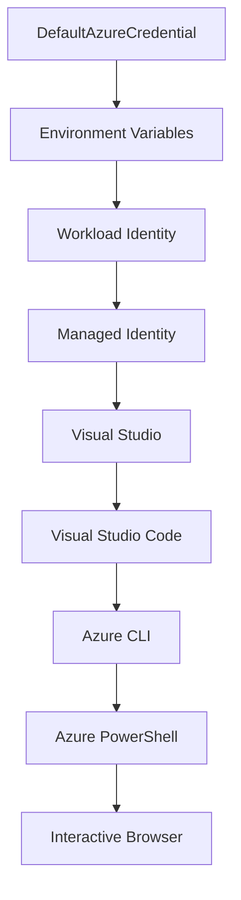

<!--
CO_OP_TRANSLATOR_METADATA:
{
  "original_hash": "fb0687bd0b166ecb0430dfeeed83487e",
  "translation_date": "2025-10-24T17:54:19+00:00",
  "source_file": "docs/getting-started/azd-basics.md",
  "language_code": "hu"
}
-->
# AZD Alapok - Azure Developer CLI megértése

# AZD Alapok - Alapfogalmak és alapelvek

**Fejezet navigáció:**
- **📚 Kurzus kezdőlap**: [AZD Kezdőknek](../../README.md)
- **📖 Aktuális fejezet**: 1. fejezet - Alapok és gyors kezdés
- **⬅️ Előző**: [Kurzus áttekintése](../../README.md#-chapter-1-foundation--quick-start)
- **➡️ Következő**: [Telepítés és beállítás](installation.md)
- **🚀 Következő fejezet**: [2. fejezet: AI-első fejlesztés](../ai-foundry/azure-ai-foundry-integration.md)

## Bevezetés

Ez a lecke bemutatja az Azure Developer CLI-t (azd), egy hatékony parancssori eszközt, amely felgyorsítja az utat a helyi fejlesztéstől az Azure-ba történő telepítésig. Megismerheted az alapfogalmakat, a főbb funkciókat, és megértheted, hogyan egyszerűsíti az azd a felhőalapú alkalmazások telepítését.

## Tanulási célok

A lecke végére:
- Megérted, mi az Azure Developer CLI és mi a fő célja
- Megtanulod az alapfogalmakat, mint sablonok, környezetek és szolgáltatások
- Felfedezed a kulcsfontosságú funkciókat, például a sablonvezérelt fejlesztést és az infrastruktúra kód formájában történő kezelését
- Megérted az azd projektstruktúrát és munkafolyamatot
- Felkészülsz az azd telepítésére és konfigurálására a fejlesztési környezetedben

## Tanulási eredmények

A lecke elvégzése után képes leszel:
- Elmagyarázni az azd szerepét a modern felhőfejlesztési munkafolyamatokban
- Azonosítani az azd projektstruktúra elemeit
- Leírni, hogyan működnek együtt a sablonok, környezetek és szolgáltatások
- Megérteni az infrastruktúra kód formájában történő kezelésének előnyeit az azd segítségével
- Felismerni az azd különböző parancsait és azok célját

## Mi az Azure Developer CLI (azd)?

Az Azure Developer CLI (azd) egy parancssori eszköz, amelyet arra terveztek, hogy felgyorsítsa az utat a helyi fejlesztéstől az Azure-ba történő telepítésig. Egyszerűsíti a felhőalapú alkalmazások építésének, telepítésének és kezelésének folyamatát az Azure-on.

## Alapfogalmak

### Sablonok
A sablonok az azd alapját képezik. Tartalmazzák:
- **Alkalmazáskód** - Forráskódod és függőségeid
- **Infrastruktúra definíciók** - Azure erőforrások Bicep vagy Terraform segítségével definiálva
- **Konfigurációs fájlok** - Beállítások és környezeti változók
- **Telepítési szkriptek** - Automatizált telepítési munkafolyamatok

### Környezetek
A környezetek különböző telepítési célokat képviselnek:
- **Fejlesztés** - Tesztelésre és fejlesztésre
- **Staging** - Előzetes termelési környezet
- **Termelés** - Éles termelési környezet

Minden környezet saját:
- Azure erőforráscsoportot
- Konfigurációs beállításokat
- Telepítési állapotot tart fenn

### Szolgáltatások
A szolgáltatások az alkalmazásod építőelemei:
- **Frontend** - Webalkalmazások, SPÁ-k
- **Backend** - API-k, mikroszolgáltatások
- **Adatbázis** - Adattárolási megoldások
- **Tárolás** - Fájl- és blobtárolás

## Főbb funkciók

### 1. Sablonvezérelt fejlesztés
```bash
# Browse available templates
azd template list

# Initialize from a template
azd init --template <template-name>
```

### 2. Infrastruktúra kód formájában
- **Bicep** - Azure specifikus nyelv
- **Terraform** - Többfelhős infrastruktúra eszköz
- **ARM sablonok** - Azure Resource Manager sablonok

### 3. Integrált munkafolyamatok
```bash
# Complete deployment workflow
azd up            # Provision + Deploy this is hands off for first time setup

# 🧪 NEW: Preview infrastructure changes before deployment (SAFE)
azd provision --preview    # Simulate infrastructure deployment without making changes

azd provision     # Create Azure resources if you update the infrastructure use this
azd deploy        # Deploy application code or redeploy application code once update
azd down          # Clean up resources
```

#### 🛡️ Biztonságos infrastruktúra tervezés előnézettel
Az `azd provision --preview` parancs forradalmi a biztonságos telepítésekhez:
- **Száraz futás elemzés** - Megmutatja, mi lesz létrehozva, módosítva vagy törölve
- **Nulla kockázat** - Nem történik tényleges változás az Azure környezetedben
- **Csapatmunka** - Ossz meg előnézeti eredményeket telepítés előtt
- **Költségbecslés** - Értsd meg az erőforrások költségeit elköteleződés előtt

```bash
# Example preview workflow
azd provision --preview           # See what will change
# Review the output, discuss with team
azd provision                     # Apply changes with confidence
```

### 4. Környezetkezelés
```bash
# Create and manage environments
azd env new <environment-name>
azd env select <environment-name>
azd env list
```

## 📁 Projektstruktúra

Egy tipikus azd projektstruktúra:
```
my-app/
├── .azd/                    # azd configuration
│   └── config.json
├── .azure/                  # Azure deployment artifacts
├── .devcontainer/          # Development container config
├── .github/workflows/      # GitHub Actions
├── .vscode/               # VS Code settings
├── infra/                 # Infrastructure code
│   ├── main.bicep        # Main infrastructure template
│   ├── main.parameters.json
│   └── modules/          # Reusable modules
├── src/                  # Application source code
│   ├── api/             # Backend services
│   └── web/             # Frontend application
├── azure.yaml           # azd project configuration
└── README.md
```

## 🔧 Konfigurációs fájlok

### azure.yaml
A fő projektkonfigurációs fájl:
```yaml
name: my-awesome-app
metadata:
  template: my-template@1.0.0

services:
  web:
    project: ./src/web
    language: js
    host: appservice
  api:
    project: ./src/api
    language: js
    host: appservice

hooks:
  preprovision:
    shell: pwsh
    run: echo "Preparing to provision..."
```

### .azure/config.json
Környezet-specifikus konfiguráció:
```json
{
  "version": 1,
  "defaultEnvironment": "dev",
  "environments": {
    "dev": {
      "subscriptionId": "your-subscription-id",
      "location": "eastus"
    }
  }
}
```

## 🎪 Gyakori munkafolyamatok

### Új projekt indítása
```bash
# Method 1: Use existing template
azd init --template todo-nodejs-mongo

# Method 2: Start from scratch
azd init

# Method 3: Use current directory
azd init .
```

### Fejlesztési ciklus
```bash
# Set up development environment
azd auth login
azd env new dev
azd env select dev

# Deploy everything
azd up

# Make changes and redeploy
azd deploy

# Clean up when done
azd down --force --purge # command in the Azure Developer CLI is a **hard reset** for your environment—especially useful when you're troubleshooting failed deployments, cleaning up orphaned resources, or prepping for a fresh redeploy.
```

## Az `azd down --force --purge` megértése
Az `azd down --force --purge` parancs hatékony módja az azd környezet és az összes kapcsolódó erőforrás teljes lebontásának. Íme, mit csinál az egyes jelzők:
```
--force
```
- Kihagyja a megerősítési kéréseket.
- Hasznos automatizálás vagy szkriptek esetén, ahol a manuális bemenet nem lehetséges.
- Biztosítja, hogy a lebontás megszakítás nélkül folytatódjon, még akkor is, ha a CLI inkonzisztenciákat észlel.

```
--purge
```
Törli **az összes kapcsolódó metaadatot**, beleértve:
Környezet állapot
Helyi `.azure` mappa
Gyorsítótárazott telepítési információk
Megakadályozza, hogy az azd "emlékezzen" korábbi telepítésekre, amelyek problémákat okozhatnak, például nem egyező erőforráscsoportok vagy elavult regiszter hivatkozások.

### Miért használjuk mindkettőt?
Ha az `azd up` parancs akadályba ütközik a fennmaradó állapot vagy részleges telepítések miatt, ez a kombináció biztosítja a **tiszta lapot**.

Különösen hasznos manuális erőforrás törlések után az Azure portálon, vagy sablonok, környezetek vagy erőforráscsoport elnevezési konvenciók váltásakor.

### Több környezet kezelése
```bash
# Create staging environment
azd env new staging
azd env select staging
azd up

# Switch back to dev
azd env select dev

# Compare environments
azd env list
```

## 🔐 Hitelesítés és hitelesítő adatok

A hitelesítés megértése kulcsfontosságú az azd telepítések sikeréhez. Az Azure többféle hitelesítési módszert használ, és az azd ugyanazt a hitelesítési láncot használja, mint más Azure eszközök.

### Azure CLI hitelesítés (`az login`)

Az azd használata előtt hitelesítened kell magad az Azure-ban. A leggyakoribb módszer az Azure CLI használata:

```bash
# Interactive login (opens browser)
az login

# Login with specific tenant
az login --tenant <tenant-id>

# Login with service principal
az login --service-principal -u <app-id> -p <password> --tenant <tenant-id>

# Check current login status
az account show

# List available subscriptions
az account list --output table

# Set default subscription
az account set --subscription <subscription-id>
```

### Hitelesítési folyamat
1. **Interaktív bejelentkezés**: Megnyitja az alapértelmezett böngészőt a hitelesítéshez
2. **Eszközkódos folyamat**: Böngésző hozzáférés nélküli környezetekhez
3. **Szolgáltatási főazonosító**: Automatizálási és CI/CD forgatókönyvekhez
4. **Kezelt identitás**: Azure-ban hosztolt alkalmazásokhoz

### DefaultAzureCredential lánc

A `DefaultAzureCredential` egy hitelesítési típus, amely egyszerűsített hitelesítési élményt nyújt azáltal, hogy automatikusan több hitelesítési forrást próbál ki meghatározott sorrendben:

#### Hitelesítési lánc sorrendje


#### 1. Környezeti változók
```bash
# Set environment variables for service principal
export AZURE_CLIENT_ID="<app-id>"
export AZURE_CLIENT_SECRET="<password>"
export AZURE_TENANT_ID="<tenant-id>"
```

#### 2. Munkaterhelési identitás (Kubernetes/GitHub Actions)
Automatikusan használva:
- Azure Kubernetes Service (AKS) munkaterhelési identitással
- GitHub Actions OIDC federációval
- Egyéb federált identitás forgatókönyvek

#### 3. Kezelt identitás
Azure erőforrásokhoz, mint például:
- Virtuális gépek
- App Service
- Azure Functions
- Konténeres példányok

```bash
# Check if running on Azure resource with managed identity
az account show --query "user.type" --output tsv
# Returns: "servicePrincipal" if using managed identity
```

#### 4. Fejlesztői eszközök integrációja
- **Visual Studio**: Automatikusan használja a bejelentkezett fiókot
- **VS Code**: Az Azure Account bővítmény hitelesítő adatait használja
- **Azure CLI**: Az `az login` hitelesítő adatait használja (leggyakoribb helyi fejlesztéshez)

### AZD hitelesítési beállítás

```bash
# Method 1: Use Azure CLI (Recommended for development)
az login
azd auth login  # Uses existing Azure CLI credentials

# Method 2: Direct azd authentication
azd auth login --use-device-code  # For headless environments

# Method 3: Check authentication status
azd auth login --check-status

# Method 4: Logout and re-authenticate
azd auth logout
azd auth login
```

### Hitelesítési legjobb gyakorlatok

#### Helyi fejlesztéshez
```bash
# 1. Login with Azure CLI
az login

# 2. Verify correct subscription
az account show
az account set --subscription "Your Subscription Name"

# 3. Use azd with existing credentials
azd auth login
```

#### CI/CD csővezetékekhez
```yaml
# GitHub Actions example
- name: Azure Login
  uses: azure/login@v1
  with:
    creds: ${{ secrets.AZURE_CREDENTIALS }}

- name: Deploy with azd
  run: |
    azd auth login --client-id ${{ secrets.AZURE_CLIENT_ID }} \
                    --client-secret ${{ secrets.AZURE_CLIENT_SECRET }} \
                    --tenant-id ${{ secrets.AZURE_TENANT_ID }}
    azd up --no-prompt
```

#### Termelési környezetekhez
- Használj **kezelt identitást**, ha Azure erőforrásokon futsz
- Használj **szolgáltatási főazonosítót** automatizálási forgatókönyvekhez
- Kerüld a hitelesítő adatok kódban vagy konfigurációs fájlokban történő tárolását
- Használj **Azure Key Vault**-ot érzékeny konfigurációhoz

### Gyakori hitelesítési problémák és megoldások

#### Probléma: "Nincs előfizetés található"
```bash
# Solution: Set default subscription
az account list --output table
az account set --subscription "<subscription-id>"
azd env set AZURE_SUBSCRIPTION_ID "<subscription-id>"
```

#### Probléma: "Elégtelen jogosultságok"
```bash
# Solution: Check and assign required roles
az role assignment list --assignee $(az account show --query user.name --output tsv)

# Common required roles:
# - Contributor (for resource management)
# - User Access Administrator (for role assignments)
```

#### Probléma: "Token lejárt"
```bash
# Solution: Re-authenticate
az logout
az login
azd auth logout
azd auth login
```

### Hitelesítés különböző forgatókönyvekben

#### Helyi fejlesztés
```bash
# Personal development account
az login
azd auth login
```

#### Csapatfejlesztés
```bash
# Use specific tenant for organization
az login --tenant contoso.onmicrosoft.com
azd auth login
```

#### Több bérlős forgatókönyvek
```bash
# Switch between tenants
az login --tenant tenant1.onmicrosoft.com
# Deploy to tenant 1
azd up

az login --tenant tenant2.onmicrosoft.com  
# Deploy to tenant 2
azd up
```

### Biztonsági megfontolások

1. **Hitelesítő adatok tárolása**: Soha ne tárold a hitelesítő adatokat forráskódban
2. **Hatókör korlátozása**: Használj legkisebb jogosultság elvet a szolgáltatási főazonosítókhoz
3. **Token forgatás**: Rendszeresen forgass szolgáltatási főazonosító titkokat
4. **Audit nyomvonal**: Figyeld a hitelesítési és telepítési tevékenységeket
5. **Hálózati biztonság**: Használj privát végpontokat, amikor lehetséges

### Hitelesítési hibaelhárítás

```bash
# Debug authentication issues
azd auth login --check-status
az account show
az account get-access-token

# Common diagnostic commands
whoami                          # Current user context
az ad signed-in-user show      # Azure AD user details
az group list                  # Test resource access
```

## Az `azd down --force --purge` megértése

### Felfedezés
```bash
azd template list              # Browse templates
azd template show <template>   # Template details
azd init --help               # Initialization options
```

### Projektkezelés
```bash
azd show                     # Project overview
azd env show                 # Current environment
azd config list             # Configuration settings
```

### Felügyelet
```bash
azd monitor                  # Open Azure portal
azd pipeline config          # Set up CI/CD
azd logs                     # View application logs
```

## Legjobb gyakorlatok

### 1. Használj jelentőségteljes neveket
```bash
# Good
azd env new production-east
azd init --template web-app-secure

# Avoid
azd env new env1
azd init --template template1
```

### 2. Használj sablonokat
- Kezdj meglévő sablonokkal
- Testreszabás az igényeid szerint
- Hozz létre újrahasználható sablonokat a szervezeted számára

### 3. Környezetek elkülönítése
- Használj külön környezeteket fejlesztéshez/staginghez/termeléshez
- Soha ne telepíts közvetlenül termelésbe helyi gépről
- Használj CI/CD csővezetékeket a termelési telepítésekhez

### 4. Konfigurációkezelés
- Használj környezeti változókat érzékeny adatokhoz
- Tartsd a konfigurációt verziókezelés alatt
- Dokumentáld a környezet-specifikus beállításokat

## Tanulási előrehaladás

### Kezdő (1-2 hét)
1. Telepítsd az azd-t és hitelesítsd magad
2. Telepíts egy egyszerű sablont
3. Értsd meg a projektstruktúrát
4. Tanuld meg az alapvető parancsokat (up, down, deploy)

### Középhaladó (3-4 hét)
1. Testreszabás sablonokkal
2. Több környezet kezelése
3. Értsd meg az infrastruktúra kódot
4. Állítsd be a CI/CD csővezetékeket

### Haladó (5+ hét)
1. Hozz létre egyedi sablonokat
2. Haladó infrastruktúra minták
3. Több régiós telepítések
4. Vállalati szintű konfigurációk

## Következő lépések

**📖 Folytasd az 1. fejezet tanulását:**
- [Telepítés és beállítás](installation.md) - Az azd telepítése és konfigurálása
- [Az első projekted](first-project.md) - Gyakorlati útmutató
- [Konfigurációs útmutató](configuration.md) - Haladó konfigurációs lehetőségek

**🎯 Készen állsz a következő fejezetre?**
- [2. fejezet: AI-első fejlesztés](../ai-foundry/azure-ai-foundry-integration.md) - Kezdj AI alkalmazásokat építeni

## További források

- [Azure Developer CLI áttekintés](https://learn.microsoft.com/en-us/azure/developer/azure-developer-cli/)
- [Sablon galéria](https://azure.github.io/awesome-azd/)
- [Közösségi minták](https://github.com/Azure-Samples)

---

**Fejezet navigáció:**
- **📚 Kurzus kezdőlap**: [AZD Kezdőknek](../../README.md)
- **📖 Aktuális fejezet**: 1. fejezet - Alapok és gyors kezdés  
- **⬅️ Előző**: [Kurzus áttekintése](../../README.md#-chapter-1-foundation--quick-start)
- **➡️ Következő**: [Telepítés és beállítás](installation.md)
- **🚀 Következő fejezet**: [2. fejezet: AI-első fejlesztés](../ai-foundry/azure-ai-foundry-integration.md)

---

**Felelősség kizárása**:  
Ez a dokumentum az [Co-op Translator](https://github.com/Azure/co-op-translator) AI fordítási szolgáltatás segítségével lett lefordítva. Bár törekszünk a pontosságra, kérjük, vegye figyelembe, hogy az automatikus fordítások hibákat vagy pontatlanságokat tartalmazhatnak. Az eredeti dokumentum az eredeti nyelvén tekintendő hiteles forrásnak. Kritikus információk esetén javasolt professzionális emberi fordítást igénybe venni. Nem vállalunk felelősséget semmilyen félreértésért vagy téves értelmezésért, amely a fordítás használatából eredhet.