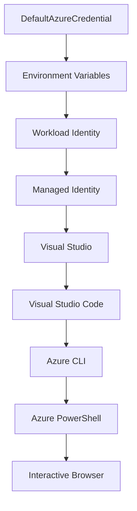

<!--
CO_OP_TRANSLATOR_METADATA:
{
  "original_hash": "fb0687bd0b166ecb0430dfeeed83487e",
  "translation_date": "2025-10-24T17:43:27+00:00",
  "source_file": "docs/getting-started/azd-basics.md",
  "language_code": "id"
}
-->
# Dasar-Dasar AZD - Memahami Azure Developer CLI

# Dasar-Dasar AZD - Konsep Inti dan Fundamental

**Navigasi Bab:**
- **📚 Beranda Kursus**: [AZD Untuk Pemula](../../README.md)
- **📖 Bab Saat Ini**: Bab 1 - Dasar & Memulai Cepat
- **⬅️ Sebelumnya**: [Ikhtisar Kursus](../../README.md#-chapter-1-foundation--quick-start)
- **➡️ Selanjutnya**: [Instalasi & Pengaturan](installation.md)
- **🚀 Bab Berikutnya**: [Bab 2: Pengembangan Berbasis AI](../ai-foundry/azure-ai-foundry-integration.md)

## Pendahuluan

Pelajaran ini memperkenalkan Anda pada Azure Developer CLI (azd), alat baris perintah yang kuat yang mempercepat perjalanan Anda dari pengembangan lokal ke penerapan di Azure. Anda akan mempelajari konsep dasar, fitur inti, dan memahami bagaimana azd menyederhanakan penerapan aplikasi cloud-native.

## Tujuan Pembelajaran

Pada akhir pelajaran ini, Anda akan:
- Memahami apa itu Azure Developer CLI dan tujuan utamanya
- Mempelajari konsep inti seperti template, lingkungan, dan layanan
- Mengeksplorasi fitur utama termasuk pengembangan berbasis template dan Infrastructure as Code
- Memahami struktur proyek azd dan alur kerjanya
- Siap untuk menginstal dan mengonfigurasi azd untuk lingkungan pengembangan Anda

## Hasil Pembelajaran

Setelah menyelesaikan pelajaran ini, Anda akan dapat:
- Menjelaskan peran azd dalam alur kerja pengembangan cloud modern
- Mengidentifikasi komponen struktur proyek azd
- Menjelaskan bagaimana template, lingkungan, dan layanan bekerja bersama
- Memahami manfaat Infrastructure as Code dengan azd
- Mengenali berbagai perintah azd dan tujuannya

## Apa itu Azure Developer CLI (azd)?

Azure Developer CLI (azd) adalah alat baris perintah yang dirancang untuk mempercepat perjalanan Anda dari pengembangan lokal ke penerapan di Azure. Alat ini menyederhanakan proses membangun, menerapkan, dan mengelola aplikasi cloud-native di Azure.

## Konsep Inti

### Template
Template adalah dasar dari azd. Template berisi:
- **Kode aplikasi** - Kode sumber dan dependensi Anda
- **Definisi infrastruktur** - Sumber daya Azure yang didefinisikan dalam Bicep atau Terraform
- **File konfigurasi** - Pengaturan dan variabel lingkungan
- **Skrip penerapan** - Alur kerja penerapan otomatis

### Lingkungan
Lingkungan mewakili target penerapan yang berbeda:
- **Pengembangan** - Untuk pengujian dan pengembangan
- **Staging** - Lingkungan pra-produksi
- **Produksi** - Lingkungan produksi langsung

Setiap lingkungan memiliki:
- Grup sumber daya Azure sendiri
- Pengaturan konfigurasi
- Status penerapan

### Layanan
Layanan adalah blok bangunan aplikasi Anda:
- **Frontend** - Aplikasi web, SPA
- **Backend** - API, mikroservis
- **Database** - Solusi penyimpanan data
- **Penyimpanan** - Penyimpanan file dan blob

## Fitur Utama

### 1. Pengembangan Berbasis Template
```bash
# Browse available templates
azd template list

# Initialize from a template
azd init --template <template-name>
```

### 2. Infrastructure as Code
- **Bicep** - Bahasa khusus domain Azure
- **Terraform** - Alat infrastruktur multi-cloud
- **ARM Templates** - Template Azure Resource Manager

### 3. Alur Kerja Terintegrasi
```bash
# Complete deployment workflow
azd up            # Provision + Deploy this is hands off for first time setup

# 🧪 NEW: Preview infrastructure changes before deployment (SAFE)
azd provision --preview    # Simulate infrastructure deployment without making changes

azd provision     # Create Azure resources if you update the infrastructure use this
azd deploy        # Deploy application code or redeploy application code once update
azd down          # Clean up resources
```

#### 🛡️ Perencanaan Infrastruktur Aman dengan Pratinjau
Perintah `azd provision --preview` adalah terobosan untuk penerapan yang aman:
- **Analisis dry-run** - Menunjukkan apa yang akan dibuat, diubah, atau dihapus
- **Risiko nol** - Tidak ada perubahan nyata yang dilakukan pada lingkungan Azure Anda
- **Kolaborasi tim** - Bagikan hasil pratinjau sebelum penerapan
- **Estimasi biaya** - Pahami biaya sumber daya sebelum komitmen

```bash
# Example preview workflow
azd provision --preview           # See what will change
# Review the output, discuss with team
azd provision                     # Apply changes with confidence
```

### 4. Manajemen Lingkungan
```bash
# Create and manage environments
azd env new <environment-name>
azd env select <environment-name>
azd env list
```

## 📁 Struktur Proyek

Struktur proyek azd yang khas:
```
my-app/
├── .azd/                    # azd configuration
│   └── config.json
├── .azure/                  # Azure deployment artifacts
├── .devcontainer/          # Development container config
├── .github/workflows/      # GitHub Actions
├── .vscode/               # VS Code settings
├── infra/                 # Infrastructure code
│   ├── main.bicep        # Main infrastructure template
│   ├── main.parameters.json
│   └── modules/          # Reusable modules
├── src/                  # Application source code
│   ├── api/             # Backend services
│   └── web/             # Frontend application
├── azure.yaml           # azd project configuration
└── README.md
```

## 🔧 File Konfigurasi

### azure.yaml
File konfigurasi utama proyek:
```yaml
name: my-awesome-app
metadata:
  template: my-template@1.0.0

services:
  web:
    project: ./src/web
    language: js
    host: appservice
  api:
    project: ./src/api
    language: js
    host: appservice

hooks:
  preprovision:
    shell: pwsh
    run: echo "Preparing to provision..."
```

### .azure/config.json
Konfigurasi khusus lingkungan:
```json
{
  "version": 1,
  "defaultEnvironment": "dev",
  "environments": {
    "dev": {
      "subscriptionId": "your-subscription-id",
      "location": "eastus"
    }
  }
}
```

## 🎪 Alur Kerja Umum

### Memulai Proyek Baru
```bash
# Method 1: Use existing template
azd init --template todo-nodejs-mongo

# Method 2: Start from scratch
azd init

# Method 3: Use current directory
azd init .
```

### Siklus Pengembangan
```bash
# Set up development environment
azd auth login
azd env new dev
azd env select dev

# Deploy everything
azd up

# Make changes and redeploy
azd deploy

# Clean up when done
azd down --force --purge # command in the Azure Developer CLI is a **hard reset** for your environment—especially useful when you're troubleshooting failed deployments, cleaning up orphaned resources, or prepping for a fresh redeploy.
```

## Memahami `azd down --force --purge`
Perintah `azd down --force --purge` adalah cara yang ampuh untuk sepenuhnya menghentikan lingkungan azd Anda dan semua sumber daya terkait. Berikut adalah rincian dari setiap flag:
```
--force
```
- Melewati prompt konfirmasi.
- Berguna untuk otomatisasi atau skrip di mana input manual tidak memungkinkan.
- Memastikan penghentian berjalan tanpa gangguan, bahkan jika CLI mendeteksi ketidakkonsistenan.

```
--purge
```
Menghapus **semua metadata terkait**, termasuk:
Status lingkungan
Folder lokal `.azure`
Info penerapan yang di-cache
Mencegah azd "mengingat" penerapan sebelumnya, yang dapat menyebabkan masalah seperti grup sumber daya yang tidak cocok atau referensi registri yang usang.

### Mengapa menggunakan keduanya?
Ketika Anda mengalami masalah dengan `azd up` karena status yang tertinggal atau penerapan parsial, kombinasi ini memastikan **lembaran baru**.

Ini sangat berguna setelah penghapusan sumber daya manual di portal Azure atau saat beralih template, lingkungan, atau konvensi penamaan grup sumber daya.

### Mengelola Banyak Lingkungan
```bash
# Create staging environment
azd env new staging
azd env select staging
azd up

# Switch back to dev
azd env select dev

# Compare environments
azd env list
```

## 🔐 Autentikasi dan Kredensial

Memahami autentikasi sangat penting untuk penerapan azd yang sukses. Azure menggunakan beberapa metode autentikasi, dan azd memanfaatkan rantai kredensial yang sama yang digunakan oleh alat Azure lainnya.

### Autentikasi Azure CLI (`az login`)

Sebelum menggunakan azd, Anda perlu mengautentikasi dengan Azure. Metode yang paling umum adalah menggunakan Azure CLI:

```bash
# Interactive login (opens browser)
az login

# Login with specific tenant
az login --tenant <tenant-id>

# Login with service principal
az login --service-principal -u <app-id> -p <password> --tenant <tenant-id>

# Check current login status
az account show

# List available subscriptions
az account list --output table

# Set default subscription
az account set --subscription <subscription-id>
```

### Alur Autentikasi
1. **Login Interaktif**: Membuka browser default Anda untuk autentikasi
2. **Alur Kode Perangkat**: Untuk lingkungan tanpa akses browser
3. **Service Principal**: Untuk otomatisasi dan skenario CI/CD
4. **Managed Identity**: Untuk aplikasi yang di-host di Azure

### DefaultAzureCredential Chain

`DefaultAzureCredential` adalah tipe kredensial yang menyediakan pengalaman autentikasi yang disederhanakan dengan mencoba beberapa sumber kredensial secara otomatis dalam urutan tertentu:

#### Urutan Rantai Kredensial


#### 1. Variabel Lingkungan
```bash
# Set environment variables for service principal
export AZURE_CLIENT_ID="<app-id>"
export AZURE_CLIENT_SECRET="<password>"
export AZURE_TENANT_ID="<tenant-id>"
```

#### 2. Workload Identity (Kubernetes/GitHub Actions)
Digunakan secara otomatis dalam:
- Azure Kubernetes Service (AKS) dengan Workload Identity
- GitHub Actions dengan federasi OIDC
- Skenario identitas federasi lainnya

#### 3. Managed Identity
Untuk sumber daya Azure seperti:
- Virtual Machines
- App Service
- Azure Functions
- Container Instances

```bash
# Check if running on Azure resource with managed identity
az account show --query "user.type" --output tsv
# Returns: "servicePrincipal" if using managed identity
```

#### 4. Integrasi Alat Pengembang
- **Visual Studio**: Secara otomatis menggunakan akun yang masuk
- **VS Code**: Menggunakan kredensial ekstensi Akun Azure
- **Azure CLI**: Menggunakan kredensial `az login` (paling umum untuk pengembangan lokal)

### Pengaturan Autentikasi AZD

```bash
# Method 1: Use Azure CLI (Recommended for development)
az login
azd auth login  # Uses existing Azure CLI credentials

# Method 2: Direct azd authentication
azd auth login --use-device-code  # For headless environments

# Method 3: Check authentication status
azd auth login --check-status

# Method 4: Logout and re-authenticate
azd auth logout
azd auth login
```

### Praktik Terbaik Autentikasi

#### Untuk Pengembangan Lokal
```bash
# 1. Login with Azure CLI
az login

# 2. Verify correct subscription
az account show
az account set --subscription "Your Subscription Name"

# 3. Use azd with existing credentials
azd auth login
```

#### Untuk Pipeline CI/CD
```yaml
# GitHub Actions example
- name: Azure Login
  uses: azure/login@v1
  with:
    creds: ${{ secrets.AZURE_CREDENTIALS }}

- name: Deploy with azd
  run: |
    azd auth login --client-id ${{ secrets.AZURE_CLIENT_ID }} \
                    --client-secret ${{ secrets.AZURE_CLIENT_SECRET }} \
                    --tenant-id ${{ secrets.AZURE_TENANT_ID }}
    azd up --no-prompt
```

#### Untuk Lingkungan Produksi
- Gunakan **Managed Identity** saat berjalan di sumber daya Azure
- Gunakan **Service Principal** untuk skenario otomatisasi
- Hindari menyimpan kredensial dalam kode atau file konfigurasi
- Gunakan **Azure Key Vault** untuk konfigurasi sensitif

### Masalah Autentikasi Umum dan Solusinya

#### Masalah: "Tidak ada langganan yang ditemukan"
```bash
# Solution: Set default subscription
az account list --output table
az account set --subscription "<subscription-id>"
azd env set AZURE_SUBSCRIPTION_ID "<subscription-id>"
```

#### Masalah: "Izin tidak mencukupi"
```bash
# Solution: Check and assign required roles
az role assignment list --assignee $(az account show --query user.name --output tsv)

# Common required roles:
# - Contributor (for resource management)
# - User Access Administrator (for role assignments)
```

#### Masalah: "Token kadaluarsa"
```bash
# Solution: Re-authenticate
az logout
az login
azd auth logout
azd auth login
```

### Autentikasi dalam Berbagai Skenario

#### Pengembangan Lokal
```bash
# Personal development account
az login
azd auth login
```

#### Pengembangan Tim
```bash
# Use specific tenant for organization
az login --tenant contoso.onmicrosoft.com
azd auth login
```

#### Skenario Multi-tenant
```bash
# Switch between tenants
az login --tenant tenant1.onmicrosoft.com
# Deploy to tenant 1
azd up

az login --tenant tenant2.onmicrosoft.com  
# Deploy to tenant 2
azd up
```

### Pertimbangan Keamanan

1. **Penyimpanan Kredensial**: Jangan pernah menyimpan kredensial dalam kode sumber
2. **Pembatasan Lingkup**: Gunakan prinsip hak istimewa paling sedikit untuk service principal
3. **Rotasi Token**: Secara teratur rotasi rahasia service principal
4. **Jejak Audit**: Pantau aktivitas autentikasi dan penerapan
5. **Keamanan Jaringan**: Gunakan endpoint privat jika memungkinkan

### Pemecahan Masalah Autentikasi

```bash
# Debug authentication issues
azd auth login --check-status
az account show
az account get-access-token

# Common diagnostic commands
whoami                          # Current user context
az ad signed-in-user show      # Azure AD user details
az group list                  # Test resource access
```

## Memahami `azd down --force --purge`

### Penemuan
```bash
azd template list              # Browse templates
azd template show <template>   # Template details
azd init --help               # Initialization options
```

### Manajemen Proyek
```bash
azd show                     # Project overview
azd env show                 # Current environment
azd config list             # Configuration settings
```

### Pemantauan
```bash
azd monitor                  # Open Azure portal
azd pipeline config          # Set up CI/CD
azd logs                     # View application logs
```

## Praktik Terbaik

### 1. Gunakan Nama yang Bermakna
```bash
# Good
azd env new production-east
azd init --template web-app-secure

# Avoid
azd env new env1
azd init --template template1
```

### 2. Manfaatkan Template
- Mulai dengan template yang ada
- Sesuaikan dengan kebutuhan Anda
- Buat template yang dapat digunakan kembali untuk organisasi Anda

### 3. Isolasi Lingkungan
- Gunakan lingkungan terpisah untuk dev/staging/prod
- Jangan pernah menerapkan langsung ke produksi dari mesin lokal
- Gunakan pipeline CI/CD untuk penerapan produksi

### 4. Manajemen Konfigurasi
- Gunakan variabel lingkungan untuk data sensitif
- Simpan konfigurasi dalam kontrol versi
- Dokumentasikan pengaturan khusus lingkungan

## Perkembangan Pembelajaran

### Pemula (Minggu 1-2)
1. Instal azd dan autentikasi
2. Terapkan template sederhana
3. Pahami struktur proyek
4. Pelajari perintah dasar (up, down, deploy)

### Menengah (Minggu 3-4)
1. Sesuaikan template
2. Kelola banyak lingkungan
3. Pahami kode infrastruktur
4. Siapkan pipeline CI/CD

### Lanjutan (Minggu 5+)
1. Buat template khusus
2. Pola infrastruktur tingkat lanjut
3. Penerapan multi-region
4. Konfigurasi tingkat perusahaan

## Langkah Selanjutnya

**📖 Lanjutkan Pembelajaran Bab 1:**
- [Instalasi & Pengaturan](installation.md) - Instal dan konfigurasi azd
- [Proyek Pertama Anda](first-project.md) - Selesaikan tutorial langsung
- [Panduan Konfigurasi](configuration.md) - Opsi konfigurasi lanjutan

**🎯 Siap untuk Bab Berikutnya?**
- [Bab 2: Pengembangan Berbasis AI](../ai-foundry/azure-ai-foundry-integration.md) - Mulai membangun aplikasi AI

## Sumber Daya Tambahan

- [Ikhtisar Azure Developer CLI](https://learn.microsoft.com/en-us/azure/developer/azure-developer-cli/)
- [Galeri Template](https://azure.github.io/awesome-azd/)
- [Contoh Komunitas](https://github.com/Azure-Samples)

---

**Navigasi Bab:**
- **📚 Beranda Kursus**: [AZD Untuk Pemula](../../README.md)
- **📖 Bab Saat Ini**: Bab 1 - Dasar & Memulai Cepat  
- **⬅️ Sebelumnya**: [Ikhtisar Kursus](../../README.md#-chapter-1-foundation--quick-start)
- **➡️ Selanjutnya**: [Instalasi & Pengaturan](installation.md)
- **🚀 Bab Berikutnya**: [Bab 2: Pengembangan Berbasis AI](../ai-foundry/azure-ai-foundry-integration.md)

---

**Penafian**:  
Dokumen ini telah diterjemahkan menggunakan layanan penerjemahan AI [Co-op Translator](https://github.com/Azure/co-op-translator). Meskipun kami berupaya untuk memberikan hasil yang akurat, harap diketahui bahwa terjemahan otomatis mungkin mengandung kesalahan atau ketidakakuratan. Dokumen asli dalam bahasa aslinya harus dianggap sebagai sumber yang otoritatif. Untuk informasi yang bersifat kritis, disarankan menggunakan jasa penerjemahan manusia profesional. Kami tidak bertanggung jawab atas kesalahpahaman atau penafsiran yang timbul dari penggunaan terjemahan ini.