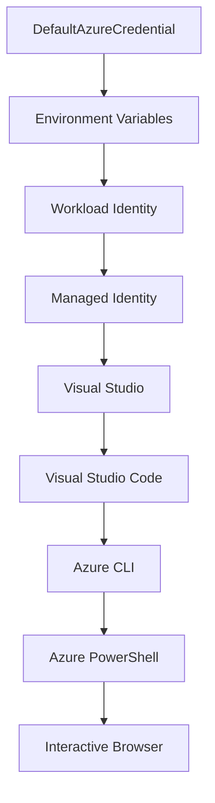

<!--
CO_OP_TRANSLATOR_METADATA:
{
  "original_hash": "fb0687bd0b166ecb0430dfeeed83487e",
  "translation_date": "2025-10-24T16:49:25+00:00",
  "source_file": "docs/getting-started/azd-basics.md",
  "language_code": "ja"
}
-->
# AZDの基本 - Azure Developer CLIの理解

# AZDの基本 - 核心概念と基礎

**章のナビゲーション:**
- **📚 コースホーム**: [AZD初心者向け](../../README.md)
- **📖 現在の章**: 第1章 - 基礎とクイックスタート
- **⬅️ 前章**: [コース概要](../../README.md#-chapter-1-foundation--quick-start)
- **➡️ 次章**: [インストールとセットアップ](installation.md)
- **🚀 次の章**: [第2章: AI優先の開発](../ai-foundry/azure-ai-foundry-integration.md)

## はじめに

このレッスンでは、Azure Developer CLI (azd) を紹介します。これは、ローカル開発からAzureへのデプロイを加速する強力なコマンドラインツールです。基本的な概念、主要な機能を学び、azdがクラウドネイティブアプリケーションのデプロイをどのように簡素化するかを理解します。

## 学習目標

このレッスンの終わりまでに、以下を理解することができます:
- Azure Developer CLIとは何か、その主な目的
- テンプレート、環境、サービスの基本概念を学ぶ
- テンプレート駆動型開発やInfrastructure as Codeを含む主要な機能を探る
- azdプロジェクトの構造とワークフローを理解する
- 開発環境にazdをインストールして設定する準備を整える

## 学習成果

このレッスンを完了すると、以下ができるようになります:
- 現代のクラウド開発ワークフローにおけるazdの役割を説明する
- azdプロジェクト構造の構成要素を特定する
- テンプレート、環境、サービスがどのように連携するかを説明する
- azdを使用したInfrastructure as Codeの利点を理解する
- azdコマンドの種類とその目的を認識する

## Azure Developer CLI (azd) とは？

Azure Developer CLI (azd) は、ローカル開発からAzureへのデプロイを加速するために設計されたコマンドラインツールです。Azure上でクラウドネイティブアプリケーションを構築、デプロイ、管理するプロセスを簡素化します。

## 核心概念

### テンプレート
テンプレートはazdの基盤です。以下を含みます:
- **アプリケーションコード** - ソースコードと依存関係
- **インフラ定義** - BicepやTerraformで定義されたAzureリソース
- **設定ファイル** - 設定と環境変数
- **デプロイメントスクリプト** - 自動化されたデプロイメントワークフロー

### 環境
環境は異なるデプロイメントターゲットを表します:
- **開発** - テストと開発用
- **ステージング** - 本番前環境
- **本番** - 実際の本番環境

各環境は独自の以下を保持します:
- Azureリソースグループ
- 設定情報
- デプロイメント状態

### サービス
サービスはアプリケーションの構成要素です:
- **フロントエンド** - Webアプリケーション、SPA
- **バックエンド** - API、マイクロサービス
- **データベース** - データストレージソリューション
- **ストレージ** - ファイルやBlobストレージ

## 主要な機能

### 1. テンプレート駆動型開発
```bash
# Browse available templates
azd template list

# Initialize from a template
azd init --template <template-name>
```

### 2. Infrastructure as Code
- **Bicep** - Azureのドメイン固有言語
- **Terraform** - マルチクラウドインフラツール
- **ARMテンプレート** - Azure Resource Managerテンプレート

### 3. 統合ワークフロー
```bash
# Complete deployment workflow
azd up            # Provision + Deploy this is hands off for first time setup

# 🧪 NEW: Preview infrastructure changes before deployment (SAFE)
azd provision --preview    # Simulate infrastructure deployment without making changes

azd provision     # Create Azure resources if you update the infrastructure use this
azd deploy        # Deploy application code or redeploy application code once update
azd down          # Clean up resources
```

#### 🛡️ プレビューによる安全なインフラ計画
`azd provision --preview` コマンドは安全なデプロイメントのための画期的な機能です:
- **ドライラン分析** - 作成、変更、削除される内容を表示
- **リスクゼロ** - Azure環境に実際の変更は加えられない
- **チームコラボレーション** - デプロイメント前にプレビュー結果を共有
- **コスト見積もり** - コミット前にリソースコストを理解

```bash
# Example preview workflow
azd provision --preview           # See what will change
# Review the output, discuss with team
azd provision                     # Apply changes with confidence
```

### 4. 環境管理
```bash
# Create and manage environments
azd env new <environment-name>
azd env select <environment-name>
azd env list
```

## 📁 プロジェクト構造

典型的なazdプロジェクト構造:
```
my-app/
├── .azd/                    # azd configuration
│   └── config.json
├── .azure/                  # Azure deployment artifacts
├── .devcontainer/          # Development container config
├── .github/workflows/      # GitHub Actions
├── .vscode/               # VS Code settings
├── infra/                 # Infrastructure code
│   ├── main.bicep        # Main infrastructure template
│   ├── main.parameters.json
│   └── modules/          # Reusable modules
├── src/                  # Application source code
│   ├── api/             # Backend services
│   └── web/             # Frontend application
├── azure.yaml           # azd project configuration
└── README.md
```

## 🔧 設定ファイル

### azure.yaml
メインプロジェクト設定ファイル:
```yaml
name: my-awesome-app
metadata:
  template: my-template@1.0.0

services:
  web:
    project: ./src/web
    language: js
    host: appservice
  api:
    project: ./src/api
    language: js
    host: appservice

hooks:
  preprovision:
    shell: pwsh
    run: echo "Preparing to provision..."
```

### .azure/config.json
環境固有の設定:
```json
{
  "version": 1,
  "defaultEnvironment": "dev",
  "environments": {
    "dev": {
      "subscriptionId": "your-subscription-id",
      "location": "eastus"
    }
  }
}
```

## 🎪 一般的なワークフロー

### 新しいプロジェクトの開始
```bash
# Method 1: Use existing template
azd init --template todo-nodejs-mongo

# Method 2: Start from scratch
azd init

# Method 3: Use current directory
azd init .
```

### 開発サイクル
```bash
# Set up development environment
azd auth login
azd env new dev
azd env select dev

# Deploy everything
azd up

# Make changes and redeploy
azd deploy

# Clean up when done
azd down --force --purge # command in the Azure Developer CLI is a **hard reset** for your environment—especially useful when you're troubleshooting failed deployments, cleaning up orphaned resources, or prepping for a fresh redeploy.
```

## `azd down --force --purge` の理解
`azd down --force --purge` コマンドは、azd環境と関連するすべてのリソースを完全に削除する強力な方法です。各フラグの機能を以下に示します:
```
--force
```
- 確認プロンプトをスキップします。
- 手動入力が難しい自動化やスクリプトに便利です。
- CLIが不整合を検出しても、削除が中断されることなく進行します。

```
--purge
```
すべての関連メタデータを削除します:
環境状態
ローカル `.azure` フォルダー
キャッシュされたデプロイメント情報
以前のデプロイメントを「記憶」することを防ぎます。これにより、リソースグループの不一致や古いレジストリ参照などの問題を回避できます。

### 両方を使用する理由
`azd up` が残存状態や部分的なデプロイメントのために壁にぶつかった場合、この組み合わせは**クリーンな状態**を保証します。

特にAzureポータルで手動でリソースを削除した後や、テンプレート、環境、リソースグループの命名規則を切り替える際に役立ちます。

### 複数環境の管理
```bash
# Create staging environment
azd env new staging
azd env select staging
azd up

# Switch back to dev
azd env select dev

# Compare environments
azd env list
```

## 🔐 認証と資格情報

認証を理解することは、azdデプロイメントを成功させるために重要です。Azureは複数の認証方法を使用し、azdは他のAzureツールで使用される同じ資格情報チェーンを活用します。

### Azure CLI認証 (`az login`)

azdを使用する前にAzureに認証する必要があります。最も一般的な方法はAzure CLIを使用することです:

```bash
# Interactive login (opens browser)
az login

# Login with specific tenant
az login --tenant <tenant-id>

# Login with service principal
az login --service-principal -u <app-id> -p <password> --tenant <tenant-id>

# Check current login status
az account show

# List available subscriptions
az account list --output table

# Set default subscription
az account set --subscription <subscription-id>
```

### 認証フロー
1. **インタラクティブログイン**: デフォルトのブラウザを開いて認証
2. **デバイスコードフロー**: ブラウザアクセスがない環境向け
3. **サービスプリンシパル**: 自動化やCI/CDシナリオ向け
4. **マネージドID**: Azureホストアプリケーション向け

### DefaultAzureCredentialチェーン

`DefaultAzureCredential` は、特定の順序で複数の資格情報ソースを自動的に試すことで、簡素化された認証体験を提供する資格情報タイプです:

#### 資格情報チェーンの順序


#### 1. 環境変数
```bash
# Set environment variables for service principal
export AZURE_CLIENT_ID="<app-id>"
export AZURE_CLIENT_SECRET="<password>"
export AZURE_TENANT_ID="<tenant-id>"
```

#### 2. ワークロードID (Kubernetes/GitHub Actions)
自動的に使用される場面:
- Azure Kubernetes Service (AKS) のワークロードID
- GitHub Actions のOIDCフェデレーション
- その他のフェデレーションIDシナリオ

#### 3. マネージドID
Azureリソース向け:
- 仮想マシン
- App Service
- Azure Functions
- コンテナーインスタンス

```bash
# Check if running on Azure resource with managed identity
az account show --query "user.type" --output tsv
# Returns: "servicePrincipal" if using managed identity
```

#### 4. 開発ツールの統合
- **Visual Studio**: サインイン済みアカウントを自動的に使用
- **VS Code**: Azure Account拡張機能の資格情報を使用
- **Azure CLI**: `az login` 資格情報を使用 (ローカル開発で最も一般的)

### AZD認証設定

```bash
# Method 1: Use Azure CLI (Recommended for development)
az login
azd auth login  # Uses existing Azure CLI credentials

# Method 2: Direct azd authentication
azd auth login --use-device-code  # For headless environments

# Method 3: Check authentication status
azd auth login --check-status

# Method 4: Logout and re-authenticate
azd auth logout
azd auth login
```

### 認証のベストプラクティス

#### ローカル開発向け
```bash
# 1. Login with Azure CLI
az login

# 2. Verify correct subscription
az account show
az account set --subscription "Your Subscription Name"

# 3. Use azd with existing credentials
azd auth login
```

#### CI/CDパイプライン向け
```yaml
# GitHub Actions example
- name: Azure Login
  uses: azure/login@v1
  with:
    creds: ${{ secrets.AZURE_CREDENTIALS }}

- name: Deploy with azd
  run: |
    azd auth login --client-id ${{ secrets.AZURE_CLIENT_ID }} \
                    --client-secret ${{ secrets.AZURE_CLIENT_SECRET }} \
                    --tenant-id ${{ secrets.AZURE_TENANT_ID }}
    azd up --no-prompt
```

#### 本番環境向け
- Azureリソースで実行する場合は**マネージドID**を使用
- 自動化シナリオでは**サービスプリンシパル**を使用
- コードや設定ファイルに資格情報を保存しない
- 機密設定には**Azure Key Vault**を使用

### 一般的な認証問題と解決策

#### 問題: "サブスクリプションが見つかりません"
```bash
# Solution: Set default subscription
az account list --output table
az account set --subscription "<subscription-id>"
azd env set AZURE_SUBSCRIPTION_ID "<subscription-id>"
```

#### 問題: "権限が不足しています"
```bash
# Solution: Check and assign required roles
az role assignment list --assignee $(az account show --query user.name --output tsv)

# Common required roles:
# - Contributor (for resource management)
# - User Access Administrator (for role assignments)
```

#### 問題: "トークンが期限切れです"
```bash
# Solution: Re-authenticate
az logout
az login
azd auth logout
azd auth login
```

### 異なるシナリオでの認証

#### ローカル開発
```bash
# Personal development account
az login
azd auth login
```

#### チーム開発
```bash
# Use specific tenant for organization
az login --tenant contoso.onmicrosoft.com
azd auth login
```

#### マルチテナントシナリオ
```bash
# Switch between tenants
az login --tenant tenant1.onmicrosoft.com
# Deploy to tenant 1
azd up

az login --tenant tenant2.onmicrosoft.com  
# Deploy to tenant 2
azd up
```

### セキュリティの考慮事項

1. **資格情報の保存**: 資格情報をソースコードに保存しない
2. **スコープの制限**: サービスプリンシパルには最小権限の原則を適用
3. **トークンのローテーション**: サービスプリンシパルの秘密を定期的に更新
4. **監査トレイル**: 認証とデプロイメント活動を監視
5. **ネットワークセキュリティ**: 可能な場合はプライベートエンドポイントを使用

### 認証のトラブルシューティング

```bash
# Debug authentication issues
azd auth login --check-status
az account show
az account get-access-token

# Common diagnostic commands
whoami                          # Current user context
az ad signed-in-user show      # Azure AD user details
az group list                  # Test resource access
```

## `azd down --force --purge` の理解

### 発見
```bash
azd template list              # Browse templates
azd template show <template>   # Template details
azd init --help               # Initialization options
```

### プロジェクト管理
```bash
azd show                     # Project overview
azd env show                 # Current environment
azd config list             # Configuration settings
```

### モニタリング
```bash
azd monitor                  # Open Azure portal
azd pipeline config          # Set up CI/CD
azd logs                     # View application logs
```

## ベストプラクティス

### 1. 意味のある名前を使用する
```bash
# Good
azd env new production-east
azd init --template web-app-secure

# Avoid
azd env new env1
azd init --template template1
```

### 2. テンプレートを活用する
- 既存のテンプレートから始める
- ニーズに合わせてカスタマイズする
- 組織向けに再利用可能なテンプレートを作成する

### 3. 環境の分離
- 開発/ステージング/本番用に別々の環境を使用する
- ローカルマシンから直接本番にデプロイしない
- 本番デプロイにはCI/CDパイプラインを使用する

### 4. 設定管理
- 機密データには環境変数を使用する
- 設定をバージョン管理に保存する
- 環境固有の設定を文書化する

## 学習の進行

### 初級 (1〜2週目)
1. azdをインストールして認証する
2. シンプルなテンプレートをデプロイする
3. プロジェクト構造を理解する
4. 基本コマンド (up, down, deploy) を学ぶ

### 中級 (3〜4週目)
1. テンプレートをカスタマイズする
2. 複数環境を管理する
3. インフラコードを理解する
4. CI/CDパイプラインを設定する

### 上級 (5週目以降)
1. カスタムテンプレートを作成する
2. 高度なインフラパターン
3. マルチリージョンデプロイメント
4. エンタープライズグレードの設定

## 次のステップ

**📖 第1章の学習を続ける:**
- [インストールとセットアップ](installation.md) - azdをインストールして設定する
- [初めてのプロジェクト](first-project.md) - 実践的なチュートリアルを完了する
- [設定ガイド](configuration.md) - 高度な設定オプション

**🎯 次の章の準備はできましたか?**
- [第2章: AI優先の開発](../ai-foundry/azure-ai-foundry-integration.md) - AIアプリケーションの構築を開始する

## 追加リソース

- [Azure Developer CLI概要](https://learn.microsoft.com/en-us/azure/developer/azure-developer-cli/)
- [テンプレートギャラリー](https://azure.github.io/awesome-azd/)
- [コミュニティサンプル](https://github.com/Azure-Samples)

---

**章のナビゲーション:**
- **📚 コースホーム**: [AZD初心者向け](../../README.md)
- **📖 現在の章**: 第1章 - 基礎とクイックスタート  
- **⬅️ 前章**: [コース概要](../../README.md#-chapter-1-foundation--quick-start)
- **➡️ 次章**: [インストールとセットアップ](installation.md)
- **🚀 次の章**: [第2章: AI優先の開発](../ai-foundry/azure-ai-foundry-integration.md)

---

**免責事項**:  
この文書はAI翻訳サービス[Co-op Translator](https://github.com/Azure/co-op-translator)を使用して翻訳されています。正確性を追求しておりますが、自動翻訳には誤りや不正確な部分が含まれる可能性があります。元の言語で記載された文書を正式な情報源としてご参照ください。重要な情報については、専門の人間による翻訳を推奨します。この翻訳の使用に起因する誤解や誤解釈について、当社は責任を負いません。