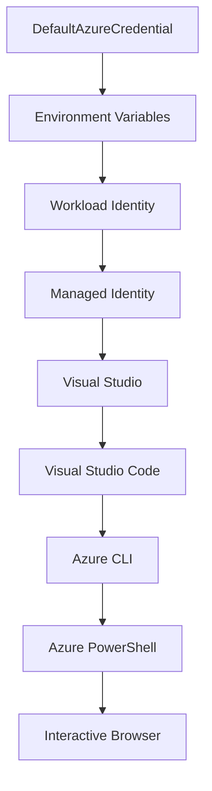

<!--
CO_OP_TRANSLATOR_METADATA:
{
  "original_hash": "fb0687bd0b166ecb0430dfeeed83487e",
  "translation_date": "2025-10-24T18:23:49+00:00",
  "source_file": "docs/getting-started/azd-basics.md",
  "language_code": "lt"
}
-->
# AZD Pagrindai - Azure Developer CLI supratimas

# AZD Pagrindai - Pagrindinės sąvokos ir pagrindai

**Skyriaus navigacija:**
- **📚 Kurso pradžia**: [AZD pradedantiesiems](../../README.md)
- **📖 Dabartinis skyrius**: 1 skyrius - Pagrindai ir greitas startas
- **⬅️ Ankstesnis**: [Kurso apžvalga](../../README.md#-chapter-1-foundation--quick-start)
- **➡️ Kitas**: [Diegimas ir nustatymai](installation.md)
- **🚀 Kitas skyrius**: [2 skyrius: AI-pirmasis vystymas](../ai-foundry/azure-ai-foundry-integration.md)

## Įvadas

Ši pamoka supažindins jus su Azure Developer CLI (azd), galingu komandų eilutės įrankiu, kuris pagreitina jūsų kelią nuo vietinio vystymo iki Azure diegimo. Sužinosite pagrindines sąvokas, pagrindines funkcijas ir kaip azd supaprastina debesų aplikacijų diegimą.

## Mokymosi tikslai

Pamokos pabaigoje jūs:
- Suprasite, kas yra Azure Developer CLI ir jo pagrindinę paskirtį
- Išmoksite pagrindines sąvokas apie šablonus, aplinkas ir paslaugas
- Susipažinsite su pagrindinėmis funkcijomis, įskaitant šablonais pagrįstą vystymą ir infrastruktūrą kaip kodą
- Suprasite azd projekto struktūrą ir darbo eigą
- Būsite pasiruošę įdiegti ir konfigūruoti azd savo vystymo aplinkoje

## Mokymosi rezultatai

Baigę pamoką, galėsite:
- Paaiškinti azd vaidmenį šiuolaikiniuose debesų vystymo procesuose
- Identifikuoti azd projekto struktūros komponentus
- Apibūdinti, kaip šablonai, aplinkos ir paslaugos veikia kartu
- Suprasti infrastruktūros kaip kodo privalumus naudojant azd
- Atpažinti skirtingas azd komandas ir jų paskirtį

## Kas yra Azure Developer CLI (azd)?

Azure Developer CLI (azd) yra komandų eilutės įrankis, sukurtas pagreitinti jūsų kelią nuo vietinio vystymo iki Azure diegimo. Jis supaprastina debesų aplikacijų kūrimo, diegimo ir valdymo procesą Azure platformoje.

## Pagrindinės sąvokos

### Šablonai
Šablonai yra azd pagrindas. Jie apima:
- **Programos kodą** - Jūsų šaltinio kodą ir priklausomybes
- **Infrastruktūros apibrėžimus** - Azure resursus, apibrėžtus Bicep arba Terraform
- **Konfigūracijos failus** - Nustatymus ir aplinkos kintamuosius
- **Diegimo scenarijus** - Automatizuotus diegimo procesus

### Aplinkos
Aplinkos atspindi skirtingus diegimo tikslus:
- **Vystymo** - Testavimui ir vystymui
- **Staging** - Prieš gamybos aplinka
- **Gamybos** - Veikianti gamybos aplinka

Kiekviena aplinka turi savo:
- Azure resursų grupę
- Konfigūracijos nustatymus
- Diegimo būseną

### Paslaugos
Paslaugos yra jūsų aplikacijos statybiniai blokai:
- **Frontend** - Internetinės aplikacijos, SPAs
- **Backend** - API, mikroservisai
- **Duomenų bazė** - Duomenų saugojimo sprendimai
- **Saugykla** - Failų ir blob saugykla

## Pagrindinės funkcijos

### 1. Šablonais pagrįstas vystymas
```bash
# Browse available templates
azd template list

# Initialize from a template
azd init --template <template-name>
```

### 2. Infrastruktūra kaip kodas
- **Bicep** - Azure specifinė kalba
- **Terraform** - Įrankis daugiadebesinei infrastruktūrai
- **ARM šablonai** - Azure Resource Manager šablonai

### 3. Integruotos darbo eigos
```bash
# Complete deployment workflow
azd up            # Provision + Deploy this is hands off for first time setup

# 🧪 NEW: Preview infrastructure changes before deployment (SAFE)
azd provision --preview    # Simulate infrastructure deployment without making changes

azd provision     # Create Azure resources if you update the infrastructure use this
azd deploy        # Deploy application code or redeploy application code once update
azd down          # Clean up resources
```

#### 🛡️ Saugus infrastruktūros planavimas su Preview
Komanda `azd provision --preview` yra revoliucinė saugiems diegimams:
- **Sauso paleidimo analizė** - Parodo, kas bus sukurta, pakeista ar ištrinta
- **Nulinė rizika** - Nėra jokių realių pakeitimų jūsų Azure aplinkoje
- **Komandos bendradarbiavimas** - Dalinkitės peržiūros rezultatais prieš diegimą
- **Kainų įvertinimas** - Supraskite resursų kainas prieš įsipareigojimą

```bash
# Example preview workflow
azd provision --preview           # See what will change
# Review the output, discuss with team
azd provision                     # Apply changes with confidence
```

### 4. Aplinkos valdymas
```bash
# Create and manage environments
azd env new <environment-name>
azd env select <environment-name>
azd env list
```

## 📁 Projekto struktūra

Tipinė azd projekto struktūra:
```
my-app/
├── .azd/                    # azd configuration
│   └── config.json
├── .azure/                  # Azure deployment artifacts
├── .devcontainer/          # Development container config
├── .github/workflows/      # GitHub Actions
├── .vscode/               # VS Code settings
├── infra/                 # Infrastructure code
│   ├── main.bicep        # Main infrastructure template
│   ├── main.parameters.json
│   └── modules/          # Reusable modules
├── src/                  # Application source code
│   ├── api/             # Backend services
│   └── web/             # Frontend application
├── azure.yaml           # azd project configuration
└── README.md
```

## 🔧 Konfigūracijos failai

### azure.yaml
Pagrindinis projekto konfigūracijos failas:
```yaml
name: my-awesome-app
metadata:
  template: my-template@1.0.0

services:
  web:
    project: ./src/web
    language: js
    host: appservice
  api:
    project: ./src/api
    language: js
    host: appservice

hooks:
  preprovision:
    shell: pwsh
    run: echo "Preparing to provision..."
```

### .azure/config.json
Aplinkai specifinė konfigūracija:
```json
{
  "version": 1,
  "defaultEnvironment": "dev",
  "environments": {
    "dev": {
      "subscriptionId": "your-subscription-id",
      "location": "eastus"
    }
  }
}
```

## 🎪 Dažnos darbo eigos

### Naujo projekto pradžia
```bash
# Method 1: Use existing template
azd init --template todo-nodejs-mongo

# Method 2: Start from scratch
azd init

# Method 3: Use current directory
azd init .
```

### Vystymo ciklas
```bash
# Set up development environment
azd auth login
azd env new dev
azd env select dev

# Deploy everything
azd up

# Make changes and redeploy
azd deploy

# Clean up when done
azd down --force --purge # command in the Azure Developer CLI is a **hard reset** for your environment—especially useful when you're troubleshooting failed deployments, cleaning up orphaned resources, or prepping for a fresh redeploy.
```

## Supratimas apie `azd down --force --purge`
Komanda `azd down --force --purge` yra galingas būdas visiškai pašalinti jūsų azd aplinką ir visus susijusius resursus. Štai ką daro kiekvienas parametras:
```
--force
```
- Praleidžia patvirtinimo užklausas.
- Naudinga automatizavimui ar scenarijams, kur rankinis įvestis nėra įmanoma.
- Užtikrina, kad pašalinimas vyktų be pertraukų, net jei CLI aptinka neatitikimus.

```
--purge
```
Ištrina **visą susijusią metainformaciją**, įskaitant:
Aplinkos būseną
Vietinį `.azure` aplanką
Kešuotą diegimo informaciją
Neleidžia azd "prisiminti" ankstesnių diegimų, kurie gali sukelti problemų, pvz., nesutampančias resursų grupes ar pasenusius registrų nuorodas.

### Kodėl naudoti abu?
Kai susiduriate su problemomis dėl `azd up` dėl likusios būsenos ar dalinių diegimų, šis derinys užtikrina **švarią pradžią**.

Tai ypač naudinga po rankinio resursų pašalinimo Azure portale arba keičiant šablonus, aplinkas ar resursų grupių pavadinimų konvencijas.

### Kelių aplinkų valdymas
```bash
# Create staging environment
azd env new staging
azd env select staging
azd up

# Switch back to dev
azd env select dev

# Compare environments
azd env list
```

## 🔐 Autentifikacija ir kredencialai

Autentifikacijos supratimas yra būtinas sėkmingiems azd diegimams. Azure naudoja kelis autentifikacijos metodus, o azd pasitelkia tą pačią kredencialų grandinę, kurią naudoja kiti Azure įrankiai.

### Azure CLI autentifikacija (`az login`)

Prieš naudojant azd, reikia autentifikuotis su Azure. Dažniausias metodas yra naudojant Azure CLI:

```bash
# Interactive login (opens browser)
az login

# Login with specific tenant
az login --tenant <tenant-id>

# Login with service principal
az login --service-principal -u <app-id> -p <password> --tenant <tenant-id>

# Check current login status
az account show

# List available subscriptions
az account list --output table

# Set default subscription
az account set --subscription <subscription-id>
```

### Autentifikacijos eiga
1. **Interaktyvus prisijungimas**: Atidaro jūsų numatytą naršyklę autentifikacijai
2. **Įrenginio kodo eiga**: Aplinkoms be naršyklės prieigos
3. **Paslaugos principas**: Automatizavimui ir CI/CD scenarijams
4. **Valdoma tapatybė**: Azure talpinamoms aplikacijoms

### DefaultAzureCredential grandinė

`DefaultAzureCredential` yra kredencialų tipas, kuris suteikia supaprastintą autentifikacijos patirtį automatiškai bandant kelis kredencialų šaltinius tam tikra tvarka:

#### Kredencialų grandinės tvarka


#### 1. Aplinkos kintamieji
```bash
# Set environment variables for service principal
export AZURE_CLIENT_ID="<app-id>"
export AZURE_CLIENT_SECRET="<password>"
export AZURE_TENANT_ID="<tenant-id>"
```

#### 2. Darbo krūvio tapatybė (Kubernetes/GitHub Actions)
Naudojama automatiškai:
- Azure Kubernetes Service (AKS) su darbo krūvio tapatybe
- GitHub Actions su OIDC federacija
- Kiti federuotos tapatybės scenarijai

#### 3. Valdoma tapatybė
Azure resursams, pvz.:
- Virtualios mašinos
- App Service
- Azure Functions
- Konteinerių instancijos

```bash
# Check if running on Azure resource with managed identity
az account show --query "user.type" --output tsv
# Returns: "servicePrincipal" if using managed identity
```

#### 4. Vystymo įrankių integracija
- **Visual Studio**: Automatiškai naudoja prisijungusią paskyrą
- **VS Code**: Naudoja Azure Account plėtinio kredencialus
- **Azure CLI**: Naudoja `az login` kredencialus (dažniausia vietinio vystymo atveju)

### AZD autentifikacijos nustatymas

```bash
# Method 1: Use Azure CLI (Recommended for development)
az login
azd auth login  # Uses existing Azure CLI credentials

# Method 2: Direct azd authentication
azd auth login --use-device-code  # For headless environments

# Method 3: Check authentication status
azd auth login --check-status

# Method 4: Logout and re-authenticate
azd auth logout
azd auth login
```

### Autentifikacijos geriausios praktikos

#### Vietiniam vystymui
```bash
# 1. Login with Azure CLI
az login

# 2. Verify correct subscription
az account show
az account set --subscription "Your Subscription Name"

# 3. Use azd with existing credentials
azd auth login
```

#### CI/CD vamzdynams
```yaml
# GitHub Actions example
- name: Azure Login
  uses: azure/login@v1
  with:
    creds: ${{ secrets.AZURE_CREDENTIALS }}

- name: Deploy with azd
  run: |
    azd auth login --client-id ${{ secrets.AZURE_CLIENT_ID }} \
                    --client-secret ${{ secrets.AZURE_CLIENT_SECRET }} \
                    --tenant-id ${{ secrets.AZURE_TENANT_ID }}
    azd up --no-prompt
```

#### Gamybos aplinkoms
- Naudokite **valdoma tapatybė**, kai veikiate Azure resursuose
- Naudokite **paslaugos principą** automatizavimo scenarijams
- Venkite saugoti kredencialus kode ar konfigūracijos failuose
- Naudokite **Azure Key Vault** jautriai konfigūracijai

### Dažnos autentifikacijos problemos ir sprendimai

#### Problema: "Prenumerata nerasta"
```bash
# Solution: Set default subscription
az account list --output table
az account set --subscription "<subscription-id>"
azd env set AZURE_SUBSCRIPTION_ID "<subscription-id>"
```

#### Problema: "Nepakankamos teisės"
```bash
# Solution: Check and assign required roles
az role assignment list --assignee $(az account show --query user.name --output tsv)

# Common required roles:
# - Contributor (for resource management)
# - User Access Administrator (for role assignments)
```

#### Problema: "Tokenas pasibaigęs"
```bash
# Solution: Re-authenticate
az logout
az login
azd auth logout
azd auth login
```

### Autentifikacija skirtinguose scenarijuose

#### Vietinis vystymas
```bash
# Personal development account
az login
azd auth login
```

#### Komandinis vystymas
```bash
# Use specific tenant for organization
az login --tenant contoso.onmicrosoft.com
azd auth login
```

#### Daugiašalės aplinkos
```bash
# Switch between tenants
az login --tenant tenant1.onmicrosoft.com
# Deploy to tenant 1
azd up

az login --tenant tenant2.onmicrosoft.com  
# Deploy to tenant 2
azd up
```

### Saugumo aspektai

1. **Kredencialų saugojimas**: Niekada nesaugokite kredencialų šaltinio kode
2. **Apribojimų taikymas**: Naudokite mažiausio privilegijų principą paslaugos principams
3. **Tokenų rotacija**: Reguliariai keiskite paslaugos principų slaptažodžius
4. **Audito pėdsakas**: Stebėkite autentifikacijos ir diegimo veiklas
5. **Tinklo saugumas**: Naudokite privačius galinius taškus, kai įmanoma

### Autentifikacijos trikčių šalinimas

```bash
# Debug authentication issues
azd auth login --check-status
az account show
az account get-access-token

# Common diagnostic commands
whoami                          # Current user context
az ad signed-in-user show      # Azure AD user details
az group list                  # Test resource access
```

## Supratimas apie `azd down --force --purge`

### Atradimas
```bash
azd template list              # Browse templates
azd template show <template>   # Template details
azd init --help               # Initialization options
```

### Projekto valdymas
```bash
azd show                     # Project overview
azd env show                 # Current environment
azd config list             # Configuration settings
```

### Stebėjimas
```bash
azd monitor                  # Open Azure portal
azd pipeline config          # Set up CI/CD
azd logs                     # View application logs
```

## Geriausios praktikos

### 1. Naudokite prasmingus pavadinimus
```bash
# Good
azd env new production-east
azd init --template web-app-secure

# Avoid
azd env new env1
azd init --template template1
```

### 2. Pasinaudokite šablonais
- Pradėkite nuo esamų šablonų
- Pritaikykite savo poreikiams
- Kurkite pakartotinai naudojamus šablonus savo organizacijai

### 3. Aplinkos izoliacija
- Naudokite atskiras aplinkas vystymui/staging/gamybai
- Niekada nediegkite tiesiai į gamybą iš vietinio kompiuterio
- Naudokite CI/CD vamzdynus gamybos diegimams

### 4. Konfigūracijos valdymas
- Naudokite aplinkos kintamuosius jautriems duomenims
- Laikykite konfigūraciją versijų kontrolėje
- Dokumentuokite aplinkai specifinius nustatymus

## Mokymosi progresija

### Pradedantysis (1-2 savaitės)
1. Įdiekite azd ir autentifikuokitės
2. Diegkite paprastą šabloną
3. Supraskite projekto struktūrą
4. Išmokite pagrindines komandas (up, down, deploy)

### Vidutinis (3-4 savaitės)
1. Pritaikykite šablonus
2. Valdykite kelias aplinkas
3. Supraskite infrastruktūros kodą
4. Nustatykite CI/CD vamzdynus

### Pažengęs (5+ savaitės)
1. Kurkite savo šablonus
2. Pažangūs infrastruktūros modeliai
3. Diegimai keliuose regionuose
4. Įmonės lygio konfigūracijos

## Kiti žingsniai

**📖 Tęskite 1 skyriaus mokymąsi:**
- [Diegimas ir nustatymai](installation.md) - Įdiekite ir konfigūruokite azd
- [Jūsų pirmasis projektas](first-project.md) - Praktinis vadovas
- [Konfigūracijos vadovas](configuration.md) - Išplėstinės konfigūracijos parinktys

**🎯 Pasiruošę kitam skyriui?**
- [2 skyrius: AI-pirmasis vystymas](../ai-foundry/azure-ai-foundry-integration.md) - Pradėkite kurti AI aplikacijas

## Papildomi ištekliai

- [Azure Developer CLI apžvalga](https://learn.microsoft.com/en-us/azure/developer/azure-developer-cli/)
- [Šablonų galerija](https://azure.github.io/awesome-azd/)
- [Bendruomenės pavyzdžiai](https://github.com/Azure-Samples)

---

**Skyriaus navigacija:**
- **📚 Kurso pradžia**: [AZD pradedantiesiems](../../README.md)
- **📖 Dabartinis skyrius**: 1 skyrius - Pagrindai ir greitas startas  
- **⬅️ Ankstesnis**: [Kurso apžvalga](../../README.md#-chapter-1-foundation--quick-start)
- **➡️ Kitas**: [Diegimas ir nustatymai](installation.md)
- **🚀 Kitas skyrius**: [2 skyrius: AI-pirmasis vystymas](../ai-foundry/azure-ai-foundry-integration.md)

---

**Atsakomybės apribojimas**:  
Šis dokumentas buvo išverstas naudojant AI vertimo paslaugą [Co-op Translator](https://github.com/Azure/co-op-translator). Nors siekiame tikslumo, prašome atkreipti dėmesį, kad automatiniai vertimai gali turėti klaidų ar netikslumų. Originalus dokumentas jo gimtąja kalba turėtų būti laikomas autoritetingu šaltiniu. Dėl svarbios informacijos rekomenduojama profesionali žmogaus vertimo paslauga. Mes neprisiimame atsakomybės už nesusipratimus ar neteisingus aiškinimus, atsiradusius naudojant šį vertimą.