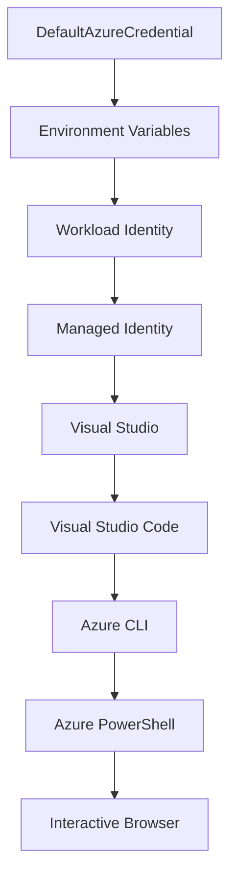

<!--
CO_OP_TRANSLATOR_METADATA:
{
  "original_hash": "fb0687bd0b166ecb0430dfeeed83487e",
  "translation_date": "2025-10-24T17:00:45+00:00",
  "source_file": "docs/getting-started/azd-basics.md",
  "language_code": "mr"
}
-->
# AZD मूलभूत गोष्टी - Azure Developer CLI समजून घेणे

# AZD मूलभूत गोष्टी - मुख्य संकल्पना आणि तत्त्वे

**अध्याय नेव्हिगेशन:**
- **📚 कोर्स होम**: [AZD सुरुवातीसाठी](../../README.md)
- **📖 चालू अध्याय**: अध्याय 1 - पाया आणि जलद प्रारंभ
- **⬅️ मागील**: [कोर्स विहंगावलोकन](../../README.md#-chapter-1-foundation--quick-start)
- **➡️ पुढील**: [स्थापना आणि सेटअप](installation.md)
- **🚀 पुढील अध्याय**: [अध्याय 2: AI-प्रथम विकास](../ai-foundry/azure-ai-foundry-integration.md)

## परिचय

या धड्यात तुम्हाला Azure Developer CLI (azd) ची ओळख करून दिली जाईल, जो एक शक्तिशाली कमांड-लाइन टूल आहे जो स्थानिक विकासापासून Azure वर तैनातीपर्यंतचा प्रवास वेगवान करतो. तुम्ही मूलभूत संकल्पना, मुख्य वैशिष्ट्ये शिकाल आणि azd कसे क्लाउड-नेटिव्ह अनुप्रयोग तैनाती सुलभ करते हे समजून घ्याल.

## शिकण्याची उद्दिष्टे

या धड्याच्या शेवटी, तुम्ही:
- Azure Developer CLI म्हणजे काय आणि त्याचा मुख्य उद्देश समजून घ्याल
- टेम्पलेट्स, वातावरण आणि सेवांच्या मुख्य संकल्पना शिकाल
- टेम्पलेट-चालित विकास आणि Infrastructure as Code यासह प्रमुख वैशिष्ट्ये एक्सप्लोर कराल
- azd प्रकल्प संरचना आणि कार्यप्रवाह समजून घ्याल
- तुमच्या विकासाच्या वातावरणासाठी azd स्थापित आणि कॉन्फिगर करण्यासाठी तयार असाल

## शिकण्याचे परिणाम

हा धडा पूर्ण केल्यानंतर, तुम्ही:
- आधुनिक क्लाउड विकास कार्यप्रवाहांमध्ये azd ची भूमिका स्पष्ट करू शकाल
- azd प्रकल्प संरचनेचे घटक ओळखू शकाल
- टेम्पलेट्स, वातावरण आणि सेवा एकत्र कसे कार्य करतात ते वर्णन करू शकाल
- azd सह Infrastructure as Code चे फायदे समजून घ्याल
- विविध azd कमांड्स आणि त्यांचे उद्देश ओळखू शकाल

## Azure Developer CLI (azd) म्हणजे काय?

Azure Developer CLI (azd) हे एक कमांड-लाइन टूल आहे जे स्थानिक विकासापासून Azure वर तैनातीपर्यंतचा प्रवास वेगवान करण्यासाठी डिझाइन केले आहे. हे Azure वर क्लाउड-नेटिव्ह अनुप्रयोग तयार करणे, तैनात करणे आणि व्यवस्थापित करणे सुलभ करते.

## मुख्य संकल्पना

### टेम्पलेट्स
टेम्पलेट्स हे azd चे आधार आहेत. त्यामध्ये समाविष्ट आहे:
- **अनुप्रयोग कोड** - तुमचा स्रोत कोड आणि अवलंबित्वे
- **इन्फ्रास्ट्रक्चर परिभाषा** - Bicep किंवा Terraform मध्ये परिभाषित Azure संसाधने
- **कॉन्फिगरेशन फाइल्स** - सेटिंग्ज आणि पर्यावरणीय व्हेरिएबल्स
- **तैनाती स्क्रिप्ट्स** - स्वयंचलित तैनाती कार्यप्रवाह

### वातावरण
वातावरणे वेगवेगळ्या तैनाती लक्ष्यांचे प्रतिनिधित्व करतात:
- **विकास** - चाचणी आणि विकासासाठी
- **स्टेजिंग** - प्री-प्रॉडक्शन वातावरण
- **प्रॉडक्शन** - लाइव्ह प्रॉडक्शन वातावरण

प्रत्येक वातावरण स्वतःचे राखते:
- Azure संसाधन गट
- कॉन्फिगरेशन सेटिंग्ज
- तैनाती स्थिती

### सेवा
सेवा तुमच्या अनुप्रयोगाचे मुख्य घटक आहेत:
- **फ्रंटएंड** - वेब अनुप्रयोग, SPAs
- **बॅकएंड** - APIs, मायक्रोसर्व्हिसेस
- **डेटाबेस** - डेटा स्टोरेज सोल्यूशन्स
- **स्टोरेज** - फाइल आणि ब्लॉब स्टोरेज

## मुख्य वैशिष्ट्ये

### 1. टेम्पलेट-चालित विकास
```bash
# Browse available templates
azd template list

# Initialize from a template
azd init --template <template-name>
```

### 2. Infrastructure as Code
- **Bicep** - Azure चे डोमेन-विशिष्ट भाषा
- **Terraform** - मल्टी-क्लाउड इन्फ्रास्ट्रक्चर टूल
- **ARM टेम्पलेट्स** - Azure Resource Manager टेम्पलेट्स

### 3. एकत्रित कार्यप्रवाह
```bash
# Complete deployment workflow
azd up            # Provision + Deploy this is hands off for first time setup

# 🧪 NEW: Preview infrastructure changes before deployment (SAFE)
azd provision --preview    # Simulate infrastructure deployment without making changes

azd provision     # Create Azure resources if you update the infrastructure use this
azd deploy        # Deploy application code or redeploy application code once update
azd down          # Clean up resources
```

#### 🛡️ सुरक्षित इन्फ्रास्ट्रक्चर नियोजन प्रीव्ह्यूसह
`azd provision --preview` कमांड सुरक्षित तैनातीसाठी गेम-चेंजर आहे:
- **ड्राय-रन विश्लेषण** - काय तयार केले जाईल, बदलले जाईल किंवा हटवले जाईल ते दर्शवते
- **शून्य जोखीम** - तुमच्या Azure वातावरणात कोणतेही वास्तविक बदल केले जात नाहीत
- **टीम सहयोग** - तैनातीपूर्वी प्रीव्ह्यू परिणाम शेअर करा
- **खर्चाचा अंदाज** - वचनबद्धतेपूर्वी संसाधन खर्च समजून घ्या

```bash
# Example preview workflow
azd provision --preview           # See what will change
# Review the output, discuss with team
azd provision                     # Apply changes with confidence
```

### 4. वातावरण व्यवस्थापन
```bash
# Create and manage environments
azd env new <environment-name>
azd env select <environment-name>
azd env list
```

## 📁 प्रकल्प संरचना

एक सामान्य azd प्रकल्प संरचना:
```
my-app/
├── .azd/                    # azd configuration
│   └── config.json
├── .azure/                  # Azure deployment artifacts
├── .devcontainer/          # Development container config
├── .github/workflows/      # GitHub Actions
├── .vscode/               # VS Code settings
├── infra/                 # Infrastructure code
│   ├── main.bicep        # Main infrastructure template
│   ├── main.parameters.json
│   └── modules/          # Reusable modules
├── src/                  # Application source code
│   ├── api/             # Backend services
│   └── web/             # Frontend application
├── azure.yaml           # azd project configuration
└── README.md
```

## 🔧 कॉन्फिगरेशन फाइल्स

### azure.yaml
मुख्य प्रकल्प कॉन्फिगरेशन फाइल:
```yaml
name: my-awesome-app
metadata:
  template: my-template@1.0.0

services:
  web:
    project: ./src/web
    language: js
    host: appservice
  api:
    project: ./src/api
    language: js
    host: appservice

hooks:
  preprovision:
    shell: pwsh
    run: echo "Preparing to provision..."
```

### .azure/config.json
वातावरण-विशिष्ट कॉन्फिगरेशन:
```json
{
  "version": 1,
  "defaultEnvironment": "dev",
  "environments": {
    "dev": {
      "subscriptionId": "your-subscription-id",
      "location": "eastus"
    }
  }
}
```

## 🎪 सामान्य कार्यप्रवाह

### नवीन प्रकल्प सुरू करणे
```bash
# Method 1: Use existing template
azd init --template todo-nodejs-mongo

# Method 2: Start from scratch
azd init

# Method 3: Use current directory
azd init .
```

### विकास चक्र
```bash
# Set up development environment
azd auth login
azd env new dev
azd env select dev

# Deploy everything
azd up

# Make changes and redeploy
azd deploy

# Clean up when done
azd down --force --purge # command in the Azure Developer CLI is a **hard reset** for your environment—especially useful when you're troubleshooting failed deployments, cleaning up orphaned resources, or prepping for a fresh redeploy.
```

## `azd down --force --purge` समजून घेणे
`azd down --force --purge` कमांड तुमचे azd वातावरण आणि संबंधित सर्व संसाधने पूर्णपणे हटवण्याचा एक शक्तिशाली मार्ग आहे. प्रत्येक फ्लॅग काय करतो याचे विश्लेषण येथे आहे:
```
--force
```
- पुष्टीकरण प्रॉम्प्ट्स वगळतो.
- स्वयंचलितता किंवा स्क्रिप्टिंगसाठी उपयुक्त जिथे मॅन्युअल इनपुट शक्य नाही.
- CLI विसंगती आढळल्यासही, टियरडाउन अडथळ्याशिवाय चालू राहतो.

```
--purge
```
संबंधित **सर्व मेटाडेटा हटवते**, ज्यामध्ये समाविष्ट आहे:
वातावरण स्थिती
स्थानिक `.azure` फोल्डर
कॅश्ड तैनाती माहिती
azd ला "आधीच्या तैनाती" लक्षात ठेवण्यापासून प्रतिबंधित करते, ज्यामुळे संसाधन गट जुळत नाहीत किंवा जुने रजिस्ट्रेशन संदर्भ यासारख्या समस्या निर्माण होऊ शकतात.

### दोन्ही का वापरावे?
जर तुम्ही `azd up` सह अडचणीत असाल, उर्वरित स्थिती किंवा अपूर्ण तैनातींमुळे, ही संयोजन **स्वच्छ सुरुवात** सुनिश्चित करते.

हे विशेषतः उपयुक्त आहे जेव्हा Azure पोर्टलमध्ये मॅन्युअल संसाधन हटवले जातात किंवा टेम्पलेट्स, वातावरण किंवा संसाधन गट नामकरण पद्धती बदलताना.

### एकाधिक वातावरण व्यवस्थापन
```bash
# Create staging environment
azd env new staging
azd env select staging
azd up

# Switch back to dev
azd env select dev

# Compare environments
azd env list
```

## 🔐 प्रमाणीकरण आणि क्रेडेन्शियल्स

यशस्वी azd तैनातीसाठी प्रमाणीकरण समजून घेणे महत्त्वाचे आहे. Azure अनेक प्रमाणीकरण पद्धती वापरते आणि azd इतर Azure टूल्सद्वारे वापरल्या जाणाऱ्या समान क्रेडेन्शियल चेनचा लाभ घेतो.

### Azure CLI प्रमाणीकरण (`az login`)

azd वापरण्यापूर्वी तुम्हाला Azure सह प्रमाणीकरण करणे आवश्यक आहे. सर्वात सामान्य पद्धत Azure CLI वापरणे आहे:

```bash
# Interactive login (opens browser)
az login

# Login with specific tenant
az login --tenant <tenant-id>

# Login with service principal
az login --service-principal -u <app-id> -p <password> --tenant <tenant-id>

# Check current login status
az account show

# List available subscriptions
az account list --output table

# Set default subscription
az account set --subscription <subscription-id>
```

### प्रमाणीकरण प्रवाह
1. **इंटरॅक्टिव्ह लॉगिन**: प्रमाणीकरणासाठी तुमचा डिफॉल्ट ब्राउझर उघडतो
2. **डिव्हाइस कोड प्रवाह**: ब्राउझर प्रवेश नसलेल्या वातावरणासाठी
3. **सेवा प्रमुख**: ऑटोमेशन आणि CI/CD परिस्थितीसाठी
4. **मॅनेज्ड आयडेंटिटी**: Azure-होस्ट केलेल्या अनुप्रयोगांसाठी

### DefaultAzureCredential चेन

`DefaultAzureCredential` हा एक क्रेडेन्शियल प्रकार आहे जो विशिष्ट क्रमाने अनेक क्रेडेन्शियल स्रोत स्वयंचलितपणे वापरून एक सरलीकृत प्रमाणीकरण अनुभव प्रदान करतो:

#### क्रेडेन्शियल चेन क्रम


#### 1. पर्यावरणीय व्हेरिएबल्स
```bash
# Set environment variables for service principal
export AZURE_CLIENT_ID="<app-id>"
export AZURE_CLIENT_SECRET="<password>"
export AZURE_TENANT_ID="<tenant-id>"
```

#### 2. वर्कलोड आयडेंटिटी (Kubernetes/GitHub क्रिया)
स्वयंचलितपणे वापरले जाते:
- Azure Kubernetes सेवा (AKS) वर्कलोड आयडेंटिटीसह
- GitHub क्रिया OIDC फेडरेशनसह
- इतर फेडरेटेड आयडेंटिटी परिस्थिती

#### 3. मॅनेज्ड आयडेंटिटी
Azure संसाधनांसाठी जसे की:
- व्हर्च्युअल मशीन
- अॅप सेवा
- Azure फंक्शन्स
- कंटेनर इन्स्टन्सेस

```bash
# Check if running on Azure resource with managed identity
az account show --query "user.type" --output tsv
# Returns: "servicePrincipal" if using managed identity
```

#### 4. विकसक टूल्स एकत्रीकरण
- **Visual Studio**: स्वयंचलितपणे साइन-इन केलेले खाते वापरते
- **VS Code**: Azure Account विस्तार क्रेडेन्शियल्स वापरते
- **Azure CLI**: `az login` क्रेडेन्शियल्स वापरते (स्थानिक विकासासाठी सर्वात सामान्य)

### AZD प्रमाणीकरण सेटअप

```bash
# Method 1: Use Azure CLI (Recommended for development)
az login
azd auth login  # Uses existing Azure CLI credentials

# Method 2: Direct azd authentication
azd auth login --use-device-code  # For headless environments

# Method 3: Check authentication status
azd auth login --check-status

# Method 4: Logout and re-authenticate
azd auth logout
azd auth login
```

### प्रमाणीकरण सर्वोत्तम पद्धती

#### स्थानिक विकासासाठी
```bash
# 1. Login with Azure CLI
az login

# 2. Verify correct subscription
az account show
az account set --subscription "Your Subscription Name"

# 3. Use azd with existing credentials
azd auth login
```

#### CI/CD पाइपलाइन्ससाठी
```yaml
# GitHub Actions example
- name: Azure Login
  uses: azure/login@v1
  with:
    creds: ${{ secrets.AZURE_CREDENTIALS }}

- name: Deploy with azd
  run: |
    azd auth login --client-id ${{ secrets.AZURE_CLIENT_ID }} \
                    --client-secret ${{ secrets.AZURE_CLIENT_SECRET }} \
                    --tenant-id ${{ secrets.AZURE_TENANT_ID }}
    azd up --no-prompt
```

#### उत्पादन वातावरणासाठी
- Azure संसाधनांवर चालताना **मॅनेज्ड आयडेंटिटी** वापरा
- ऑटोमेशन परिस्थितीसाठी **सेवा प्रमुख** वापरा
- कोड किंवा कॉन्फिगरेशन फाइल्समध्ये क्रेडेन्शियल्स संग्रहित करणे टाळा
- संवेदनशील कॉन्फिगरेशनसाठी **Azure Key Vault** वापरा

### सामान्य प्रमाणीकरण समस्या आणि उपाय

#### समस्या: "कोणतीही सदस्यता सापडली नाही"
```bash
# Solution: Set default subscription
az account list --output table
az account set --subscription "<subscription-id>"
azd env set AZURE_SUBSCRIPTION_ID "<subscription-id>"
```

#### समस्या: "अपुरे परवानग्या"
```bash
# Solution: Check and assign required roles
az role assignment list --assignee $(az account show --query user.name --output tsv)

# Common required roles:
# - Contributor (for resource management)
# - User Access Administrator (for role assignments)
```

#### समस्या: "टोकन कालबाह्य झाले"
```bash
# Solution: Re-authenticate
az logout
az login
azd auth logout
azd auth login
```

### विविध परिस्थितीत प्रमाणीकरण

#### स्थानिक विकास
```bash
# Personal development account
az login
azd auth login
```

#### टीम विकास
```bash
# Use specific tenant for organization
az login --tenant contoso.onmicrosoft.com
azd auth login
```

#### मल्टी-टेनंट परिस्थिती
```bash
# Switch between tenants
az login --tenant tenant1.onmicrosoft.com
# Deploy to tenant 1
azd up

az login --tenant tenant2.onmicrosoft.com  
# Deploy to tenant 2
azd up
```

### सुरक्षा विचार

1. **क्रेडेन्शियल संग्रहण**: क्रेडेन्शियल्स कधीही स्रोत कोडमध्ये संग्रहित करू नका
2. **स्कोप मर्यादा**: सेवा प्रमुखांसाठी कमीतकमी-अधिकार तत्त्व वापरा
3. **टोकन रोटेशन**: सेवा प्रमुख रहस्ये नियमितपणे फिरवा
4. **ऑडिट ट्रेल**: प्रमाणीकरण आणि तैनाती क्रियाकलापांचे निरीक्षण करा
5. **नेटवर्क सुरक्षा**: शक्य असल्यास खाजगी एंडपॉइंट्स वापरा

### प्रमाणीकरण समस्या सोडवणे

```bash
# Debug authentication issues
azd auth login --check-status
az account show
az account get-access-token

# Common diagnostic commands
whoami                          # Current user context
az ad signed-in-user show      # Azure AD user details
az group list                  # Test resource access
```

## `azd down --force --purge` समजून घेणे

### शोध
```bash
azd template list              # Browse templates
azd template show <template>   # Template details
azd init --help               # Initialization options
```

### प्रकल्प व्यवस्थापन
```bash
azd show                     # Project overview
azd env show                 # Current environment
azd config list             # Configuration settings
```

### निरीक्षण
```bash
azd monitor                  # Open Azure portal
azd pipeline config          # Set up CI/CD
azd logs                     # View application logs
```

## सर्वोत्तम पद्धती

### 1. अर्थपूर्ण नावे वापरा
```bash
# Good
azd env new production-east
azd init --template web-app-secure

# Avoid
azd env new env1
azd init --template template1
```

### 2. टेम्पलेट्सचा लाभ घ्या
- विद्यमान टेम्पलेट्ससह प्रारंभ करा
- तुमच्या गरजेनुसार सानुकूलित करा
- तुमच्या संस्थेसाठी पुनर्वापर करण्यायोग्य टेम्पलेट्स तयार करा

### 3. वातावरण वेगळे करणे
- विकास/स्टेजिंग/उत्पादनासाठी स्वतंत्र वातावरण वापरा
- स्थानिक मशीनवरून थेट उत्पादनात तैनात करू नका
- उत्पादन तैनातीसाठी CI/CD पाइपलाइन्स वापरा

### 4. कॉन्फिगरेशन व्यवस्थापन
- संवेदनशील डेटासाठी पर्यावरणीय व्हेरिएबल्स वापरा
- कॉन्फिगरेशन आवृत्ती नियंत्रणात ठेवा
- वातावरण-विशिष्ट सेटिंग्ज दस्तऐवजीकरण करा

## शिकण्याची प्रगती

### सुरुवातीचा (आठवडा 1-2)
1. azd स्थापित करा आणि प्रमाणीकरण करा
2. एक साधा टेम्पलेट तैनात करा
3. प्रकल्प संरचना समजून घ्या
4. मूलभूत कमांड्स (up, down, deploy) शिका

### मध्यम (आठवडा 3-4)
1. टेम्पलेट्स सानुकूलित करा
2. एकाधिक वातावरण व्यवस्थापित करा
3. इन्फ्रास्ट्रक्चर कोड समजून घ्या
4. CI/CD पाइपलाइन्स सेट करा

### प्रगत (आठवडा 5+)
1. सानुकूल टेम्पलेट्स तयार करा
2. प्रगत इन्फ्रास्ट्रक्चर नमुने
3. मल्टी-रीजन तैनाती
4. एंटरप्राइझ-ग्रेड कॉन्फिगरेशन्स

## पुढील पायऱ्या

**📖 अध्याय 1 शिकणे सुरू ठेवा:**
- [स्थापना आणि सेटअप](installation.md) - azd स्थापित आणि कॉन्फिगर करा
- [तुमचा पहिला प्रकल्प](first-project.md) - हँड्स-ऑन ट्यूटोरियल पूर्ण करा
- [कॉन्फिगरेशन मार्गदर्शक](configuration.md) - प्रगत कॉन्फिगरेशन पर्याय

**🎯 पुढील अध्यायासाठी तयार?**
- [अध्याय 2: AI-प्रथम विकास](../ai-foundry/azure-ai-foundry-integration.md) - AI अनुप्रयोग तयार करणे सुरू करा

## अतिरिक्त संसाधने

- [Azure Developer CLI विहंगावलोकन](https://learn.microsoft.com/en-us/azure/developer/azure-developer-cli/)
- [टेम्पलेट गॅलरी](https://azure.github.io/awesome-azd/)
- [कम्युनिटी नमुने](https://github.com/Azure-Samples)

---

**अध्याय नेव्हिगेशन:**
- **📚 कोर्स होम**: [AZD सुरुवातीसाठी](../../README.md)
- **📖 चालू अध्याय**: अध्याय 1 - पाया आणि जलद प्रारंभ  
- **⬅️ मागील**: [कोर्स विहंगावलोकन](../../README.md#-chapter-1-foundation--quick-start)
- **➡️ पुढील**: [स्थापना आणि सेटअप](installation.md)
- **🚀 पुढील अध्याय**: [अध्याय 2: AI-प्रथम विकास](../ai-foundry/azure-ai-foundry-integration.md)

---

**अस्वीकरण**:  
हा दस्तऐवज AI भाषांतर सेवा [Co-op Translator](https://github.com/Azure/co-op-translator) वापरून भाषांतरित करण्यात आला आहे. आम्ही अचूकतेसाठी प्रयत्नशील असलो तरी, कृपया लक्षात ठेवा की स्वयंचलित भाषांतरे त्रुटी किंवा अचूकतेच्या अभावासह असू शकतात. मूळ भाषेतील दस्तऐवज हा अधिकृत स्रोत मानला जावा. महत्त्वाच्या माहितीसाठी व्यावसायिक मानवी भाषांतराची शिफारस केली जाते. या भाषांतराचा वापर करून उद्भवलेल्या कोणत्याही गैरसमज किंवा चुकीच्या अर्थासाठी आम्ही जबाबदार राहणार नाही.