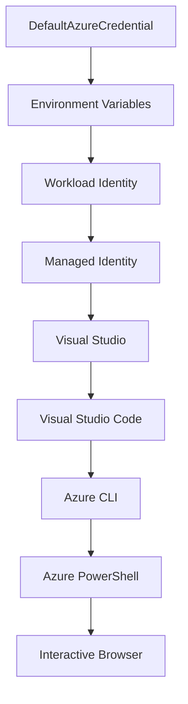

<!--
CO_OP_TRANSLATOR_METADATA:
{
  "original_hash": "fb0687bd0b166ecb0430dfeeed83487e",
  "translation_date": "2025-10-24T18:17:25+00:00",
  "source_file": "docs/getting-started/azd-basics.md",
  "language_code": "my"
}
-->
# AZD အခြေခံ - Azure Developer CLI ကိုနားလည်ခြင်း

# AZD အခြေခံ - အဓိကအယူအဆများနှင့် အခြေခံအချက်များ

**အခန်းအညွှန်း:**
- **📚 သင်ခန်းစာအိမ်**: [AZD အခြေခံသင်ခန်းစာ](../../README.md)
- **📖 လက်ရှိအခန်း**: အခန်း ၁ - အခြေခံနှင့် အမြန်စတင်ခြင်း
- **⬅️ အရင်**: [သင်ခန်းစာအကျဉ်း](../../README.md#-chapter-1-foundation--quick-start)
- **➡️ နောက်တစ်ခု**: [တပ်ဆင်ခြင်းနှင့် စတင်ခြင်း](installation.md)
- **🚀 နောက်အခန်း**: [အခန်း ၂: AI-First ဖွံ့ဖြိုးတိုးတက်မှု](../ai-foundry/azure-ai-foundry-integration.md)

## မိတ်ဆက်

ဒီသင်ခန်းစာမှာ Azure Developer CLI (azd) ကိုမိတ်ဆက်ပေးမှာဖြစ်ပြီး၊ ဒါဟာ ဒေသတွင်းဖွံ့ဖြိုးတိုးတက်မှုမှ Azure သို့ တင်သွင်းခြင်းအထိ အလျင်အမြန်လုပ်ဆောင်နိုင်စေတဲ့ command-line tool တစ်ခုဖြစ်ပါတယ်။ azd က cloud-native application တင်သွင်းခြင်းကို ဘယ်လိုရိုးရှင်းစေတယ်ဆိုတာကို သင်လေ့လာနိုင်ပါမယ်။

## သင်ယူရမည့်ရည်မှန်းချက်များ

ဒီသင်ခန်းစာအဆုံးသတ်ချိန်မှာ သင်:
- Azure Developer CLI ဆိုတာဘာလဲ၊ အဓိကရည်ရွယ်ချက်ကဘာလဲဆိုတာနားလည်ပါမယ်
- Template, Environment, Service အဓိကအယူအဆများကိုလေ့လာပါမယ်
- Template-Driven Development နှင့် Infrastructure as Code အပါအဝင် အဓိက features များကိုလေ့လာပါမယ်
- azd project structure နှင့် workflow ကိုနားလည်ပါမယ်
- သင့်ဖွံ့ဖြိုးတိုးတက်မှုပတ်ဝန်းကျင်အတွက် azd ကိုတပ်ဆင်ပြီး အဆင်သင့်ဖြစ်စေပါမယ်

## သင်ယူမှုရလဒ်များ

ဒီသင်ခန်းစာကိုပြီးမြောက်ပြီးနောက်မှာ သင်:
- အခေတ်မီ cloud ဖွံ့ဖြိုးတိုးတက်မှု workflow တွေမှာ azd ရဲ့บทบาทကိုရှင်းပြနိုင်ပါမယ်
- azd project structure ရဲ့ components တွေကိုသိရှိနိုင်ပါမယ်
- Template, Environment, Service တွေဘယ်လိုပေါင်းစပ်လုပ်ဆောင်တယ်ဆိုတာဖော်ပြနိုင်ပါမယ်
- azd ရဲ့ Infrastructure as Code ရဲ့အကျိုးကျေးဇူးကိုနားလည်နိုင်ပါမယ်
- azd commands များနှင့်၎င်းတို့ရဲ့ရည်ရွယ်ချက်များကိုသိရှိနိုင်ပါမယ်

## Azure Developer CLI (azd) ဆိုတာဘာလဲ?

Azure Developer CLI (azd) က ဒေသတွင်းဖွံ့ဖြိုးတိုးတက်မှုမှ Azure သို့ တင်သွင်းခြင်းကို အလျင်အမြန်လုပ်ဆောင်နိုင်စေဖို့အတွက် ဒီဇိုင်းထုတ်ထားတဲ့ command-line tool တစ်ခုဖြစ်ပါတယ်။ ဒါဟာ Azure ပေါ်မှာ cloud-native application တွေကို တည်ဆောက်ခြင်း၊ တင်သွင်းခြင်း၊ စီမံခန့်ခွဲခြင်းလုပ်ငန်းစဉ်ကို ရိုးရှင်းစေပါတယ်။

## အဓိကအယူအဆများ

### Templates
Templates တွေဟာ azd ရဲ့အခြေခံဖြစ်ပါတယ်။ Template တွေမှာပါဝင်တာတွေက:
- **Application code** - သင့်ရဲ့ source code နဲ့ dependencies
- **Infrastructure definitions** - Azure resources တွေကို Bicep သို့မဟုတ် Terraform နဲ့ဖော်ပြထားတာ
- **Configuration files** - Settings နဲ့ environment variables
- **Deployment scripts** - Automated deployment workflows

### Environments
Environments တွေဟာ တင်သွင်းမှုရည်ရွယ်ချက်အမျိုးမျိုးကို ကိုယ်စားပြုပါတယ်:
- **Development** - စမ်းသပ်ခြင်းနဲ့ ဖွံ့ဖြိုးတိုးတက်မှုအတွက်
- **Staging** - ထုတ်လုပ်မှုမတိုင်မီအခြေအနေ
- **Production** - အသုံးပြုမှုအခြေအနေ

Environment တစ်ခုစီမှာ:
- Azure resource group
- Configuration settings
- Deployment state ကို ကိုယ်ပိုင်ပိုင်ဆိုင်မှုရှိပါတယ်

### Services
Services တွေဟာ သင့် application ရဲ့အခြေခံအဆောက်အအုံတွေဖြစ်ပါတယ်:
- **Frontend** - Web applications, SPAs
- **Backend** - APIs, microservices
- **Database** - Data storage solutions
- **Storage** - File နဲ့ blob storage

## အဓိက Features

### 1. Template-Driven Development
```bash
# Browse available templates
azd template list

# Initialize from a template
azd init --template <template-name>
```

### 2. Infrastructure as Code
- **Bicep** - Azure ရဲ့ domain-specific language
- **Terraform** - Multi-cloud infrastructure tool
- **ARM Templates** - Azure Resource Manager templates

### 3. Integrated Workflows
```bash
# Complete deployment workflow
azd up            # Provision + Deploy this is hands off for first time setup

# 🧪 NEW: Preview infrastructure changes before deployment (SAFE)
azd provision --preview    # Simulate infrastructure deployment without making changes

azd provision     # Create Azure resources if you update the infrastructure use this
azd deploy        # Deploy application code or redeploy application code once update
azd down          # Clean up resources
```

#### 🛡️ Safe Infrastructure Planning with Preview
`azd provision --preview` command က safe deployments အတွက် အရေးကြီးတဲ့ feature တစ်ခုဖြစ်ပါတယ်:
- **Dry-run analysis** - ဘာတွေကို ဖန်တီးမလဲ၊ ပြင်ဆင်မလဲ၊ ဖျက်မလဲဆိုတာပြသပေးတယ်
- **Zero risk** - Azure environment မှာ အပြောင်းအလဲမရှိဘဲ
- **Team collaboration** - Deployment မလုပ်ခင် preview ရလဒ်တွေကိုမျှဝေနိုင်တယ်
- **Cost estimation** - Resource cost တွေကိုနားလည်နိုင်တယ်

```bash
# Example preview workflow
azd provision --preview           # See what will change
# Review the output, discuss with team
azd provision                     # Apply changes with confidence
```

### 4. Environment Management
```bash
# Create and manage environments
azd env new <environment-name>
azd env select <environment-name>
azd env list
```

## 📁 Project Structure

azd project structure ရဲ့ပုံမှန်:
```
my-app/
├── .azd/                    # azd configuration
│   └── config.json
├── .azure/                  # Azure deployment artifacts
├── .devcontainer/          # Development container config
├── .github/workflows/      # GitHub Actions
├── .vscode/               # VS Code settings
├── infra/                 # Infrastructure code
│   ├── main.bicep        # Main infrastructure template
│   ├── main.parameters.json
│   └── modules/          # Reusable modules
├── src/                  # Application source code
│   ├── api/             # Backend services
│   └── web/             # Frontend application
├── azure.yaml           # azd project configuration
└── README.md
```

## 🔧 Configuration Files

### azure.yaml
Project configuration file အဓိက:
```yaml
name: my-awesome-app
metadata:
  template: my-template@1.0.0

services:
  web:
    project: ./src/web
    language: js
    host: appservice
  api:
    project: ./src/api
    language: js
    host: appservice

hooks:
  preprovision:
    shell: pwsh
    run: echo "Preparing to provision..."
```

### .azure/config.json
Environment-specific configuration:
```json
{
  "version": 1,
  "defaultEnvironment": "dev",
  "environments": {
    "dev": {
      "subscriptionId": "your-subscription-id",
      "location": "eastus"
    }
  }
}
```

## 🎪 Common Workflows

### Starting a New Project
```bash
# Method 1: Use existing template
azd init --template todo-nodejs-mongo

# Method 2: Start from scratch
azd init

# Method 3: Use current directory
azd init .
```

### Development Cycle
```bash
# Set up development environment
azd auth login
azd env new dev
azd env select dev

# Deploy everything
azd up

# Make changes and redeploy
azd deploy

# Clean up when done
azd down --force --purge # command in the Azure Developer CLI is a **hard reset** for your environment—especially useful when you're troubleshooting failed deployments, cleaning up orphaned resources, or prepping for a fresh redeploy.
```

## `azd down --force --purge` ကိုနားလည်ခြင်း
`azd down --force --purge` command က azd environment နဲ့ ဆက်စပ် resource တွေကို အပြည့်အဝဖျက်သိမ်းဖို့ အရေးကြီးတဲ့နည်းလမ်းတစ်ခုဖြစ်ပါတယ်။ Flag တစ်ခုစီရဲ့လုပ်ဆောင်ချက်ကိုအောက်မှာဖော်ပြထားပါတယ်:
```
--force
```
- အတည်ပြုမှု prompt တွေကိုကျော်သွားတယ်။
- Manual input မလိုအပ်တဲ့ automation သို့မဟုတ် scripting အတွက်အသုံးဝင်တယ်။
- CLI က အဆင်မပြေမှုတွေကိုတွေ့ရှိရင်တောင် အတားအဆီးမရှိဘဲ teardown ကိုဆက်လုပ်နိုင်စေတယ်။

```
--purge
```
Metadata အားလုံးကိုဖျက်သိမ်းတယ်၊ အပါအဝင်:
Environment state
ဒေသတွင်း `.azure` folder
Cached deployment info
azd ရဲ့ "အတိတ် deployment" တွေကိုမမှတ်မိအောင်လုပ်ပေးတယ်၊ resource group မကိုက်ညီမှု သို့မဟုတ် stale registry references လိုပြဿနာတွေကိုရှောင်ရှားနိုင်တယ်။

### ဘာကြောင့်နှစ်ခုလုံးကိုအသုံးပြုသင့်လဲ?
`azd up` မှာ lingering state သို့မဟုတ် partial deployments ကြောင့်အခက်အခဲရှိတဲ့အခါ၊ ဒီ combo က **သန့်ရှင်းတဲ့အခြေအနေ** ကိုအာမခံပေးနိုင်ပါတယ်။

အထူးသဖြင့် Azure portal မှာ resource တွေကို manual ဖျက်သိမ်းပြီးနောက် သို့မဟုတ် template, environment, resource group naming conventions တွေကိုပြောင်းလဲတဲ့အခါမှာအသုံးဝင်ပါတယ်။

### Managing Multiple Environments
```bash
# Create staging environment
azd env new staging
azd env select staging
azd up

# Switch back to dev
azd env select dev

# Compare environments
azd env list
```

## 🔐 Authentication and Credentials

Authentication ကိုနားလည်ခြင်းက azd deployments အောင်မြင်ဖို့အတွက် အရေးကြီးပါတယ်။ Azure က authentication နည်းလမ်းအမျိုးမျိုးကိုအသုံးပြုပြီး၊ azd က အခြား Azure tools တွေမှာအသုံးပြုတဲ့ credential chain ကိုအသုံးပြုပါတယ်။

### Azure CLI Authentication (`az login`)

azd ကိုအသုံးပြုခင် Azure နဲ့ authenticate လုပ်ဖို့လိုအပ်ပါတယ်။ အများဆုံးအသုံးပြုတဲ့နည်းလမ်းက Azure CLI ကိုအသုံးပြုခြင်းဖြစ်ပါတယ်:

```bash
# Interactive login (opens browser)
az login

# Login with specific tenant
az login --tenant <tenant-id>

# Login with service principal
az login --service-principal -u <app-id> -p <password> --tenant <tenant-id>

# Check current login status
az account show

# List available subscriptions
az account list --output table

# Set default subscription
az account set --subscription <subscription-id>
```

### Authentication Flow
1. **Interactive Login**: Authentication အတွက် default browser ကိုဖွင့်ပေးတယ်
2. **Device Code Flow**: Browser access မရှိတဲ့ environment တွေအတွက်
3. **Service Principal**: Automation နဲ့ CI/CD scenarios အတွက်
4. **Managed Identity**: Azure-hosted applications အတွက်

### DefaultAzureCredential Chain

`DefaultAzureCredential` က credential sources အမျိုးမျိုးကို အလိုအလျောက်စမ်းသပ်ပေးတဲ့ simplified authentication experience ကိုပေးပါတယ်:

#### Credential Chain Order


#### 1. Environment Variables
```bash
# Set environment variables for service principal
export AZURE_CLIENT_ID="<app-id>"
export AZURE_CLIENT_SECRET="<password>"
export AZURE_TENANT_ID="<tenant-id>"
```

#### 2. Workload Identity (Kubernetes/GitHub Actions)
အလိုအလျောက်အသုံးပြုတဲ့နေရာတွေ:
- Azure Kubernetes Service (AKS) with Workload Identity
- GitHub Actions with OIDC federation
- အခြား federated identity scenarios

#### 3. Managed Identity
Azure resources အတွက်:
- Virtual Machines
- App Service
- Azure Functions
- Container Instances

```bash
# Check if running on Azure resource with managed identity
az account show --query "user.type" --output tsv
# Returns: "servicePrincipal" if using managed identity
```

#### 4. Developer Tools Integration
- **Visual Studio**: Signed-in account ကိုအလိုအလျောက်အသုံးပြုတယ်
- **VS Code**: Azure Account extension credentials ကိုအသုံးပြုတယ်
- **Azure CLI**: `az login` credentials ကိုအသုံးပြုတယ် (ဒေသတွင်းဖွံ့ဖြိုးတိုးတက်မှုအတွက်အများဆုံး)

### AZD Authentication Setup

```bash
# Method 1: Use Azure CLI (Recommended for development)
az login
azd auth login  # Uses existing Azure CLI credentials

# Method 2: Direct azd authentication
azd auth login --use-device-code  # For headless environments

# Method 3: Check authentication status
azd auth login --check-status

# Method 4: Logout and re-authenticate
azd auth logout
azd auth login
```

### Authentication Best Practices

#### ဒေသတွင်းဖွံ့ဖြိုးတိုးတက်မှုအတွက်
```bash
# 1. Login with Azure CLI
az login

# 2. Verify correct subscription
az account show
az account set --subscription "Your Subscription Name"

# 3. Use azd with existing credentials
azd auth login
```

#### CI/CD Pipelines အတွက်
```yaml
# GitHub Actions example
- name: Azure Login
  uses: azure/login@v1
  with:
    creds: ${{ secrets.AZURE_CREDENTIALS }}

- name: Deploy with azd
  run: |
    azd auth login --client-id ${{ secrets.AZURE_CLIENT_ID }} \
                    --client-secret ${{ secrets.AZURE_CLIENT_SECRET }} \
                    --tenant-id ${{ secrets.AZURE_TENANT_ID }}
    azd up --no-prompt
```

#### ထုတ်လုပ်မှုအခြေအနေများအတွက်
- Azure resources ပေါ်မှာ run လုပ်တဲ့အခါ **Managed Identity** ကိုအသုံးပြုပါ
- Automation scenarios အတွက် **Service Principal** ကိုအသုံးပြုပါ
- Credentials တွေကို code သို့မဟုတ် configuration files မှာမသိမ်းပါနဲ့
- Sensitive configuration အတွက် **Azure Key Vault** ကိုအသုံးပြုပါ

### Authentication ပြဿနာများနှင့် ဖြေရှင်းနည်းများ

#### ပြဿနာ: "No subscription found"
```bash
# Solution: Set default subscription
az account list --output table
az account set --subscription "<subscription-id>"
azd env set AZURE_SUBSCRIPTION_ID "<subscription-id>"
```

#### ပြဿနာ: "Insufficient permissions"
```bash
# Solution: Check and assign required roles
az role assignment list --assignee $(az account show --query user.name --output tsv)

# Common required roles:
# - Contributor (for resource management)
# - User Access Administrator (for role assignments)
```

#### ပြဿနာ: "Token expired"
```bash
# Solution: Re-authenticate
az logout
az login
azd auth logout
azd auth login
```

### Authentication in Different Scenarios

#### ဒေသတွင်းဖွံ့ဖြိုးတိုးတက်မှု
```bash
# Personal development account
az login
azd auth login
```

#### Team Development
```bash
# Use specific tenant for organization
az login --tenant contoso.onmicrosoft.com
azd auth login
```

#### Multi-tenant Scenarios
```bash
# Switch between tenants
az login --tenant tenant1.onmicrosoft.com
# Deploy to tenant 1
azd up

az login --tenant tenant2.onmicrosoft.com  
# Deploy to tenant 2
azd up
```

### လုံခြုံရေးစဉ်းစားချက်များ

1. **Credential Storage**: Credentials တွေကို source code မှာမသိမ်းပါနဲ့
2. **Scope Limitation**: Service principals အတွက် least-privilege principle ကိုအသုံးပြုပါ
3. **Token Rotation**: Service principal secrets တွေကို regular rotation လုပ်ပါ
4. **Audit Trail**: Authentication နဲ့ deployment လုပ်ငန်းစဉ်တွေကိုစောင့်ကြည့်ပါ
5. **Network Security**: Private endpoints ကိုအသုံးပြုပါ

### Authentication Troubleshooting

```bash
# Debug authentication issues
azd auth login --check-status
az account show
az account get-access-token

# Common diagnostic commands
whoami                          # Current user context
az ad signed-in-user show      # Azure AD user details
az group list                  # Test resource access
```

## `azd down --force --purge` ကိုနားလည်ခြင်း

### Discovery
```bash
azd template list              # Browse templates
azd template show <template>   # Template details
azd init --help               # Initialization options
```

### Project Management
```bash
azd show                     # Project overview
azd env show                 # Current environment
azd config list             # Configuration settings
```

### Monitoring
```bash
azd monitor                  # Open Azure portal
azd pipeline config          # Set up CI/CD
azd logs                     # View application logs
```

## အကောင်းဆုံးအလေ့အကျင့်များ

### 1. အဓိပ္ပါယ်ရှိတဲ့နာမည်တွေကိုအသုံးပြုပါ
```bash
# Good
azd env new production-east
azd init --template web-app-secure

# Avoid
azd env new env1
azd init --template template1
```

### 2. Templates တွေကိုအသုံးပြုပါ
- ရှိပြီးသား templates တွေနဲ့စတင်ပါ
- သင့်လိုအပ်ချက်အတွက် customize လုပ်ပါ
- သင့်အဖွဲ့အစည်းအတွက် reusable templates တွေကိုဖန်တီးပါ

### 3. Environment Isolation
- dev/staging/prod အတွက် environment တွေကိုခွဲထားပါ
- ဒေသတွင်းစက်ကနေ production ကိုတိုက်ရိုက် deploy မလုပ်ပါနဲ့
- Production deployments အတွက် CI/CD pipelines ကိုအသုံးပြုပါ

### 4. Configuration Management
- Sensitive data အတွက် environment variables ကိုအသုံးပြုပါ
- Configuration ကို version control မှာထားပါ
- Environment-specific settings တွေကို documentation လုပ်ပါ

## သင်ယူမှုတိုးတက်မှု

### Beginner (Week 1-2)
1. azd ကိုတပ်ဆင်ပြီး authenticate လုပ်ပါ
2. ရိုးရှင်းတဲ့ template တစ်ခုကို deploy လုပ်ပါ
3. Project structure ကိုနားလည်ပါ
4. Basic commands (up, down, deploy) တွေကိုလေ့လာပါ

### Intermediate (Week 3-4)
1. Templates တွေကို customize လုပ်ပါ
2. Multiple environments တွေကိုစီမံပါ
3. Infrastructure code ကိုနားလည်ပါ
4. CI/CD pipelines တွေကိုတပ်ဆင်ပါ

### Advanced (Week 5+)
1. Custom templates တွေကိုဖန်တီးပါ
2. Infrastructure patterns advanced တွေကိုလေ့လာပါ
3. Multi-region deployments တွေကိုလုပ်ပါ
4. Enterprise-grade configurations တွေကိုတပ်ဆင်ပါ

## နောက်တစ်ဆင့်

**📖 အခန်း ၁ သင်ယူမှုဆက်လက်:**
- [တပ်ဆင်ခြင်းနှင့် စတင်ခြင်း](installation.md) - azd ကိုတပ်ဆင်ပြီး configure လုပ်ပါ
- [သင့်ရဲ့ပထမဆုံး Project](first-project.md) - လက်တွေ့ tutorial ကိုပြီးမြောက်ပါ
- [Configuration လမ်းညွှန်](configuration.md) - အဆင့်မြင့် configuration ရွေးချယ်မှုများ

**🎯 နောက်အခန်းအဆင်သင့်ဖြစ်ပါပြီလား?**
- [အခန်း ၂: AI-First ဖွံ့ဖြိုးတိုးတက်မှု](../ai-foundry/azure-ai-foundry-integration.md) - AI applications တွေကိုစတင်တည်ဆောက်ပါ

## ထပ်ဆောင်းအရင်းအမြစ်များ

- [Azure Developer CLI အကျဉ်း](https://learn.microsoft.com/en-us/azure/developer/azure-developer-cli/)
- [Template Gallery](https://azure.github.io/awesome-azd/)
- [Community Samples](https://github.com/Azure-Samples)

---

**အခန်းအညွှန်း:**
- **📚 သင်ခန်းစာအိမ်**: [AZD အခြေခံသင်ခန်းစာ](../../README.md)
- **📖 လက်ရှိအခန်း**: အခန်း ၁ - အခြေခံနှင့် အမြန်စတင်ခြင်း  
- **⬅️ အရင်**: [သင်ခန်းစာအကျဉ်း](../../README.md#-chapter-1-foundation--quick-start)
- **➡️ နောက်တစ်ခု**: [တပ်ဆင်ခြင်းနှင့် စတင်ခြင်း](installation.md)
- **🚀 နောက်အခန်း**: [အခန်း ၂: AI-First ဖွံ့ဖြိုးတိုးတက်မှု](../ai-foundry/azure-ai-foundry-integration.md)

---

**အကြောင်းကြားချက်**:  
ဤစာရွက်စာတမ်းကို AI ဘာသာပြန်ဝန်ဆောင်မှု [Co-op Translator](https://github.com/Azure/co-op-translator) ကို အသုံးပြု၍ ဘာသာပြန်ထားပါသည်။ ကျွန်ုပ်တို့သည် တိကျမှန်ကန်မှုအတွက် ကြိုးစားနေသော်လည်း၊ အလိုအလျောက် ဘာသာပြန်မှုများတွင် အမှားများ သို့မဟုတ် မမှန်ကန်မှုများ ပါဝင်နိုင်သည်ကို သတိပြုပါ။ မူရင်းဘာသာစကားဖြင့် ရေးသားထားသော စာရွက်စာတမ်းကို အာဏာတရားရှိသော အရင်းအမြစ်အဖြစ် သတ်မှတ်သင့်ပါသည်။ အရေးကြီးသော အချက်အလက်များအတွက် လူက ဘာသာပြန်မှုကို အသုံးပြုရန် အကြံပြုပါသည်။ ဤဘာသာပြန်မှုကို အသုံးပြုခြင်းမှ ဖြစ်ပေါ်လာသော အလွဲအမှားများ သို့မဟုတ် အနားလွဲမှုများအတွက် ကျွန်ုပ်တို့သည် တာဝန်မယူပါ။