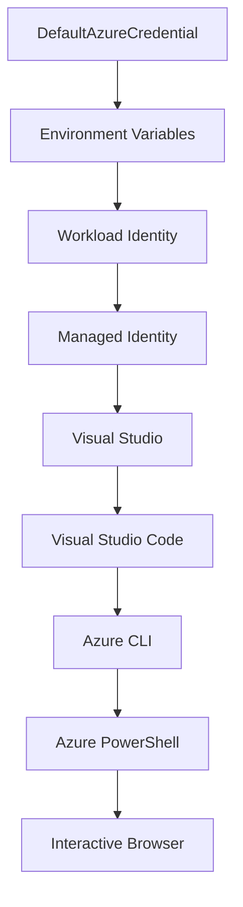

<!--
CO_OP_TRANSLATOR_METADATA:
{
  "original_hash": "fb0687bd0b166ecb0430dfeeed83487e",
  "translation_date": "2025-10-24T17:04:00+00:00",
  "source_file": "docs/getting-started/azd-basics.md",
  "language_code": "ne"
}
-->
# AZD आधारभूत - Azure Developer CLI बुझ्दै

# AZD आधारभूत - मुख्य अवधारणाहरू र आधारभूत जानकारी

**अध्याय नेभिगेसन:**
- **📚 कोर्स होम**: [AZD For Beginners](../../README.md)
- **📖 हालको अध्याय**: अध्याय १ - आधारभूत र छिटो सुरु
- **⬅️ अघिल्लो**: [कोर्स अवलोकन](../../README.md#-chapter-1-foundation--quick-start)
- **➡️ अर्को**: [स्थापना र सेटअप](installation.md)
- **🚀 अर्को अध्याय**: [अध्याय २: AI-First Development](../ai-foundry/azure-ai-foundry-integration.md)

## परिचय

यस पाठले तपाईंलाई Azure Developer CLI (azd) को परिचय दिन्छ, जुन एक शक्तिशाली कमाण्ड-लाइन उपकरण हो जसले स्थानीय विकासबाट Azure मा परिनियोजनसम्मको यात्रा छिटो बनाउँछ। तपाईंले आधारभूत अवधारणाहरू, मुख्य सुविधाहरू सिक्नुहुनेछ र azd ले क्लाउड-नेटिभ एप्लिकेसन परिनियोजनलाई कसरी सरल बनाउँछ भन्ने बुझ्नुहुनेछ।

## सिक्ने लक्ष्यहरू

यस पाठको अन्त्यसम्म, तपाईं:
- Azure Developer CLI के हो र यसको मुख्य उद्देश्य के हो भन्ने बुझ्नुहुनेछ
- टेम्प्लेटहरू, वातावरणहरू, र सेवाहरूको मुख्य अवधारणाहरू सिक्नुहुनेछ
- टेम्प्लेट-ड्राइभन विकास र Infrastructure as Code जस्ता मुख्य सुविधाहरू अन्वेषण गर्नुहुनेछ
- azd परियोजना संरचना र कार्यप्रवाह बुझ्नुहुनेछ
- तपाईंको विकास वातावरणको लागि azd स्थापना र कन्फिगर गर्न तयार हुनुहुनेछ

## सिक्ने परिणामहरू

यस पाठ पूरा गरेपछि, तपाईं:
- आधुनिक क्लाउड विकास कार्यप्रवाहमा azd को भूमिका व्याख्या गर्न सक्नुहुनेछ
- azd परियोजना संरचनाका घटकहरू पहिचान गर्न सक्नुहुनेछ
- टेम्प्लेटहरू, वातावरणहरू, र सेवाहरू कसरी सँगै काम गर्छन् भन्ने वर्णन गर्न सक्नुहुनेछ
- azd सँग Infrastructure as Code को फाइदाहरू बुझ्न सक्नुहुनेछ
- विभिन्न azd कमाण्डहरू र तिनको उद्देश्यहरू चिन्न सक्नुहुनेछ

## Azure Developer CLI (azd) के हो?

Azure Developer CLI (azd) एक कमाण्ड-लाइन उपकरण हो जसले स्थानीय विकासबाट Azure परिनियोजनसम्मको यात्रा छिटो बनाउँछ। यसले Azure मा क्लाउड-नेटिभ एप्लिकेसनहरू निर्माण, परिनियोजन, र व्यवस्थापन गर्ने प्रक्रिया सरल बनाउँछ।

## मुख्य अवधारणाहरू

### टेम्प्लेटहरू
टेम्प्लेटहरू azd को आधार हुन्। तिनीहरूले समावेश गर्छन्:
- **एप्लिकेसन कोड** - तपाईंको स्रोत कोड र निर्भरताहरू
- **Infrastructure परिभाषाहरू** - Azure स्रोतहरू Bicep वा Terraform मा परिभाषित
- **कन्फिगरेसन फाइलहरू** - सेटिङहरू र वातावरण चरहरू
- **परिनियोजन स्क्रिप्टहरू** - स्वचालित परिनियोजन कार्यप्रवाहहरू

### वातावरणहरू
वातावरणहरू विभिन्न परिनियोजन लक्ष्यहरू प्रतिनिधित्व गर्छन्:
- **विकास** - परीक्षण र विकासको लागि
- **स्टेजिङ** - प्रि-प्रोडक्सन वातावरण
- **प्रोडक्सन** - लाइभ प्रोडक्सन वातावरण

प्रत्येक वातावरणले आफ्नै:
- Azure स्रोत समूह
- कन्फिगरेसन सेटिङहरू
- परिनियोजन अवस्था कायम राख्छ

### सेवाहरू
सेवाहरू तपाईंको एप्लिकेसनका निर्माण ब्लकहरू हुन्:
- **फ्रन्टएन्ड** - वेब एप्लिकेसनहरू, SPAs
- **ब्याकएन्ड** - APIs, माइक्रोसर्भिसहरू
- **डाटाबेस** - डाटा भण्डारण समाधानहरू
- **स्टोरेज** - फाइल र ब्लब स्टोरेज

## मुख्य सुविधाहरू

### १. टेम्प्लेट-ड्राइभन विकास
```bash
# Browse available templates
azd template list

# Initialize from a template
azd init --template <template-name>
```

### २. Infrastructure as Code
- **Bicep** - Azure को डोमेन-विशेष भाषा
- **Terraform** - मल्टी-क्लाउड Infrastructure उपकरण
- **ARM टेम्प्लेटहरू** - Azure Resource Manager टेम्प्लेटहरू

### ३. एकीकृत कार्यप्रवाहहरू
```bash
# Complete deployment workflow
azd up            # Provision + Deploy this is hands off for first time setup

# 🧪 NEW: Preview infrastructure changes before deployment (SAFE)
azd provision --preview    # Simulate infrastructure deployment without making changes

azd provision     # Create Azure resources if you update the infrastructure use this
azd deploy        # Deploy application code or redeploy application code once update
azd down          # Clean up resources
```

#### 🛡️ सुरक्षित Infrastructure योजना प्रिभ्यूको साथ
`azd provision --preview` कमाण्ड सुरक्षित परिनियोजनको लागि गेम-चेन्जर हो:
- **ड्राइ-रन विश्लेषण** - के सिर्जना, परिमार्जन, वा मेटिनेछ भन्ने देखाउँछ
- **शून्य जोखिम** - तपाईंको Azure वातावरणमा कुनै वास्तविक परिवर्तन गरिँदैन
- **टीम सहयोग** - परिनियोजन अघि प्रिभ्यू परिणामहरू साझा गर्नुहोस्
- **खर्च अनुमान** - प्रतिबद्धता अघि स्रोत खर्चहरू बुझ्नुहोस्

```bash
# Example preview workflow
azd provision --preview           # See what will change
# Review the output, discuss with team
azd provision                     # Apply changes with confidence
```

### ४. वातावरण व्यवस्थापन
```bash
# Create and manage environments
azd env new <environment-name>
azd env select <environment-name>
azd env list
```

## 📁 परियोजना संरचना

एक सामान्य azd परियोजना संरचना:
```
my-app/
├── .azd/                    # azd configuration
│   └── config.json
├── .azure/                  # Azure deployment artifacts
├── .devcontainer/          # Development container config
├── .github/workflows/      # GitHub Actions
├── .vscode/               # VS Code settings
├── infra/                 # Infrastructure code
│   ├── main.bicep        # Main infrastructure template
│   ├── main.parameters.json
│   └── modules/          # Reusable modules
├── src/                  # Application source code
│   ├── api/             # Backend services
│   └── web/             # Frontend application
├── azure.yaml           # azd project configuration
└── README.md
```

## 🔧 कन्फिगरेसन फाइलहरू

### azure.yaml
मुख्य परियोजना कन्फिगरेसन फाइल:
```yaml
name: my-awesome-app
metadata:
  template: my-template@1.0.0

services:
  web:
    project: ./src/web
    language: js
    host: appservice
  api:
    project: ./src/api
    language: js
    host: appservice

hooks:
  preprovision:
    shell: pwsh
    run: echo "Preparing to provision..."
```

### .azure/config.json
वातावरण-विशेष कन्फिगरेसन:
```json
{
  "version": 1,
  "defaultEnvironment": "dev",
  "environments": {
    "dev": {
      "subscriptionId": "your-subscription-id",
      "location": "eastus"
    }
  }
}
```

## 🎪 सामान्य कार्यप्रवाहहरू

### नयाँ परियोजना सुरु गर्दै
```bash
# Method 1: Use existing template
azd init --template todo-nodejs-mongo

# Method 2: Start from scratch
azd init

# Method 3: Use current directory
azd init .
```

### विकास चक्र
```bash
# Set up development environment
azd auth login
azd env new dev
azd env select dev

# Deploy everything
azd up

# Make changes and redeploy
azd deploy

# Clean up when done
azd down --force --purge # command in the Azure Developer CLI is a **hard reset** for your environment—especially useful when you're troubleshooting failed deployments, cleaning up orphaned resources, or prepping for a fresh redeploy.
```

## `azd down --force --purge` बुझ्दै
`azd down --force --purge` कमाण्ड तपाईंको azd वातावरण र सबै सम्बन्धित स्रोतहरू पूर्ण रूपमा हटाउने शक्तिशाली तरिका हो। प्रत्येक फ्ल्यागले के गर्छ भन्ने विवरण यहाँ छ:
```
--force
```
- पुष्टि प्रम्प्टहरू छोड्छ।
- स्वचालन वा स्क्रिप्टिङको लागि उपयोगी जहाँ म्यानुअल इनपुट सम्भव छैन।
- CLI ले असंगतता पत्ता लगाए पनि टियरडाउन बिना अवरोध अगाडि बढ्छ।

```
--purge
```
**सबै सम्बन्धित मेटाडाटा** मेटाउँछ, जसमा समावेश छ:
वातावरण अवस्था
स्थानीय `.azure` फोल्डर
क्यास गरिएको परिनियोजन जानकारी
azd लाई "अघिल्लो परिनियोजनहरू सम्झन" बाट रोक्छ, जसले स्रोत समूहहरू वा पुरानो रजिस्ट्री सन्दर्भहरू जस्ता समस्याहरू निम्त्याउन सक्छ।

### किन दुवै प्रयोग गर्ने?
जब तपाईं `azd up` सँग अड्किनुहुन्छ किनभने बाँकी अवस्था वा आंशिक परिनियोजनहरू, यो संयोजनले **सफा स्लेट** सुनिश्चित गर्दछ।

यो विशेष गरी उपयोगी छ जब Azure पोर्टलमा म्यानुअल स्रोत मेटाउने वा टेम्प्लेटहरू, वातावरणहरू, वा स्रोत समूह नामकरण सम्मेलनहरू परिवर्तन गर्दा।

### धेरै वातावरणहरू व्यवस्थापन गर्दै
```bash
# Create staging environment
azd env new staging
azd env select staging
azd up

# Switch back to dev
azd env select dev

# Compare environments
azd env list
```

## 🔐 प्रमाणीकरण र क्रेडेन्सियलहरू

सफल azd परिनियोजनहरूको लागि प्रमाणीकरण बुझ्नु महत्त्वपूर्ण छ। Azure ले धेरै प्रमाणीकरण विधिहरू प्रयोग गर्दछ, र azd ले अन्य Azure उपकरणहरूले प्रयोग गर्ने समान क्रेडेन्सियल चेन प्रयोग गर्दछ।

### Azure CLI प्रमाणीकरण (`az login`)

azd प्रयोग गर्नु अघि, तपाईंले Azure सँग प्रमाणीकरण गर्न आवश्यक छ। सबैभन्दा सामान्य विधि Azure CLI प्रयोग गर्नु हो:

```bash
# Interactive login (opens browser)
az login

# Login with specific tenant
az login --tenant <tenant-id>

# Login with service principal
az login --service-principal -u <app-id> -p <password> --tenant <tenant-id>

# Check current login status
az account show

# List available subscriptions
az account list --output table

# Set default subscription
az account set --subscription <subscription-id>
```

### प्रमाणीकरण प्रवाह
1. **इन्टरएक्टिभ लगइन**: प्रमाणीकरणको लागि तपाईंको डिफल्ट ब्राउजर खोल्छ
2. **डिभाइस कोड प्रवाह**: ब्राउजर पहुँच बिना वातावरणहरूको लागि
3. **सर्भिस प्रिन्सिपल**: स्वचालन र CI/CD परिदृश्यहरूको लागि
4. **म्यानेज्ड आइडेन्टिटी**: Azure-होस्टेड एप्लिकेसनहरूको लागि

### DefaultAzureCredential चेन

`DefaultAzureCredential` एक क्रेडेन्सियल प्रकार हो जसले धेरै क्रेडेन्सियल स्रोतहरूलाई विशिष्ट क्रममा स्वचालित रूपमा प्रयास गरेर सरल प्रमाणीकरण अनुभव प्रदान गर्दछ:

#### क्रेडेन्सियल चेन क्रम


#### १. वातावरण चरहरू
```bash
# Set environment variables for service principal
export AZURE_CLIENT_ID="<app-id>"
export AZURE_CLIENT_SECRET="<password>"
export AZURE_TENANT_ID="<tenant-id>"
```

#### २. वर्कलोड आइडेन्टिटी (Kubernetes/GitHub Actions)
स्वचालित रूपमा प्रयोग गरिन्छ:
- Azure Kubernetes Service (AKS) वर्कलोड आइडेन्टिटीसँग
- GitHub Actions OIDC फेडरेशनसँग
- अन्य फेडरेटेड आइडेन्टिटी परिदृश्यहरू

#### ३. म्यानेज्ड आइडेन्टिटी
Azure स्रोतहरूको लागि जस्तै:
- भर्चुअल मेसिनहरू
- एप सर्भिस
- Azure Functions
- कन्टेनर इन्स्टेन्सहरू

```bash
# Check if running on Azure resource with managed identity
az account show --query "user.type" --output tsv
# Returns: "servicePrincipal" if using managed identity
```

#### ४. डेभलपर उपकरण एकीकरण
- **Visual Studio**: स्वचालित रूपमा साइन-इन गरिएको खाता प्रयोग गर्दछ
- **VS Code**: Azure Account एक्सटेन्सन क्रेडेन्सियल प्रयोग गर्दछ
- **Azure CLI**: `az login` क्रेडेन्सियल प्रयोग गर्दछ (स्थानीय विकासको लागि सबैभन्दा सामान्य)

### AZD प्रमाणीकरण सेटअप

```bash
# Method 1: Use Azure CLI (Recommended for development)
az login
azd auth login  # Uses existing Azure CLI credentials

# Method 2: Direct azd authentication
azd auth login --use-device-code  # For headless environments

# Method 3: Check authentication status
azd auth login --check-status

# Method 4: Logout and re-authenticate
azd auth logout
azd auth login
```

### प्रमाणीकरणका उत्कृष्ट अभ्यासहरू

#### स्थानीय विकासको लागि
```bash
# 1. Login with Azure CLI
az login

# 2. Verify correct subscription
az account show
az account set --subscription "Your Subscription Name"

# 3. Use azd with existing credentials
azd auth login
```

#### CI/CD पाइपलाइनहरूको लागि
```yaml
# GitHub Actions example
- name: Azure Login
  uses: azure/login@v1
  with:
    creds: ${{ secrets.AZURE_CREDENTIALS }}

- name: Deploy with azd
  run: |
    azd auth login --client-id ${{ secrets.AZURE_CLIENT_ID }} \
                    --client-secret ${{ secrets.AZURE_CLIENT_SECRET }} \
                    --tenant-id ${{ secrets.AZURE_TENANT_ID }}
    azd up --no-prompt
```

#### उत्पादन वातावरणहरूको लागि
- Azure स्रोतहरूमा चल्दा **म्यानेज्ड आइडेन्टिटी** प्रयोग गर्नुहोस्
- स्वचालन परिदृश्यहरूको लागि **सर्भिस प्रिन्सिपल** प्रयोग गर्नुहोस्
- कोड वा कन्फिगरेसन फाइलहरूमा क्रेडेन्सियलहरू भण्डारण नगर्नुहोस्
- संवेदनशील कन्फिगरेसनको लागि **Azure Key Vault** प्रयोग गर्नुहोस्

### सामान्य प्रमाणीकरण समस्याहरू र समाधानहरू

#### समस्या: "कुनै सदस्यता फेला परेन"
```bash
# Solution: Set default subscription
az account list --output table
az account set --subscription "<subscription-id>"
azd env set AZURE_SUBSCRIPTION_ID "<subscription-id>"
```

#### समस्या: "अपर्याप्त अनुमति"
```bash
# Solution: Check and assign required roles
az role assignment list --assignee $(az account show --query user.name --output tsv)

# Common required roles:
# - Contributor (for resource management)
# - User Access Administrator (for role assignments)
```

#### समस्या: "टोकन समाप्त भयो"
```bash
# Solution: Re-authenticate
az logout
az login
azd auth logout
azd auth login
```

### विभिन्न परिदृश्यहरूमा प्रमाणीकरण

#### स्थानीय विकास
```bash
# Personal development account
az login
azd auth login
```

#### टीम विकास
```bash
# Use specific tenant for organization
az login --tenant contoso.onmicrosoft.com
azd auth login
```

#### मल्टी-टेनेन्ट परिदृश्यहरू
```bash
# Switch between tenants
az login --tenant tenant1.onmicrosoft.com
# Deploy to tenant 1
azd up

az login --tenant tenant2.onmicrosoft.com  
# Deploy to tenant 2
azd up
```

### सुरक्षा विचारहरू

1. **क्रेडेन्सियल भण्डारण**: कहिल्यै स्रोत कोडमा क्रेडेन्सियलहरू भण्डारण नगर्नुहोस्
2. **स्कोप सीमितता**: सर्भिस प्रिन्सिपलहरूको लागि न्यूनतम-अधिकार सिद्धान्त प्रयोग गर्नुहोस्
3. **टोकन रोटेशन**: सर्भिस प्रिन्सिपल गोप्य नियमित रूपमा रोटेट गर्नुहोस्
4. **अडिट ट्रेल**: प्रमाणीकरण र परिनियोजन गतिविधिहरू अनुगमन गर्नुहोस्
5. **नेटवर्क सुरक्षा**: सम्भव भएमा निजी अन्त बिन्दुहरू प्रयोग गर्नुहोस्

### प्रमाणीकरण समस्या समाधान

```bash
# Debug authentication issues
azd auth login --check-status
az account show
az account get-access-token

# Common diagnostic commands
whoami                          # Current user context
az ad signed-in-user show      # Azure AD user details
az group list                  # Test resource access
```

## `azd down --force --purge` बुझ्दै

### खोज
```bash
azd template list              # Browse templates
azd template show <template>   # Template details
azd init --help               # Initialization options
```

### परियोजना व्यवस्थापन
```bash
azd show                     # Project overview
azd env show                 # Current environment
azd config list             # Configuration settings
```

### अनुगमन
```bash
azd monitor                  # Open Azure portal
azd pipeline config          # Set up CI/CD
azd logs                     # View application logs
```

## उत्कृष्ट अभ्यासहरू

### १. अर्थपूर्ण नामहरू प्रयोग गर्नुहोस्
```bash
# Good
azd env new production-east
azd init --template web-app-secure

# Avoid
azd env new env1
azd init --template template1
```

### २. टेम्प्लेटहरू प्रयोग गर्नुहोस्
- अवस्थित टेम्प्लेटहरूसँग सुरु गर्नुहोस्
- तपाईंको आवश्यकताहरूको लागि अनुकूलन गर्नुहोस्
- तपाईंको संगठनको लागि पुन: प्रयोग गर्न सकिने टेम्प्लेटहरू सिर्जना गर्नुहोस्

### ३. वातावरण अलगाव
- विकास/स्टेजिङ/प्रोडक्सनको लागि अलग वातावरणहरू प्रयोग गर्नुहोस्
- स्थानीय मेसिनबाट सिधै प्रोडक्सनमा कहिल्यै परिनियोजन नगर्नुहोस्
- प्रोडक्सन परिनियोजनहरूको लागि CI/CD पाइपलाइनहरू प्रयोग गर्नुहोस्

### ४. कन्फिगरेसन व्यवस्थापन
- संवेदनशील डाटाको लागि वातावरण चरहरू प्रयोग गर्नुहोस्
- कन्फिगरेसन संस्करण नियन्त्रणमा राख्नुहोस्
- वातावरण-विशेष सेटिङहरू दस्तावेज गर्नुहोस्

## सिक्ने प्रगति

### प्रारम्भिक (हप्ता १-२)
1. azd स्थापना गर्नुहोस् र प्रमाणीकरण गर्नुहोस्
2. साधारण टेम्प्लेट परिनियोजन गर्नुहोस्
3. परियोजना संरचना बुझ्नुहोस्
4. आधारभूत कमाण्डहरू सिक्नुहोस् (up, down, deploy)

### मध्यवर्ती (हप्ता ३-४)
1. टेम्प्लेटहरू अनुकूलन गर्नुहोस्
2. धेरै वातावरणहरू व्यवस्थापन गर्नुहोस्
3. Infrastructure कोड बुझ्नुहोस्
4. CI/CD पाइपलाइनहरू सेट गर्नुहोस्

### उन्नत (हप्ता ५+)
1. कस्टम टेम्प्लेटहरू सिर्जना गर्नुहोस्
2. उन्नत Infrastructure ढाँचाहरू
3. मल्टी-क्षेत्र परिनियोजनहरू
4. उद्यम-ग्रेड कन्फिगरेसनहरू

## अर्को चरणहरू

**📖 अध्याय १ सिकाइ जारी राख्नुहोस्:**
- [स्थापना र सेटअप](installation.md) - azd स्थापना र कन्फिगर गर्नुहोस्
- [तपाईंको पहिलो परियोजना](first-project.md) - व्यावहारिक ट्युटोरियल पूरा गर्नुहोस्
- [कन्फिगरेसन गाइड](configuration.md) - उन्नत कन्फिगरेसन विकल्पहरू

**🎯 अर्को अध्यायको लागि तयार?**
- [अध्याय २: AI-First Development](../ai-foundry/azure-ai-foundry-integration.md) - AI एप्लिकेसनहरू निर्माण गर्न सुरु गर्नुहोस्

## थप स्रोतहरू

- [Azure Developer CLI अवलोकन](https://learn.microsoft.com/en-us/azure/developer/azure-developer-cli/)
- [टेम्प्लेट ग्यालरी](https://azure.github.io/awesome-azd/)
- [समुदाय नमूनाहरू](https://github.com/Azure-Samples)

---

**अध्याय नेभिगेसन:**
- **📚 कोर्स होम**: [AZD For Beginners](../../README.md)
- **📖 हालको अध्याय**: अध्याय १ - आधारभूत र छिटो सुरु  
- **⬅️ अघिल्लो**: [कोर्स अवलोकन](../../README.md#-chapter-1-foundation--quick-start)
- **➡️ अर्को**: [स्थापना र सेटअप](installation.md)
- **🚀 अर्को अध्याय**: [अध्याय २: AI-First Development](../ai-foundry/azure-ai-foundry-integration.md)

---

**अस्वीकरण**:  
यो दस्तावेज़ AI अनुवाद सेवा [Co-op Translator](https://github.com/Azure/co-op-translator) प्रयोग गरेर अनुवाद गरिएको छ। हामी शुद्धताको लागि प्रयास गर्छौं, तर कृपया ध्यान दिनुहोस् कि स्वचालित अनुवादमा त्रुटिहरू वा अशुद्धताहरू हुन सक्छ। यसको मूल भाषा मा रहेको दस्तावेज़लाई आधिकारिक स्रोत मानिनुपर्छ। महत्वपूर्ण जानकारीको लागि, व्यावसायिक मानव अनुवाद सिफारिस गरिन्छ। यस अनुवादको प्रयोगबाट उत्पन्न हुने कुनै पनि गलतफहमी वा गलत व्याख्याको लागि हामी जिम्मेवार हुने छैनौं।