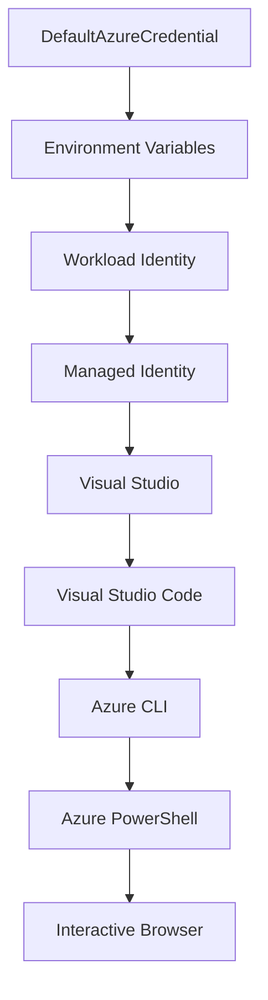

<!--
CO_OP_TRANSLATOR_METADATA:
{
  "original_hash": "fb0687bd0b166ecb0430dfeeed83487e",
  "translation_date": "2025-10-24T17:37:26+00:00",
  "source_file": "docs/getting-started/azd-basics.md",
  "language_code": "nl"
}
-->
# AZD Basisprincipes - Begrijpen van Azure Developer CLI

# AZD Basisprincipes - Kernconcepten en Grondbeginselen

**Hoofdstuk Navigatie:**
- **📚 Cursus Home**: [AZD Voor Beginners](../../README.md)
- **📖 Huidig Hoofdstuk**: Hoofdstuk 1 - Basis & Snelle Start
- **⬅️ Vorige**: [Cursusoverzicht](../../README.md#-chapter-1-foundation--quick-start)
- **➡️ Volgende**: [Installatie & Instellen](installation.md)
- **🚀 Volgend Hoofdstuk**: [Hoofdstuk 2: AI-First Ontwikkeling](../ai-foundry/azure-ai-foundry-integration.md)

## Introductie

Deze les introduceert je aan Azure Developer CLI (azd), een krachtige command-line tool die je reis van lokale ontwikkeling naar Azure-implementatie versnelt. Je leert de fundamentele concepten, kernfuncties en begrijpt hoe azd het implementeren van cloud-native applicaties vereenvoudigt.

## Leerdoelen

Aan het einde van deze les zul je:
- Begrijpen wat Azure Developer CLI is en het primaire doel ervan
- De kernconcepten van templates, omgevingen en services leren
- Belangrijke functies verkennen, waaronder template-gedreven ontwikkeling en Infrastructure as Code
- Het azd-projectstructuur en workflow begrijpen
- Klaar zijn om azd te installeren en configureren voor je ontwikkelomgeving

## Leerresultaten

Na het voltooien van deze les kun je:
- De rol van azd in moderne cloudontwikkelingsworkflows uitleggen
- De componenten van een azd-projectstructuur identificeren
- Beschrijven hoe templates, omgevingen en services samenwerken
- De voordelen van Infrastructure as Code met azd begrijpen
- Verschillende azd-commando's en hun doeleinden herkennen

## Wat is Azure Developer CLI (azd)?

Azure Developer CLI (azd) is een command-line tool ontworpen om je reis van lokale ontwikkeling naar Azure-implementatie te versnellen. Het vereenvoudigt het proces van bouwen, implementeren en beheren van cloud-native applicaties op Azure.

## Kernconcepten

### Templates
Templates vormen de basis van azd. Ze bevatten:
- **Applicatiecode** - Je broncode en afhankelijkheden
- **Infrastructuurdefinities** - Azure-resources gedefinieerd in Bicep of Terraform
- **Configuratiebestanden** - Instellingen en omgevingsvariabelen
- **Implementatiescripts** - Geautomatiseerde implementatieworkflows

### Omgevingen
Omgevingen vertegenwoordigen verschillende implementatiedoelen:
- **Ontwikkeling** - Voor testen en ontwikkeling
- **Staging** - Pre-productieomgeving
- **Productie** - Live productieomgeving

Elke omgeving onderhoudt zijn eigen:
- Azure resourcegroep
- Configuratie-instellingen
- Implementatiestatus

### Services
Services zijn de bouwstenen van je applicatie:
- **Frontend** - Webapplicaties, SPAs
- **Backend** - API's, microservices
- **Database** - Datastore-oplossingen
- **Opslag** - Bestand- en blobopslag

## Belangrijke Functies

### 1. Template-gedreven Ontwikkeling
```bash
# Browse available templates
azd template list

# Initialize from a template
azd init --template <template-name>
```

### 2. Infrastructure as Code
- **Bicep** - Azure's domeinspecifieke taal
- **Terraform** - Multi-cloud infrastructuurtool
- **ARM Templates** - Azure Resource Manager templates

### 3. Geïntegreerde Workflows
```bash
# Complete deployment workflow
azd up            # Provision + Deploy this is hands off for first time setup

# 🧪 NEW: Preview infrastructure changes before deployment (SAFE)
azd provision --preview    # Simulate infrastructure deployment without making changes

azd provision     # Create Azure resources if you update the infrastructure use this
azd deploy        # Deploy application code or redeploy application code once update
azd down          # Clean up resources
```

#### 🛡️ Veilige Infrastructuurplanning met Preview
Het `azd provision --preview` commando is een gamechanger voor veilige implementaties:
- **Dry-run analyse** - Laat zien wat wordt aangemaakt, gewijzigd of verwijderd
- **Geen risico** - Er worden geen daadwerkelijke wijzigingen aangebracht in je Azure-omgeving
- **Team samenwerking** - Deel previewresultaten vóór implementatie
- **Kostenraming** - Begrijp resourcekosten vóór commitment

```bash
# Example preview workflow
azd provision --preview           # See what will change
# Review the output, discuss with team
azd provision                     # Apply changes with confidence
```

### 4. Omgevingsbeheer
```bash
# Create and manage environments
azd env new <environment-name>
azd env select <environment-name>
azd env list
```

## 📁 Projectstructuur

Een typische azd-projectstructuur:
```
my-app/
├── .azd/                    # azd configuration
│   └── config.json
├── .azure/                  # Azure deployment artifacts
├── .devcontainer/          # Development container config
├── .github/workflows/      # GitHub Actions
├── .vscode/               # VS Code settings
├── infra/                 # Infrastructure code
│   ├── main.bicep        # Main infrastructure template
│   ├── main.parameters.json
│   └── modules/          # Reusable modules
├── src/                  # Application source code
│   ├── api/             # Backend services
│   └── web/             # Frontend application
├── azure.yaml           # azd project configuration
└── README.md
```

## 🔧 Configuratiebestanden

### azure.yaml
Het belangrijkste projectconfiguratiebestand:
```yaml
name: my-awesome-app
metadata:
  template: my-template@1.0.0

services:
  web:
    project: ./src/web
    language: js
    host: appservice
  api:
    project: ./src/api
    language: js
    host: appservice

hooks:
  preprovision:
    shell: pwsh
    run: echo "Preparing to provision..."
```

### .azure/config.json
Omgevingsspecifieke configuratie:
```json
{
  "version": 1,
  "defaultEnvironment": "dev",
  "environments": {
    "dev": {
      "subscriptionId": "your-subscription-id",
      "location": "eastus"
    }
  }
}
```

## 🎪 Veelvoorkomende Workflows

### Een Nieuw Project Starten
```bash
# Method 1: Use existing template
azd init --template todo-nodejs-mongo

# Method 2: Start from scratch
azd init

# Method 3: Use current directory
azd init .
```

### Ontwikkelcyclus
```bash
# Set up development environment
azd auth login
azd env new dev
azd env select dev

# Deploy everything
azd up

# Make changes and redeploy
azd deploy

# Clean up when done
azd down --force --purge # command in the Azure Developer CLI is a **hard reset** for your environment—especially useful when you're troubleshooting failed deployments, cleaning up orphaned resources, or prepping for a fresh redeploy.
```

## Begrijpen van `azd down --force --purge`
Het `azd down --force --purge` commando is een krachtige manier om je azd-omgeving en alle bijbehorende resources volledig af te breken. Hier is een overzicht van wat elke vlag doet:
```
--force
```
- Slaat bevestigingsprompts over.
- Handig voor automatisering of scripting waar handmatige invoer niet haalbaar is.
- Zorgt ervoor dat de afbraak zonder onderbreking doorgaat, zelfs als de CLI inconsistenties detecteert.

```
--purge
```
Verwijdert **alle bijbehorende metadata**, inclusief:
Omgevingsstatus
Lokale `.azure` map
Gecachte implementatie-informatie
Voorkomt dat azd "vorige implementaties onthoudt", wat problemen kan veroorzaken zoals niet-overeenkomende resourcegroepen of verouderde registerverwijzingen.

### Waarom beide gebruiken?
Wanneer je vastloopt met `azd up` door achterblijvende status of gedeeltelijke implementaties, zorgt deze combinatie voor een **schone lei**.

Het is vooral handig na handmatige resourceverwijderingen in de Azure portal of bij het wisselen van templates, omgevingen of resourcegroepnaamconventies.

### Meerdere Omgevingen Beheren
```bash
# Create staging environment
azd env new staging
azd env select staging
azd up

# Switch back to dev
azd env select dev

# Compare environments
azd env list
```

## 🔐 Authenticatie en Referenties

Het begrijpen van authenticatie is cruciaal voor succesvolle azd-implementaties. Azure gebruikt meerdere authenticatiemethoden, en azd maakt gebruik van dezelfde referentieketen die door andere Azure-tools wordt gebruikt.

### Azure CLI Authenticatie (`az login`)

Voordat je azd gebruikt, moet je je authenticeren bij Azure. De meest gebruikelijke methode is via Azure CLI:

```bash
# Interactive login (opens browser)
az login

# Login with specific tenant
az login --tenant <tenant-id>

# Login with service principal
az login --service-principal -u <app-id> -p <password> --tenant <tenant-id>

# Check current login status
az account show

# List available subscriptions
az account list --output table

# Set default subscription
az account set --subscription <subscription-id>
```

### Authenticatiestroom
1. **Interactieve Login**: Opent je standaardbrowser voor authenticatie
2. **Apparaatcode Stroom**: Voor omgevingen zonder browsertoegang
3. **Service Principal**: Voor automatisering en CI/CD-scenario's
4. **Managed Identity**: Voor Azure-gehoste applicaties

### DefaultAzureCredential Ketting

`DefaultAzureCredential` is een referentietype dat een vereenvoudigde authenticatie-ervaring biedt door automatisch meerdere referentiebronnen in een specifieke volgorde te proberen:

#### Volgorde van Referentieketen


#### 1. Omgevingsvariabelen
```bash
# Set environment variables for service principal
export AZURE_CLIENT_ID="<app-id>"
export AZURE_CLIENT_SECRET="<password>"
export AZURE_TENANT_ID="<tenant-id>"
```

#### 2. Workload Identity (Kubernetes/GitHub Actions)
Wordt automatisch gebruikt in:
- Azure Kubernetes Service (AKS) met Workload Identity
- GitHub Actions met OIDC-federatie
- Andere federatieve identiteitsscenario's

#### 3. Managed Identity
Voor Azure-resources zoals:
- Virtuele Machines
- App Service
- Azure Functions
- Container Instances

```bash
# Check if running on Azure resource with managed identity
az account show --query "user.type" --output tsv
# Returns: "servicePrincipal" if using managed identity
```

#### 4. Integratie met Ontwikkeltools
- **Visual Studio**: Gebruikt automatisch het ingelogde account
- **VS Code**: Gebruikt Azure Account extensie-referenties
- **Azure CLI**: Gebruikt `az login` referenties (meest gebruikelijk voor lokale ontwikkeling)

### AZD Authenticatie Instellen

```bash
# Method 1: Use Azure CLI (Recommended for development)
az login
azd auth login  # Uses existing Azure CLI credentials

# Method 2: Direct azd authentication
azd auth login --use-device-code  # For headless environments

# Method 3: Check authentication status
azd auth login --check-status

# Method 4: Logout and re-authenticate
azd auth logout
azd auth login
```

### Beste Praktijken voor Authenticatie

#### Voor Lokale Ontwikkeling
```bash
# 1. Login with Azure CLI
az login

# 2. Verify correct subscription
az account show
az account set --subscription "Your Subscription Name"

# 3. Use azd with existing credentials
azd auth login
```

#### Voor CI/CD Pipelines
```yaml
# GitHub Actions example
- name: Azure Login
  uses: azure/login@v1
  with:
    creds: ${{ secrets.AZURE_CREDENTIALS }}

- name: Deploy with azd
  run: |
    azd auth login --client-id ${{ secrets.AZURE_CLIENT_ID }} \
                    --client-secret ${{ secrets.AZURE_CLIENT_SECRET }} \
                    --tenant-id ${{ secrets.AZURE_TENANT_ID }}
    azd up --no-prompt
```

#### Voor Productieomgevingen
- Gebruik **Managed Identity** bij het draaien op Azure-resources
- Gebruik **Service Principal** voor automatiseringsscenario's
- Vermijd het opslaan van referenties in code of configuratiebestanden
- Gebruik **Azure Key Vault** voor gevoelige configuratie

### Veelvoorkomende Authenticatieproblemen en Oplossingen

#### Probleem: "Geen abonnement gevonden"
```bash
# Solution: Set default subscription
az account list --output table
az account set --subscription "<subscription-id>"
azd env set AZURE_SUBSCRIPTION_ID "<subscription-id>"
```

#### Probleem: "Onvoldoende rechten"
```bash
# Solution: Check and assign required roles
az role assignment list --assignee $(az account show --query user.name --output tsv)

# Common required roles:
# - Contributor (for resource management)
# - User Access Administrator (for role assignments)
```

#### Probleem: "Token verlopen"
```bash
# Solution: Re-authenticate
az logout
az login
azd auth logout
azd auth login
```

### Authenticatie in Verschillende Scenario's

#### Lokale Ontwikkeling
```bash
# Personal development account
az login
azd auth login
```

#### Teamontwikkeling
```bash
# Use specific tenant for organization
az login --tenant contoso.onmicrosoft.com
azd auth login
```

#### Multi-tenant Scenario's
```bash
# Switch between tenants
az login --tenant tenant1.onmicrosoft.com
# Deploy to tenant 1
azd up

az login --tenant tenant2.onmicrosoft.com  
# Deploy to tenant 2
azd up
```

### Veiligheidsoverwegingen

1. **Opslag van Referenties**: Sla nooit referenties op in broncode
2. **Beperking van Scope**: Gebruik het principe van minimale rechten voor service principals
3. **Tokenrotatie**: Draai regelmatig service principal geheimen
4. **Audit Trail**: Monitor authenticatie- en implementatieactiviteiten
5. **Netwerkbeveiliging**: Gebruik waar mogelijk private endpoints

### Problemen met Authenticatie Oplossen

```bash
# Debug authentication issues
azd auth login --check-status
az account show
az account get-access-token

# Common diagnostic commands
whoami                          # Current user context
az ad signed-in-user show      # Azure AD user details
az group list                  # Test resource access
```

## Begrijpen van `azd down --force --purge`

### Ontdekking
```bash
azd template list              # Browse templates
azd template show <template>   # Template details
azd init --help               # Initialization options
```

### Projectbeheer
```bash
azd show                     # Project overview
azd env show                 # Current environment
azd config list             # Configuration settings
```

### Monitoring
```bash
azd monitor                  # Open Azure portal
azd pipeline config          # Set up CI/CD
azd logs                     # View application logs
```

## Beste Praktijken

### 1. Gebruik Betekenisvolle Namen
```bash
# Good
azd env new production-east
azd init --template web-app-secure

# Avoid
azd env new env1
azd init --template template1
```

### 2. Maak Gebruik van Templates
- Begin met bestaande templates
- Pas aan voor jouw behoeften
- Maak herbruikbare templates voor je organisatie

### 3. Omgevingsisolatie
- Gebruik aparte omgevingen voor ontwikkeling/staging/productie
- Implementeer nooit direct naar productie vanaf een lokale machine
- Gebruik CI/CD-pipelines voor productie-implementaties

### 4. Configuratiebeheer
- Gebruik omgevingsvariabelen voor gevoelige gegevens
- Houd configuratie in versiebeheer
- Documenteer omgevingsspecifieke instellingen

## Leerprogressie

### Beginner (Week 1-2)
1. Installeer azd en authenticeer
2. Implementeer een eenvoudig template
3. Begrijp projectstructuur
4. Leer basiscommando's (up, down, deploy)

### Gemiddeld (Week 3-4)
1. Pas templates aan
2. Beheer meerdere omgevingen
3. Begrijp infrastructuurcode
4. Stel CI/CD-pipelines in

### Gevorderd (Week 5+)
1. Maak aangepaste templates
2. Geavanceerde infrastructuurpatronen
3. Multi-regio implementaties
4. Configuraties van ondernemingsniveau

## Volgende Stappen

**📖 Ga verder met Hoofdstuk 1:**
- [Installatie & Instellen](installation.md) - Installeer en configureer azd
- [Je Eerste Project](first-project.md) - Voltooi hands-on tutorial
- [Configuratiegids](configuration.md) - Geavanceerde configuratieopties

**🎯 Klaar voor het Volgende Hoofdstuk?**
- [Hoofdstuk 2: AI-First Ontwikkeling](../ai-foundry/azure-ai-foundry-integration.md) - Begin met het bouwen van AI-applicaties

## Aanvullende Bronnen

- [Azure Developer CLI Overzicht](https://learn.microsoft.com/en-us/azure/developer/azure-developer-cli/)
- [Template Galerij](https://azure.github.io/awesome-azd/)
- [Community Voorbeelden](https://github.com/Azure-Samples)

---

**Hoofdstuk Navigatie:**
- **📚 Cursus Home**: [AZD Voor Beginners](../../README.md)
- **📖 Huidig Hoofdstuk**: Hoofdstuk 1 - Basis & Snelle Start  
- **⬅️ Vorige**: [Cursusoverzicht](../../README.md#-chapter-1-foundation--quick-start)
- **➡️ Volgende**: [Installatie & Instellen](installation.md)
- **🚀 Volgend Hoofdstuk**: [Hoofdstuk 2: AI-First Ontwikkeling](../ai-foundry/azure-ai-foundry-integration.md)

---

**Disclaimer**:  
Dit document is vertaald met behulp van de AI-vertalingsservice [Co-op Translator](https://github.com/Azure/co-op-translator). Hoewel we streven naar nauwkeurigheid, dient u zich ervan bewust te zijn dat geautomatiseerde vertalingen fouten of onnauwkeurigheden kunnen bevatten. Het originele document in de oorspronkelijke taal moet worden beschouwd als de gezaghebbende bron. Voor kritieke informatie wordt professionele menselijke vertaling aanbevolen. Wij zijn niet aansprakelijk voor eventuele misverstanden of verkeerde interpretaties die voortvloeien uit het gebruik van deze vertaling.