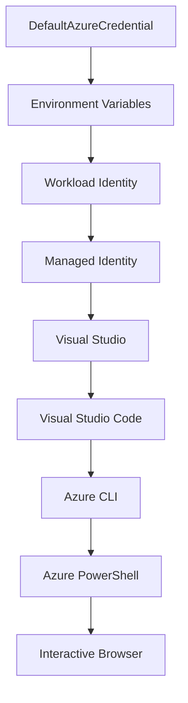

<!--
CO_OP_TRANSLATOR_METADATA:
{
  "original_hash": "fb0687bd0b166ecb0430dfeeed83487e",
  "translation_date": "2025-10-24T17:08:08+00:00",
  "source_file": "docs/getting-started/azd-basics.md",
  "language_code": "pa"
}
-->
# AZD ਬੁਨਿਆਦੀਆਂ - Azure Developer CLI ਨੂੰ ਸਮਝਣਾ

# AZD ਬੁਨਿਆਦੀਆਂ - ਮੁੱਖ ਧਾਰਨਾਵਾਂ ਅਤੇ ਮੂਲ ਸਿਧਾਂਤ

**ਅਧਿਆਇ ਨੈਵੀਗੇਸ਼ਨ:**
- **📚 ਕੋਰਸ ਮੁੱਖ ਪੰਨਾ**: [AZD ਸ਼ੁਰੂਆਤੀ ਲਈ](../../README.md)
- **📖 ਮੌਜੂਦਾ ਅਧਿਆਇ**: ਅਧਿਆਇ 1 - ਬੁਨਿਆਦ ਅਤੇ ਤੁਰੰਤ ਸ਼ੁਰੂਆਤ
- **⬅️ ਪਿਛਲਾ**: [ਕੋਰਸ ਝਲਕ](../../README.md#-chapter-1-foundation--quick-start)
- **➡️ ਅਗਲਾ**: [ਇੰਸਟਾਲੇਸ਼ਨ ਅਤੇ ਸੈਟਅਪ](installation.md)
- **🚀 ਅਗਲਾ ਅਧਿਆਇ**: [ਅਧਿਆਇ 2: AI-ਪਹਿਲਾ ਵਿਕਾਸ](../ai-foundry/azure-ai-foundry-integration.md)

## ਪੇਸ਼ਕਸ਼

ਇਸ ਪਾਠ ਵਿੱਚ ਤੁਹਾਨੂੰ Azure Developer CLI (azd) ਨਾਲ ਜਾਣੂ ਕਰਵਾਇਆ ਜਾਵੇਗਾ, ਜੋ ਕਿ ਇੱਕ ਸ਼ਕਤੀਸ਼ਾਲੀ ਕਮਾਂਡ-ਲਾਈਨ ਟੂਲ ਹੈ ਜੋ ਤੁਹਾਡੇ ਸਥਾਨਕ ਵਿਕਾਸ ਤੋਂ Azure ਡਿਪਲੌਇਮੈਂਟ ਤੱਕ ਦੇ ਸਫਰ ਨੂੰ ਤੇਜ਼ ਕਰਦਾ ਹੈ। ਤੁਸੀਂ ਬੁਨਿਆਦੀ ਧਾਰਨਾਵਾਂ, ਮੁੱਖ ਵਿਸ਼ੇਸ਼ਤਾਵਾਂ ਸਿੱਖੋਗੇ ਅਤੇ ਸਮਝੋਗੇ ਕਿ azd ਕਿਵੇਂ ਕਲਾਉਡ-ਨੈਟਿਵ ਐਪਲੀਕੇਸ਼ਨ ਡਿਪਲੌਇਮੈਂਟ ਨੂੰ ਸਧਾਰਨ ਬਣਾਉਂਦਾ ਹੈ।

## ਸਿੱਖਣ ਦੇ ਲਕਸ਼

ਇਸ ਪਾਠ ਦੇ ਅੰਤ ਤੱਕ, ਤੁਸੀਂ:
- ਸਮਝ ਪਾਉਗੇ ਕਿ Azure Developer CLI ਕੀ ਹੈ ਅਤੇ ਇਸ ਦਾ ਮੁੱਖ ਉਦੇਸ਼ ਕੀ ਹੈ
- ਟੈਂਪਲੇਟਸ, ਇਨਵਾਇਰਮੈਂਟਸ ਅਤੇ ਸੇਵਾਵਾਂ ਦੀਆਂ ਮੁੱਖ ਧਾਰਨਾਵਾਂ ਸਿੱਖੋਗੇ
- ਮੁੱਖ ਵਿਸ਼ੇਸ਼ਤਾਵਾਂ ਦੀ ਖੋਜ ਕਰੋਗੇ ਜਿਵੇਂ ਕਿ ਟੈਂਪਲੇਟ-ਚਲਿਤ ਵਿਕਾਸ ਅਤੇ Infrastructure as Code
- azd ਪ੍ਰੋਜੈਕਟ ਸਟ੍ਰਕਚਰ ਅਤੇ ਵਰਕਫਲੋ ਨੂੰ ਸਮਝੋਗੇ
- azd ਨੂੰ ਆਪਣੇ ਵਿਕਾਸ ਵਾਤਾਵਰਣ ਲਈ ਇੰਸਟਾਲ ਅਤੇ ਕਨਫਿਗਰ ਕਰਨ ਲਈ ਤਿਆਰ ਹੋਵੋਗੇ

## ਸਿੱਖਣ ਦੇ ਨਤੀਜੇ

ਇਸ ਪਾਠ ਨੂੰ ਪੂਰਾ ਕਰਨ ਤੋਂ ਬਾਅਦ, ਤੁਸੀਂ ਸਮਰੱਥ ਹੋਵੋਗੇ:
- ਆਧੁਨਿਕ ਕਲਾਉਡ ਵਿਕਾਸ ਵਰਕਫਲੋਜ਼ ਵਿੱਚ azd ਦੀ ਭੂਮਿਕਾ ਦੀ ਵਿਆਖਿਆ ਕਰਨਾ
- azd ਪ੍ਰੋਜੈਕਟ ਸਟ੍ਰਕਚਰ ਦੇ ਘਟਕਾਂ ਦੀ ਪਛਾਣ ਕਰਨਾ
- ਸਮਝਣਾ ਕਿ ਟੈਂਪਲੇਟਸ, ਇਨਵਾਇਰਮੈਂਟਸ ਅਤੇ ਸੇਵਾਵਾਂ ਕਿਵੇਂ ਇਕੱਠੇ ਕੰਮ ਕਰਦੀਆਂ ਹਨ
- azd ਨਾਲ Infrastructure as Code ਦੇ ਫਾਇਦੇ ਸਮਝਣਾ
- ਵੱਖ-ਵੱਖ azd ਕਮਾਂਡਸ ਅਤੇ ਉਨ੍ਹਾਂ ਦੇ ਉਦੇਸ਼ਾਂ ਨੂੰ ਪਛਾਣਣਾ

## Azure Developer CLI (azd) ਕੀ ਹੈ?

Azure Developer CLI (azd) ਇੱਕ ਕਮਾਂਡ-ਲਾਈਨ ਟੂਲ ਹੈ ਜੋ ਤੁਹਾਡੇ ਸਥਾਨਕ ਵਿਕਾਸ ਤੋਂ Azure ਡਿਪਲੌਇਮੈਂਟ ਤੱਕ ਦੇ ਸਫਰ ਨੂੰ ਤੇਜ਼ ਕਰਨ ਲਈ ਡਿਜ਼ਾਈਨ ਕੀਤਾ ਗਿਆ ਹੈ। ਇਹ Azure 'ਤੇ ਕਲਾਉਡ-ਨੈਟਿਵ ਐਪਲੀਕੇਸ਼ਨ ਬਣਾਉਣ, ਡਿਪਲੌਇ ਕਰਨ ਅਤੇ ਪ੍ਰਬੰਧਨ ਕਰਨ ਦੀ ਪ੍ਰਕਿਰਿਆ ਨੂੰ ਸਧਾਰਨ ਬਣਾਉਂਦਾ ਹੈ।

## ਮੁੱਖ ਧਾਰਨਾਵਾਂ

### ਟੈਂਪਲੇਟਸ
ਟੈਂਪਲੇਟਸ azd ਦੀ ਬੁਨਿਆਦ ਹਨ। ਇਹ ਸ਼ਾਮਲ ਕਰਦੇ ਹਨ:
- **ਐਪਲੀਕੇਸ਼ਨ ਕੋਡ** - ਤੁਹਾਡਾ ਸਰੋਤ ਕੋਡ ਅਤੇ ਡਿਪੈਂਡੈਂਸੀਜ਼
- **ਇਨਫਰਾਸਟਰਕਚਰ ਦੀ ਪਰਿਭਾਸ਼ਾ** - Bicep ਜਾਂ Terraform ਵਿੱਚ ਪਰਿਭਾਸ਼ਿਤ Azure ਸਰੋਤ
- **ਕਨਫਿਗਰੇਸ਼ਨ ਫਾਈਲਾਂ** - ਸੈਟਿੰਗਸ ਅਤੇ ਵਾਤਾਵਰਣ ਵੈਰੀਏਬਲ
- **ਡਿਪਲੌਇਮੈਂਟ ਸਕ੍ਰਿਪਟਸ** - ਆਟੋਮੈਟਿਕ ਡਿਪਲੌਇਮੈਂਟ ਵਰਕਫਲੋਜ਼

### ਇਨਵਾਇਰਮੈਂਟਸ
ਇਨਵਾਇਰਮੈਂਟਸ ਵੱਖ-ਵੱਖ ਡਿਪਲੌਇਮੈਂਟ ਟਾਰਗਟਸ ਨੂੰ ਦਰਸਾਉਂਦੇ ਹਨ:
- **ਵਿਕਾਸ** - ਟੈਸਟਿੰਗ ਅਤੇ ਵਿਕਾਸ ਲਈ
- **ਸਟੇਜਿੰਗ** - ਪ੍ਰੀ-ਪ੍ਰੋਡਕਸ਼ਨ ਵਾਤਾਵਰਣ
- **ਪ੍ਰੋਡਕਸ਼ਨ** - ਲਾਈਵ ਪ੍ਰੋਡਕਸ਼ਨ ਵਾਤਾਵਰਣ

ਹਰ ਇਨਵਾਇਰਮੈਂਟ ਆਪਣਾ:
- Azure ਸਰੋਤ ਸਮੂਹ
- ਕਨਫਿਗਰੇਸ਼ਨ ਸੈਟਿੰਗਸ
- ਡਿਪਲੌਇਮੈਂਟ ਸਥਿਤੀ

### ਸੇਵਾਵਾਂ
ਸੇਵਾਵਾਂ ਤੁਹਾਡੇ ਐਪਲੀਕੇਸ਼ਨ ਦੇ ਬਿਲਡਿੰਗ ਬਲਾਕ ਹਨ:
- **ਫਰੰਟਐਂਡ** - ਵੈਬ ਐਪਲੀਕੇਸ਼ਨ, SPAs
- **ਬੈਕਐਂਡ** - APIs, ਮਾਈਕਰੋਸਰਵਿਸਜ਼
- **ਡਾਟਾਬੇਸ** - ਡਾਟਾ ਸਟੋਰੇਜ ਹੱਲ
- **ਸਟੋਰੇਜ** - ਫਾਈਲ ਅਤੇ ਬਲੌਬ ਸਟੋਰੇਜ

## ਮੁੱਖ ਵਿਸ਼ੇਸ਼ਤਾਵਾਂ

### 1. ਟੈਂਪਲੇਟ-ਚਲਿਤ ਵਿਕਾਸ
```bash
# Browse available templates
azd template list

# Initialize from a template
azd init --template <template-name>
```

### 2. Infrastructure as Code
- **Bicep** - Azure ਦੀ ਡੋਮੇਨ-ਸਪੈਸਿਫਿਕ ਭਾਸ਼ਾ
- **Terraform** - ਮਲਟੀ-ਕਲਾਉਡ ਇਨਫਰਾਸਟਰਕਚਰ ਟੂਲ
- **ARM ਟੈਂਪਲੇਟਸ** - Azure Resource Manager ਟੈਂਪਲੇਟਸ

### 3. ਇੰਟੀਗਰੇਟਡ ਵਰਕਫਲੋਜ਼
```bash
# Complete deployment workflow
azd up            # Provision + Deploy this is hands off for first time setup

# 🧪 NEW: Preview infrastructure changes before deployment (SAFE)
azd provision --preview    # Simulate infrastructure deployment without making changes

azd provision     # Create Azure resources if you update the infrastructure use this
azd deploy        # Deploy application code or redeploy application code once update
azd down          # Clean up resources
```

#### 🛡️ ਸੁਰੱਖਿਅਤ ਇਨਫਰਾਸਟਰਕਚਰ ਪਲਾਨਿੰਗ ਪ੍ਰੀਵਿਊ ਨਾਲ
`azd provision --preview` ਕਮਾਂਡ ਸੁਰੱਖਿਅਤ ਡਿਪਲੌਇਮੈਂਟ ਲਈ ਇੱਕ ਗੇਮ-ਚੇਂਜਰ ਹੈ:
- **ਡ੍ਰਾਈ-ਰਨ ਵਿਸ਼ਲੇਸ਼ਣ** - ਦਿਖਾਉਂਦਾ ਹੈ ਕਿ ਕੀ ਬਣਾਇਆ ਜਾਵੇਗਾ, ਸੋਧਿਆ ਜਾਵੇਗਾ ਜਾਂ ਮਿਟਾਇਆ ਜਾਵੇਗਾ
- **ਜ਼ੀਰੋ ਰਿਸਕ** - ਤੁਹਾਡੇ Azure ਵਾਤਾਵਰਣ ਵਿੱਚ ਕੋਈ ਅਸਲ ਬਦਲਾਅ ਨਹੀਂ ਹੁੰਦੇ
- **ਟੀਮ ਸਹਿਯੋਗ** - ਡਿਪਲੌਇਮੈਂਟ ਤੋਂ ਪਹਿਲਾਂ ਪ੍ਰੀਵਿਊ ਨਤੀਜੇ ਸਾਂਝੇ ਕਰੋ
- **ਲਾਗਤ ਅਨੁਮਾਨ** - ਵਸਾਏ ਜਾਣ ਵਾਲੇ ਸਰੋਤਾਂ ਦੀ ਲਾਗਤ ਨੂੰ ਸਮਝੋ

```bash
# Example preview workflow
azd provision --preview           # See what will change
# Review the output, discuss with team
azd provision                     # Apply changes with confidence
```

### 4. ਇਨਵਾਇਰਮੈਂਟ ਪ੍ਰਬੰਧਨ
```bash
# Create and manage environments
azd env new <environment-name>
azd env select <environment-name>
azd env list
```

## 📁 ਪ੍ਰੋਜੈਕਟ ਸਟ੍ਰਕਚਰ

ਇੱਕ ਆਮ azd ਪ੍ਰੋਜੈਕਟ ਸਟ੍ਰਕਚਰ:
```
my-app/
├── .azd/                    # azd configuration
│   └── config.json
├── .azure/                  # Azure deployment artifacts
├── .devcontainer/          # Development container config
├── .github/workflows/      # GitHub Actions
├── .vscode/               # VS Code settings
├── infra/                 # Infrastructure code
│   ├── main.bicep        # Main infrastructure template
│   ├── main.parameters.json
│   └── modules/          # Reusable modules
├── src/                  # Application source code
│   ├── api/             # Backend services
│   └── web/             # Frontend application
├── azure.yaml           # azd project configuration
└── README.md
```

## 🔧 ਕਨਫਿਗਰੇਸ਼ਨ ਫਾਈਲਾਂ

### azure.yaml
ਮੁੱਖ ਪ੍ਰੋਜੈਕਟ ਕਨਫਿਗਰੇਸ਼ਨ ਫਾਈਲ:
```yaml
name: my-awesome-app
metadata:
  template: my-template@1.0.0

services:
  web:
    project: ./src/web
    language: js
    host: appservice
  api:
    project: ./src/api
    language: js
    host: appservice

hooks:
  preprovision:
    shell: pwsh
    run: echo "Preparing to provision..."
```

### .azure/config.json
ਇਨਵਾਇਰਮੈਂਟ-ਸਪੈਸਿਫਿਕ ਕਨਫਿਗਰੇਸ਼ਨ:
```json
{
  "version": 1,
  "defaultEnvironment": "dev",
  "environments": {
    "dev": {
      "subscriptionId": "your-subscription-id",
      "location": "eastus"
    }
  }
}
```

## 🎪 ਆਮ ਵਰਕਫਲੋਜ਼

### ਨਵਾਂ ਪ੍ਰੋਜੈਕਟ ਸ਼ੁਰੂ ਕਰਨਾ
```bash
# Method 1: Use existing template
azd init --template todo-nodejs-mongo

# Method 2: Start from scratch
azd init

# Method 3: Use current directory
azd init .
```

### ਵਿਕਾਸ ਚੱਕਰ
```bash
# Set up development environment
azd auth login
azd env new dev
azd env select dev

# Deploy everything
azd up

# Make changes and redeploy
azd deploy

# Clean up when done
azd down --force --purge # command in the Azure Developer CLI is a **hard reset** for your environment—especially useful when you're troubleshooting failed deployments, cleaning up orphaned resources, or prepping for a fresh redeploy.
```

## `azd down --force --purge` ਨੂੰ ਸਮਝਣਾ
`azd down --force --purge` ਕਮਾਂਡ ਤੁਹਾਡੇ azd ਵਾਤਾਵਰਣ ਅਤੇ ਸਾਰੇ ਸੰਬੰਧਿਤ ਸਰੋਤਾਂ ਨੂੰ ਪੂਰੀ ਤਰ੍ਹਾਂ ਹਟਾਉਣ ਦਾ ਇੱਕ ਸ਼ਕਤੀਸ਼ਾਲੀ ਤਰੀਕਾ ਹੈ। ਹਰ ਫਲੈਗ ਦਾ ਵਿਸਥਾਰ:
```
--force
```
- ਪੁਸ਼ਟੀਕਰਨ ਪ੍ਰੰਪਟਸ ਨੂੰ ਸਕਿਪ ਕਰਦਾ ਹੈ।
- ਜਿੱਥੇ ਮੈਨੂਅਲ ਇਨਪੁਟ ਸੰਭਵ ਨਹੀਂ ਹੈ, ਉਥੇ ਆਟੋਮੇਸ਼ਨ ਜਾਂ ਸਕ੍ਰਿਪਟਿੰਗ ਲਈ ਉਪਯੋਗ।
- CLI ਦੁਆਰਾ ਅਸਮੰਜਸਤਾ ਪਤਾ ਲਗਾਉਣ ਦੇ ਬਾਵਜੂਦ, ਟੀਅਰਡਾਊਨ ਨੂੰ ਬਿਨਾਂ ਰੁਕਾਵਟ ਦੇ ਜਾਰੀ ਰੱਖਦਾ ਹੈ।

```
--purge
```
**ਸਾਰੇ ਸੰਬੰਧਿਤ ਮੈਟਾਡੇਟਾ** ਨੂੰ ਮਿਟਾਉਂਦਾ ਹੈ, ਜਿਸ ਵਿੱਚ ਸ਼ਾਮਲ ਹਨ:
ਵਾਤਾਵਰਣ ਸਥਿਤੀ
ਸਥਾਨਕ `.azure` ਫੋਲਡਰ
ਕੈਸ਼ਡ ਡਿਪਲੌਇਮੈਂਟ ਜਾਣਕਾਰੀ
azd ਨੂੰ ਪਿਛਲੇ ਡਿਪਲੌਇਮੈਂਟਸ "ਯਾਦ" ਕਰਨ ਤੋਂ ਰੋਕਦਾ ਹੈ, ਜੋ ਕਿ ਮਿਸਮੈਚਡ ਸਰੋਤ ਸਮੂਹ ਜਾਂ ਸਟੇਲ ਰਜਿਸਟਰੀ ਰਿਫਰੈਂਸਾਂ ਵਰਗੀਆਂ ਸਮੱਸਿਆਵਾਂ ਪੈਦਾ ਕਰ ਸਕਦਾ ਹੈ।

### ਦੋਵੇਂ ਨੂੰ ਕਿਉਂ ਵਰਤਣਾ ਚਾਹੀਦਾ ਹੈ?
ਜਦੋਂ ਤੁਸੀਂ `azd up` ਨਾਲ ਅਟਕ ਜਾਂਦੇ ਹੋ ਕਿਉਂਕਿ ਸਥਿਤੀ ਜਾਂ ਅਧੂਰੇ ਡਿਪਲੌਇਮੈਂਟਸ ਬਚੇ ਹੋਏ ਹਨ, ਇਹ ਕੌਂਬੋ **ਸਾਫ਼ ਸਲੇਟ** ਯਕੀਨੀ ਬਣਾਉਂਦਾ ਹੈ।

ਇਹ ਖਾਸ ਤੌਰ 'ਤੇ ਮੈਨੂਅਲ ਸਰੋਤ ਮਿਟਾਉਣ ਤੋਂ ਬਾਅਦ ਮਦਦਗਾਰ ਹੁੰਦਾ ਹੈ ਜਿਵੇਂ Azure ਪੋਰਟਲ ਵਿੱਚ ਜਾਂ ਜਦੋਂ ਟੈਂਪਲੇਟਸ, ਇਨਵਾਇਰਮੈਂਟਸ ਜਾਂ ਸਰੋਤ ਸਮੂਹ ਨਾਮਕਰਨ ਰੀਤੀ-ਰਿਵਾਜ਼ਾਂ ਨੂੰ ਬਦਲਦੇ ਹੋ।

### ਕਈ ਇਨਵਾਇਰਮੈਂਟਸ ਦਾ ਪ੍ਰਬੰਧਨ
```bash
# Create staging environment
azd env new staging
azd env select staging
azd up

# Switch back to dev
azd env select dev

# Compare environments
azd env list
```

## 🔐 ਪ੍ਰਮਾਣਿਕਤਾ ਅਤੇ ਪ੍ਰਮਾਣ

azd ਡਿਪਲੌਇਮੈਂਟਸ ਲਈ ਪ੍ਰਮਾਣਿਕਤਾ ਨੂੰ ਸਮਝਣਾ ਬਹੁਤ ਜ਼ਰੂਰੀ ਹੈ। Azure ਕਈ ਪ੍ਰਮਾਣਿਕਤਾ ਤਰੀਕਿਆਂ ਦੀ ਵਰਤੋਂ ਕਰਦਾ ਹੈ, ਅਤੇ azd ਉਹੀ ਪ੍ਰਮਾਣਿਕਤਾ ਚੇਨ ਵਰਤਦਾ ਹੈ ਜੋ ਹੋਰ Azure ਟੂਲਾਂ ਦੁਆਰਾ ਵਰਤੀ ਜਾਂਦੀ ਹੈ।

### Azure CLI ਪ੍ਰਮਾਣਿਕਤਾ (`az login`)

azd ਵਰਤਣ ਤੋਂ ਪਹਿਲਾਂ, ਤੁਹਾਨੂੰ Azure ਨਾਲ ਪ੍ਰਮਾਣਿਕਤਾ ਕਰਨ ਦੀ ਲੋੜ ਹੈ। ਸਭ ਤੋਂ ਆਮ ਤਰੀਕਾ Azure CLI ਦੀ ਵਰਤੋਂ ਕਰਨਾ ਹੈ:

```bash
# Interactive login (opens browser)
az login

# Login with specific tenant
az login --tenant <tenant-id>

# Login with service principal
az login --service-principal -u <app-id> -p <password> --tenant <tenant-id>

# Check current login status
az account show

# List available subscriptions
az account list --output table

# Set default subscription
az account set --subscription <subscription-id>
```

### ਪ੍ਰਮਾਣਿਕਤਾ ਪ੍ਰਵਾਹ
1. **ਇੰਟਰਐਕਟਿਵ ਲੌਗਇਨ**: ਪ੍ਰਮਾਣਿਕਤਾ ਲਈ ਤੁਹਾਡੇ ਡਿਫਾਲਟ ਬ੍ਰਾਊਜ਼ਰ ਨੂੰ ਖੋਲ੍ਹਦਾ ਹੈ
2. **ਡਿਵਾਈਸ ਕੋਡ ਫਲੋ**: ਜਿੱਥੇ ਬ੍ਰਾਊਜ਼ਰ ਪਹੁੰਚ ਨਹੀਂ ਹੈ
3. **ਸਰਵਿਸ ਪ੍ਰਿੰਸਿਪਲ**: ਆਟੋਮੇਸ਼ਨ ਅਤੇ CI/CD ਸਥਿਤੀਆਂ ਲਈ
4. **ਮੈਨੇਜਡ ਆਈਡੈਂਟਿਟੀ**: Azure-ਹੋਸਟ ਕੀਤੀਆਂ ਐਪਲੀਕੇਸ਼ਨਸ ਲਈ

### DefaultAzureCredential ਚੇਨ

`DefaultAzureCredential` ਇੱਕ ਪ੍ਰਮਾਣਿਕਤਾ ਕਿਸਮ ਹੈ ਜੋ ਕਈ ਪ੍ਰਮਾਣਿਕਤਾ ਸਰੋਤਾਂ ਨੂੰ ਇੱਕ ਖਾਸ ਕ੍ਰਮ ਵਿੱਚ ਆਟੋਮੈਟਿਕ ਤੌਰ 'ਤੇ ਅਜ਼ਮਾਉਣ ਦੁਆਰਾ ਸਧਾਰਨ ਪ੍ਰਮਾਣਿਕਤਾ ਅਨੁਭਵ ਪ੍ਰਦਾਨ ਕਰਦੀ ਹੈ:

#### ਪ੍ਰਮਾਣਿਕਤਾ ਚੇਨ ਕ੍ਰਮ


#### 1. ਵਾਤਾਵਰਣ ਵੈਰੀਏਬਲ
```bash
# Set environment variables for service principal
export AZURE_CLIENT_ID="<app-id>"
export AZURE_CLIENT_SECRET="<password>"
export AZURE_TENANT_ID="<tenant-id>"
```

#### 2. ਵਰਕਲੋਡ ਆਈਡੈਂਟਿਟੀ (Kubernetes/GitHub Actions)
ਆਟੋਮੈਟਿਕ ਤੌਰ 'ਤੇ ਵਰਤਿਆ ਜਾਂਦਾ ਹੈ:
- Azure Kubernetes Service (AKS) ਨਾਲ ਵਰਕਲੋਡ ਆਈਡੈਂਟਿਟੀ
- GitHub Actions ਨਾਲ OIDC ਫੈਡਰੇਸ਼ਨ
- ਹੋਰ ਫੈਡਰੇਟਿਡ ਆਈਡੈਂਟਿਟੀ ਸਥਿਤੀਆਂ

#### 3. ਮੈਨੇਜਡ ਆਈਡੈਂਟਿਟੀ
Azure ਸਰੋਤਾਂ ਲਈ ਜਿਵੇਂ:
- ਵਰਚੁਅਲ ਮਸ਼ੀਨਸ
- ਐਪ ਸਰਵਿਸ
- Azure ਫੰਕਸ਼ਨਸ
- ਕੰਟੇਨਰ ਇੰਸਟੈਂਸ

```bash
# Check if running on Azure resource with managed identity
az account show --query "user.type" --output tsv
# Returns: "servicePrincipal" if using managed identity
```

#### 4. ਡਿਵੈਲਪਰ ਟੂਲਸ ਇੰਟੀਗ੍ਰੇਸ਼ਨ
- **ਵਿਜ਼ੂਅਲ ਸਟੂਡੀਓ**: ਆਟੋਮੈਟਿਕ ਤੌਰ 'ਤੇ ਸਾਈਨ-ਇਨ ਖਾਤੇ ਦੀ ਵਰਤੋਂ ਕਰਦਾ ਹੈ
- **VS ਕੋਡ**: Azure ਖਾਤਾ ਐਕਸਟੈਂਸ਼ਨ ਪ੍ਰਮਾਣਿਕਤਾ ਦੀ ਵਰਤੋਂ ਕਰਦਾ ਹੈ
- **Azure CLI**: `az login` ਪ੍ਰਮਾਣਿਕਤਾ ਦੀ ਵਰਤੋਂ ਕਰਦਾ ਹੈ (ਸਥਾਨਕ ਵਿਕਾਸ ਲਈ ਸਭ ਤੋਂ ਆਮ)

### AZD ਪ੍ਰਮਾਣਿਕਤਾ ਸੈਟਅਪ

```bash
# Method 1: Use Azure CLI (Recommended for development)
az login
azd auth login  # Uses existing Azure CLI credentials

# Method 2: Direct azd authentication
azd auth login --use-device-code  # For headless environments

# Method 3: Check authentication status
azd auth login --check-status

# Method 4: Logout and re-authenticate
azd auth logout
azd auth login
```

### ਪ੍ਰਮਾਣਿਕਤਾ ਲਈ ਸਭ ਤੋਂ ਵਧੀਆ ਤਰੀਕੇ

#### ਸਥਾਨਕ ਵਿਕਾਸ ਲਈ
```bash
# 1. Login with Azure CLI
az login

# 2. Verify correct subscription
az account show
az account set --subscription "Your Subscription Name"

# 3. Use azd with existing credentials
azd auth login
```

#### CI/CD ਪਾਈਪਲਾਈਨਸ ਲਈ
```yaml
# GitHub Actions example
- name: Azure Login
  uses: azure/login@v1
  with:
    creds: ${{ secrets.AZURE_CREDENTIALS }}

- name: Deploy with azd
  run: |
    azd auth login --client-id ${{ secrets.AZURE_CLIENT_ID }} \
                    --client-secret ${{ secrets.AZURE_CLIENT_SECRET }} \
                    --tenant-id ${{ secrets.AZURE_TENANT_ID }}
    azd up --no-prompt
```

#### ਪ੍ਰੋਡਕਸ਼ਨ ਵਾਤਾਵਰਣਾਂ ਲਈ
- Azure ਸਰੋਤਾਂ 'ਤੇ ਚਲਾਉਣ ਸਮੇਂ **ਮੈਨੇਜਡ ਆਈਡੈਂਟਿਟੀ** ਦੀ ਵਰਤੋਂ ਕਰੋ
- ਆਟੋਮੇਸ਼ਨ ਸਥਿਤੀਆਂ ਲਈ **ਸਰਵਿਸ ਪ੍ਰਿੰਸਿਪਲ** ਦੀ ਵਰਤੋਂ ਕਰੋ
- ਕੋਡ ਜਾਂ ਕਨਫਿਗਰੇਸ਼ਨ ਫਾਈਲਾਂ ਵਿੱਚ ਪ੍ਰਮਾਣਿਕਤਾ ਸਟੋਰ ਕਰਨ ਤੋਂ ਬਚੋ
- ਸੰਵੇਦਨਸ਼ੀਲ ਕਨਫਿਗਰੇਸ਼ਨ ਲਈ **Azure Key Vault** ਦੀ ਵਰਤੋਂ ਕਰੋ

### ਆਮ ਪ੍ਰਮਾਣਿਕਤਾ ਸਮੱਸਿਆਵਾਂ ਅਤੇ ਹੱਲ

#### ਸਮੱਸਿਆ: "ਕੋਈ ਸਬਸਕ੍ਰਿਪਸ਼ਨ ਨਹੀਂ ਮਿਲੀ"
```bash
# Solution: Set default subscription
az account list --output table
az account set --subscription "<subscription-id>"
azd env set AZURE_SUBSCRIPTION_ID "<subscription-id>"
```

#### ਸਮੱਸਿਆ: "ਅਧਿਕਾਰ ਅਪਰਯਾਪਤ ਹਨ"
```bash
# Solution: Check and assign required roles
az role assignment list --assignee $(az account show --query user.name --output tsv)

# Common required roles:
# - Contributor (for resource management)
# - User Access Administrator (for role assignments)
```

#### ਸਮੱਸਿਆ: "ਟੋਕਨ ਮਿਆਦ ਖਤਮ ਹੋ ਗਈ"
```bash
# Solution: Re-authenticate
az logout
az login
azd auth logout
azd auth login
```

### ਵੱਖ-ਵੱਖ ਸਥਿਤੀਆਂ ਵਿੱਚ ਪ੍ਰਮਾਣਿਕਤਾ

#### ਸਥਾਨਕ ਵਿਕਾਸ
```bash
# Personal development account
az login
azd auth login
```

#### ਟੀਮ ਵਿਕਾਸ
```bash
# Use specific tenant for organization
az login --tenant contoso.onmicrosoft.com
azd auth login
```

#### ਮਲਟੀ-ਟੈਨੈਂਟ ਸਥਿਤੀਆਂ
```bash
# Switch between tenants
az login --tenant tenant1.onmicrosoft.com
# Deploy to tenant 1
azd up

az login --tenant tenant2.onmicrosoft.com  
# Deploy to tenant 2
azd up
```

### ਸੁਰੱਖਿਆ ਦੇ ਵਿਚਾਰ

1. **ਪ੍ਰਮਾਣਿਕਤਾ ਸਟੋਰੇਜ**: ਕਦੇ ਵੀ ਸਰੋਤ ਕੋਡ ਵਿੱਚ ਪ੍ਰਮਾਣਿਕਤਾ ਸਟੋਰ ਨਾ ਕਰੋ
2. **ਸਕੋਪ ਸੀਮਿਤਤਾ**: ਸਰਵਿਸ ਪ੍ਰਿੰਸਿਪਲ ਲਈ ਘੱਟ-ਵਰਤੋਂ ਦਾ ਸਿਧਾਂਤ ਵਰਤੋ
3. **ਟੋਕਨ ਰੋਟੇਸ਼ਨ**: ਸਰਵਿਸ ਪ੍ਰਿੰਸਿਪਲ ਸਿਕ੍ਰੇਟਸ ਨੂੰ ਨਿਯਮਿਤ ਤੌਰ 'ਤੇ ਬਦਲੋ
4. **ਆਡਿਟ ਟ੍ਰੇਲ**: ਪ੍ਰਮਾਣਿਕਤਾ ਅਤੇ ਡਿਪਲੌਇਮੈਂਟ ਗਤੀਵਿਧੀਆਂ ਦੀ ਨਿਗਰਾਨੀ ਕਰੋ
5. **ਨੈਟਵਰਕ ਸੁਰੱਖਿਆ**: ਸੰਭਵ ਹੋਣ 'ਤੇ ਪ੍ਰਾਈਵੇਟ ਐਂਡਪੌਇੰਟਸ ਦੀ ਵਰਤੋਂ ਕਰੋ

### ਪ੍ਰਮਾਣਿਕਤਾ ਦੀ ਸਮੱਸਿਆ ਦਾ ਹੱਲ

```bash
# Debug authentication issues
azd auth login --check-status
az account show
az account get-access-token

# Common diagnostic commands
whoami                          # Current user context
az ad signed-in-user show      # Azure AD user details
az group list                  # Test resource access
```

## `azd down --force --purge` ਨੂੰ ਸਮਝਣਾ

### ਖੋਜ
```bash
azd template list              # Browse templates
azd template show <template>   # Template details
azd init --help               # Initialization options
```

### ਪ੍ਰੋਜੈਕਟ ਪ੍ਰਬੰਧਨ
```bash
azd show                     # Project overview
azd env show                 # Current environment
azd config list             # Configuration settings
```

### ਨਿਗਰਾਨੀ
```bash
azd monitor                  # Open Azure portal
azd pipeline config          # Set up CI/CD
azd logs                     # View application logs
```

## ਸਭ ਤੋਂ ਵਧੀਆ ਤਰੀਕੇ

### 1. ਅਰਥਪੂਰਨ ਨਾਮਾਂ ਦੀ ਵਰਤੋਂ ਕਰੋ
```bash
# Good
azd env new production-east
azd init --template web-app-secure

# Avoid
azd env new env1
azd init --template template1
```

### 2. ਟੈਂਪਲੇਟਸ ਦੀ ਵਰਤੋਂ ਕਰੋ
- ਮੌਜੂਦਾ ਟੈਂਪਲੇਟਸ ਨਾਲ ਸ਼ੁਰੂ ਕਰੋ
- ਆਪਣੀਆਂ ਜ਼ਰੂਰਤਾਂ ਲਈ ਕਸਟਮਾਈਜ਼ ਕਰੋ
- ਆਪਣੇ ਸੰਗਠਨ ਲਈ ਦੁਬਾਰਾ ਵਰਤਣਯੋਗ ਟੈਂਪਲੇਟਸ ਬਣਾਓ

### 3. ਇਨਵਾਇਰਮੈਂਟ ਆਈਸੋਲੇਸ਼ਨ
- dev/staging/prod ਲਈ ਵੱਖ-ਵੱਖ ਇਨਵਾਇਰਮੈਂਟਸ ਦੀ ਵਰਤੋਂ ਕਰੋ
- ਸਥਾਨਕ ਮਸ਼ੀਨ ਤੋਂ ਸਿੱਧੇ ਪ੍ਰੋਡਕਸ਼ਨ ਵਿੱਚ ਕਦੇ ਵੀ ਡਿਪਲੌਇ ਨਾ ਕਰੋ
- ਪ੍ਰੋਡਕਸ਼ਨ ਡਿਪਲੌਇਮੈਂਟਸ ਲਈ CI/CD ਪਾਈਪ

---

**ਅਸਵੀਕਰਤਾ**:  
ਇਹ ਦਸਤਾਵੇਜ਼ AI ਅਨੁਵਾਦ ਸੇਵਾ [Co-op Translator](https://github.com/Azure/co-op-translator) ਦੀ ਵਰਤੋਂ ਕਰਕੇ ਅਨੁਵਾਦ ਕੀਤਾ ਗਿਆ ਹੈ। ਜਦੋਂ ਕਿ ਅਸੀਂ ਸਹੀ ਹੋਣ ਦੀ ਕੋਸ਼ਿਸ਼ ਕਰਦੇ ਹਾਂ, ਕਿਰਪਾ ਕਰਕੇ ਧਿਆਨ ਦਿਓ ਕਿ ਸਵੈਚਾਲਿਤ ਅਨੁਵਾਦਾਂ ਵਿੱਚ ਗਲਤੀਆਂ ਜਾਂ ਅਸੁਚਤਤਾਵਾਂ ਹੋ ਸਕਦੀਆਂ ਹਨ। ਇਸ ਦੀ ਮੂਲ ਭਾਸ਼ਾ ਵਿੱਚ ਮੂਲ ਦਸਤਾਵੇਜ਼ ਨੂੰ ਅਧਿਕਾਰਤ ਸਰੋਤ ਮੰਨਿਆ ਜਾਣਾ ਚਾਹੀਦਾ ਹੈ। ਮਹੱਤਵਪੂਰਨ ਜਾਣਕਾਰੀ ਲਈ, ਪੇਸ਼ੇਵਰ ਮਨੁੱਖੀ ਅਨੁਵਾਦ ਦੀ ਸਿਫਾਰਸ਼ ਕੀਤੀ ਜਾਂਦੀ ਹੈ। ਇਸ ਅਨੁਵਾਦ ਦੀ ਵਰਤੋਂ ਤੋਂ ਪੈਦਾ ਹੋਣ ਵਾਲੇ ਕਿਸੇ ਵੀ ਗਲਤਫਹਿਮੀ ਜਾਂ ਗਲਤ ਵਿਆਖਿਆ ਲਈ ਅਸੀਂ ਜ਼ਿੰਮੇਵਾਰ ਨਹੀਂ ਹਾਂ।