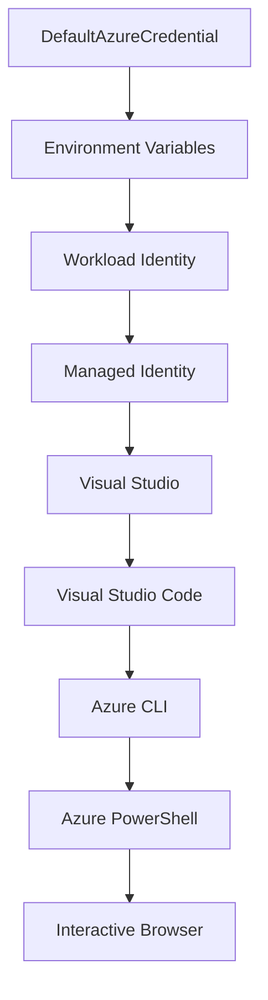

<!--
CO_OP_TRANSLATOR_METADATA:
{
  "original_hash": "fb0687bd0b166ecb0430dfeeed83487e",
  "translation_date": "2025-10-24T16:31:45+00:00",
  "source_file": "docs/getting-started/azd-basics.md",
  "language_code": "ru"
}
-->
# Основы AZD - Понимание Azure Developer CLI

# Основы AZD - Основные концепции и принципы

**Навигация по главам:**
- **📚 Домашняя страница курса**: [AZD для начинающих](../../README.md)
- **📖 Текущая глава**: Глава 1 - Основы и быстрый старт
- **⬅️ Предыдущая**: [Обзор курса](../../README.md#-chapter-1-foundation--quick-start)
- **➡️ Следующая**: [Установка и настройка](installation.md)
- **🚀 Следующая глава**: [Глава 2: Разработка с использованием ИИ](../ai-foundry/azure-ai-foundry-integration.md)

## Введение

Этот урок познакомит вас с Azure Developer CLI (azd) — мощным инструментом командной строки, который ускоряет переход от локальной разработки к развертыванию в Azure. Вы узнаете основные концепции, ключевые функции и поймете, как azd упрощает развертывание облачных приложений.

## Цели обучения

К концу этого урока вы:
- Поймете, что такое Azure Developer CLI и его основное назначение
- Изучите основные концепции, такие как шаблоны, окружения и сервисы
- Ознакомитесь с ключевыми функциями, включая разработку на основе шаблонов и инфраструктуру как код
- Разберетесь в структуре проекта azd и рабочем процессе
- Будете готовы установить и настроить azd для своей среды разработки

## Результаты обучения

После завершения урока вы сможете:
- Объяснить роль azd в современных рабочих процессах облачной разработки
- Определить компоненты структуры проекта azd
- Описать, как шаблоны, окружения и сервисы взаимодействуют друг с другом
- Понять преимущества использования инфраструктуры как кода с azd
- Распознать различные команды azd и их назначение

## Что такое Azure Developer CLI (azd)?

Azure Developer CLI (azd) — это инструмент командной строки, разработанный для ускорения перехода от локальной разработки к развертыванию в Azure. Он упрощает процесс создания, развертывания и управления облачными приложениями в Azure.

## Основные концепции

### Шаблоны
Шаблоны — это основа azd. Они включают:
- **Код приложения** — исходный код и зависимости
- **Определения инфраструктуры** — ресурсы Azure, описанные в Bicep или Terraform
- **Файлы конфигурации** — настройки и переменные окружения
- **Скрипты развертывания** — автоматизированные рабочие процессы развертывания

### Окружения
Окружения представляют собой различные цели развертывания:
- **Разработка** — для тестирования и разработки
- **Тестирование** — пред-производственная среда
- **Производство** — рабочая производственная среда

Каждое окружение имеет свои:
- Группу ресурсов Azure
- Настройки конфигурации
- Состояние развертывания

### Сервисы
Сервисы — это строительные блоки вашего приложения:
- **Frontend** — веб-приложения, SPA
- **Backend** — API, микросервисы
- **База данных** — решения для хранения данных
- **Хранилище** — файловое и блоб-хранилище

## Ключевые функции

### 1. Разработка на основе шаблонов
```bash
# Browse available templates
azd template list

# Initialize from a template
azd init --template <template-name>
```

### 2. Инфраструктура как код
- **Bicep** — специализированный язык Azure
- **Terraform** — инструмент для мультиоблачной инфраструктуры
- **ARM Templates** — шаблоны Azure Resource Manager

### 3. Интегрированные рабочие процессы
```bash
# Complete deployment workflow
azd up            # Provision + Deploy this is hands off for first time setup

# 🧪 NEW: Preview infrastructure changes before deployment (SAFE)
azd provision --preview    # Simulate infrastructure deployment without making changes

azd provision     # Create Azure resources if you update the infrastructure use this
azd deploy        # Deploy application code or redeploy application code once update
azd down          # Clean up resources
```

#### 🛡️ Безопасное планирование инфраструктуры с помощью Preview
Команда `azd provision --preview` — это революционное решение для безопасного развертывания:
- **Анализ без выполнения** — показывает, что будет создано, изменено или удалено
- **Нулевой риск** — никаких реальных изменений в вашей среде Azure
- **Командное сотрудничество** — возможность делиться результатами предварительного просмотра перед развертыванием
- **Оценка стоимости** — понимание затрат на ресурсы до их создания

```bash
# Example preview workflow
azd provision --preview           # See what will change
# Review the output, discuss with team
azd provision                     # Apply changes with confidence
```

### 4. Управление окружениями
```bash
# Create and manage environments
azd env new <environment-name>
azd env select <environment-name>
azd env list
```

## 📁 Структура проекта

Типичная структура проекта azd:
```
my-app/
├── .azd/                    # azd configuration
│   └── config.json
├── .azure/                  # Azure deployment artifacts
├── .devcontainer/          # Development container config
├── .github/workflows/      # GitHub Actions
├── .vscode/               # VS Code settings
├── infra/                 # Infrastructure code
│   ├── main.bicep        # Main infrastructure template
│   ├── main.parameters.json
│   └── modules/          # Reusable modules
├── src/                  # Application source code
│   ├── api/             # Backend services
│   └── web/             # Frontend application
├── azure.yaml           # azd project configuration
└── README.md
```

## 🔧 Файлы конфигурации

### azure.yaml
Основной файл конфигурации проекта:
```yaml
name: my-awesome-app
metadata:
  template: my-template@1.0.0

services:
  web:
    project: ./src/web
    language: js
    host: appservice
  api:
    project: ./src/api
    language: js
    host: appservice

hooks:
  preprovision:
    shell: pwsh
    run: echo "Preparing to provision..."
```

### .azure/config.json
Конфигурация, специфичная для окружения:
```json
{
  "version": 1,
  "defaultEnvironment": "dev",
  "environments": {
    "dev": {
      "subscriptionId": "your-subscription-id",
      "location": "eastus"
    }
  }
}
```

## 🎪 Общие рабочие процессы

### Начало нового проекта
```bash
# Method 1: Use existing template
azd init --template todo-nodejs-mongo

# Method 2: Start from scratch
azd init

# Method 3: Use current directory
azd init .
```

### Цикл разработки
```bash
# Set up development environment
azd auth login
azd env new dev
azd env select dev

# Deploy everything
azd up

# Make changes and redeploy
azd deploy

# Clean up when done
azd down --force --purge # command in the Azure Developer CLI is a **hard reset** for your environment—especially useful when you're troubleshooting failed deployments, cleaning up orphaned resources, or prepping for a fresh redeploy.
```

## Понимание команды `azd down --force --purge`
Команда `azd down --force --purge` — это мощный способ полностью удалить окружение azd и все связанные ресурсы. Вот разбор того, что делает каждый флаг:
```
--force
```
- Пропускает запросы на подтверждение.
- Полезно для автоматизации или скриптов, где ручной ввод невозможен.
- Обеспечивает выполнение удаления без прерываний, даже если CLI обнаруживает несоответствия.

```
--purge
```
Удаляет **все связанные метаданные**, включая:
Состояние окружения
Локальную папку `.azure`
Кэшированную информацию о развертывании
Предотвращает "запоминание" предыдущих развертываний, что может вызвать проблемы, такие как несоответствие групп ресурсов или устаревшие ссылки на реестры.

### Зачем использовать оба?
Если вы столкнулись с проблемами при использовании `azd up` из-за оставшегося состояния или частичных развертываний, эта комбинация обеспечивает **чистый лист**.

Особенно полезно после ручного удаления ресурсов в портале Azure или при переключении шаблонов, окружений или соглашений о наименовании групп ресурсов.

### Управление несколькими окружениями
```bash
# Create staging environment
azd env new staging
azd env select staging
azd up

# Switch back to dev
azd env select dev

# Compare environments
azd env list
```

## 🔐 Аутентификация и учетные данные

Понимание аутентификации имеет решающее значение для успешных развертываний с помощью azd. Azure использует несколько методов аутентификации, и azd использует ту же цепочку учетных данных, что и другие инструменты Azure.

### Аутентификация через Azure CLI (`az login`)

Перед использованием azd необходимо пройти аутентификацию в Azure. Наиболее распространенный метод — использование Azure CLI:

```bash
# Interactive login (opens browser)
az login

# Login with specific tenant
az login --tenant <tenant-id>

# Login with service principal
az login --service-principal -u <app-id> -p <password> --tenant <tenant-id>

# Check current login status
az account show

# List available subscriptions
az account list --output table

# Set default subscription
az account set --subscription <subscription-id>
```

### Поток аутентификации
1. **Интерактивный вход**: Открывает браузер по умолчанию для аутентификации
2. **Поток с кодом устройства**: Для сред без доступа к браузеру
3. **Служебный принципал**: Для автоматизации и сценариев CI/CD
4. **Управляемая идентичность**: Для приложений, размещенных в Azure

### DefaultAzureCredential Chain

`DefaultAzureCredential` — это тип учетных данных, который обеспечивает упрощенный процесс аутентификации, автоматически проверяя несколько источников учетных данных в определенном порядке:

#### Порядок цепочки учетных данных


#### 1. Переменные окружения
```bash
# Set environment variables for service principal
export AZURE_CLIENT_ID="<app-id>"
export AZURE_CLIENT_SECRET="<password>"
export AZURE_TENANT_ID="<tenant-id>"
```

#### 2. Workload Identity (Kubernetes/GitHub Actions)
Используется автоматически в:
- Azure Kubernetes Service (AKS) с Workload Identity
- GitHub Actions с федерацией OIDC
- Других сценариях федеративной идентичности

#### 3. Управляемая идентичность
Для ресурсов Azure, таких как:
- Виртуальные машины
- App Service
- Azure Functions
- Container Instances

```bash
# Check if running on Azure resource with managed identity
az account show --query "user.type" --output tsv
# Returns: "servicePrincipal" if using managed identity
```

#### 4. Интеграция с инструментами разработчика
- **Visual Studio**: Автоматически использует учетную запись, в которую выполнен вход
- **VS Code**: Использует учетные данные расширения Azure Account
- **Azure CLI**: Использует учетные данные `az login` (наиболее распространено для локальной разработки)

### Настройка аутентификации AZD

```bash
# Method 1: Use Azure CLI (Recommended for development)
az login
azd auth login  # Uses existing Azure CLI credentials

# Method 2: Direct azd authentication
azd auth login --use-device-code  # For headless environments

# Method 3: Check authentication status
azd auth login --check-status

# Method 4: Logout and re-authenticate
azd auth logout
azd auth login
```

### Лучшие практики аутентификации

#### Для локальной разработки
```bash
# 1. Login with Azure CLI
az login

# 2. Verify correct subscription
az account show
az account set --subscription "Your Subscription Name"

# 3. Use azd with existing credentials
azd auth login
```

#### Для конвейеров CI/CD
```yaml
# GitHub Actions example
- name: Azure Login
  uses: azure/login@v1
  with:
    creds: ${{ secrets.AZURE_CREDENTIALS }}

- name: Deploy with azd
  run: |
    azd auth login --client-id ${{ secrets.AZURE_CLIENT_ID }} \
                    --client-secret ${{ secrets.AZURE_CLIENT_SECRET }} \
                    --tenant-id ${{ secrets.AZURE_TENANT_ID }}
    azd up --no-prompt
```

#### Для производственных окружений
- Используйте **управляемую идентичность** при запуске на ресурсах Azure
- Используйте **служебный принципал** для сценариев автоматизации
- Избегайте хранения учетных данных в коде или файлах конфигурации
- Используйте **Azure Key Vault** для конфиденциальной конфигурации

### Распространенные проблемы с аутентификацией и их решения

#### Проблема: "Подписка не найдена"
```bash
# Solution: Set default subscription
az account list --output table
az account set --subscription "<subscription-id>"
azd env set AZURE_SUBSCRIPTION_ID "<subscription-id>"
```

#### Проблема: "Недостаточно прав"
```bash
# Solution: Check and assign required roles
az role assignment list --assignee $(az account show --query user.name --output tsv)

# Common required roles:
# - Contributor (for resource management)
# - User Access Administrator (for role assignments)
```

#### Проблема: "Срок действия токена истек"
```bash
# Solution: Re-authenticate
az logout
az login
azd auth logout
azd auth login
```

### Аутентификация в различных сценариях

#### Локальная разработка
```bash
# Personal development account
az login
azd auth login
```

#### Командная разработка
```bash
# Use specific tenant for organization
az login --tenant contoso.onmicrosoft.com
azd auth login
```

#### Мультиарендные сценарии
```bash
# Switch between tenants
az login --tenant tenant1.onmicrosoft.com
# Deploy to tenant 1
azd up

az login --tenant tenant2.onmicrosoft.com  
# Deploy to tenant 2
azd up
```

### Соображения безопасности

1. **Хранение учетных данных**: Никогда не храните учетные данные в исходном коде
2. **Ограничение области**: Используйте принцип минимальных привилегий для служебных принципалов
3. **Ротация токенов**: Регулярно обновляйте секреты служебных принципалов
4. **Журнал аудита**: Отслеживайте действия по аутентификации и развертыванию
5. **Сетевая безопасность**: Используйте частные конечные точки, если это возможно

### Устранение неполадок с аутентификацией

```bash
# Debug authentication issues
azd auth login --check-status
az account show
az account get-access-token

# Common diagnostic commands
whoami                          # Current user context
az ad signed-in-user show      # Azure AD user details
az group list                  # Test resource access
```

## Понимание команды `azd down --force --purge`

### Обнаружение
```bash
azd template list              # Browse templates
azd template show <template>   # Template details
azd init --help               # Initialization options
```

### Управление проектом
```bash
azd show                     # Project overview
azd env show                 # Current environment
azd config list             # Configuration settings
```

### Мониторинг
```bash
azd monitor                  # Open Azure portal
azd pipeline config          # Set up CI/CD
azd logs                     # View application logs
```

## Лучшие практики

### 1. Используйте осмысленные имена
```bash
# Good
azd env new production-east
azd init --template web-app-secure

# Avoid
azd env new env1
azd init --template template1
```

### 2. Используйте шаблоны
- Начинайте с существующих шаблонов
- Настраивайте их под свои нужды
- Создавайте повторно используемые шаблоны для своей организации

### 3. Изоляция окружений
- Используйте отдельные окружения для разработки/тестирования/производства
- Никогда не развертывайте напрямую в производство с локальной машины
- Используйте конвейеры CI/CD для развертывания в производственной среде

### 4. Управление конфигурацией
- Используйте переменные окружения для конфиденциальных данных
- Храните конфигурацию в системе контроля версий
- Документируйте настройки, специфичные для окружений

## Прогресс обучения

### Начинающий (1-2 недели)
1. Установите azd и выполните аутентификацию
2. Разверните простой шаблон
3. Поймите структуру проекта
4. Изучите основные команды (up, down, deploy)

### Средний уровень (3-4 недели)
1. Настройте шаблоны
2. Управляйте несколькими окружениями
3. Поймите инфраструктуру как код
4. Настройте конвейеры CI/CD

### Продвинутый уровень (5+ недель)
1. Создавайте собственные шаблоны
2. Изучите сложные инфраструктурные паттерны
3. Развертывание в нескольких регионах
4. Конфигурации корпоративного уровня

## Следующие шаги

**📖 Продолжение обучения в главе 1:**
- [Установка и настройка](installation.md) — Установите и настройте azd
- [Ваш первый проект](first-project.md) — Пройдите практическое руководство
- [Руководство по конфигурации](configuration.md) — Расширенные параметры конфигурации

**🎯 Готовы к следующей главе?**
- [Глава 2: Разработка с использованием ИИ](../ai-foundry/azure-ai-foundry-integration.md) — Начните создавать приложения с использованием ИИ

## Дополнительные ресурсы

- [Обзор Azure Developer CLI](https://learn.microsoft.com/en-us/azure/developer/azure-developer-cli/)
- [Галерея шаблонов](https://azure.github.io/awesome-azd/)
- [Примеры сообщества](https://github.com/Azure-Samples)

---

**Навигация по главам:**
- **📚 Домашняя страница курса**: [AZD для начинающих](../../README.md)
- **📖 Текущая глава**: Глава 1 - Основы и быстрый старт  
- **⬅️ Предыдущая**: [Обзор курса](../../README.md#-chapter-1-foundation--quick-start)
- **➡️ Следующая**: [Установка и настройка](installation.md)
- **🚀 Следующая глава**: [Глава 2: Разработка с использованием ИИ](../ai-foundry/azure-ai-foundry-integration.md)

---

**Отказ от ответственности**:  
Этот документ был переведен с использованием сервиса автоматического перевода [Co-op Translator](https://github.com/Azure/co-op-translator). Хотя мы стремимся к точности, пожалуйста, учитывайте, что автоматические переводы могут содержать ошибки или неточности. Оригинальный документ на его родном языке следует считать авторитетным источником. Для получения критически важной информации рекомендуется профессиональный перевод человеком. Мы не несем ответственности за любые недоразумения или неправильные интерпретации, возникающие в результате использования данного перевода.