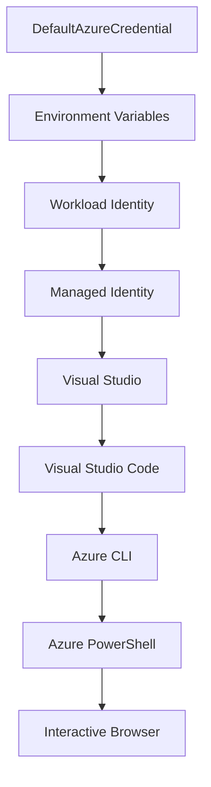

<!--
CO_OP_TRANSLATOR_METADATA:
{
  "original_hash": "fb0687bd0b166ecb0430dfeeed83487e",
  "translation_date": "2025-10-24T18:00:23+00:00",
  "source_file": "docs/getting-started/azd-basics.md",
  "language_code": "sk"
}
-->
# Základy AZD - Pochopenie Azure Developer CLI

# Základy AZD - Hlavné koncepty a základy

**Navigácia kapitolou:**
- **📚 Domov kurzu**: [AZD pre začiatočníkov](../../README.md)
- **📖 Aktuálna kapitola**: Kapitola 1 - Základy & Rýchly štart
- **⬅️ Predchádzajúca**: [Prehľad kurzu](../../README.md#-chapter-1-foundation--quick-start)
- **➡️ Ďalšia**: [Inštalácia & Nastavenie](installation.md)
- **🚀 Ďalšia kapitola**: [Kapitola 2: AI-First Development](../ai-foundry/azure-ai-foundry-integration.md)

## Úvod

Táto lekcia vás zoznámi s Azure Developer CLI (azd), výkonným nástrojom príkazového riadku, ktorý urýchľuje váš prechod od lokálneho vývoja k nasadeniu na Azure. Naučíte sa základné koncepty, hlavné funkcie a pochopíte, ako azd zjednodušuje nasadenie cloudových aplikácií.

## Ciele učenia

Na konci tejto lekcie budete:
- Rozumieť, čo je Azure Developer CLI a aký je jeho hlavný účel
- Naučíte sa základné koncepty šablón, prostredí a služieb
- Preskúmate kľúčové funkcie vrátane vývoja na základe šablón a Infrastructure as Code
- Pochopíte štruktúru projektu azd a pracovný postup
- Budete pripravení na inštaláciu a konfiguráciu azd pre vaše vývojové prostredie

## Výsledky učenia

Po dokončení tejto lekcie budete schopní:
- Vysvetliť úlohu azd v moderných pracovných postupoch cloudového vývoja
- Identifikovať komponenty štruktúry projektu azd
- Opísať, ako šablóny, prostredia a služby spolupracujú
- Pochopiť výhody Infrastructure as Code s azd
- Rozpoznať rôzne príkazy azd a ich účely

## Čo je Azure Developer CLI (azd)?

Azure Developer CLI (azd) je nástroj príkazového riadku navrhnutý na urýchlenie vášho prechodu od lokálneho vývoja k nasadeniu na Azure. Zjednodušuje proces budovania, nasadzovania a správy cloudových aplikácií na Azure.

## Základné koncepty

### Šablóny
Šablóny sú základom azd. Obsahujú:
- **Kód aplikácie** - Váš zdrojový kód a závislosti
- **Definície infraštruktúry** - Azure zdroje definované v Bicep alebo Terraform
- **Konfiguračné súbory** - Nastavenia a environmentálne premenné
- **Nasadzovacie skripty** - Automatizované pracovné postupy nasadenia

### Prostredia
Prostredia predstavujú rôzne ciele nasadenia:
- **Vývojové** - Na testovanie a vývoj
- **Staging** - Predprodukčné prostredie
- **Produkčné** - Živé produkčné prostredie

Každé prostredie si udržiava vlastné:
- Azure resource group
- Konfiguračné nastavenia
- Stav nasadenia

### Služby
Služby sú stavebnými blokmi vašej aplikácie:
- **Frontend** - Webové aplikácie, SPAs
- **Backend** - API, mikroslužby
- **Databáza** - Riešenia na ukladanie dát
- **Úložisko** - Ukladanie súborov a blobov

## Kľúčové funkcie

### 1. Vývoj na základe šablón
```bash
# Browse available templates
azd template list

# Initialize from a template
azd init --template <template-name>
```

### 2. Infrastructure as Code
- **Bicep** - Doménovo špecifický jazyk Azure
- **Terraform** - Nástroj pre infraštruktúru na viacerých cloudoch
- **ARM Templates** - Šablóny Azure Resource Manager

### 3. Integrované pracovné postupy
```bash
# Complete deployment workflow
azd up            # Provision + Deploy this is hands off for first time setup

# 🧪 NEW: Preview infrastructure changes before deployment (SAFE)
azd provision --preview    # Simulate infrastructure deployment without making changes

azd provision     # Create Azure resources if you update the infrastructure use this
azd deploy        # Deploy application code or redeploy application code once update
azd down          # Clean up resources
```

#### 🛡️ Bezpečné plánovanie infraštruktúry s náhľadom
Príkaz `azd provision --preview` je pre bezpečné nasadenia prelomový:
- **Analýza na sucho** - Ukazuje, čo bude vytvorené, upravené alebo zmazané
- **Žiadne riziko** - Žiadne skutočné zmeny sa nevykonajú vo vašom Azure prostredí
- **Tímová spolupráca** - Zdieľajte výsledky náhľadu pred nasadením
- **Odhad nákladov** - Pochopte náklady na zdroje pred záväzkom

```bash
# Example preview workflow
azd provision --preview           # See what will change
# Review the output, discuss with team
azd provision                     # Apply changes with confidence
```

### 4. Správa prostredí
```bash
# Create and manage environments
azd env new <environment-name>
azd env select <environment-name>
azd env list
```

## 📁 Štruktúra projektu

Typická štruktúra projektu azd:
```
my-app/
├── .azd/                    # azd configuration
│   └── config.json
├── .azure/                  # Azure deployment artifacts
├── .devcontainer/          # Development container config
├── .github/workflows/      # GitHub Actions
├── .vscode/               # VS Code settings
├── infra/                 # Infrastructure code
│   ├── main.bicep        # Main infrastructure template
│   ├── main.parameters.json
│   └── modules/          # Reusable modules
├── src/                  # Application source code
│   ├── api/             # Backend services
│   └── web/             # Frontend application
├── azure.yaml           # azd project configuration
└── README.md
```

## 🔧 Konfiguračné súbory

### azure.yaml
Hlavný konfiguračný súbor projektu:
```yaml
name: my-awesome-app
metadata:
  template: my-template@1.0.0

services:
  web:
    project: ./src/web
    language: js
    host: appservice
  api:
    project: ./src/api
    language: js
    host: appservice

hooks:
  preprovision:
    shell: pwsh
    run: echo "Preparing to provision..."
```

### .azure/config.json
Konfigurácia špecifická pre prostredie:
```json
{
  "version": 1,
  "defaultEnvironment": "dev",
  "environments": {
    "dev": {
      "subscriptionId": "your-subscription-id",
      "location": "eastus"
    }
  }
}
```

## 🎪 Bežné pracovné postupy

### Začiatok nového projektu
```bash
# Method 1: Use existing template
azd init --template todo-nodejs-mongo

# Method 2: Start from scratch
azd init

# Method 3: Use current directory
azd init .
```

### Vývojový cyklus
```bash
# Set up development environment
azd auth login
azd env new dev
azd env select dev

# Deploy everything
azd up

# Make changes and redeploy
azd deploy

# Clean up when done
azd down --force --purge # command in the Azure Developer CLI is a **hard reset** for your environment—especially useful when you're troubleshooting failed deployments, cleaning up orphaned resources, or prepping for a fresh redeploy.
```

## Pochopenie `azd down --force --purge`
Príkaz `azd down --force --purge` je silný spôsob, ako úplne odstrániť vaše azd prostredie a všetky súvisiace zdroje. Tu je rozpis, čo jednotlivé príznaky robia:
```
--force
```
- Preskočí potvrdenia.
- Užitočné pre automatizáciu alebo skriptovanie, kde manuálny vstup nie je možný.
- Zabezpečuje, že odstránenie prebehne bez prerušenia, aj keď CLI zistí nekonzistencie.

```
--purge
```
Odstráni **všetky súvisiace metadáta**, vrátane:
Stavu prostredia
Lokálneho priečinka `.azure`
Informácií o uloženom nasadení
Zabraňuje azd "pamätať si" predchádzajúce nasadenia, čo môže spôsobiť problémy ako nesúlad resource groups alebo zastarané registry.

### Prečo používať oboje?
Keď narazíte na problémy s `azd up` kvôli pretrvávajúcemu stavu alebo čiastočným nasadeniam, táto kombinácia zabezpečí **čistý štart**.

Je obzvlášť užitočná po manuálnom odstránení zdrojov v Azure portáli alebo pri zmene šablón, prostredí alebo konvencií pomenovania resource groups.

### Správa viacerých prostredí
```bash
# Create staging environment
azd env new staging
azd env select staging
azd up

# Switch back to dev
azd env select dev

# Compare environments
azd env list
```

## 🔐 Autentifikácia a poverenia

Pochopenie autentifikácie je kľúčové pre úspešné nasadenia azd. Azure používa viacero metód autentifikácie a azd využíva rovnaký reťazec poverení ako ostatné nástroje Azure.

### Autentifikácia Azure CLI (`az login`)

Pred použitím azd sa musíte autentifikovať s Azure. Najbežnejšou metódou je použitie Azure CLI:

```bash
# Interactive login (opens browser)
az login

# Login with specific tenant
az login --tenant <tenant-id>

# Login with service principal
az login --service-principal -u <app-id> -p <password> --tenant <tenant-id>

# Check current login status
az account show

# List available subscriptions
az account list --output table

# Set default subscription
az account set --subscription <subscription-id>
```

### Tok autentifikácie
1. **Interaktívne prihlásenie**: Otvorí váš predvolený prehliadač na autentifikáciu
2. **Tok kódu zariadenia**: Pre prostredia bez prístupu k prehliadaču
3. **Service Principal**: Pre automatizáciu a scenáre CI/CD
4. **Managed Identity**: Pre aplikácie hostované na Azure

### DefaultAzureCredential Chain

`DefaultAzureCredential` je typ poverenia, ktorý poskytuje zjednodušený autentifikačný zážitok automatickým skúšaním viacerých zdrojov poverení v špecifickom poradí:

#### Poradie reťazca poverení


#### 1. Environmentálne premenné
```bash
# Set environment variables for service principal
export AZURE_CLIENT_ID="<app-id>"
export AZURE_CLIENT_SECRET="<password>"
export AZURE_TENANT_ID="<tenant-id>"
```

#### 2. Workload Identity (Kubernetes/GitHub Actions)
Používa sa automaticky v:
- Azure Kubernetes Service (AKS) s Workload Identity
- GitHub Actions s OIDC federáciou
- Iné scenáre federovanej identity

#### 3. Managed Identity
Pre Azure zdroje ako:
- Virtuálne stroje
- App Service
- Azure Functions
- Container Instances

```bash
# Check if running on Azure resource with managed identity
az account show --query "user.type" --output tsv
# Returns: "servicePrincipal" if using managed identity
```

#### 4. Integrácia vývojárskych nástrojov
- **Visual Studio**: Automaticky používa prihlásený účet
- **VS Code**: Používa poverenia rozšírenia Azure Account
- **Azure CLI**: Používa poverenia `az login` (najbežnejšie pre lokálny vývoj)

### Nastavenie autentifikácie AZD

```bash
# Method 1: Use Azure CLI (Recommended for development)
az login
azd auth login  # Uses existing Azure CLI credentials

# Method 2: Direct azd authentication
azd auth login --use-device-code  # For headless environments

# Method 3: Check authentication status
azd auth login --check-status

# Method 4: Logout and re-authenticate
azd auth logout
azd auth login
```

### Najlepšie praktiky autentifikácie

#### Pre lokálny vývoj
```bash
# 1. Login with Azure CLI
az login

# 2. Verify correct subscription
az account show
az account set --subscription "Your Subscription Name"

# 3. Use azd with existing credentials
azd auth login
```

#### Pre CI/CD pipelines
```yaml
# GitHub Actions example
- name: Azure Login
  uses: azure/login@v1
  with:
    creds: ${{ secrets.AZURE_CREDENTIALS }}

- name: Deploy with azd
  run: |
    azd auth login --client-id ${{ secrets.AZURE_CLIENT_ID }} \
                    --client-secret ${{ secrets.AZURE_CLIENT_SECRET }} \
                    --tenant-id ${{ secrets.AZURE_TENANT_ID }}
    azd up --no-prompt
```

#### Pre produkčné prostredia
- Používajte **Managed Identity** pri spúšťaní na Azure zdrojoch
- Používajte **Service Principal** pre automatizačné scenáre
- Vyhnite sa ukladaniu poverení do kódu alebo konfiguračných súborov
- Používajte **Azure Key Vault** pre citlivé konfigurácie

### Bežné problémy s autentifikáciou a riešenia

#### Problém: "Nenašla sa žiadna predplatná"
```bash
# Solution: Set default subscription
az account list --output table
az account set --subscription "<subscription-id>"
azd env set AZURE_SUBSCRIPTION_ID "<subscription-id>"
```

#### Problém: "Nedostatočné povolenia"
```bash
# Solution: Check and assign required roles
az role assignment list --assignee $(az account show --query user.name --output tsv)

# Common required roles:
# - Contributor (for resource management)
# - User Access Administrator (for role assignments)
```

#### Problém: "Platnosť tokenu vypršala"
```bash
# Solution: Re-authenticate
az logout
az login
azd auth logout
azd auth login
```

### Autentifikácia v rôznych scenároch

#### Lokálny vývoj
```bash
# Personal development account
az login
azd auth login
```

#### Tímový vývoj
```bash
# Use specific tenant for organization
az login --tenant contoso.onmicrosoft.com
azd auth login
```

#### Scenáre s viacerými nájomníkmi
```bash
# Switch between tenants
az login --tenant tenant1.onmicrosoft.com
# Deploy to tenant 1
azd up

az login --tenant tenant2.onmicrosoft.com  
# Deploy to tenant 2
azd up
```

### Bezpečnostné úvahy

1. **Ukladanie poverení**: Nikdy neukladajte poverenia do zdrojového kódu
2. **Obmedzenie rozsahu**: Používajte princíp najmenej potrebných právomocí pre service principals
3. **Rotácia tokenov**: Pravidelne rotujte tajomstvá service principal
4. **Auditná stopa**: Monitorujte autentifikačné a nasadzovacie aktivity
5. **Sieťová bezpečnosť**: Používajte privátne endpointy, keď je to možné

### Riešenie problémov s autentifikáciou

```bash
# Debug authentication issues
azd auth login --check-status
az account show
az account get-access-token

# Common diagnostic commands
whoami                          # Current user context
az ad signed-in-user show      # Azure AD user details
az group list                  # Test resource access
```

## Pochopenie `azd down --force --purge`

### Objavovanie
```bash
azd template list              # Browse templates
azd template show <template>   # Template details
azd init --help               # Initialization options
```

### Správa projektov
```bash
azd show                     # Project overview
azd env show                 # Current environment
azd config list             # Configuration settings
```

### Monitorovanie
```bash
azd monitor                  # Open Azure portal
azd pipeline config          # Set up CI/CD
azd logs                     # View application logs
```

## Najlepšie praktiky

### 1. Používajte zmysluplné názvy
```bash
# Good
azd env new production-east
azd init --template web-app-secure

# Avoid
azd env new env1
azd init --template template1
```

### 2. Využívajte šablóny
- Začnite s existujúcimi šablónami
- Prispôsobte si ich podľa svojich potrieb
- Vytvorte opakovane použiteľné šablóny pre vašu organizáciu

### 3. Izolácia prostredí
- Používajte samostatné prostredia pre vývoj/staging/produkciu
- Nikdy nenasadzujte priamo do produkcie z lokálneho stroja
- Používajte CI/CD pipelines pre produkčné nasadenia

### 4. Správa konfigurácie
- Používajte environmentálne premenné pre citlivé údaje
- Udržujte konfiguráciu vo verziovacej kontrole
- Dokumentujte nastavenia špecifické pre prostredie

## Postup učenia

### Začiatočník (1-2 týždne)
1. Nainštalujte azd a autentifikujte sa
2. Nasadte jednoduchú šablónu
3. Pochopte štruktúru projektu
4. Naučte sa základné príkazy (up, down, deploy)

### Stredne pokročilý (3-4 týždne)
1. Prispôsobte šablóny
2. Spravujte viaceré prostredia
3. Pochopte kód infraštruktúry
4. Nastavte CI/CD pipelines

### Pokročilý (5+ týždňov)
1. Vytvorte vlastné šablóny
2. Pokročilé vzory infraštruktúry
3. Nasadenia vo viacerých regiónoch
4. Konfigurácie na úrovni podniku

## Ďalšie kroky

**📖 Pokračujte v učení kapitoly 1:**
- [Inštalácia & Nastavenie](installation.md) - Nainštalujte a nakonfigurujte azd
- [Váš prvý projekt](first-project.md) - Dokončite praktický tutoriál
- [Sprievodca konfiguráciou](configuration.md) - Pokročilé možnosti konfigurácie

**🎯 Pripravení na ďalšiu kapitolu?**
- [Kapitola 2: AI-First Development](../ai-foundry/azure-ai-foundry-integration.md) - Začnite budovať AI aplikácie

## Ďalšie zdroje

- [Prehľad Azure Developer CLI](https://learn.microsoft.com/en-us/azure/developer/azure-developer-cli/)
- [Galéria šablón](https://azure.github.io/awesome-azd/)
- [Ukážky komunity](https://github.com/Azure-Samples)

---

**Navigácia kapitolou:**
- **📚 Domov kurzu**: [AZD pre začiatočníkov](../../README.md)
- **📖 Aktuálna kapitola**: Kapitola 1 - Základy & Rýchly štart  
- **⬅️ Predchádzajúca**: [Prehľad kurzu](../../README.md#-chapter-1-foundation--quick-start)
- **➡️ Ďalšia**: [Inštalácia & Nastavenie](installation.md)
- **🚀 Ďalšia kapitola**: [Kapitola 2: AI-First Development](../ai-foundry/azure-ai-foundry-integration.md)

---

**Zrieknutie sa zodpovednosti**:  
Tento dokument bol preložený pomocou služby AI prekladu [Co-op Translator](https://github.com/Azure/co-op-translator). Aj keď sa snažíme o presnosť, prosím, berte na vedomie, že automatizované preklady môžu obsahovať chyby alebo nepresnosti. Pôvodný dokument v jeho rodnom jazyku by mal byť považovaný za autoritatívny zdroj. Pre kritické informácie sa odporúča profesionálny ľudský preklad. Nenesieme zodpovednosť za akékoľvek nedorozumenia alebo nesprávne interpretácie vyplývajúce z použitia tohto prekladu.