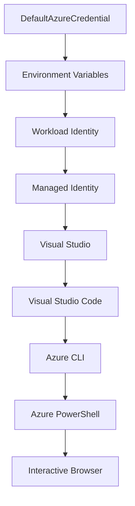

<!--
CO_OP_TRANSLATOR_METADATA:
{
  "original_hash": "fb0687bd0b166ecb0430dfeeed83487e",
  "translation_date": "2025-10-24T18:13:55+00:00",
  "source_file": "docs/getting-started/azd-basics.md",
  "language_code": "sl"
}
-->
# AZD Osnove - Razumevanje Azure Developer CLI

# AZD Osnove - Ključni koncepti in temelji

**Navigacija po poglavjih:**
- **📚 Domača stran tečaja**: [AZD Za začetnike](../../README.md)
- **📖 Trenutno poglavje**: Poglavje 1 - Temelji in hitri začetek
- **⬅️ Prejšnje**: [Pregled tečaja](../../README.md#-chapter-1-foundation--quick-start)
- **➡️ Naslednje**: [Namestitev in nastavitev](installation.md)
- **🚀 Naslednje poglavje**: [Poglavje 2: Razvoj z AI](../ai-foundry/azure-ai-foundry-integration.md)

## Uvod

Ta lekcija vas bo seznanila z Azure Developer CLI (azd), zmogljivim orodjem ukazne vrstice, ki pospeši prehod od lokalnega razvoja do uvajanja v Azure. Spoznali boste osnovne koncepte, ključne funkcije in razumeli, kako azd poenostavi uvajanje aplikacij, zasnovanih za oblak.

## Cilji učenja

Do konca te lekcije boste:
- Razumeli, kaj je Azure Developer CLI in njegov glavni namen
- Spoznali ključne koncepte, kot so predloge, okolja in storitve
- Raziskali ključne funkcije, vključno z razvojem na podlagi predlog in infrastrukturo kot kodo
- Razumeli strukturo projekta azd in delovni proces
- Pripravljeni na namestitev in konfiguracijo azd za vaš razvojni okolje

## Rezultati učenja

Po zaključku te lekcije boste lahko:
- Razložili vlogo azd v sodobnih delovnih procesih razvoja v oblaku
- Identificirali komponente strukture projekta azd
- Opisali, kako predloge, okolja in storitve delujejo skupaj
- Razumeli prednosti infrastrukture kot kode z azd
- Prepoznali različne ukaze azd in njihove namene

## Kaj je Azure Developer CLI (azd)?

Azure Developer CLI (azd) je orodje ukazne vrstice, zasnovano za pospešitev prehoda od lokalnega razvoja do uvajanja v Azure. Poenostavi proces gradnje, uvajanja in upravljanja aplikacij, zasnovanih za oblak, na platformi Azure.

## Ključni koncepti

### Predloge
Predloge so temelj azd. Vsebujejo:
- **Kodo aplikacije** - Vašo izvorno kodo in odvisnosti
- **Definicije infrastrukture** - Azure viri, definirani v Bicep ali Terraform
- **Konfiguracijske datoteke** - Nastavitve in okoljske spremenljivke
- **Skripte za uvajanje** - Avtomatizirani procesi uvajanja

### Okolja
Okolja predstavljajo različne cilje uvajanja:
- **Razvojno** - Za testiranje in razvoj
- **Staging** - Predprodukcijsko okolje
- **Produkcijsko** - Živo produkcijsko okolje

Vsako okolje ima svoje:
- Skupino virov Azure
- Konfiguracijske nastavitve
- Stanje uvajanja

### Storitve
Storitve so gradniki vaše aplikacije:
- **Frontend** - Spletne aplikacije, SPAs
- **Backend** - API-ji, mikrostoritve
- **Baza podatkov** - Rešitve za shranjevanje podatkov
- **Shranjevanje** - Shranjevanje datotek in blobov

## Ključne funkcije

### 1. Razvoj na podlagi predlog
```bash
# Browse available templates
azd template list

# Initialize from a template
azd init --template <template-name>
```

### 2. Infrastruktura kot koda
- **Bicep** - Jezik, specifičen za Azure
- **Terraform** - Orodje za infrastrukturo v več oblakih
- **ARM Predloge** - Predloge Azure Resource Manager

### 3. Integrirani delovni procesi
```bash
# Complete deployment workflow
azd up            # Provision + Deploy this is hands off for first time setup

# 🧪 NEW: Preview infrastructure changes before deployment (SAFE)
azd provision --preview    # Simulate infrastructure deployment without making changes

azd provision     # Create Azure resources if you update the infrastructure use this
azd deploy        # Deploy application code or redeploy application code once update
azd down          # Clean up resources
```

#### 🛡️ Varno načrtovanje infrastrukture s predogledom
Ukaz `azd provision --preview` je izjemno koristen za varno uvajanje:
- **Analiza suhega zagona** - Prikaže, kaj bo ustvarjeno, spremenjeno ali izbrisano
- **Brez tveganja** - Brez dejanskih sprememb v vašem Azure okolju
- **Sodelovanje ekipe** - Delite rezultate predogleda pred uvajanjem
- **Ocena stroškov** - Razumite stroške virov pred zavezo

```bash
# Example preview workflow
azd provision --preview           # See what will change
# Review the output, discuss with team
azd provision                     # Apply changes with confidence
```

### 4. Upravljanje okolij
```bash
# Create and manage environments
azd env new <environment-name>
azd env select <environment-name>
azd env list
```

## 📁 Struktura projekta

Tipična struktura projekta azd:
```
my-app/
├── .azd/                    # azd configuration
│   └── config.json
├── .azure/                  # Azure deployment artifacts
├── .devcontainer/          # Development container config
├── .github/workflows/      # GitHub Actions
├── .vscode/               # VS Code settings
├── infra/                 # Infrastructure code
│   ├── main.bicep        # Main infrastructure template
│   ├── main.parameters.json
│   └── modules/          # Reusable modules
├── src/                  # Application source code
│   ├── api/             # Backend services
│   └── web/             # Frontend application
├── azure.yaml           # azd project configuration
└── README.md
```

## 🔧 Konfiguracijske datoteke

### azure.yaml
Glavna konfiguracijska datoteka projekta:
```yaml
name: my-awesome-app
metadata:
  template: my-template@1.0.0

services:
  web:
    project: ./src/web
    language: js
    host: appservice
  api:
    project: ./src/api
    language: js
    host: appservice

hooks:
  preprovision:
    shell: pwsh
    run: echo "Preparing to provision..."
```

### .azure/config.json
Konfiguracija, specifična za okolje:
```json
{
  "version": 1,
  "defaultEnvironment": "dev",
  "environments": {
    "dev": {
      "subscriptionId": "your-subscription-id",
      "location": "eastus"
    }
  }
}
```

## 🎪 Pogosti delovni procesi

### Začetek novega projekta
```bash
# Method 1: Use existing template
azd init --template todo-nodejs-mongo

# Method 2: Start from scratch
azd init

# Method 3: Use current directory
azd init .
```

### Razvojni cikel
```bash
# Set up development environment
azd auth login
azd env new dev
azd env select dev

# Deploy everything
azd up

# Make changes and redeploy
azd deploy

# Clean up when done
azd down --force --purge # command in the Azure Developer CLI is a **hard reset** for your environment—especially useful when you're troubleshooting failed deployments, cleaning up orphaned resources, or prepping for a fresh redeploy.
```

## Razumevanje `azd down --force --purge`
Ukaz `azd down --force --purge` je močan način za popolno odstranitev vašega azd okolja in vseh povezanih virov. Tukaj je razčlenitev, kaj pomeni vsaka zastavica:
```
--force
```
- Preskoči potrditvene pozive.
- Koristno za avtomatizacijo ali skriptiranje, kjer ročni vnos ni izvedljiv.
- Zagotavlja, da se odstranitev nadaljuje brez prekinitve, tudi če CLI zazna neskladnosti.

```
--purge
```
Izbriše **vse povezane metapodatke**, vključno z:
Stanje okolja
Lokalna mapa `.azure`
Predpomnjene informacije o uvajanju
Preprečuje, da bi azd "zapomnil" prejšnja uvajanja, kar lahko povzroči težave, kot so neskladne skupine virov ali zastarele reference registracije.

### Zakaj uporabiti oboje?
Ko naletite na težave z `azd up` zaradi preostalega stanja ali delnih uvajanj, ta kombinacija zagotavlja **čisto stanje**.

To je še posebej koristno po ročnih brisanjih virov v Azure portalu ali pri menjavi predlog, okolij ali konvencij poimenovanja skupin virov.

### Upravljanje več okolij
```bash
# Create staging environment
azd env new staging
azd env select staging
azd up

# Switch back to dev
azd env select dev

# Compare environments
azd env list
```

## 🔐 Avtentikacija in poverilnice

Razumevanje avtentikacije je ključnega pomena za uspešno uvajanje z azd. Azure uporablja več metod avtentikacije, azd pa izkorišča isto verigo poverilnic, kot jo uporabljajo druga orodja Azure.

### Avtentikacija Azure CLI (`az login`)

Pred uporabo azd se morate avtenticirati z Azure. Najpogostejša metoda je uporaba Azure CLI:

```bash
# Interactive login (opens browser)
az login

# Login with specific tenant
az login --tenant <tenant-id>

# Login with service principal
az login --service-principal -u <app-id> -p <password> --tenant <tenant-id>

# Check current login status
az account show

# List available subscriptions
az account list --output table

# Set default subscription
az account set --subscription <subscription-id>
```

### Potek avtentikacije
1. **Interaktivna prijava**: Odpre vaš privzeti brskalnik za avtentikacijo
2. **Device Code Flow**: Za okolja brez dostopa do brskalnika
3. **Service Principal**: Za avtomatizacijo in scenarije CI/CD
4. **Managed Identity**: Za aplikacije, gostovane na Azure

### Veriga poverilnic DefaultAzureCredential

`DefaultAzureCredential` je vrsta poverilnic, ki zagotavlja poenostavljeno izkušnjo avtentikacije z avtomatskim poskusom več virov poverilnic v določenem vrstnem redu:

#### Vrstni red verige poverilnic


#### 1. Okoljske spremenljivke
```bash
# Set environment variables for service principal
export AZURE_CLIENT_ID="<app-id>"
export AZURE_CLIENT_SECRET="<password>"
export AZURE_TENANT_ID="<tenant-id>"
```

#### 2. Workload Identity (Kubernetes/GitHub Actions)
Samodejno se uporablja v:
- Azure Kubernetes Service (AKS) z Workload Identity
- GitHub Actions z OIDC federacijo
- Drugih scenarijih federirane identitete

#### 3. Managed Identity
Za Azure vire, kot so:
- Virtualni stroji
- App Service
- Azure Functions
- Container Instances

```bash
# Check if running on Azure resource with managed identity
az account show --query "user.type" --output tsv
# Returns: "servicePrincipal" if using managed identity
```

#### 4. Integracija z razvojnimi orodji
- **Visual Studio**: Samodejno uporablja prijavljen račun
- **VS Code**: Uporablja poverilnice razširitve Azure Account
- **Azure CLI**: Uporablja poverilnice `az login` (najpogostejše za lokalni razvoj)

### Nastavitev avtentikacije z AZD

```bash
# Method 1: Use Azure CLI (Recommended for development)
az login
azd auth login  # Uses existing Azure CLI credentials

# Method 2: Direct azd authentication
azd auth login --use-device-code  # For headless environments

# Method 3: Check authentication status
azd auth login --check-status

# Method 4: Logout and re-authenticate
azd auth logout
azd auth login
```

### Najboljše prakse avtentikacije

#### Za lokalni razvoj
```bash
# 1. Login with Azure CLI
az login

# 2. Verify correct subscription
az account show
az account set --subscription "Your Subscription Name"

# 3. Use azd with existing credentials
azd auth login
```

#### Za CI/CD pipelines
```yaml
# GitHub Actions example
- name: Azure Login
  uses: azure/login@v1
  with:
    creds: ${{ secrets.AZURE_CREDENTIALS }}

- name: Deploy with azd
  run: |
    azd auth login --client-id ${{ secrets.AZURE_CLIENT_ID }} \
                    --client-secret ${{ secrets.AZURE_CLIENT_SECRET }} \
                    --tenant-id ${{ secrets.AZURE_TENANT_ID }}
    azd up --no-prompt
```

#### Za produkcijska okolja
- Uporabite **Managed Identity** pri izvajanju na Azure virih
- Uporabite **Service Principal** za scenarije avtomatizacije
- Izogibajte se shranjevanju poverilnic v kodi ali konfiguracijskih datotekah
- Uporabite **Azure Key Vault** za občutljive konfiguracije

### Pogoste težave z avtentikacijo in rešitve

#### Težava: "Ni najdena nobena naročnina"
```bash
# Solution: Set default subscription
az account list --output table
az account set --subscription "<subscription-id>"
azd env set AZURE_SUBSCRIPTION_ID "<subscription-id>"
```

#### Težava: "Nezadostna dovoljenja"
```bash
# Solution: Check and assign required roles
az role assignment list --assignee $(az account show --query user.name --output tsv)

# Common required roles:
# - Contributor (for resource management)
# - User Access Administrator (for role assignments)
```

#### Težava: "Žeton je potekel"
```bash
# Solution: Re-authenticate
az logout
az login
azd auth logout
azd auth login
```

### Avtentikacija v različnih scenarijih

#### Lokalni razvoj
```bash
# Personal development account
az login
azd auth login
```

#### Razvoj ekipe
```bash
# Use specific tenant for organization
az login --tenant contoso.onmicrosoft.com
azd auth login
```

#### Scenariji z več najemniki
```bash
# Switch between tenants
az login --tenant tenant1.onmicrosoft.com
# Deploy to tenant 1
azd up

az login --tenant tenant2.onmicrosoft.com  
# Deploy to tenant 2
azd up
```

### Varnostni vidiki

1. **Shranjevanje poverilnic**: Nikoli ne shranjujte poverilnic v izvorni kodi
2. **Omejitev obsega**: Uporabite načelo najmanjših privilegijev za service principals
3. **Rotacija žetonov**: Redno rotirajte skrivnosti service principal
4. **Sledljivost**: Spremljajte aktivnosti avtentikacije in uvajanja
5. **Omrežna varnost**: Uporabljajte zasebne končne točke, kadar je to mogoče

### Odpravljanje težav z avtentikacijo

```bash
# Debug authentication issues
azd auth login --check-status
az account show
az account get-access-token

# Common diagnostic commands
whoami                          # Current user context
az ad signed-in-user show      # Azure AD user details
az group list                  # Test resource access
```

## Razumevanje `azd down --force --purge`

### Odkritje
```bash
azd template list              # Browse templates
azd template show <template>   # Template details
azd init --help               # Initialization options
```

### Upravljanje projektov
```bash
azd show                     # Project overview
azd env show                 # Current environment
azd config list             # Configuration settings
```

### Spremljanje
```bash
azd monitor                  # Open Azure portal
azd pipeline config          # Set up CI/CD
azd logs                     # View application logs
```

## Najboljše prakse

### 1. Uporabljajte smiselna imena
```bash
# Good
azd env new production-east
azd init --template web-app-secure

# Avoid
azd env new env1
azd init --template template1
```

### 2. Izkoristite predloge
- Začnite z obstoječimi predlogami
- Prilagodite jih svojim potrebam
- Ustvarite predloge za ponovno uporabo v vaši organizaciji

### 3. Izolacija okolij
- Uporabljajte ločena okolja za razvoj/staging/produkcijo
- Nikoli ne uvajajte neposredno v produkcijo z lokalnega računalnika
- Uporabljajte CI/CD pipelines za produkcijska uvajanja

### 4. Upravljanje konfiguracije
- Uporabljajte okoljske spremenljivke za občutljive podatke
- Hranite konfiguracijo v sistemu za nadzor različic
- Dokumentirajte nastavitve, specifične za okolje

## Napredovanje učenja

### Začetnik (1-2 teden)
1. Namestite azd in se avtenticirajte
2. Uvedite preprosto predlogo
3. Razumite strukturo projekta
4. Naučite se osnovnih ukazov (up, down, deploy)

### Srednje napreden (3-4 teden)
1. Prilagodite predloge
2. Upravljajte več okolij
3. Razumite infrastrukturo kot kodo
4. Nastavite CI/CD pipelines

### Napreden (5+ tednov)
1. Ustvarite lastne predloge
2. Napredni vzorci infrastrukture
3. Uvajanja v več regijah
4. Konfiguracije na ravni podjetja

## Naslednji koraki

**📖 Nadaljujte z učenjem v poglavju 1:**
- [Namestitev in nastavitev](installation.md) - Namestite in konfigurirajte azd
- [Vaš prvi projekt](first-project.md) - Zaključite praktični vodič
- [Vodnik za konfiguracijo](configuration.md) - Napredne možnosti konfiguracije

**🎯 Pripravljeni na naslednje poglavje?**
- [Poglavje 2: Razvoj z AI](../ai-foundry/azure-ai-foundry-integration.md) - Začnite graditi AI aplikacije

## Dodatni viri

- [Pregled Azure Developer CLI](https://learn.microsoft.com/en-us/azure/developer/azure-developer-cli/)
- [Galerija predlog](https://azure.github.io/awesome-azd/)
- [Primeri skupnosti](https://github.com/Azure-Samples)

---

**Navigacija po poglavjih:**
- **📚 Domača stran tečaja**: [AZD Za začetnike](../../README.md)
- **📖 Trenutno poglavje**: Poglavje 1 - Temelji in hitri začetek  
- **⬅️ Prejšnje**: [Pregled tečaja](../../README.md#-chapter-1-foundation--quick-start)
- **➡️ Naslednje**: [Namestitev in nastavitev](installation.md)
- **🚀 Naslednje poglavje**: [Poglavje 2: Razvoj z AI](../ai-foundry/azure-ai-foundry-integration.md)

---

**Omejitev odgovornosti**:  
Ta dokument je bil preveden z uporabo storitve AI za prevajanje [Co-op Translator](https://github.com/Azure/co-op-translator). Čeprav si prizadevamo za natančnost, vas prosimo, da upoštevate, da lahko avtomatizirani prevodi vsebujejo napake ali netočnosti. Izvirni dokument v njegovem maternem jeziku naj se šteje za avtoritativni vir. Za ključne informacije priporočamo profesionalni človeški prevod. Ne prevzemamo odgovornosti za morebitna nesporazumevanja ali napačne razlage, ki izhajajo iz uporabe tega prevoda.