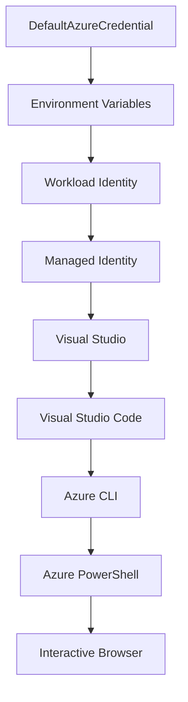

<!--
CO_OP_TRANSLATOR_METADATA:
{
  "original_hash": "fb0687bd0b166ecb0430dfeeed83487e",
  "translation_date": "2025-10-24T18:09:28+00:00",
  "source_file": "docs/getting-started/azd-basics.md",
  "language_code": "sr"
}
-->
# Osnove AZD - Razumevanje Azure Developer CLI

# Osnove AZD - Ključni pojmovi i osnove

**Navigacija kroz poglavlja:**
- **📚 Početna stranica kursa**: [AZD za početnike](../../README.md)
- **📖 Trenutno poglavlje**: Poglavlje 1 - Osnove i brzi početak
- **⬅️ Prethodno**: [Pregled kursa](../../README.md#-chapter-1-foundation--quick-start)
- **➡️ Sledeće**: [Instalacija i podešavanje](installation.md)
- **🚀 Sledeće poglavlje**: [Poglavlje 2: Razvoj zasnovan na veštačkoj inteligenciji](../ai-foundry/azure-ai-foundry-integration.md)

## Uvod

Ova lekcija vas upoznaje sa Azure Developer CLI (azd), moćnim alatom komandne linije koji ubrzava vaš put od lokalnog razvoja do implementacije na Azure. Naučićete osnovne pojmove, ključne funkcije i kako azd pojednostavljuje implementaciju aplikacija zasnovanih na oblaku.

## Ciljevi učenja

Na kraju ove lekcije, moći ćete:
- Razumeti šta je Azure Developer CLI i njegovu osnovnu svrhu
- Naučiti osnovne pojmove kao što su šabloni, okruženja i servisi
- Istražiti ključne funkcije uključujući razvoj zasnovan na šablonima i infrastrukturu kao kod
- Razumeti strukturu projekta azd i radni tok
- Biti spremni da instalirate i konfigurišete azd za vaše razvojno okruženje

## Ishodi učenja

Nakon završetka ove lekcije, moći ćete:
- Objasniti ulogu azd-a u modernim radnim tokovima razvoja na oblaku
- Identifikovati komponente strukture azd projekta
- Opisati kako šabloni, okruženja i servisi funkcionišu zajedno
- Razumeti prednosti infrastrukture kao kod sa azd-om
- Prepoznati različite azd komande i njihove svrhe

## Šta je Azure Developer CLI (azd)?

Azure Developer CLI (azd) je alat komandne linije dizajniran da ubrza vaš put od lokalnog razvoja do implementacije na Azure. Pojednostavljuje proces izgradnje, implementacije i upravljanja aplikacijama zasnovanim na oblaku na Azure.

## Osnovni pojmovi

### Šabloni
Šabloni su osnova azd-a. Oni sadrže:
- **Kod aplikacije** - Vaš izvorni kod i zavisnosti
- **Definicije infrastrukture** - Azure resurse definisane u Bicep ili Terraform
- **Konfiguracione fajlove** - Postavke i promenljive okruženja
- **Skripte za implementaciju** - Automatizovani radni tokovi implementacije

### Okruženja
Okruženja predstavljaju različite ciljeve implementacije:
- **Razvojno** - Za testiranje i razvoj
- **Staging** - Okruženje pre produkcije
- **Produkcija** - Aktivno produkcijsko okruženje

Svako okruženje održava svoje:
- Azure resursne grupe
- Konfiguracione postavke
- Stanje implementacije

### Servisi
Servisi su gradivni blokovi vaše aplikacije:
- **Frontend** - Web aplikacije, SPAs
- **Backend** - API-jevi, mikrousluge
- **Baza podataka** - Rešenja za skladištenje podataka
- **Skladište** - Skladištenje fajlova i blobova

## Ključne funkcije

### 1. Razvoj zasnovan na šablonima
```bash
# Browse available templates
azd template list

# Initialize from a template
azd init --template <template-name>
```

### 2. Infrastruktura kao kod
- **Bicep** - Jezik specifičan za Azure
- **Terraform** - Alat za infrastrukturu na više oblaka
- **ARM šabloni** - Šabloni za Azure Resource Manager

### 3. Integrisani radni tokovi
```bash
# Complete deployment workflow
azd up            # Provision + Deploy this is hands off for first time setup

# 🧪 NEW: Preview infrastructure changes before deployment (SAFE)
azd provision --preview    # Simulate infrastructure deployment without making changes

azd provision     # Create Azure resources if you update the infrastructure use this
azd deploy        # Deploy application code or redeploy application code once update
azd down          # Clean up resources
```

#### 🛡️ Sigurno planiranje infrastrukture sa pregledom
Komanda `azd provision --preview` je revolucionarna za sigurne implementacije:
- **Analiza suve probe** - Prikazuje šta će biti kreirano, modifikovano ili obrisano
- **Bez rizika** - Nema stvarnih promena u vašem Azure okruženju
- **Saradnja tima** - Delite rezultate pregleda pre implementacije
- **Procena troškova** - Razumite troškove resursa pre obaveze

```bash
# Example preview workflow
azd provision --preview           # See what will change
# Review the output, discuss with team
azd provision                     # Apply changes with confidence
```

### 4. Upravljanje okruženjima
```bash
# Create and manage environments
azd env new <environment-name>
azd env select <environment-name>
azd env list
```

## 📁 Struktura projekta

Tipična struktura azd projekta:
```
my-app/
├── .azd/                    # azd configuration
│   └── config.json
├── .azure/                  # Azure deployment artifacts
├── .devcontainer/          # Development container config
├── .github/workflows/      # GitHub Actions
├── .vscode/               # VS Code settings
├── infra/                 # Infrastructure code
│   ├── main.bicep        # Main infrastructure template
│   ├── main.parameters.json
│   └── modules/          # Reusable modules
├── src/                  # Application source code
│   ├── api/             # Backend services
│   └── web/             # Frontend application
├── azure.yaml           # azd project configuration
└── README.md
```

## 🔧 Konfiguracioni fajlovi

### azure.yaml
Glavni konfiguracioni fajl projekta:
```yaml
name: my-awesome-app
metadata:
  template: my-template@1.0.0

services:
  web:
    project: ./src/web
    language: js
    host: appservice
  api:
    project: ./src/api
    language: js
    host: appservice

hooks:
  preprovision:
    shell: pwsh
    run: echo "Preparing to provision..."
```

### .azure/config.json
Konfiguracija specifična za okruženje:
```json
{
  "version": 1,
  "defaultEnvironment": "dev",
  "environments": {
    "dev": {
      "subscriptionId": "your-subscription-id",
      "location": "eastus"
    }
  }
}
```

## 🎪 Uobičajeni radni tokovi

### Pokretanje novog projekta
```bash
# Method 1: Use existing template
azd init --template todo-nodejs-mongo

# Method 2: Start from scratch
azd init

# Method 3: Use current directory
azd init .
```

### Razvojni ciklus
```bash
# Set up development environment
azd auth login
azd env new dev
azd env select dev

# Deploy everything
azd up

# Make changes and redeploy
azd deploy

# Clean up when done
azd down --force --purge # command in the Azure Developer CLI is a **hard reset** for your environment—especially useful when you're troubleshooting failed deployments, cleaning up orphaned resources, or prepping for a fresh redeploy.
```

## Razumevanje `azd down --force --purge`
Komanda `azd down --force --purge` je moćan način da potpuno uklonite vaše azd okruženje i sve povezane resurse. Evo pregleda šta svaka opcija radi:
```
--force
```
- Preskače potvrde.
- Korisno za automatizaciju ili skriptovanje gde ručni unos nije moguć.
- Osigurava da se uklanjanje nastavi bez prekida, čak i ako CLI otkrije nedoslednosti.

```
--purge
```
Briše **sve povezane metapodatke**, uključujući:
Stanje okruženja
Lokalni `.azure` folder
Keširane informacije o implementaciji
Sprečava azd da "pamti" prethodne implementacije, što može izazvati probleme poput neusklađenih resursnih grupa ili zastarelih referenci u registru.

### Zašto koristiti oba?
Kada naiđete na problem sa `azd up` zbog preostalog stanja ili delimičnih implementacija, ova kombinacija osigurava **čistu početnu tačku**.

Posebno je korisno nakon ručnog brisanja resursa u Azure portalu ili kada menjate šablone, okruženja ili konvencije imenovanja resursnih grupa.

### Upravljanje višestrukim okruženjima
```bash
# Create staging environment
azd env new staging
azd env select staging
azd up

# Switch back to dev
azd env select dev

# Compare environments
azd env list
```

## 🔐 Autentifikacija i kredencijali

Razumevanje autentifikacije je ključno za uspešne azd implementacije. Azure koristi više metoda autentifikacije, a azd koristi isti lanac kredencijala kao i drugi Azure alati.

### Azure CLI autentifikacija (`az login`)

Pre nego što koristite azd, potrebno je da se autentifikujete sa Azure. Najčešći metod je korišćenje Azure CLI:

```bash
# Interactive login (opens browser)
az login

# Login with specific tenant
az login --tenant <tenant-id>

# Login with service principal
az login --service-principal -u <app-id> -p <password> --tenant <tenant-id>

# Check current login status
az account show

# List available subscriptions
az account list --output table

# Set default subscription
az account set --subscription <subscription-id>
```

### Tok autentifikacije
1. **Interaktivna prijava**: Otvara vaš podrazumevani pregledač za autentifikaciju
2. **Tok sa kodom uređaja**: Za okruženja bez pristupa pregledaču
3. **Servisni principal**: Za automatizaciju i CI/CD scenarije
4. **Upravljani identitet**: Za aplikacije hostovane na Azure

### DefaultAzureCredential lanac

`DefaultAzureCredential` je tip kredencijala koji pruža pojednostavljeno iskustvo autentifikacije automatskim pokušajem više izvora kredencijala u određenom redosledu:

#### Redosled lanca kredencijala


#### 1. Promenljive okruženja
```bash
# Set environment variables for service principal
export AZURE_CLIENT_ID="<app-id>"
export AZURE_CLIENT_SECRET="<password>"
export AZURE_TENANT_ID="<tenant-id>"
```

#### 2. Identitet radnog opterećenja (Kubernetes/GitHub Actions)
Automatski se koristi u:
- Azure Kubernetes Service (AKS) sa identitetom radnog opterećenja
- GitHub Actions sa OIDC federacijom
- Ostali scenariji federisanog identiteta

#### 3. Upravljani identitet
Za Azure resurse kao što su:
- Virtuelne mašine
- App Service
- Azure Functions
- Container Instances

```bash
# Check if running on Azure resource with managed identity
az account show --query "user.type" --output tsv
# Returns: "servicePrincipal" if using managed identity
```

#### 4. Integracija sa razvojnim alatima
- **Visual Studio**: Automatski koristi prijavljeni nalog
- **VS Code**: Koristi kredencijale ekstenzije Azure Account
- **Azure CLI**: Koristi `az login` kredencijale (najčešće za lokalni razvoj)

### Podešavanje autentifikacije za AZD

```bash
# Method 1: Use Azure CLI (Recommended for development)
az login
azd auth login  # Uses existing Azure CLI credentials

# Method 2: Direct azd authentication
azd auth login --use-device-code  # For headless environments

# Method 3: Check authentication status
azd auth login --check-status

# Method 4: Logout and re-authenticate
azd auth logout
azd auth login
```

### Najbolje prakse za autentifikaciju

#### Za lokalni razvoj
```bash
# 1. Login with Azure CLI
az login

# 2. Verify correct subscription
az account show
az account set --subscription "Your Subscription Name"

# 3. Use azd with existing credentials
azd auth login
```

#### Za CI/CD pipeline
```yaml
# GitHub Actions example
- name: Azure Login
  uses: azure/login@v1
  with:
    creds: ${{ secrets.AZURE_CREDENTIALS }}

- name: Deploy with azd
  run: |
    azd auth login --client-id ${{ secrets.AZURE_CLIENT_ID }} \
                    --client-secret ${{ secrets.AZURE_CLIENT_SECRET }} \
                    --tenant-id ${{ secrets.AZURE_TENANT_ID }}
    azd up --no-prompt
```

#### Za produkciona okruženja
- Koristite **upravljani identitet** kada radite na Azure resursima
- Koristite **servisni principal** za automatizovane scenarije
- Izbegavajte čuvanje kredencijala u kodu ili konfiguracionim fajlovima
- Koristite **Azure Key Vault** za osetljive konfiguracije

### Uobičajeni problemi sa autentifikacijom i rešenja

#### Problem: "Nije pronađena pretplata"
```bash
# Solution: Set default subscription
az account list --output table
az account set --subscription "<subscription-id>"
azd env set AZURE_SUBSCRIPTION_ID "<subscription-id>"
```

#### Problem: "Nedovoljna ovlašćenja"
```bash
# Solution: Check and assign required roles
az role assignment list --assignee $(az account show --query user.name --output tsv)

# Common required roles:
# - Contributor (for resource management)
# - User Access Administrator (for role assignments)
```

#### Problem: "Token je istekao"
```bash
# Solution: Re-authenticate
az logout
az login
azd auth logout
azd auth login
```

### Autentifikacija u različitim scenarijima

#### Lokalni razvoj
```bash
# Personal development account
az login
azd auth login
```

#### Timski razvoj
```bash
# Use specific tenant for organization
az login --tenant contoso.onmicrosoft.com
azd auth login
```

#### Scenariji sa više klijenata
```bash
# Switch between tenants
az login --tenant tenant1.onmicrosoft.com
# Deploy to tenant 1
azd up

az login --tenant tenant2.onmicrosoft.com  
# Deploy to tenant 2
azd up
```

### Bezbednosni aspekti

1. **Skladištenje kredencijala**: Nikada ne čuvajte kredencijale u izvornom kodu
2. **Ograničenje opsega**: Koristite princip najmanjih privilegija za servisne principale
3. **Rotacija tokena**: Redovno rotirajte tajne servisnih principala
4. **Trag audita**: Pratite aktivnosti autentifikacije i implementacije
5. **Mrežna bezbednost**: Koristite privatne krajnje tačke kad god je moguće

### Rešavanje problema sa autentifikacijom

```bash
# Debug authentication issues
azd auth login --check-status
az account show
az account get-access-token

# Common diagnostic commands
whoami                          # Current user context
az ad signed-in-user show      # Azure AD user details
az group list                  # Test resource access
```

## Razumevanje `azd down --force --purge`

### Otkrivanje
```bash
azd template list              # Browse templates
azd template show <template>   # Template details
azd init --help               # Initialization options
```

### Upravljanje projektima
```bash
azd show                     # Project overview
azd env show                 # Current environment
azd config list             # Configuration settings
```

### Praćenje
```bash
azd monitor                  # Open Azure portal
azd pipeline config          # Set up CI/CD
azd logs                     # View application logs
```

## Najbolje prakse

### 1. Koristite smislena imena
```bash
# Good
azd env new production-east
azd init --template web-app-secure

# Avoid
azd env new env1
azd init --template template1
```

### 2. Iskoristite šablone
- Počnite sa postojećim šablonima
- Prilagodite ih svojim potrebama
- Kreirajte šablone za ponovnu upotrebu u vašoj organizaciji

### 3. Izolacija okruženja
- Koristite odvojena okruženja za razvoj/staging/produkciju
- Nikada ne implementirajte direktno u produkciju sa lokalnog računara
- Koristite CI/CD pipeline za produkcijske implementacije

### 4. Upravljanje konfiguracijom
- Koristite promenljive okruženja za osetljive podatke
- Držite konfiguraciju u verzionoj kontroli
- Dokumentujte postavke specifične za okruženje

## Napredak u učenju

### Početnik (1-2 nedelje)
1. Instalirajte azd i autentifikujte se
2. Implementirajte jednostavan šablon
3. Razumite strukturu projekta
4. Naučite osnovne komande (up, down, deploy)

### Srednji nivo (3-4 nedelje)
1. Prilagodite šablone
2. Upravljajte višestrukim okruženjima
3. Razumite infrastrukturu kao kod
4. Postavite CI/CD pipeline

### Napredni nivo (5+ nedelja)
1. Kreirajte prilagođene šablone
2. Napredni obrasci infrastrukture
3. Implementacije u više regiona
4. Konfiguracije na nivou preduzeća

## Sledeći koraci

**📖 Nastavite sa učenjem u Poglavlju 1:**
- [Instalacija i podešavanje](installation.md) - Instalirajte i konfigurišite azd
- [Vaš prvi projekat](first-project.md) - Završite praktični vodič
- [Vodič za konfiguraciju](configuration.md) - Napredne opcije konfiguracije

**🎯 Spremni za sledeće poglavlje?**
- [Poglavlje 2: Razvoj zasnovan na veštačkoj inteligenciji](../ai-foundry/azure-ai-foundry-integration.md) - Počnite sa izradom AI aplikacija

## Dodatni resursi

- [Pregled Azure Developer CLI](https://learn.microsoft.com/en-us/azure/developer/azure-developer-cli/)
- [Galerija šablona](https://azure.github.io/awesome-azd/)
- [Primeri iz zajednice](https://github.com/Azure-Samples)

---

**Navigacija kroz poglavlja:**
- **📚 Početna stranica kursa**: [AZD za početnike](../../README.md)
- **📖 Trenutno poglavlje**: Poglavlje 1 - Osnove i brzi početak  
- **⬅️ Prethodno**: [Pregled kursa](../../README.md#-chapter-1-foundation--quick-start)
- **➡️ Sledeće**: [Instalacija i podešavanje](installation.md)
- **🚀 Sledeće poglavlje**: [Poglavlje 2: Razvoj zasnovan na veštačkoj inteligenciji](../ai-foundry/azure-ai-foundry-integration.md)

---

**Одрицање од одговорности**:  
Овај документ је преведен помоћу услуге за превођење вештачке интелигенције [Co-op Translator](https://github.com/Azure/co-op-translator). Иако настојимо да обезбедимо тачност, молимо вас да имате у виду да аутоматски преводи могу садржати грешке или нетачности. Оригинални документ на његовом изворном језику треба сматрати ауторитативним извором. За критичне информације препоручује се професионални превод од стране људи. Не преузимамо одговорност за било каква погрешна тумачења или неспоразуме који могу настати услед коришћења овог превода.