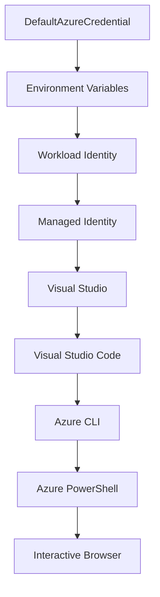

<!--
CO_OP_TRANSLATOR_METADATA:
{
  "original_hash": "fb0687bd0b166ecb0430dfeeed83487e",
  "translation_date": "2025-10-24T17:28:16+00:00",
  "source_file": "docs/getting-started/azd-basics.md",
  "language_code": "sv"
}
-->
# AZD Grunder - Förstå Azure Developer CLI

# AZD Grunder - Kärnkoncept och Grundläggande

**Kapitelnavigation:**
- **📚 Kursens startsida**: [AZD För Nybörjare](../../README.md)
- **📖 Nuvarande kapitel**: Kapitel 1 - Grundläggande & Snabbstart
- **⬅️ Föregående**: [Kursöversikt](../../README.md#-chapter-1-foundation--quick-start)
- **➡️ Nästa**: [Installation & Konfiguration](installation.md)
- **🚀 Nästa kapitel**: [Kapitel 2: AI-Driven Utveckling](../ai-foundry/azure-ai-foundry-integration.md)

## Introduktion

Den här lektionen introducerar dig till Azure Developer CLI (azd), ett kraftfullt kommandoradsverktyg som påskyndar din resa från lokal utveckling till Azure-distribution. Du kommer att lära dig de grundläggande koncepten, kärnfunktionerna och förstå hur azd förenklar distributionen av molnbaserade applikationer.

## Lärandemål

I slutet av denna lektion kommer du att:
- Förstå vad Azure Developer CLI är och dess huvudsakliga syfte
- Lära dig kärnkoncepten kring mallar, miljöer och tjänster
- Utforska nyckelfunktioner inklusive mallbaserad utveckling och Infrastruktur som Kod
- Förstå azd-projektstrukturen och arbetsflödet
- Vara redo att installera och konfigurera azd för din utvecklingsmiljö

## Läranderesultat

Efter att ha avslutat denna lektion kommer du att kunna:
- Förklara azds roll i moderna arbetsflöden för molnutveckling
- Identifiera komponenterna i en azd-projektstruktur
- Beskriva hur mallar, miljöer och tjänster samverkar
- Förstå fördelarna med Infrastruktur som Kod med azd
- Känna igen olika azd-kommandon och deras syften

## Vad är Azure Developer CLI (azd)?

Azure Developer CLI (azd) är ett kommandoradsverktyg som är utformat för att påskynda din resa från lokal utveckling till Azure-distribution. Det förenklar processen att bygga, distribuera och hantera molnbaserade applikationer på Azure.

## Kärnkoncept

### Mallar
Mallar är grunden för azd. De innehåller:
- **Applikationskod** - Din källkod och dess beroenden
- **Infrastrukturbeskrivningar** - Azure-resurser definierade i Bicep eller Terraform
- **Konfigurationsfiler** - Inställningar och miljövariabler
- **Distributionsskript** - Automatiserade distributionsarbetsflöden

### Miljöer
Miljöer representerar olika distributionsmål:
- **Utveckling** - För testning och utveckling
- **Staging** - Förproduktionsmiljö
- **Produktion** - Live-produktionsmiljö

Varje miljö har sin egen:
- Azure-resursgrupp
- Konfigurationsinställningar
- Distributionsstatus

### Tjänster
Tjänster är byggstenarna i din applikation:
- **Frontend** - Webbapplikationer, SPAs
- **Backend** - API:er, mikrotjänster
- **Databas** - Databaslösningar
- **Lagring** - Fil- och bloblagring

## Nyckelfunktioner

### 1. Mallbaserad Utveckling
```bash
# Browse available templates
azd template list

# Initialize from a template
azd init --template <template-name>
```

### 2. Infrastruktur som Kod
- **Bicep** - Azures domänspecifika språk
- **Terraform** - Multimoln-infrastrukturverktyg
- **ARM-mallar** - Azure Resource Manager-mallar

### 3. Integrerade Arbetsflöden
```bash
# Complete deployment workflow
azd up            # Provision + Deploy this is hands off for first time setup

# 🧪 NEW: Preview infrastructure changes before deployment (SAFE)
azd provision --preview    # Simulate infrastructure deployment without making changes

azd provision     # Create Azure resources if you update the infrastructure use this
azd deploy        # Deploy application code or redeploy application code once update
azd down          # Clean up resources
```

#### 🛡️ Säker Infrastrukturplanering med Förhandsgranskning
Kommandot `azd provision --preview` är en revolutionerande funktion för säkra distributioner:
- **Analys av torrkörning** - Visar vad som kommer att skapas, ändras eller tas bort
- **Ingen risk** - Inga faktiska ändringar görs i din Azure-miljö
- **Samarbete i team** - Dela förhandsgranskningsresultat innan distribution
- **Kostnadsberäkning** - Förstå resurskostnader innan åtagande

```bash
# Example preview workflow
azd provision --preview           # See what will change
# Review the output, discuss with team
azd provision                     # Apply changes with confidence
```

### 4. Miljöhantering
```bash
# Create and manage environments
azd env new <environment-name>
azd env select <environment-name>
azd env list
```

## 📁 Projektstruktur

En typisk azd-projektstruktur:
```
my-app/
├── .azd/                    # azd configuration
│   └── config.json
├── .azure/                  # Azure deployment artifacts
├── .devcontainer/          # Development container config
├── .github/workflows/      # GitHub Actions
├── .vscode/               # VS Code settings
├── infra/                 # Infrastructure code
│   ├── main.bicep        # Main infrastructure template
│   ├── main.parameters.json
│   └── modules/          # Reusable modules
├── src/                  # Application source code
│   ├── api/             # Backend services
│   └── web/             # Frontend application
├── azure.yaml           # azd project configuration
└── README.md
```

## 🔧 Konfigurationsfiler

### azure.yaml
Huvudkonfigurationsfilen för projektet:
```yaml
name: my-awesome-app
metadata:
  template: my-template@1.0.0

services:
  web:
    project: ./src/web
    language: js
    host: appservice
  api:
    project: ./src/api
    language: js
    host: appservice

hooks:
  preprovision:
    shell: pwsh
    run: echo "Preparing to provision..."
```

### .azure/config.json
Miljöspecifik konfiguration:
```json
{
  "version": 1,
  "defaultEnvironment": "dev",
  "environments": {
    "dev": {
      "subscriptionId": "your-subscription-id",
      "location": "eastus"
    }
  }
}
```

## 🎪 Vanliga Arbetsflöden

### Starta ett Nytt Projekt
```bash
# Method 1: Use existing template
azd init --template todo-nodejs-mongo

# Method 2: Start from scratch
azd init

# Method 3: Use current directory
azd init .
```

### Utvecklingscykel
```bash
# Set up development environment
azd auth login
azd env new dev
azd env select dev

# Deploy everything
azd up

# Make changes and redeploy
azd deploy

# Clean up when done
azd down --force --purge # command in the Azure Developer CLI is a **hard reset** for your environment—especially useful when you're troubleshooting failed deployments, cleaning up orphaned resources, or prepping for a fresh redeploy.
```

## Förstå `azd down --force --purge`
Kommandot `azd down --force --purge` är ett kraftfullt sätt att helt ta bort din azd-miljö och alla associerade resurser. Här är en sammanfattning av vad varje flagga gör:
```
--force
```
- Hoppar över bekräftelsefrågor.
- Användbart för automatisering eller skript där manuell inmatning inte är möjlig.
- Säkerställer att nedmonteringen fortsätter utan avbrott, även om CLI upptäcker inkonsekvenser.

```
--purge
```
Tar bort **all associerad metadata**, inklusive:
Miljöstatus
Lokal `.azure`-mapp
Cachelagrad distributionsinformation
Förhindrar att azd "kommer ihåg" tidigare distributioner, vilket kan orsaka problem som felaktiga resursgrupper eller föråldrade registerreferenser.


### Varför använda båda?
När du har stött på problem med `azd up` på grund av kvarvarande status eller delvisa distributioner, säkerställer denna kombination en **ren start**.

Det är särskilt användbart efter manuella resursborttagningar i Azure-portalen eller vid byte av mallar, miljöer eller namngivningskonventioner för resursgrupper.


### Hantera Flera Miljöer
```bash
# Create staging environment
azd env new staging
azd env select staging
azd up

# Switch back to dev
azd env select dev

# Compare environments
azd env list
```

## 🔐 Autentisering och Behörigheter

Att förstå autentisering är avgörande för framgångsrika azd-distributioner. Azure använder flera autentiseringsmetoder, och azd utnyttjar samma autentiseringskedja som andra Azure-verktyg.

### Azure CLI Autentisering (`az login`)

Innan du använder azd måste du autentisera med Azure. Den vanligaste metoden är att använda Azure CLI:

```bash
# Interactive login (opens browser)
az login

# Login with specific tenant
az login --tenant <tenant-id>

# Login with service principal
az login --service-principal -u <app-id> -p <password> --tenant <tenant-id>

# Check current login status
az account show

# List available subscriptions
az account list --output table

# Set default subscription
az account set --subscription <subscription-id>
```

### Autentiseringsflöde
1. **Interaktiv Inloggning**: Öppnar din standardwebbläsare för autentisering
2. **Enhetskodflöde**: För miljöer utan webbläsartillgång
3. **Service Principal**: För automatisering och CI/CD-scenarier
4. **Hantera Identitet**: För applikationer som hostas på Azure

### DefaultAzureCredential-kedja

`DefaultAzureCredential` är en autentiseringstyp som erbjuder en förenklad autentiseringsupplevelse genom att automatiskt försöka flera autentiseringskällor i en specifik ordning:

#### Autentiseringskedjans ordning


#### 1. Miljövariabler
```bash
# Set environment variables for service principal
export AZURE_CLIENT_ID="<app-id>"
export AZURE_CLIENT_SECRET="<password>"
export AZURE_TENANT_ID="<tenant-id>"
```

#### 2. Arbetslastidentitet (Kubernetes/GitHub Actions)
Används automatiskt i:
- Azure Kubernetes Service (AKS) med Arbetslastidentitet
- GitHub Actions med OIDC-federation
- Andra federerade identitetsscenarier

#### 3. Hantera Identitet
För Azure-resurser som:
- Virtuella Maskiner
- App Service
- Azure Functions
- Container Instances

```bash
# Check if running on Azure resource with managed identity
az account show --query "user.type" --output tsv
# Returns: "servicePrincipal" if using managed identity
```

#### 4. Integration med Utvecklingsverktyg
- **Visual Studio**: Använder automatiskt inloggat konto
- **VS Code**: Använder autentiseringsuppgifter från Azure Account-tillägget
- **Azure CLI**: Använder `az login`-autentisering (vanligast för lokal utveckling)

### AZD Autentiseringsinställningar

```bash
# Method 1: Use Azure CLI (Recommended for development)
az login
azd auth login  # Uses existing Azure CLI credentials

# Method 2: Direct azd authentication
azd auth login --use-device-code  # For headless environments

# Method 3: Check authentication status
azd auth login --check-status

# Method 4: Logout and re-authenticate
azd auth logout
azd auth login
```

### Bästa Praxis för Autentisering

#### För Lokal Utveckling
```bash
# 1. Login with Azure CLI
az login

# 2. Verify correct subscription
az account show
az account set --subscription "Your Subscription Name"

# 3. Use azd with existing credentials
azd auth login
```

#### För CI/CD-pipelines
```yaml
# GitHub Actions example
- name: Azure Login
  uses: azure/login@v1
  with:
    creds: ${{ secrets.AZURE_CREDENTIALS }}

- name: Deploy with azd
  run: |
    azd auth login --client-id ${{ secrets.AZURE_CLIENT_ID }} \
                    --client-secret ${{ secrets.AZURE_CLIENT_SECRET }} \
                    --tenant-id ${{ secrets.AZURE_TENANT_ID }}
    azd up --no-prompt
```

#### För Produktionsmiljöer
- Använd **Hantera Identitet** när du kör på Azure-resurser
- Använd **Service Principal** för automatiseringsscenarier
- Undvik att lagra autentiseringsuppgifter i kod eller konfigurationsfiler
- Använd **Azure Key Vault** för känslig konfiguration

### Vanliga Autentiseringsproblem och Lösningar

#### Problem: "Ingen prenumeration hittades"
```bash
# Solution: Set default subscription
az account list --output table
az account set --subscription "<subscription-id>"
azd env set AZURE_SUBSCRIPTION_ID "<subscription-id>"
```

#### Problem: "Otillräckliga behörigheter"
```bash
# Solution: Check and assign required roles
az role assignment list --assignee $(az account show --query user.name --output tsv)

# Common required roles:
# - Contributor (for resource management)
# - User Access Administrator (for role assignments)
```

#### Problem: "Token har gått ut"
```bash
# Solution: Re-authenticate
az logout
az login
azd auth logout
azd auth login
```

### Autentisering i Olika Scenarier

#### Lokal Utveckling
```bash
# Personal development account
az login
azd auth login
```

#### Teamutveckling
```bash
# Use specific tenant for organization
az login --tenant contoso.onmicrosoft.com
azd auth login
```

#### Multitenant-scenarier
```bash
# Switch between tenants
az login --tenant tenant1.onmicrosoft.com
# Deploy to tenant 1
azd up

az login --tenant tenant2.onmicrosoft.com  
# Deploy to tenant 2
azd up
```

### Säkerhetsöverväganden

1. **Lagring av autentiseringsuppgifter**: Lagra aldrig autentiseringsuppgifter i källkod
2. **Begränsning av åtkomst**: Använd principen om minsta privilegier för serviceprincipaler
3. **Tokenrotation**: Rotera regelbundet hemligheter för serviceprincipaler
4. **Revisionsspår**: Övervaka autentiserings- och distributionsaktiviteter
5. **Nätverkssäkerhet**: Använd privata slutpunkter när det är möjligt

### Felsökning av Autentisering

```bash
# Debug authentication issues
azd auth login --check-status
az account show
az account get-access-token

# Common diagnostic commands
whoami                          # Current user context
az ad signed-in-user show      # Azure AD user details
az group list                  # Test resource access
```

## Förstå `azd down --force --purge`

### Upptäckt
```bash
azd template list              # Browse templates
azd template show <template>   # Template details
azd init --help               # Initialization options
```

### Projektledning
```bash
azd show                     # Project overview
azd env show                 # Current environment
azd config list             # Configuration settings
```

### Övervakning
```bash
azd monitor                  # Open Azure portal
azd pipeline config          # Set up CI/CD
azd logs                     # View application logs
```

## Bästa Praxis

### 1. Använd Meningsfulla Namn
```bash
# Good
azd env new production-east
azd init --template web-app-secure

# Avoid
azd env new env1
azd init --template template1
```

### 2. Utnyttja Mallar
- Börja med befintliga mallar
- Anpassa efter dina behov
- Skapa återanvändbara mallar för din organisation

### 3. Miljöisolering
- Använd separata miljöer för utveckling/staging/produktion
- Distribuera aldrig direkt till produktion från lokal maskin
- Använd CI/CD-pipelines för produktionsdistributioner

### 4. Konfigurationshantering
- Använd miljövariabler för känslig data
- Håll konfigurationen i versionskontroll
- Dokumentera miljöspecifika inställningar

## Lärande Progression

### Nybörjare (Vecka 1-2)
1. Installera azd och autentisera
2. Distribuera en enkel mall
3. Förstå projektstrukturen
4. Lär dig grundläggande kommandon (up, down, deploy)

### Mellannivå (Vecka 3-4)
1. Anpassa mallar
2. Hantera flera miljöer
3. Förstå infrastrukturkod
4. Sätt upp CI/CD-pipelines

### Avancerad (Vecka 5+)
1. Skapa egna mallar
2. Avancerade infrastrukturmönster
3. Multiregion-distributioner
4. Konfigurationer för företag

## Nästa Steg

**📖 Fortsätt med Kapitel 1:**
- [Installation & Konfiguration](installation.md) - Installera och konfigurera azd
- [Ditt Första Projekt](first-project.md) - Slutför praktisk handledning
- [Konfigurationsguide](configuration.md) - Avancerade konfigurationsalternativ

**🎯 Redo för Nästa Kapitel?**
- [Kapitel 2: AI-Driven Utveckling](../ai-foundry/azure-ai-foundry-integration.md) - Börja bygga AI-applikationer

## Ytterligare Resurser

- [Översikt över Azure Developer CLI](https://learn.microsoft.com/en-us/azure/developer/azure-developer-cli/)
- [Mallgalleri](https://azure.github.io/awesome-azd/)
- [Community-exempel](https://github.com/Azure-Samples)

---

**Kapitelnavigation:**
- **📚 Kursens startsida**: [AZD För Nybörjare](../../README.md)
- **📖 Nuvarande kapitel**: Kapitel 1 - Grundläggande & Snabbstart  
- **⬅️ Föregående**: [Kursöversikt](../../README.md#-chapter-1-foundation--quick-start)
- **➡️ Nästa**: [Installation & Konfiguration](installation.md)
- **🚀 Nästa Kapitel**: [Kapitel 2: AI-Driven Utveckling](../ai-foundry/azure-ai-foundry-integration.md)

---

**Ansvarsfriskrivning**:  
Detta dokument har översatts med hjälp av AI-översättningstjänsten [Co-op Translator](https://github.com/Azure/co-op-translator). Även om vi strävar efter noggrannhet, bör det noteras att automatiserade översättningar kan innehålla fel eller felaktigheter. Det ursprungliga dokumentet på dess ursprungliga språk bör betraktas som den auktoritativa källan. För kritisk information rekommenderas professionell mänsklig översättning. Vi ansvarar inte för eventuella missförstånd eller feltolkningar som uppstår vid användning av denna översättning.