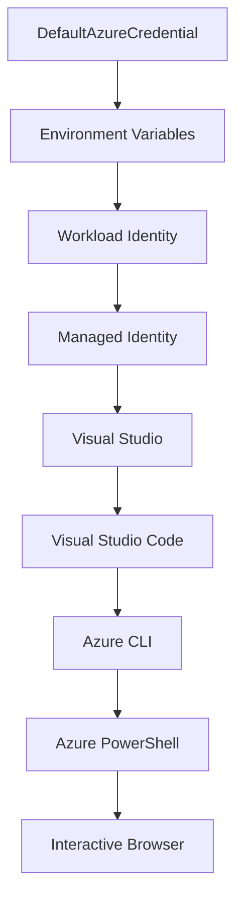

<!--
CO_OP_TRANSLATOR_METADATA:
{
  "original_hash": "fb0687bd0b166ecb0430dfeeed83487e",
  "translation_date": "2025-10-24T17:51:04+00:00",
  "source_file": "docs/getting-started/azd-basics.md",
  "language_code": "sw"
}
-->
# AZD Msingi - Kuelewa Azure Developer CLI

# AZD Msingi - Dhana za Msingi na Misingi

**Ukurasa wa Sehemu:**
- **📚 Nyumbani kwa Kozi**: [AZD Kwa Wanaoanza](../../README.md)
- **📖 Sura ya Sasa**: Sura ya 1 - Msingi & Kuanza Haraka
- **⬅️ Iliyopita**: [Muhtasari wa Kozi](../../README.md#-chapter-1-foundation--quick-start)
- **➡️ Inayofuata**: [Usakinishaji & Usanidi](installation.md)
- **🚀 Sura Inayofuata**: [Sura ya 2: Maendeleo ya Kwanza ya AI](../ai-foundry/azure-ai-foundry-integration.md)

## Utangulizi

Somo hili linakutambulisha kwa Azure Developer CLI (azd), chombo chenye nguvu cha mstari wa amri kinachoharakisha safari yako kutoka kwa maendeleo ya ndani hadi kwa usambazaji wa Azure. Utajifunza dhana za msingi, vipengele vya msingi, na kuelewa jinsi azd inavyorahisisha usambazaji wa programu za wingu.

## Malengo ya Kujifunza

Mwisho wa somo hili, utaweza:
- Kuelewa Azure Developer CLI ni nini na madhumuni yake ya msingi
- Kujifunza dhana za msingi za templeti, mazingira, na huduma
- Kuchunguza vipengele muhimu ikiwa ni pamoja na maendeleo yanayoongozwa na templeti na Miundombinu kama Kanuni
- Kuelewa muundo wa mradi wa azd na mtiririko wa kazi
- Kuwa tayari kusakinisha na kusanidi azd kwa mazingira yako ya maendeleo

## Matokeo ya Kujifunza

Baada ya kukamilisha somo hili, utaweza:
- Kuelezea jukumu la azd katika mtiririko wa kazi wa maendeleo ya wingu la kisasa
- Kutambua vipengele vya muundo wa mradi wa azd
- Kufafanua jinsi templeti, mazingira, na huduma zinavyofanya kazi pamoja
- Kuelewa faida za Miundombinu kama Kanuni kwa kutumia azd
- Kutambua amri tofauti za azd na madhumuni yake

## Azure Developer CLI (azd) ni nini?

Azure Developer CLI (azd) ni chombo cha mstari wa amri kilichoundwa ili kuharakisha safari yako kutoka kwa maendeleo ya ndani hadi usambazaji wa Azure. Kinapunguza mchakato wa kujenga, kusambaza, na kusimamia programu za wingu kwenye Azure.

## Dhana za Msingi

### Templeti
Templeti ni msingi wa azd. Zinajumuisha:
- **Msimbo wa programu** - Msimbo wako wa chanzo na utegemezi
- **Ufafanuzi wa miundombinu** - Rasilimali za Azure zilizoelezwa kwa Bicep au Terraform
- **Faili za usanidi** - Mipangilio na vigezo vya mazingira
- **Skripti za usambazaji** - Mtiririko wa kazi wa usambazaji wa kiotomatiki

### Mazingira
Mazingira yanawakilisha malengo tofauti ya usambazaji:
- **Maendeleo** - Kwa majaribio na maendeleo
- **Staging** - Mazingira ya kabla ya uzalishaji
- **Uzalishaji** - Mazingira ya uzalishaji wa moja kwa moja

Kila mazingira yanadumisha:
- Kikundi cha rasilimali za Azure
- Mipangilio ya usanidi
- Hali ya usambazaji

### Huduma
Huduma ni sehemu za kujenga za programu yako:
- **Frontend** - Programu za wavuti, SPAs
- **Backend** - APIs, huduma ndogo
- **Database** - Suluhisho za hifadhi ya data
- **Storage** - Hifadhi ya faili na blob

## Vipengele Muhimu

### 1. Maendeleo Yanayoongozwa na Templeti
```bash
# Browse available templates
azd template list

# Initialize from a template
azd init --template <template-name>
```

### 2. Miundombinu kama Kanuni
- **Bicep** - Lugha maalum ya Azure
- **Terraform** - Chombo cha miundombinu ya wingu nyingi
- **ARM Templates** - Templeti za Azure Resource Manager

### 3. Mtiririko wa Kazi Ulioingiliana
```bash
# Complete deployment workflow
azd up            # Provision + Deploy this is hands off for first time setup

# 🧪 NEW: Preview infrastructure changes before deployment (SAFE)
azd provision --preview    # Simulate infrastructure deployment without making changes

azd provision     # Create Azure resources if you update the infrastructure use this
azd deploy        # Deploy application code or redeploy application code once update
azd down          # Clean up resources
```

#### 🛡️ Mipango Salama ya Miundombinu kwa Kutazama Kabla
Amri ya `azd provision --preview` ni mabadiliko makubwa kwa usambazaji salama:
- **Uchambuzi wa majaribio** - Inaonyesha kitakachoundwa, kubadilishwa, au kufutwa
- **Hatari sifuri** - Hakuna mabadiliko halisi yanayofanywa kwenye mazingira yako ya Azure
- **Ushirikiano wa timu** - Shiriki matokeo ya kutazama kabla ya usambazaji
- **Makadirio ya gharama** - Elewa gharama za rasilimali kabla ya kujitolea

```bash
# Example preview workflow
azd provision --preview           # See what will change
# Review the output, discuss with team
azd provision                     # Apply changes with confidence
```

### 4. Usimamizi wa Mazingira
```bash
# Create and manage environments
azd env new <environment-name>
azd env select <environment-name>
azd env list
```

## 📁 Muundo wa Mradi

Muundo wa kawaida wa mradi wa azd:
```
my-app/
├── .azd/                    # azd configuration
│   └── config.json
├── .azure/                  # Azure deployment artifacts
├── .devcontainer/          # Development container config
├── .github/workflows/      # GitHub Actions
├── .vscode/               # VS Code settings
├── infra/                 # Infrastructure code
│   ├── main.bicep        # Main infrastructure template
│   ├── main.parameters.json
│   └── modules/          # Reusable modules
├── src/                  # Application source code
│   ├── api/             # Backend services
│   └── web/             # Frontend application
├── azure.yaml           # azd project configuration
└── README.md
```

## 🔧 Faili za Usanidi

### azure.yaml
Faili kuu ya usanidi wa mradi:
```yaml
name: my-awesome-app
metadata:
  template: my-template@1.0.0

services:
  web:
    project: ./src/web
    language: js
    host: appservice
  api:
    project: ./src/api
    language: js
    host: appservice

hooks:
  preprovision:
    shell: pwsh
    run: echo "Preparing to provision..."
```

### .azure/config.json
Usanidi maalum wa mazingira:
```json
{
  "version": 1,
  "defaultEnvironment": "dev",
  "environments": {
    "dev": {
      "subscriptionId": "your-subscription-id",
      "location": "eastus"
    }
  }
}
```

## 🎪 Mtiririko wa Kazi wa Kawaida

### Kuanza Mradi Mpya
```bash
# Method 1: Use existing template
azd init --template todo-nodejs-mongo

# Method 2: Start from scratch
azd init

# Method 3: Use current directory
azd init .
```

### Mzunguko wa Maendeleo
```bash
# Set up development environment
azd auth login
azd env new dev
azd env select dev

# Deploy everything
azd up

# Make changes and redeploy
azd deploy

# Clean up when done
azd down --force --purge # command in the Azure Developer CLI is a **hard reset** for your environment—especially useful when you're troubleshooting failed deployments, cleaning up orphaned resources, or prepping for a fresh redeploy.
```

## Kuelewa `azd down --force --purge`
Amri ya `azd down --force --purge` ni njia yenye nguvu ya kuondoa kabisa mazingira yako ya azd na rasilimali zote zinazohusiana. Hapa kuna muhtasari wa kile kila bendera inafanya:
```
--force
```
- Inaruka maombi ya uthibitisho.
- Inafaa kwa otomatiki au maandishi ambapo pembejeo ya mwongozo si rahisi.
- Inahakikisha mchakato wa kuondoa unaendelea bila usumbufu, hata kama CLI inagundua kutokubaliana.

```
--purge
```
Inafuta **metadata zote zinazohusiana**, ikiwa ni pamoja na:
Hali ya mazingira
Folda ya ndani ya `.azure`
Taarifa za usambazaji zilizohifadhiwa
Inazuia azd "kukumbuka" usambazaji wa awali, ambayo inaweza kusababisha masuala kama vikundi vya rasilimali visivyolingana au marejeleo ya rejista yaliyopitwa na wakati.

### Kwa nini utumie zote mbili?
Unapokutana na tatizo na `azd up` kutokana na hali iliyosalia au usambazaji wa sehemu, mchanganyiko huu unahakikisha **ukurasa safi**.

Ni muhimu hasa baada ya kufuta rasilimali kwa mikono kwenye portal ya Azure au wakati wa kubadilisha templeti, mazingira, au mikataba ya majina ya vikundi vya rasilimali.

### Kusimamia Mazingira Mengi
```bash
# Create staging environment
azd env new staging
azd env select staging
azd up

# Switch back to dev
azd env select dev

# Compare environments
azd env list
```

## 🔐 Uthibitishaji na Hati

Kuelewa uthibitishaji ni muhimu kwa usambazaji wa azd uliofanikiwa. Azure hutumia mbinu nyingi za uthibitishaji, na azd hutumia mnyororo wa hati sawa unaotumiwa na zana nyingine za Azure.

### Uthibitishaji wa Azure CLI (`az login`)

Kabla ya kutumia azd, unahitaji kuthibitisha na Azure. Njia ya kawaida ni kutumia Azure CLI:

```bash
# Interactive login (opens browser)
az login

# Login with specific tenant
az login --tenant <tenant-id>

# Login with service principal
az login --service-principal -u <app-id> -p <password> --tenant <tenant-id>

# Check current login status
az account show

# List available subscriptions
az account list --output table

# Set default subscription
az account set --subscription <subscription-id>
```

### Mtiririko wa Uthibitishaji
1. **Kuingia kwa Maingiliano**: Hufungua kivinjari chako cha chaguo-msingi kwa uthibitishaji
2. **Mtindo wa Nambari ya Kifaa**: Kwa mazingira yasiyo na ufikiaji wa kivinjari
3. **Service Principal**: Kwa otomatiki na hali za CI/CD
4. **Managed Identity**: Kwa programu zinazohifadhiwa na Azure

### DefaultAzureCredential Chain

`DefaultAzureCredential` ni aina ya hati inayotoa uzoefu rahisi wa uthibitishaji kwa kujaribu vyanzo vingi vya hati kwa mpangilio maalum:

#### Mpangilio wa Mnyororo wa Hati


#### 1. Vigezo vya Mazingira
```bash
# Set environment variables for service principal
export AZURE_CLIENT_ID="<app-id>"
export AZURE_CLIENT_SECRET="<password>"
export AZURE_TENANT_ID="<tenant-id>"
```

#### 2. Workload Identity (Kubernetes/GitHub Actions)
Inatumika kiotomatiki katika:
- Azure Kubernetes Service (AKS) na Workload Identity
- GitHub Actions na OIDC federation
- Hali nyingine za utambulisho wa pamoja

#### 3. Managed Identity
Kwa rasilimali za Azure kama:
- Virtual Machines
- App Service
- Azure Functions
- Container Instances

```bash
# Check if running on Azure resource with managed identity
az account show --query "user.type" --output tsv
# Returns: "servicePrincipal" if using managed identity
```

#### 4. Ujumuishaji wa Zana za Waendelezaji
- **Visual Studio**: Hutumia akaunti iliyosainiwa kiotomatiki
- **VS Code**: Hutumia hati za kiendelezi cha Akaunti ya Azure
- **Azure CLI**: Hutumia hati za `az login` (za kawaida kwa maendeleo ya ndani)

### Usanidi wa Uthibitishaji wa AZD

```bash
# Method 1: Use Azure CLI (Recommended for development)
az login
azd auth login  # Uses existing Azure CLI credentials

# Method 2: Direct azd authentication
azd auth login --use-device-code  # For headless environments

# Method 3: Check authentication status
azd auth login --check-status

# Method 4: Logout and re-authenticate
azd auth logout
azd auth login
```

### Mazoea Bora ya Uthibitishaji

#### Kwa Maendeleo ya Ndani
```bash
# 1. Login with Azure CLI
az login

# 2. Verify correct subscription
az account show
az account set --subscription "Your Subscription Name"

# 3. Use azd with existing credentials
azd auth login
```

#### Kwa Mifumo ya CI/CD
```yaml
# GitHub Actions example
- name: Azure Login
  uses: azure/login@v1
  with:
    creds: ${{ secrets.AZURE_CREDENTIALS }}

- name: Deploy with azd
  run: |
    azd auth login --client-id ${{ secrets.AZURE_CLIENT_ID }} \
                    --client-secret ${{ secrets.AZURE_CLIENT_SECRET }} \
                    --tenant-id ${{ secrets.AZURE_TENANT_ID }}
    azd up --no-prompt
```

#### Kwa Mazingira ya Uzalishaji
- Tumia **Managed Identity** wakati wa kuendesha kwenye rasilimali za Azure
- Tumia **Service Principal** kwa hali za otomatiki
- Epuka kuhifadhi hati kwenye msimbo au faili za usanidi
- Tumia **Azure Key Vault** kwa usanidi nyeti

### Masuala ya Kawaida ya Uthibitishaji na Suluhisho

#### Tatizo: "Hakuna usajili uliopatikana"
```bash
# Solution: Set default subscription
az account list --output table
az account set --subscription "<subscription-id>"
azd env set AZURE_SUBSCRIPTION_ID "<subscription-id>"
```

#### Tatizo: "Hati hazitoshi"
```bash
# Solution: Check and assign required roles
az role assignment list --assignee $(az account show --query user.name --output tsv)

# Common required roles:
# - Contributor (for resource management)
# - User Access Administrator (for role assignments)
```

#### Tatizo: "Token imeisha muda wake"
```bash
# Solution: Re-authenticate
az logout
az login
azd auth logout
azd auth login
```

### Uthibitishaji katika Hali Tofauti

#### Maendeleo ya Ndani
```bash
# Personal development account
az login
azd auth login
```

#### Maendeleo ya Timu
```bash
# Use specific tenant for organization
az login --tenant contoso.onmicrosoft.com
azd auth login
```

#### Hali za Wateja Wengi
```bash
# Switch between tenants
az login --tenant tenant1.onmicrosoft.com
# Deploy to tenant 1
azd up

az login --tenant tenant2.onmicrosoft.com  
# Deploy to tenant 2
azd up
```

### Masuala ya Usalama

1. **Uhifadhi wa Hati**: Usihifadhi hati kwenye msimbo wa chanzo
2. **Kikomo cha Upeo**: Tumia kanuni ya upendeleo mdogo kwa service principals
3. **Mzunguko wa Token**: Badilisha siri za service principal mara kwa mara
4. **Kumbukumbu ya Ukaguzi**: Fuatilia shughuli za uthibitishaji na usambazaji
5. **Usalama wa Mtandao**: Tumia sehemu za kibinafsi inapowezekana

### Kutatua Masuala ya Uthibitishaji

```bash
# Debug authentication issues
azd auth login --check-status
az account show
az account get-access-token

# Common diagnostic commands
whoami                          # Current user context
az ad signed-in-user show      # Azure AD user details
az group list                  # Test resource access
```

## Kuelewa `azd down --force --purge`

### Ugunduzi
```bash
azd template list              # Browse templates
azd template show <template>   # Template details
azd init --help               # Initialization options
```

### Usimamizi wa Mradi
```bash
azd show                     # Project overview
azd env show                 # Current environment
azd config list             # Configuration settings
```

### Ufuatiliaji
```bash
azd monitor                  # Open Azure portal
azd pipeline config          # Set up CI/CD
azd logs                     # View application logs
```

## Mazoea Bora

### 1. Tumia Majina Yenye Maana
```bash
# Good
azd env new production-east
azd init --template web-app-secure

# Avoid
azd env new env1
azd init --template template1
```

### 2. Tumia Templeti
- Anza na templeti zilizopo
- Badilisha kulingana na mahitaji yako
- Unda templeti zinazoweza kutumika tena kwa shirika lako

### 3. Kutenganisha Mazingira
- Tumia mazingira tofauti kwa maendeleo/staging/uzalishaji
- Usisambaze moja kwa moja kwa uzalishaji kutoka kwa mashine ya ndani
- Tumia mifumo ya CI/CD kwa usambazaji wa uzalishaji

### 4. Usimamizi wa Usanidi
- Tumia vigezo vya mazingira kwa data nyeti
- Weka usanidi katika udhibiti wa toleo
- Andika mipangilio maalum ya mazingira

## Maendeleo ya Kujifunza

### Mwanzoni (Wiki ya 1-2)
1. Sakinisha azd na uthibitishe
2. Sambaza templeti rahisi
3. Elewa muundo wa mradi
4. Jifunze amri za msingi (up, down, deploy)

### Kati (Wiki ya 3-4)
1. Badilisha templeti
2. Simamia mazingira mengi
3. Elewa kanuni za miundombinu
4. Sanidi mifumo ya CI/CD

### Juu (Wiki ya 5+)
1. Unda templeti maalum
2. Mifumo ya miundombinu ya hali ya juu
3. Usambazaji wa maeneo mengi
4. Usanidi wa kiwango cha biashara

## Hatua Zifuatazo

**📖 Endelea Kujifunza Sura ya 1:**
- [Usakinishaji & Usanidi](installation.md) - Sakinisha na usanidi azd
- [Mradi Wako wa Kwanza](first-project.md) - Kamilisha mafunzo ya vitendo
- [Mwongozo wa Usanidi](configuration.md) - Chaguo za usanidi wa hali ya juu

**🎯 Tayari kwa Sura Inayofuata?**
- [Sura ya 2: Maendeleo ya Kwanza ya AI](../ai-foundry/azure-ai-foundry-integration.md) - Anza kujenga programu za AI

## Rasilimali za Ziada

- [Muhtasari wa Azure Developer CLI](https://learn.microsoft.com/en-us/azure/developer/azure-developer-cli/)
- [Maktaba ya Templeti](https://azure.github.io/awesome-azd/)
- [Mifano ya Jamii](https://github.com/Azure-Samples)

---

**Ukurasa wa Sehemu:**
- **📚 Nyumbani kwa Kozi**: [AZD Kwa Wanaoanza](../../README.md)
- **📖 Sura ya Sasa**: Sura ya 1 - Msingi & Kuanza Haraka  
- **⬅️ Iliyopita**: [Muhtasari wa Kozi](../../README.md#-chapter-1-foundation--quick-start)
- **➡️ Inayofuata**: [Usakinishaji & Usanidi](installation.md)
- **🚀 Sura Inayofuata**: [Sura ya 2: Maendeleo ya Kwanza ya AI](../ai-foundry/azure-ai-foundry-integration.md)

---

**Kanusho**:  
Hati hii imetafsiriwa kwa kutumia huduma ya tafsiri ya AI [Co-op Translator](https://github.com/Azure/co-op-translator). Ingawa tunajitahidi kwa usahihi, tafadhali fahamu kuwa tafsiri za kiotomatiki zinaweza kuwa na makosa au kutokuwa sahihi. Hati ya asili katika lugha yake ya asili inapaswa kuzingatiwa kama chanzo cha mamlaka. Kwa taarifa muhimu, tafsiri ya kitaalamu ya binadamu inapendekezwa. Hatutawajibika kwa kutoelewana au tafsiri zisizo sahihi zinazotokana na matumizi ya tafsiri hii.