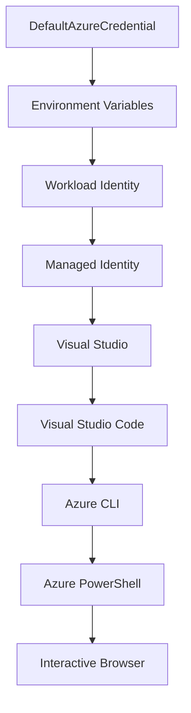

<!--
CO_OP_TRANSLATOR_METADATA:
{
  "original_hash": "fb0687bd0b166ecb0430dfeeed83487e",
  "translation_date": "2025-10-24T17:26:17+00:00",
  "source_file": "docs/getting-started/azd-basics.md",
  "language_code": "th"
}
-->
# AZD พื้นฐาน - ทำความเข้าใจ Azure Developer CLI

# AZD พื้นฐาน - แนวคิดและพื้นฐานสำคัญ

**สารบัญบทเรียน:**
- **📚 หน้าแรกของคอร์ส**: [AZD สำหรับผู้เริ่มต้น](../../README.md)
- **📖 บทเรียนปัจจุบัน**: บทที่ 1 - พื้นฐานและเริ่มต้นใช้งาน
- **⬅️ ก่อนหน้า**: [ภาพรวมคอร์ส](../../README.md#-chapter-1-foundation--quick-start)
- **➡️ ถัดไป**: [การติดตั้งและตั้งค่า](installation.md)
- **🚀 บทเรียนถัดไป**: [บทที่ 2: การพัฒนาโดยเน้น AI](../ai-foundry/azure-ai-foundry-integration.md)

## บทนำ

บทเรียนนี้จะแนะนำคุณให้รู้จักกับ Azure Developer CLI (azd) ซึ่งเป็นเครื่องมือบรรทัดคำสั่งที่ทรงพลังที่ช่วยเร่งกระบวนการจากการพัฒนาในเครื่องไปจนถึงการปรับใช้บน Azure คุณจะได้เรียนรู้แนวคิดพื้นฐาน ฟีเจอร์สำคัญ และเข้าใจว่า azd ช่วยให้การปรับใช้แอปพลิเคชันแบบ cloud-native ง่ายขึ้นได้อย่างไร

## เป้าหมายการเรียนรู้

เมื่อจบบทเรียนนี้ คุณจะ:
- เข้าใจว่า Azure Developer CLI คืออะไรและมีวัตถุประสงค์หลักอย่างไร
- เรียนรู้แนวคิดพื้นฐานเกี่ยวกับเทมเพลต สภาพแวดล้อม และบริการ
- สำรวจฟีเจอร์สำคัญ เช่น การพัฒนาที่ขับเคลื่อนด้วยเทมเพลตและ Infrastructure as Code
- เข้าใจโครงสร้างและกระบวนการทำงานของโปรเจกต์ azd
- เตรียมพร้อมสำหรับการติดตั้งและตั้งค่า azd ในสภาพแวดล้อมการพัฒนาของคุณ

## ผลลัพธ์การเรียนรู้

หลังจากจบบทเรียนนี้ คุณจะสามารถ:
- อธิบายบทบาทของ azd ในกระบวนการพัฒนา cloud สมัยใหม่
- ระบุองค์ประกอบของโครงสร้างโปรเจกต์ azd
- อธิบายว่าเทมเพลต สภาพแวดล้อม และบริการทำงานร่วมกันอย่างไร
- เข้าใจประโยชน์ของ Infrastructure as Code ด้วย azd
- รู้จักคำสั่ง azd ต่างๆ และวัตถุประสงค์ของมัน

## Azure Developer CLI (azd) คืออะไร?

Azure Developer CLI (azd) เป็นเครื่องมือบรรทัดคำสั่งที่ออกแบบมาเพื่อเร่งกระบวนการจากการพัฒนาในเครื่องไปจนถึงการปรับใช้บน Azure มันช่วยให้การสร้าง การปรับใช้ และการจัดการแอปพลิเคชันแบบ cloud-native บน Azure เป็นเรื่องง่ายขึ้น

## แนวคิดพื้นฐาน

### เทมเพลต
เทมเพลตเป็นพื้นฐานของ azd ซึ่งประกอบด้วย:
- **โค้ดแอปพลิเคชัน** - โค้ดต้นฉบับและ dependencies ของคุณ
- **การกำหนดโครงสร้างพื้นฐาน** - ทรัพยากร Azure ที่กำหนดใน Bicep หรือ Terraform
- **ไฟล์การตั้งค่า** - การตั้งค่าและตัวแปรสภาพแวดล้อม
- **สคริปต์การปรับใช้** - กระบวนการปรับใช้อัตโนมัติ

### สภาพแวดล้อม
สภาพแวดล้อมแสดงถึงเป้าหมายการปรับใช้ที่แตกต่างกัน:
- **Development** - สำหรับการทดสอบและพัฒนา
- **Staging** - สภาพแวดล้อมก่อนการผลิต
- **Production** - สภาพแวดล้อมการผลิตจริง

แต่ละสภาพแวดล้อมมีการจัดการ:
- กลุ่มทรัพยากร Azure
- การตั้งค่าคอนฟิก
- สถานะการปรับใช้

### บริการ
บริการเป็นองค์ประกอบสำคัญของแอปพลิเคชันของคุณ:
- **Frontend** - แอปพลิเคชันเว็บ, SPAs
- **Backend** - APIs, microservices
- **Database** - โซลูชันการจัดเก็บข้อมูล
- **Storage** - การจัดเก็บไฟล์และ blob

## ฟีเจอร์สำคัญ

### 1. การพัฒนาที่ขับเคลื่อนด้วยเทมเพลต
```bash
# Browse available templates
azd template list

# Initialize from a template
azd init --template <template-name>
```

### 2. Infrastructure as Code
- **Bicep** - ภาษาที่เฉพาะเจาะจงของ Azure
- **Terraform** - เครื่องมือโครงสร้างพื้นฐานแบบ multi-cloud
- **ARM Templates** - เทมเพลต Azure Resource Manager

### 3. กระบวนการทำงานแบบบูรณาการ
```bash
# Complete deployment workflow
azd up            # Provision + Deploy this is hands off for first time setup

# 🧪 NEW: Preview infrastructure changes before deployment (SAFE)
azd provision --preview    # Simulate infrastructure deployment without making changes

azd provision     # Create Azure resources if you update the infrastructure use this
azd deploy        # Deploy application code or redeploy application code once update
azd down          # Clean up resources
```

#### 🛡️ การวางแผนโครงสร้างพื้นฐานอย่างปลอดภัยด้วย Preview
คำสั่ง `azd provision --preview` เป็นตัวเปลี่ยนเกมสำหรับการปรับใช้อย่างปลอดภัย:
- **การวิเคราะห์แบบ dry-run** - แสดงสิ่งที่จะถูกสร้าง แก้ไข หรือลบ
- **ไม่มีความเสี่ยง** - ไม่มีการเปลี่ยนแปลงจริงในสภาพแวดล้อม Azure ของคุณ
- **การทำงานร่วมกันในทีม** - แชร์ผลลัพธ์ preview ก่อนการปรับใช้
- **การประมาณค่าใช้จ่าย** - เข้าใจค่าใช้จ่ายทรัพยากรก่อนการตัดสินใจ

```bash
# Example preview workflow
azd provision --preview           # See what will change
# Review the output, discuss with team
azd provision                     # Apply changes with confidence
```

### 4. การจัดการสภาพแวดล้อม
```bash
# Create and manage environments
azd env new <environment-name>
azd env select <environment-name>
azd env list
```

## 📁 โครงสร้างโปรเจกต์

โครงสร้างโปรเจกต์ azd ทั่วไป:
```
my-app/
├── .azd/                    # azd configuration
│   └── config.json
├── .azure/                  # Azure deployment artifacts
├── .devcontainer/          # Development container config
├── .github/workflows/      # GitHub Actions
├── .vscode/               # VS Code settings
├── infra/                 # Infrastructure code
│   ├── main.bicep        # Main infrastructure template
│   ├── main.parameters.json
│   └── modules/          # Reusable modules
├── src/                  # Application source code
│   ├── api/             # Backend services
│   └── web/             # Frontend application
├── azure.yaml           # azd project configuration
└── README.md
```

## 🔧 ไฟล์การตั้งค่า

### azure.yaml
ไฟล์การตั้งค่าโปรเจกต์หลัก:
```yaml
name: my-awesome-app
metadata:
  template: my-template@1.0.0

services:
  web:
    project: ./src/web
    language: js
    host: appservice
  api:
    project: ./src/api
    language: js
    host: appservice

hooks:
  preprovision:
    shell: pwsh
    run: echo "Preparing to provision..."
```

### .azure/config.json
การตั้งค่าที่เฉพาะเจาะจงสำหรับสภาพแวดล้อม:
```json
{
  "version": 1,
  "defaultEnvironment": "dev",
  "environments": {
    "dev": {
      "subscriptionId": "your-subscription-id",
      "location": "eastus"
    }
  }
}
```

## 🎪 กระบวนการทำงานทั่วไป

### การเริ่มต้นโปรเจกต์ใหม่
```bash
# Method 1: Use existing template
azd init --template todo-nodejs-mongo

# Method 2: Start from scratch
azd init

# Method 3: Use current directory
azd init .
```

### วงจรการพัฒนา
```bash
# Set up development environment
azd auth login
azd env new dev
azd env select dev

# Deploy everything
azd up

# Make changes and redeploy
azd deploy

# Clean up when done
azd down --force --purge # command in the Azure Developer CLI is a **hard reset** for your environment—especially useful when you're troubleshooting failed deployments, cleaning up orphaned resources, or prepping for a fresh redeploy.
```

## ทำความเข้าใจ `azd down --force --purge`
คำสั่ง `azd down --force --purge` เป็นวิธีที่ทรงพลังในการลบสภาพแวดล้อม azd และทรัพยากรที่เกี่ยวข้องทั้งหมดอย่างสมบูรณ์ นี่คือรายละเอียดของแต่ละ flag:
```
--force
```
- ข้ามการยืนยัน
- มีประโยชน์สำหรับการทำงานอัตโนมัติหรือการเขียนสคริปต์ที่ไม่สามารถป้อนข้อมูลด้วยมือได้
- รับรองว่าการลบจะดำเนินการโดยไม่มีการหยุดชะงัก แม้ว่า CLI จะตรวจพบความไม่สอดคล้องกัน

```
--purge
```
ลบ **ข้อมูลเมตาที่เกี่ยวข้องทั้งหมด** รวมถึง:
สถานะสภาพแวดล้อม
โฟลเดอร์ `.azure` ในเครื่อง
ข้อมูลการปรับใช้ที่แคชไว้
ป้องกันไม่ให้ azd "จำ" การปรับใช้ก่อนหน้า ซึ่งอาจทำให้เกิดปัญหา เช่น กลุ่มทรัพยากรที่ไม่ตรงกันหรือการอ้างอิง registry ที่ล้าสมัย

### ทำไมต้องใช้ทั้งสองอย่าง?
เมื่อคุณพบปัญหากับ `azd up` เนื่องจากสถานะที่ค้างหรือการปรับใช้บางส่วน คำสั่งนี้ช่วยให้คุณเริ่มต้นใหม่ได้อย่างสะอาด

มันมีประโยชน์อย่างยิ่งหลังจากการลบทรัพยากรด้วยมือใน Azure portal หรือเมื่อเปลี่ยนเทมเพลต สภาพแวดล้อม หรือการตั้งชื่อกลุ่มทรัพยากร

### การจัดการหลายสภาพแวดล้อม
```bash
# Create staging environment
azd env new staging
azd env select staging
azd up

# Switch back to dev
azd env select dev

# Compare environments
azd env list
```

## 🔐 การรับรองความถูกต้องและข้อมูลรับรอง

การทำความเข้าใจการรับรองความถูกต้องเป็นสิ่งสำคัญสำหรับการปรับใช้ azd ที่ประสบความสำเร็จ Azure ใช้วิธีการรับรองความถูกต้องหลายวิธี และ azd ใช้ credential chain เดียวกันกับเครื่องมือ Azure อื่นๆ

### การรับรองความถูกต้องด้วย Azure CLI (`az login`)

ก่อนใช้ azd คุณต้องรับรองความถูกต้องกับ Azure วิธีที่พบมากที่สุดคือการใช้ Azure CLI:

```bash
# Interactive login (opens browser)
az login

# Login with specific tenant
az login --tenant <tenant-id>

# Login with service principal
az login --service-principal -u <app-id> -p <password> --tenant <tenant-id>

# Check current login status
az account show

# List available subscriptions
az account list --output table

# Set default subscription
az account set --subscription <subscription-id>
```

### กระบวนการรับรองความถูกต้อง
1. **Interactive Login**: เปิดเบราว์เซอร์เริ่มต้นของคุณเพื่อรับรองความถูกต้อง
2. **Device Code Flow**: สำหรับสภาพแวดล้อมที่ไม่มีการเข้าถึงเบราว์เซอร์
3. **Service Principal**: สำหรับการทำงานอัตโนมัติและสถานการณ์ CI/CD
4. **Managed Identity**: สำหรับแอปพลิเคชันที่โฮสต์บน Azure

### DefaultAzureCredential Chain

`DefaultAzureCredential` เป็นประเภท credential ที่ให้ประสบการณ์การรับรองความถูกต้องที่ง่ายขึ้นโดยพยายามใช้แหล่ง credential หลายแหล่งในลำดับที่เฉพาะเจาะจง:

#### ลำดับ chain credential


#### 1. ตัวแปรสภาพแวดล้อม
```bash
# Set environment variables for service principal
export AZURE_CLIENT_ID="<app-id>"
export AZURE_CLIENT_SECRET="<password>"
export AZURE_TENANT_ID="<tenant-id>"
```

#### 2. Workload Identity (Kubernetes/GitHub Actions)
ใช้โดยอัตโนมัติใน:
- Azure Kubernetes Service (AKS) พร้อม Workload Identity
- GitHub Actions พร้อม OIDC federation
- สถานการณ์ identity federation อื่นๆ

#### 3. Managed Identity
สำหรับทรัพยากร Azure เช่น:
- Virtual Machines
- App Service
- Azure Functions
- Container Instances

```bash
# Check if running on Azure resource with managed identity
az account show --query "user.type" --output tsv
# Returns: "servicePrincipal" if using managed identity
```

#### 4. การบูรณาการเครื่องมือสำหรับนักพัฒนา
- **Visual Studio**: ใช้บัญชีที่ลงชื่อเข้าใช้อัตโนมัติ
- **VS Code**: ใช้ข้อมูลรับรองจากส่วนขยาย Azure Account
- **Azure CLI**: ใช้ข้อมูลรับรอง `az login` (พบมากที่สุดสำหรับการพัฒนาในเครื่อง)

### การตั้งค่าการรับรองความถูกต้องของ AZD

```bash
# Method 1: Use Azure CLI (Recommended for development)
az login
azd auth login  # Uses existing Azure CLI credentials

# Method 2: Direct azd authentication
azd auth login --use-device-code  # For headless environments

# Method 3: Check authentication status
azd auth login --check-status

# Method 4: Logout and re-authenticate
azd auth logout
azd auth login
```

### แนวปฏิบัติที่ดีที่สุดสำหรับการรับรองความถูกต้อง

#### สำหรับการพัฒนาในเครื่อง
```bash
# 1. Login with Azure CLI
az login

# 2. Verify correct subscription
az account show
az account set --subscription "Your Subscription Name"

# 3. Use azd with existing credentials
azd auth login
```

#### สำหรับ CI/CD Pipelines
```yaml
# GitHub Actions example
- name: Azure Login
  uses: azure/login@v1
  with:
    creds: ${{ secrets.AZURE_CREDENTIALS }}

- name: Deploy with azd
  run: |
    azd auth login --client-id ${{ secrets.AZURE_CLIENT_ID }} \
                    --client-secret ${{ secrets.AZURE_CLIENT_SECRET }} \
                    --tenant-id ${{ secrets.AZURE_TENANT_ID }}
    azd up --no-prompt
```

#### สำหรับสภาพแวดล้อมการผลิต
- ใช้ **Managed Identity** เมื่อทำงานบนทรัพยากร Azure
- ใช้ **Service Principal** สำหรับสถานการณ์การทำงานอัตโนมัติ
- หลีกเลี่ยงการเก็บข้อมูลรับรองในโค้ดหรือไฟล์การตั้งค่า
- ใช้ **Azure Key Vault** สำหรับการตั้งค่าที่สำคัญ

### ปัญหาการรับรองความถูกต้องทั่วไปและวิธีแก้ไข

#### ปัญหา: "ไม่พบ subscription"
```bash
# Solution: Set default subscription
az account list --output table
az account set --subscription "<subscription-id>"
azd env set AZURE_SUBSCRIPTION_ID "<subscription-id>"
```

#### ปัญหา: "สิทธิ์ไม่เพียงพอ"
```bash
# Solution: Check and assign required roles
az role assignment list --assignee $(az account show --query user.name --output tsv)

# Common required roles:
# - Contributor (for resource management)
# - User Access Administrator (for role assignments)
```

#### ปัญหา: "Token หมดอายุ"
```bash
# Solution: Re-authenticate
az logout
az login
azd auth logout
azd auth login
```

### การรับรองความถูกต้องในสถานการณ์ต่างๆ

#### การพัฒนาในเครื่อง
```bash
# Personal development account
az login
azd auth login
```

#### การพัฒนาทีม
```bash
# Use specific tenant for organization
az login --tenant contoso.onmicrosoft.com
azd auth login
```

#### สถานการณ์ multi-tenant
```bash
# Switch between tenants
az login --tenant tenant1.onmicrosoft.com
# Deploy to tenant 1
azd up

az login --tenant tenant2.onmicrosoft.com  
# Deploy to tenant 2
azd up
```

### การพิจารณาด้านความปลอดภัย

1. **การจัดเก็บข้อมูลรับรอง**: ห้ามเก็บข้อมูลรับรองในโค้ดต้นฉบับ
2. **การจำกัดขอบเขต**: ใช้หลักการ least-privilege สำหรับ service principals
3. **การหมุนเวียน token**: หมุนเวียน secret ของ service principal เป็นประจำ
4. **Audit Trail**: ตรวจสอบกิจกรรมการรับรองความถูกต้องและการปรับใช้
5. **ความปลอดภัยเครือข่าย**: ใช้ private endpoints เมื่อเป็นไปได้

### การแก้ไขปัญหาการรับรองความถูกต้อง

```bash
# Debug authentication issues
azd auth login --check-status
az account show
az account get-access-token

# Common diagnostic commands
whoami                          # Current user context
az ad signed-in-user show      # Azure AD user details
az group list                  # Test resource access
```

## ทำความเข้าใจ `azd down --force --purge`

### การค้นพบ
```bash
azd template list              # Browse templates
azd template show <template>   # Template details
azd init --help               # Initialization options
```

### การจัดการโปรเจกต์
```bash
azd show                     # Project overview
azd env show                 # Current environment
azd config list             # Configuration settings
```

### การตรวจสอบ
```bash
azd monitor                  # Open Azure portal
azd pipeline config          # Set up CI/CD
azd logs                     # View application logs
```

## แนวปฏิบัติที่ดีที่สุด

### 1. ใช้ชื่อที่มีความหมาย
```bash
# Good
azd env new production-east
azd init --template web-app-secure

# Avoid
azd env new env1
azd init --template template1
```

### 2. ใช้เทมเพลต
- เริ่มต้นด้วยเทมเพลตที่มีอยู่
- ปรับแต่งให้เหมาะกับความต้องการของคุณ
- สร้างเทมเพลตที่นำกลับมาใช้ใหม่ได้สำหรับองค์กรของคุณ

### 3. การแยกสภาพแวดล้อม
- ใช้สภาพแวดล้อมแยกสำหรับ dev/staging/prod
- ห้ามปรับใช้โดยตรงไปยัง production จากเครื่องในพื้นที่
- ใช้ CI/CD pipelines สำหรับการปรับใช้ production

### 4. การจัดการการตั้งค่า
- ใช้ตัวแปรสภาพแวดล้อมสำหรับข้อมูลที่สำคัญ
- เก็บการตั้งค่าไว้ใน version control
- เอกสารการตั้งค่าที่เฉพาะเจาะจงสำหรับสภาพแวดล้อม

## ความก้าวหน้าในการเรียนรู้

### ระดับเริ่มต้น (สัปดาห์ที่ 1-2)
1. ติดตั้ง azd และรับรองความถูกต้อง
2. ปรับใช้เทมเพลตง่ายๆ
3. เข้าใจโครงสร้างโปรเจกต์
4. เรียนรู้คำสั่งพื้นฐาน (up, down, deploy)

### ระดับกลาง (สัปดาห์ที่ 3-4)
1. ปรับแต่งเทมเพลต
2. จัดการหลายสภาพแวดล้อม
3. เข้าใจโค้ดโครงสร้างพื้นฐาน
4. ตั้งค่า CI/CD pipelines

### ระดับสูง (สัปดาห์ที่ 5+)
1. สร้างเทมเพลตที่กำหนดเอง
2. รูปแบบโครงสร้างพื้นฐานขั้นสูง
3. การปรับใช้หลายภูมิภาค
4. การตั้งค่าระดับองค์กร

## ขั้นตอนถัดไป

**📖 ดำเนินการเรียนรู้บทที่ 1 ต่อ:**
- [การติดตั้งและตั้งค่า](installation.md) - ติดตั้งและตั้งค่า azd
- [โปรเจกต์แรกของคุณ](first-project.md) - ทำแบบฝึกหัดด้วยมือ
- [คู่มือการตั้งค่า](configuration.md) - ตัวเลือกการตั้งค่าขั้นสูง

**🎯 พร้อมสำหรับบทถัดไป?**
- [บทที่ 2: การพัฒนาโดยเน้น AI](../ai-foundry/azure-ai-foundry-integration.md) - เริ่มสร้างแอปพลิเคชัน AI

## แหล่งข้อมูลเพิ่มเติม

- [ภาพรวม Azure Developer CLI](https://learn.microsoft.com/en-us/azure/developer/azure-developer-cli/)
- [แกลเลอรีเทมเพลต](https://azure.github.io/awesome-azd/)
- [ตัวอย่างจากชุมชน](https://github.com/Azure-Samples)

---

**สารบัญบทเรียน:**
- **📚 หน้าแรกของคอร์ส**: [AZD สำหรับผู้เริ่มต้น](../../README.md)
- **📖 บทเรียนปัจจุบัน**: บทที่ 1 - พื้นฐานและเริ่มต้นใช้งาน  
- **⬅️ ก่อนหน้า**: [ภาพรวมคอร์ส](../../README.md#-chapter-1-foundation--quick-start)
- **➡️ ถัดไป**: [การติดตั้งและตั้งค่า](installation.md)
- **🚀 บทเรียนถัดไป**: [บทที่ 2: การพัฒนาโดยเน้น AI](../ai-foundry/azure-ai-foundry-integration.md)

---

**ข้อจำกัดความรับผิดชอบ**:  
เอกสารนี้ได้รับการแปลโดยใช้บริการแปลภาษา AI [Co-op Translator](https://github.com/Azure/co-op-translator) แม้ว่าเราจะพยายามให้การแปลมีความถูกต้อง แต่โปรดทราบว่าการแปลอัตโนมัติอาจมีข้อผิดพลาดหรือความไม่ถูกต้อง เอกสารต้นฉบับในภาษาดั้งเดิมควรถือเป็นแหล่งข้อมูลที่เชื่อถือได้ สำหรับข้อมูลที่สำคัญ ขอแนะนำให้ใช้บริการแปลภาษามืออาชีพ เราไม่รับผิดชอบต่อความเข้าใจผิดหรือการตีความผิดที่เกิดจากการใช้การแปลนี้