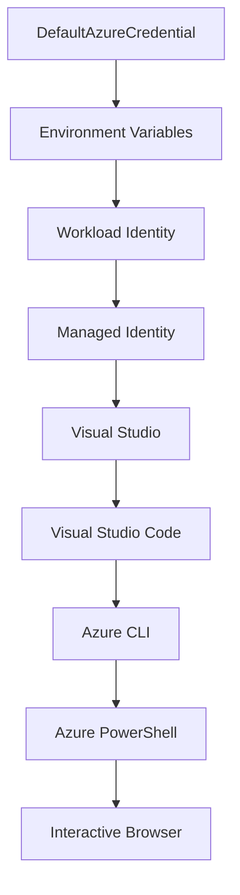

<!--
CO_OP_TRANSLATOR_METADATA:
{
  "original_hash": "fb0687bd0b166ecb0430dfeeed83487e",
  "translation_date": "2025-10-24T17:47:27+00:00",
  "source_file": "docs/getting-started/azd-basics.md",
  "language_code": "tl"
}
-->
# AZD Pangunahing Kaalaman - Pag-unawa sa Azure Developer CLI

# AZD Pangunahing Kaalaman - Mga Konsepto at Batayan

**Pag-navigate sa Kabanata:**
- **📚 Home ng Kurso**: [AZD Para sa Mga Baguhan](../../README.md)
- **📖 Kasalukuyang Kabanata**: Kabanata 1 - Pundasyon at Mabilisang Pagsisimula
- **⬅️ Nakaraan**: [Pangkalahatang-ideya ng Kurso](../../README.md#-chapter-1-foundation--quick-start)
- **➡️ Susunod**: [Pag-install at Setup](installation.md)
- **🚀 Susunod na Kabanata**: [Kabanata 2: AI-First Development](../ai-foundry/azure-ai-foundry-integration.md)

## Panimula

Ang araling ito ay magpapakilala sa iyo sa Azure Developer CLI (azd), isang makapangyarihang tool na command-line na nagpapabilis sa iyong paglalakbay mula sa lokal na pag-develop patungo sa pag-deploy sa Azure. Malalaman mo ang mga pangunahing konsepto, pangunahing tampok, at kung paano pinapasimple ng azd ang pag-deploy ng cloud-native na mga aplikasyon.

## Mga Layunin sa Pag-aaral

Sa pagtatapos ng araling ito, ikaw ay:
- Mauunawaan kung ano ang Azure Developer CLI at ang pangunahing layunin nito
- Matututo ng mga pangunahing konsepto ng templates, environments, at services
- Tuklasin ang mga pangunahing tampok kabilang ang template-driven development at Infrastructure as Code
- Mauunawaan ang istruktura ng proyekto ng azd at workflow
- Handa nang mag-install at mag-configure ng azd para sa iyong development environment

## Mga Resulta ng Pag-aaral

Pagkatapos makumpleto ang araling ito, magagawa mong:
- Ipaliwanag ang papel ng azd sa modernong cloud development workflows
- Tukuyin ang mga bahagi ng istruktura ng proyekto ng azd
- Ilarawan kung paano nagtutulungan ang templates, environments, at services
- Mauunawaan ang mga benepisyo ng Infrastructure as Code gamit ang azd
- Makilala ang iba't ibang azd commands at ang kanilang mga layunin

## Ano ang Azure Developer CLI (azd)?

Ang Azure Developer CLI (azd) ay isang command-line tool na idinisenyo upang pabilisin ang iyong paglalakbay mula sa lokal na pag-develop patungo sa pag-deploy sa Azure. Pinapasimple nito ang proseso ng paggawa, pag-deploy, at pamamahala ng cloud-native na mga aplikasyon sa Azure.

## Mga Pangunahing Konsepto

### Templates
Ang templates ang pundasyon ng azd. Naglalaman ito ng:
- **Application code** - Ang iyong source code at mga dependencies
- **Infrastructure definitions** - Mga Azure resources na tinukoy sa Bicep o Terraform
- **Configuration files** - Mga settings at environment variables
- **Deployment scripts** - Mga automated deployment workflows

### Environments
Ang environments ay kumakatawan sa iba't ibang deployment targets:
- **Development** - Para sa testing at development
- **Staging** - Pre-production environment
- **Production** - Live production environment

Ang bawat environment ay may sariling:
- Azure resource group
- Configuration settings
- Deployment state

### Services
Ang services ay ang mga building blocks ng iyong aplikasyon:
- **Frontend** - Mga web application, SPAs
- **Backend** - Mga API, microservices
- **Database** - Mga solusyon sa data storage
- **Storage** - File at blob storage

## Mga Pangunahing Tampok

### 1. Template-Driven Development
```bash
# Browse available templates
azd template list

# Initialize from a template
azd init --template <template-name>
```

### 2. Infrastructure as Code
- **Bicep** - Domain-specific language ng Azure
- **Terraform** - Multi-cloud infrastructure tool
- **ARM Templates** - Mga template ng Azure Resource Manager

### 3. Integrated Workflows
```bash
# Complete deployment workflow
azd up            # Provision + Deploy this is hands off for first time setup

# 🧪 NEW: Preview infrastructure changes before deployment (SAFE)
azd provision --preview    # Simulate infrastructure deployment without making changes

azd provision     # Create Azure resources if you update the infrastructure use this
azd deploy        # Deploy application code or redeploy application code once update
azd down          # Clean up resources
```

#### 🛡️ Ligtas na Pagpaplano ng Infrastructure gamit ang Preview
Ang `azd provision --preview` command ay isang malaking tulong para sa ligtas na pag-deploy:
- **Dry-run analysis** - Ipinapakita kung ano ang gagawin, babaguhin, o buburahin
- **Walang panganib** - Walang aktwal na pagbabago sa iyong Azure environment
- **Team collaboration** - Ibahagi ang mga resulta ng preview bago mag-deploy
- **Cost estimation** - Mauunawaan ang gastos ng resources bago mag-commit

```bash
# Example preview workflow
azd provision --preview           # See what will change
# Review the output, discuss with team
azd provision                     # Apply changes with confidence
```

### 4. Pamamahala ng Environment
```bash
# Create and manage environments
azd env new <environment-name>
azd env select <environment-name>
azd env list
```

## 📁 Istruktura ng Proyekto

Isang tipikal na istruktura ng proyekto ng azd:
```
my-app/
├── .azd/                    # azd configuration
│   └── config.json
├── .azure/                  # Azure deployment artifacts
├── .devcontainer/          # Development container config
├── .github/workflows/      # GitHub Actions
├── .vscode/               # VS Code settings
├── infra/                 # Infrastructure code
│   ├── main.bicep        # Main infrastructure template
│   ├── main.parameters.json
│   └── modules/          # Reusable modules
├── src/                  # Application source code
│   ├── api/             # Backend services
│   └── web/             # Frontend application
├── azure.yaml           # azd project configuration
└── README.md
```

## 🔧 Mga Configuration Files

### azure.yaml
Ang pangunahing configuration file ng proyekto:
```yaml
name: my-awesome-app
metadata:
  template: my-template@1.0.0

services:
  web:
    project: ./src/web
    language: js
    host: appservice
  api:
    project: ./src/api
    language: js
    host: appservice

hooks:
  preprovision:
    shell: pwsh
    run: echo "Preparing to provision..."
```

### .azure/config.json
Configuration na partikular sa environment:
```json
{
  "version": 1,
  "defaultEnvironment": "dev",
  "environments": {
    "dev": {
      "subscriptionId": "your-subscription-id",
      "location": "eastus"
    }
  }
}
```

## 🎪 Karaniwang Workflows

### Pagsisimula ng Bagong Proyekto
```bash
# Method 1: Use existing template
azd init --template todo-nodejs-mongo

# Method 2: Start from scratch
azd init

# Method 3: Use current directory
azd init .
```

### Siklo ng Pag-develop
```bash
# Set up development environment
azd auth login
azd env new dev
azd env select dev

# Deploy everything
azd up

# Make changes and redeploy
azd deploy

# Clean up when done
azd down --force --purge # command in the Azure Developer CLI is a **hard reset** for your environment—especially useful when you're troubleshooting failed deployments, cleaning up orphaned resources, or prepping for a fresh redeploy.
```

## Pag-unawa sa `azd down --force --purge`
Ang `azd down --force --purge` command ay isang makapangyarihang paraan upang ganap na tanggalin ang iyong azd environment at lahat ng kaugnay na resources. Narito ang breakdown ng bawat flag:
```
--force
```
- Nilalaktawan ang mga confirmation prompts.
- Kapaki-pakinabang para sa automation o scripting kung saan hindi posible ang manual na input.
- Tinitiyak na magpapatuloy ang teardown nang walang abala, kahit na may mga inconsistency na natukoy ng CLI.

```
--purge
```
Binubura ang **lahat ng kaugnay na metadata**, kabilang ang:
State ng environment
Lokal na `.azure` folder
Impormasyon ng cached deployment
Pinipigilan ang azd mula sa "pag-alala" ng mga nakaraang deployment, na maaaring magdulot ng mga isyu tulad ng hindi tugmang resource groups o stale registry references.

### Bakit gamitin ang dalawa?
Kapag nahirapan ka sa `azd up` dahil sa natitirang state o partial deployments, ang kombinasyong ito ay tinitiyak ang **malinis na simula**.

Ito ay partikular na kapaki-pakinabang pagkatapos ng manual na pagtanggal ng resources sa Azure portal o kapag nagpapalit ng templates, environments, o naming conventions ng resource group.

### Pamamahala ng Maramihang Environments
```bash
# Create staging environment
azd env new staging
azd env select staging
azd up

# Switch back to dev
azd env select dev

# Compare environments
azd env list
```

## 🔐 Authentication at Mga Kredensyal

Ang pag-unawa sa authentication ay mahalaga para sa matagumpay na azd deployments. Gumagamit ang Azure ng maraming authentication methods, at ginagamit ng azd ang parehong credential chain na ginagamit ng iba pang Azure tools.

### Azure CLI Authentication (`az login`)

Bago gamitin ang azd, kailangan mong mag-authenticate sa Azure. Ang pinaka-karaniwang paraan ay gamit ang Azure CLI:

```bash
# Interactive login (opens browser)
az login

# Login with specific tenant
az login --tenant <tenant-id>

# Login with service principal
az login --service-principal -u <app-id> -p <password> --tenant <tenant-id>

# Check current login status
az account show

# List available subscriptions
az account list --output table

# Set default subscription
az account set --subscription <subscription-id>
```

### Authentication Flow
1. **Interactive Login**: Binubuksan ang iyong default browser para sa authentication
2. **Device Code Flow**: Para sa mga environment na walang browser access
3. **Service Principal**: Para sa automation at CI/CD scenarios
4. **Managed Identity**: Para sa mga Azure-hosted applications

### DefaultAzureCredential Chain

Ang `DefaultAzureCredential` ay isang uri ng kredensyal na nagbibigay ng pinasimpleng karanasan sa authentication sa pamamagitan ng awtomatikong pagsubok sa maraming pinagmulan ng kredensyal sa partikular na order:

#### Order ng Credential Chain


#### 1. Environment Variables
```bash
# Set environment variables for service principal
export AZURE_CLIENT_ID="<app-id>"
export AZURE_CLIENT_SECRET="<password>"
export AZURE_TENANT_ID="<tenant-id>"
```

#### 2. Workload Identity (Kubernetes/GitHub Actions)
Awtomatikong ginagamit sa:
- Azure Kubernetes Service (AKS) gamit ang Workload Identity
- GitHub Actions gamit ang OIDC federation
- Iba pang federated identity scenarios

#### 3. Managed Identity
Para sa mga Azure resources tulad ng:
- Virtual Machines
- App Service
- Azure Functions
- Container Instances

```bash
# Check if running on Azure resource with managed identity
az account show --query "user.type" --output tsv
# Returns: "servicePrincipal" if using managed identity
```

#### 4. Integration ng Developer Tools
- **Visual Studio**: Awtomatikong ginagamit ang naka-sign-in na account
- **VS Code**: Ginagamit ang kredensyal ng Azure Account extension
- **Azure CLI**: Ginagamit ang `az login` credentials (pinaka-karaniwan para sa lokal na pag-develop)

### Setup ng AZD Authentication

```bash
# Method 1: Use Azure CLI (Recommended for development)
az login
azd auth login  # Uses existing Azure CLI credentials

# Method 2: Direct azd authentication
azd auth login --use-device-code  # For headless environments

# Method 3: Check authentication status
azd auth login --check-status

# Method 4: Logout and re-authenticate
azd auth logout
azd auth login
```

### Mga Best Practices sa Authentication

#### Para sa Lokal na Pag-develop
```bash
# 1. Login with Azure CLI
az login

# 2. Verify correct subscription
az account show
az account set --subscription "Your Subscription Name"

# 3. Use azd with existing credentials
azd auth login
```

#### Para sa CI/CD Pipelines
```yaml
# GitHub Actions example
- name: Azure Login
  uses: azure/login@v1
  with:
    creds: ${{ secrets.AZURE_CREDENTIALS }}

- name: Deploy with azd
  run: |
    azd auth login --client-id ${{ secrets.AZURE_CLIENT_ID }} \
                    --client-secret ${{ secrets.AZURE_CLIENT_SECRET }} \
                    --tenant-id ${{ secrets.AZURE_TENANT_ID }}
    azd up --no-prompt
```

#### Para sa Production Environments
- Gumamit ng **Managed Identity** kapag tumatakbo sa Azure resources
- Gumamit ng **Service Principal** para sa automation scenarios
- Iwasan ang pag-store ng credentials sa code o configuration files
- Gumamit ng **Azure Key Vault** para sa sensitibong configuration

### Karaniwang Isyu sa Authentication at Mga Solusyon

#### Isyu: "No subscription found"
```bash
# Solution: Set default subscription
az account list --output table
az account set --subscription "<subscription-id>"
azd env set AZURE_SUBSCRIPTION_ID "<subscription-id>"
```

#### Isyu: "Insufficient permissions"
```bash
# Solution: Check and assign required roles
az role assignment list --assignee $(az account show --query user.name --output tsv)

# Common required roles:
# - Contributor (for resource management)
# - User Access Administrator (for role assignments)
```

#### Isyu: "Token expired"
```bash
# Solution: Re-authenticate
az logout
az login
azd auth logout
azd auth login
```

### Authentication sa Iba't Ibang Scenarios

#### Lokal na Pag-develop
```bash
# Personal development account
az login
azd auth login
```

#### Team Development
```bash
# Use specific tenant for organization
az login --tenant contoso.onmicrosoft.com
azd auth login
```

#### Multi-tenant Scenarios
```bash
# Switch between tenants
az login --tenant tenant1.onmicrosoft.com
# Deploy to tenant 1
azd up

az login --tenant tenant2.onmicrosoft.com  
# Deploy to tenant 2
azd up
```

### Mga Pagsasaalang-alang sa Seguridad

1. **Credential Storage**: Huwag kailanman mag-store ng credentials sa source code
2. **Scope Limitation**: Gumamit ng least-privilege principle para sa service principals
3. **Token Rotation**: Regular na i-rotate ang service principal secrets
4. **Audit Trail**: Subaybayan ang authentication at deployment activities
5. **Network Security**: Gumamit ng private endpoints kung maaari

### Pag-troubleshoot ng Authentication

```bash
# Debug authentication issues
azd auth login --check-status
az account show
az account get-access-token

# Common diagnostic commands
whoami                          # Current user context
az ad signed-in-user show      # Azure AD user details
az group list                  # Test resource access
```

## Pag-unawa sa `azd down --force --purge`

### Discovery
```bash
azd template list              # Browse templates
azd template show <template>   # Template details
azd init --help               # Initialization options
```

### Pamamahala ng Proyekto
```bash
azd show                     # Project overview
azd env show                 # Current environment
azd config list             # Configuration settings
```

### Monitoring
```bash
azd monitor                  # Open Azure portal
azd pipeline config          # Set up CI/CD
azd logs                     # View application logs
```

## Mga Best Practices

### 1. Gumamit ng Makahulugang Pangalan
```bash
# Good
azd env new production-east
azd init --template web-app-secure

# Avoid
azd env new env1
azd init --template template1
```

### 2. Gamitin ang Templates
- Magsimula sa mga umiiral na templates
- I-customize ayon sa iyong pangangailangan
- Gumawa ng reusable templates para sa iyong organisasyon

### 3. Paghiwalay ng Environment
- Gumamit ng hiwalay na environments para sa dev/staging/prod
- Huwag mag-deploy nang direkta sa production mula sa lokal na makina
- Gumamit ng CI/CD pipelines para sa production deployments

### 4. Pamamahala ng Configuration
- Gumamit ng environment variables para sa sensitibong data
- Panatilihin ang configuration sa version control
- I-dokumento ang mga settings na partikular sa environment

## Pag-usad sa Pag-aaral

### Baguhan (Linggo 1-2)
1. I-install ang azd at mag-authenticate
2. Mag-deploy ng simpleng template
3. Mauunawaan ang istruktura ng proyekto
4. Matutunan ang mga pangunahing commands (up, down, deploy)

### Intermediate (Linggo 3-4)
1. I-customize ang templates
2. Pamahalaan ang maramihang environments
3. Mauunawaan ang infrastructure code
4. Mag-set up ng CI/CD pipelines

### Advanced (Linggo 5+)
1. Gumawa ng custom templates
2. Advanced na infrastructure patterns
3. Multi-region deployments
4. Enterprise-grade configurations

## Mga Susunod na Hakbang

**📖 Ipagpatuloy ang Pag-aaral sa Kabanata 1:**
- [Pag-install at Setup](installation.md) - I-install at i-configure ang azd
- [Ang Iyong Unang Proyekto](first-project.md) - Kumpletuhin ang hands-on tutorial
- [Configuration Guide](configuration.md) - Mga advanced na opsyon sa configuration

**🎯 Handa na para sa Susunod na Kabanata?**
- [Kabanata 2: AI-First Development](../ai-foundry/azure-ai-foundry-integration.md) - Simulan ang paggawa ng AI applications

## Karagdagang Resources

- [Pangkalahatang-ideya ng Azure Developer CLI](https://learn.microsoft.com/en-us/azure/developer/azure-developer-cli/)
- [Template Gallery](https://azure.github.io/awesome-azd/)
- [Mga Sample ng Komunidad](https://github.com/Azure-Samples)

---

**Pag-navigate sa Kabanata:**
- **📚 Home ng Kurso**: [AZD Para sa Mga Baguhan](../../README.md)
- **📖 Kasalukuyang Kabanata**: Kabanata 1 - Pundasyon at Mabilisang Pagsisimula  
- **⬅️ Nakaraan**: [Pangkalahatang-ideya ng Kurso](../../README.md#-chapter-1-foundation--quick-start)
- **➡️ Susunod**: [Pag-install at Setup](installation.md)
- **🚀 Susunod na Kabanata**: [Kabanata 2: AI-First Development](../ai-foundry/azure-ai-foundry-integration.md)

---

**Paunawa**:  
Ang dokumentong ito ay isinalin gamit ang AI translation service na [Co-op Translator](https://github.com/Azure/co-op-translator). Bagama't sinisikap naming maging tumpak, mangyaring tandaan na ang mga awtomatikong pagsasalin ay maaaring maglaman ng mga pagkakamali o hindi pagkakatugma. Ang orihinal na dokumento sa kanyang katutubong wika ang dapat ituring na mapagkakatiwalaang pinagmulan. Para sa mahalagang impormasyon, inirerekomenda ang propesyonal na pagsasalin ng tao. Hindi kami mananagot sa anumang hindi pagkakaunawaan o maling interpretasyon na dulot ng paggamit ng pagsasaling ito.