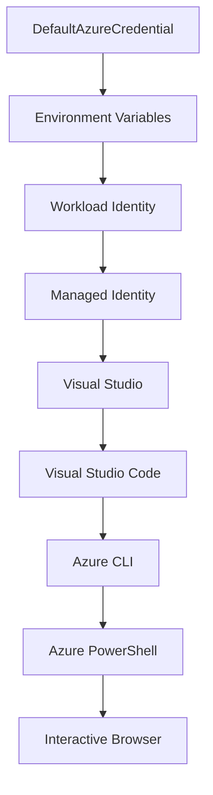

<!--
CO_OP_TRANSLATOR_METADATA:
{
  "original_hash": "fb0687bd0b166ecb0430dfeeed83487e",
  "translation_date": "2025-10-24T17:19:44+00:00",
  "source_file": "docs/getting-started/azd-basics.md",
  "language_code": "tr"
}
-->
# AZD Temelleri - Azure Developer CLI'yi Anlamak

# AZD Temelleri - Temel Kavramlar ve Temeller

**Bölüm Navigasyonu:**
- **📚 Kurs Ana Sayfası**: [AZD Yeni Başlayanlar İçin](../../README.md)
- **📖 Mevcut Bölüm**: Bölüm 1 - Temel Bilgiler ve Hızlı Başlangıç
- **⬅️ Önceki**: [Kurs Genel Bakış](../../README.md#-chapter-1-foundation--quick-start)
- **➡️ Sonraki**: [Kurulum ve Ayarlar](installation.md)
- **🚀 Sonraki Bölüm**: [Bölüm 2: AI-Öncelikli Geliştirme](../ai-foundry/azure-ai-foundry-integration.md)

## Giriş

Bu ders, Azure Developer CLI'yi (azd) tanıtarak, yerel geliştirmeden Azure'a dağıtıma kadar olan süreci hızlandıran güçlü bir komut satırı aracını ele alır. Temel kavramları, ana özellikleri öğrenecek ve azd'nin bulut tabanlı uygulama dağıtımını nasıl kolaylaştırdığını anlayacaksınız.

## Öğrenme Hedefleri

Bu dersin sonunda:
- Azure Developer CLI'nin ne olduğunu ve temel amacını anlayacaksınız
- Şablonlar, ortamlar ve hizmetler gibi temel kavramları öğreneceksiniz
- Şablon tabanlı geliştirme ve Kod Olarak Altyapı gibi ana özellikleri keşfedeceksiniz
- azd proje yapısını ve iş akışını anlayacaksınız
- azd'yi geliştirme ortamınıza kurmaya ve yapılandırmaya hazır olacaksınız

## Öğrenme Çıktıları

Bu dersi tamamladıktan sonra:
- azd'nin modern bulut geliştirme iş akışlarındaki rolünü açıklayabileceksiniz
- azd proje yapısının bileşenlerini tanımlayabileceksiniz
- Şablonların, ortamların ve hizmetlerin nasıl birlikte çalıştığını açıklayabileceksiniz
- azd ile Kod Olarak Altyapının faydalarını anlayabileceksiniz
- Farklı azd komutlarını ve amaçlarını tanıyabileceksiniz

## Azure Developer CLI (azd) Nedir?

Azure Developer CLI (azd), yerel geliştirmeden Azure'a dağıtıma kadar olan süreci hızlandırmak için tasarlanmış bir komut satırı aracıdır. Bulut tabanlı uygulamaları Azure üzerinde oluşturma, dağıtma ve yönetme sürecini basitleştirir.

## Temel Kavramlar

### Şablonlar
Şablonlar azd'nin temelini oluşturur. Şunları içerir:
- **Uygulama kodu** - Kaynak kodunuz ve bağımlılıklarınız
- **Altyapı tanımları** - Azure kaynakları Bicep veya Terraform ile tanımlanır
- **Yapılandırma dosyaları** - Ayarlar ve ortam değişkenleri
- **Dağıtım betikleri** - Otomatik dağıtım iş akışları

### Ortamlar
Ortamlar farklı dağıtım hedeflerini temsil eder:
- **Geliştirme** - Test ve geliştirme için
- **Staging** - Üretim öncesi ortam
- **Üretim** - Canlı üretim ortamı

Her ortam kendi:
- Azure kaynak grubunu
- Yapılandırma ayarlarını
- Dağıtım durumunu korur

### Hizmetler
Hizmetler uygulamanızın yapı taşlarıdır:
- **Frontend** - Web uygulamaları, SPAs
- **Backend** - API'ler, mikro hizmetler
- **Veritabanı** - Veri depolama çözümleri
- **Depolama** - Dosya ve blob depolama

## Ana Özellikler

### 1. Şablon Tabanlı Geliştirme
```bash
# Browse available templates
azd template list

# Initialize from a template
azd init --template <template-name>
```

### 2. Kod Olarak Altyapı
- **Bicep** - Azure'un alanına özgü dili
- **Terraform** - Çoklu bulut altyapı aracı
- **ARM Şablonları** - Azure Resource Manager şablonları

### 3. Entegre İş Akışları
```bash
# Complete deployment workflow
azd up            # Provision + Deploy this is hands off for first time setup

# 🧪 NEW: Preview infrastructure changes before deployment (SAFE)
azd provision --preview    # Simulate infrastructure deployment without making changes

azd provision     # Create Azure resources if you update the infrastructure use this
azd deploy        # Deploy application code or redeploy application code once update
azd down          # Clean up resources
```

#### 🛡️ Önizleme ile Güvenli Altyapı Planlama
`azd provision --preview` komutu güvenli dağıtımlar için devrim niteliğindedir:
- **Dry-run analizi** - Nelerin oluşturulacağını, değiştirileceğini veya silineceğini gösterir
- **Sıfır risk** - Azure ortamınızda gerçek bir değişiklik yapılmaz
- **Ekip işbirliği** - Dağıtımdan önce önizleme sonuçlarını paylaşın
- **Maliyet tahmini** - Kaynak maliyetlerini taahhüt etmeden önce anlayın

```bash
# Example preview workflow
azd provision --preview           # See what will change
# Review the output, discuss with team
azd provision                     # Apply changes with confidence
```

### 4. Ortam Yönetimi
```bash
# Create and manage environments
azd env new <environment-name>
azd env select <environment-name>
azd env list
```

## 📁 Proje Yapısı

Tipik bir azd proje yapısı:
```
my-app/
├── .azd/                    # azd configuration
│   └── config.json
├── .azure/                  # Azure deployment artifacts
├── .devcontainer/          # Development container config
├── .github/workflows/      # GitHub Actions
├── .vscode/               # VS Code settings
├── infra/                 # Infrastructure code
│   ├── main.bicep        # Main infrastructure template
│   ├── main.parameters.json
│   └── modules/          # Reusable modules
├── src/                  # Application source code
│   ├── api/             # Backend services
│   └── web/             # Frontend application
├── azure.yaml           # azd project configuration
└── README.md
```

## 🔧 Yapılandırma Dosyaları

### azure.yaml
Ana proje yapılandırma dosyası:
```yaml
name: my-awesome-app
metadata:
  template: my-template@1.0.0

services:
  web:
    project: ./src/web
    language: js
    host: appservice
  api:
    project: ./src/api
    language: js
    host: appservice

hooks:
  preprovision:
    shell: pwsh
    run: echo "Preparing to provision..."
```

### .azure/config.json
Ortam özelinde yapılandırma:
```json
{
  "version": 1,
  "defaultEnvironment": "dev",
  "environments": {
    "dev": {
      "subscriptionId": "your-subscription-id",
      "location": "eastus"
    }
  }
}
```

## 🎪 Yaygın İş Akışları

### Yeni Bir Projeye Başlama
```bash
# Method 1: Use existing template
azd init --template todo-nodejs-mongo

# Method 2: Start from scratch
azd init

# Method 3: Use current directory
azd init .
```

### Geliştirme Döngüsü
```bash
# Set up development environment
azd auth login
azd env new dev
azd env select dev

# Deploy everything
azd up

# Make changes and redeploy
azd deploy

# Clean up when done
azd down --force --purge # command in the Azure Developer CLI is a **hard reset** for your environment—especially useful when you're troubleshooting failed deployments, cleaning up orphaned resources, or prepping for a fresh redeploy.
```

## `azd down --force --purge` Komutunu Anlamak
`azd down --force --purge` komutu, azd ortamınızı ve ilişkili tüm kaynakları tamamen kaldırmanın güçlü bir yoludur. İşte her bir bayrağın ne yaptığına dair bir açıklama:
```
--force
```
- Onay istemlerini atlar.
- Manuel girişin mümkün olmadığı otomasyon veya betiklerde kullanışlıdır.
- CLI tutarsızlıkları algılasa bile kesintisiz bir şekilde kaldırma işlemini garanti eder.

```
--purge
```
**Tüm ilişkili meta verileri** siler, şunları içerir:
Ortam durumu
Yerel `.azure` klasörü
Önbelleğe alınmış dağıtım bilgileri
azd'nin önceki dağıtımları "hatırlamasını" önler, bu da kaynak grupları veya eski kayıt defteri referansları gibi sorunlara neden olabilir.

### Neden her ikisini kullanmalısınız?
`azd up` ile kalan durum veya kısmi dağıtımlar nedeniyle bir duvara çarptığınızda, bu kombinasyon **temiz bir başlangıç** sağlar.

Özellikle Azure portalında manuel kaynak silme işlemlerinden sonra veya şablonları, ortamları veya kaynak grubu adlandırma kurallarını değiştirirken faydalıdır.

### Birden Fazla Ortamı Yönetmek
```bash
# Create staging environment
azd env new staging
azd env select staging
azd up

# Switch back to dev
azd env select dev

# Compare environments
azd env list
```

## 🔐 Kimlik Doğrulama ve Kimlik Bilgileri

Başarılı azd dağıtımları için kimlik doğrulamayı anlamak çok önemlidir. Azure, birden fazla kimlik doğrulama yöntemi kullanır ve azd, diğer Azure araçları tarafından kullanılan aynı kimlik bilgisi zincirinden yararlanır.

### Azure CLI Kimlik Doğrulama (`az login`)

azd kullanmadan önce Azure ile kimlik doğrulaması yapmanız gerekir. En yaygın yöntem Azure CLI kullanmaktır:

```bash
# Interactive login (opens browser)
az login

# Login with specific tenant
az login --tenant <tenant-id>

# Login with service principal
az login --service-principal -u <app-id> -p <password> --tenant <tenant-id>

# Check current login status
az account show

# List available subscriptions
az account list --output table

# Set default subscription
az account set --subscription <subscription-id>
```

### Kimlik Doğrulama Akışı
1. **Etkileşimli Giriş**: Kimlik doğrulama için varsayılan tarayıcınızı açar
2. **Cihaz Kodu Akışı**: Tarayıcı erişimi olmayan ortamlar için
3. **Hizmet Prensibi**: Otomasyon ve CI/CD senaryoları için
4. **Yönetilen Kimlik**: Azure barındırılan uygulamalar için

### DefaultAzureCredential Zinciri

`DefaultAzureCredential`, belirli bir sırayla birden fazla kimlik bilgisi kaynağını otomatik olarak deneyerek basitleştirilmiş bir kimlik doğrulama deneyimi sağlayan bir kimlik bilgisi türüdür:

#### Kimlik Bilgisi Zinciri Sırası


#### 1. Ortam Değişkenleri
```bash
# Set environment variables for service principal
export AZURE_CLIENT_ID="<app-id>"
export AZURE_CLIENT_SECRET="<password>"
export AZURE_TENANT_ID="<tenant-id>"
```

#### 2. İş Yükü Kimliği (Kubernetes/GitHub Actions)
Otomatik olarak kullanılır:
- Azure Kubernetes Service (AKS) ile İş Yükü Kimliği
- GitHub Actions ile OIDC federasyonu
- Diğer federasyon kimlik senaryoları

#### 3. Yönetilen Kimlik
Azure kaynakları için:
- Sanal Makineler
- Uygulama Hizmeti
- Azure İşlevleri
- Konteyner Örnekleri

```bash
# Check if running on Azure resource with managed identity
az account show --query "user.type" --output tsv
# Returns: "servicePrincipal" if using managed identity
```

#### 4. Geliştirici Araçları Entegrasyonu
- **Visual Studio**: Oturum açmış hesabı otomatik olarak kullanır
- **VS Code**: Azure Hesap eklentisi kimlik bilgilerini kullanır
- **Azure CLI**: `az login` kimlik bilgilerini kullanır (yerel geliştirme için en yaygın)

### AZD Kimlik Doğrulama Kurulumu

```bash
# Method 1: Use Azure CLI (Recommended for development)
az login
azd auth login  # Uses existing Azure CLI credentials

# Method 2: Direct azd authentication
azd auth login --use-device-code  # For headless environments

# Method 3: Check authentication status
azd auth login --check-status

# Method 4: Logout and re-authenticate
azd auth logout
azd auth login
```

### Kimlik Doğrulama En İyi Uygulamaları

#### Yerel Geliştirme İçin
```bash
# 1. Login with Azure CLI
az login

# 2. Verify correct subscription
az account show
az account set --subscription "Your Subscription Name"

# 3. Use azd with existing credentials
azd auth login
```

#### CI/CD Boru Hatları İçin
```yaml
# GitHub Actions example
- name: Azure Login
  uses: azure/login@v1
  with:
    creds: ${{ secrets.AZURE_CREDENTIALS }}

- name: Deploy with azd
  run: |
    azd auth login --client-id ${{ secrets.AZURE_CLIENT_ID }} \
                    --client-secret ${{ secrets.AZURE_CLIENT_SECRET }} \
                    --tenant-id ${{ secrets.AZURE_TENANT_ID }}
    azd up --no-prompt
```

#### Üretim Ortamları İçin
- Azure kaynaklarında çalışırken **Yönetilen Kimlik** kullanın
- Otomasyon senaryoları için **Hizmet Prensibi** kullanın
- Kimlik bilgilerini kodda veya yapılandırma dosyalarında saklamaktan kaçının
- Hassas yapılandırma için **Azure Key Vault** kullanın

### Yaygın Kimlik Doğrulama Sorunları ve Çözümleri

#### Sorun: "Abonelik bulunamadı"
```bash
# Solution: Set default subscription
az account list --output table
az account set --subscription "<subscription-id>"
azd env set AZURE_SUBSCRIPTION_ID "<subscription-id>"
```

#### Sorun: "Yetersiz izinler"
```bash
# Solution: Check and assign required roles
az role assignment list --assignee $(az account show --query user.name --output tsv)

# Common required roles:
# - Contributor (for resource management)
# - User Access Administrator (for role assignments)
```

#### Sorun: "Token süresi doldu"
```bash
# Solution: Re-authenticate
az logout
az login
azd auth logout
azd auth login
```

### Farklı Senaryolarda Kimlik Doğrulama

#### Yerel Geliştirme
```bash
# Personal development account
az login
azd auth login
```

#### Ekip Geliştirme
```bash
# Use specific tenant for organization
az login --tenant contoso.onmicrosoft.com
azd auth login
```

#### Çok Kiracılı Senaryolar
```bash
# Switch between tenants
az login --tenant tenant1.onmicrosoft.com
# Deploy to tenant 1
azd up

az login --tenant tenant2.onmicrosoft.com  
# Deploy to tenant 2
azd up
```

### Güvenlik Hususları

1. **Kimlik Bilgisi Depolama**: Kimlik bilgilerini asla kaynak kodda saklamayın
2. **Kapsam Sınırlaması**: Hizmet prensipleri için en az ayrıcalık ilkesini kullanın
3. **Token Döndürme**: Hizmet prensibi sırlarını düzenli olarak döndürün
4. **Denetim İzleme**: Kimlik doğrulama ve dağıtım etkinliklerini izleyin
5. **Ağ Güvenliği**: Mümkün olduğunda özel uç noktalar kullanın

### Kimlik Doğrulama Sorunlarını Giderme

```bash
# Debug authentication issues
azd auth login --check-status
az account show
az account get-access-token

# Common diagnostic commands
whoami                          # Current user context
az ad signed-in-user show      # Azure AD user details
az group list                  # Test resource access
```

## `azd down --force --purge` Komutunu Anlamak

### Keşif
```bash
azd template list              # Browse templates
azd template show <template>   # Template details
azd init --help               # Initialization options
```

### Proje Yönetimi
```bash
azd show                     # Project overview
azd env show                 # Current environment
azd config list             # Configuration settings
```

### İzleme
```bash
azd monitor                  # Open Azure portal
azd pipeline config          # Set up CI/CD
azd logs                     # View application logs
```

## En İyi Uygulamalar

### 1. Anlamlı İsimler Kullanın
```bash
# Good
azd env new production-east
azd init --template web-app-secure

# Avoid
azd env new env1
azd init --template template1
```

### 2. Şablonlardan Yararlanın
- Mevcut şablonlarla başlayın
- İhtiyaçlarınıza göre özelleştirin
- Kuruluşunuz için yeniden kullanılabilir şablonlar oluşturun

### 3. Ortam İzolasyonu
- Geliştirme/staging/üretim için ayrı ortamlar kullanın
- Yerel makineden doğrudan üretime dağıtım yapmayın
- Üretim dağıtımları için CI/CD boru hatlarını kullanın

### 4. Yapılandırma Yönetimi
- Hassas veriler için ortam değişkenlerini kullanın
- Yapılandırmayı sürüm kontrolünde tutun
- Ortama özel ayarları belgeleyin

## Öğrenme İlerlemesi

### Başlangıç Seviyesi (1-2 Hafta)
1. azd'yi kurun ve kimlik doğrulama yapın
2. Basit bir şablon dağıtın
3. Proje yapısını anlayın
4. Temel komutları öğrenin (up, down, deploy)

### Orta Seviye (3-4 Hafta)
1. Şablonları özelleştirin
2. Birden fazla ortam yönetin
3. Altyapı kodunu anlayın
4. CI/CD boru hatlarını ayarlayın

### İleri Seviye (5+ Hafta)
1. Özel şablonlar oluşturun
2. Gelişmiş altyapı desenleri
3. Çok bölgeli dağıtımlar
4. Kurumsal düzeyde yapılandırmalar

## Sonraki Adımlar

**📖 Bölüm 1 Öğrenimine Devam Edin:**
- [Kurulum ve Ayarlar](installation.md) - azd'yi kurun ve yapılandırın
- [İlk Projeniz](first-project.md) - Uygulamalı eğitim tamamlayın
- [Yapılandırma Kılavuzu](configuration.md) - Gelişmiş yapılandırma seçenekleri

**🎯 Sonraki Bölüme Hazır mısınız?**
- [Bölüm 2: AI-Öncelikli Geliştirme](../ai-foundry/azure-ai-foundry-integration.md) - AI uygulamaları oluşturmaya başlayın

## Ek Kaynaklar

- [Azure Developer CLI Genel Bakış](https://learn.microsoft.com/en-us/azure/developer/azure-developer-cli/)
- [Şablon Galerisi](https://azure.github.io/awesome-azd/)
- [Topluluk Örnekleri](https://github.com/Azure-Samples)

---

**Bölüm Navigasyonu:**
- **📚 Kurs Ana Sayfası**: [AZD Yeni Başlayanlar İçin](../../README.md)
- **📖 Mevcut Bölüm**: Bölüm 1 - Temel Bilgiler ve Hızlı Başlangıç  
- **⬅️ Önceki**: [Kurs Genel Bakış](../../README.md#-chapter-1-foundation--quick-start)
- **➡️ Sonraki**: [Kurulum ve Ayarlar](installation.md)
- **🚀 Sonraki Bölüm**: [Bölüm 2: AI-Öncelikli Geliştirme](../ai-foundry/azure-ai-foundry-integration.md)

---

**Feragatname**:  
Bu belge, AI çeviri hizmeti [Co-op Translator](https://github.com/Azure/co-op-translator) kullanılarak çevrilmiştir. Doğruluk için çaba göstersek de, otomatik çevirilerin hata veya yanlışlıklar içerebileceğini lütfen unutmayın. Belgenin orijinal dili, yetkili kaynak olarak kabul edilmelidir. Kritik bilgiler için profesyonel insan çevirisi önerilir. Bu çevirinin kullanımından kaynaklanan yanlış anlamalar veya yanlış yorumlamalar için sorumluluk kabul etmiyoruz.