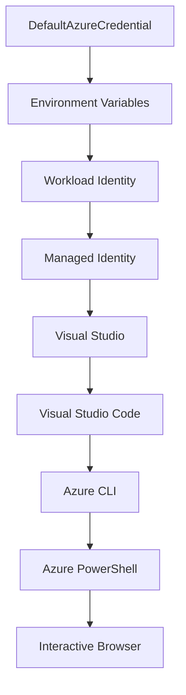

<!--
CO_OP_TRANSLATOR_METADATA:
{
  "original_hash": "fb0687bd0b166ecb0430dfeeed83487e",
  "translation_date": "2025-10-24T16:46:33+00:00",
  "source_file": "docs/getting-started/azd-basics.md",
  "language_code": "tw"
}
-->
# AZD 基礎 - 認識 Azure Developer CLI

# AZD 基礎 - 核心概念與基本原理

**章節導航：**
- **📚 課程首頁**: [AZD 初學者指南](../../README.md)
- **📖 本章節**: 第1章 - 基礎與快速入門
- **⬅️ 上一章**: [課程概述](../../README.md#-chapter-1-foundation--quick-start)
- **➡️ 下一章**: [安裝與設定](installation.md)
- **🚀 下一章節**: [第2章：AI優先開發](../ai-foundry/azure-ai-foundry-integration.md)

## 簡介

本課程將介紹 Azure Developer CLI (azd)，這是一個強大的命令列工具，能加速您從本地開發到 Azure 部署的過程。您將學習基本概念、核心功能，並了解 azd 如何簡化雲原生應用程式的部署。

## 學習目標

完成本課程後，您將能夠：
- 了解 Azure Developer CLI 的用途及主要目的
- 學習模板、環境和服務的核心概念
- 探索包括模板驅動開發和基礎架構即代碼的主要功能
- 理解 azd 專案結構和工作流程
- 為您的開發環境安裝和配置 azd 做好準備

## 學習成果

完成本課程後，您將能夠：
- 解釋 azd 在現代雲端開發工作流程中的角色
- 識別 azd 專案結構的組成部分
- 描述模板、環境和服務如何協同工作
- 理解使用 azd 的基礎架構即代碼的好處
- 認識不同的 azd 命令及其用途

## 什麼是 Azure Developer CLI (azd)?

Azure Developer CLI (azd) 是一個命令列工具，旨在加速您從本地開發到 Azure 部署的過程。它簡化了在 Azure 上構建、部署和管理雲原生應用程式的流程。

## 核心概念

### 模板
模板是 azd 的基礎。它包含：
- **應用程式代碼** - 您的原始碼和依賴項
- **基礎架構定義** - 使用 Bicep 或 Terraform 定義的 Azure 資源
- **配置文件** - 設定和環境變數
- **部署腳本** - 自動化部署工作流程

### 環境
環境代表不同的部署目標：
- **開發** - 用於測試和開發
- **測試** - 預生產環境
- **生產** - 實際生產環境

每個環境都有自己的：
- Azure 資源群組
- 配置設定
- 部署狀態

### 服務
服務是應用程式的構建模塊：
- **前端** - 網頁應用程式、單頁應用程式 (SPA)
- **後端** - API、微服務
- **資料庫** - 資料存儲解決方案
- **存儲** - 文件和 Blob 存儲

## 主要功能

### 1. 模板驅動開發
```bash
# Browse available templates
azd template list

# Initialize from a template
azd init --template <template-name>
```

### 2. 基礎架構即代碼
- **Bicep** - Azure 的領域專用語言
- **Terraform** - 多雲基礎架構工具
- **ARM Templates** - Azure 資源管理器模板

### 3. 整合工作流程
```bash
# Complete deployment workflow
azd up            # Provision + Deploy this is hands off for first time setup

# 🧪 NEW: Preview infrastructure changes before deployment (SAFE)
azd provision --preview    # Simulate infrastructure deployment without making changes

azd provision     # Create Azure resources if you update the infrastructure use this
azd deploy        # Deploy application code or redeploy application code once update
azd down          # Clean up resources
```

#### 🛡️ 使用預覽進行安全基礎架構規劃
`azd provision --preview` 命令是安全部署的突破性工具：
- **模擬分析** - 顯示將被創建、修改或刪除的內容
- **零風險** - 不會對您的 Azure 環境進行實際更改
- **團隊協作** - 部署前共享預覽結果
- **成本估算** - 在承諾之前了解資源成本

```bash
# Example preview workflow
azd provision --preview           # See what will change
# Review the output, discuss with team
azd provision                     # Apply changes with confidence
```

### 4. 環境管理
```bash
# Create and manage environments
azd env new <environment-name>
azd env select <environment-name>
azd env list
```

## 📁 專案結構

典型的 azd 專案結構：
```
my-app/
├── .azd/                    # azd configuration
│   └── config.json
├── .azure/                  # Azure deployment artifacts
├── .devcontainer/          # Development container config
├── .github/workflows/      # GitHub Actions
├── .vscode/               # VS Code settings
├── infra/                 # Infrastructure code
│   ├── main.bicep        # Main infrastructure template
│   ├── main.parameters.json
│   └── modules/          # Reusable modules
├── src/                  # Application source code
│   ├── api/             # Backend services
│   └── web/             # Frontend application
├── azure.yaml           # azd project configuration
└── README.md
```

## 🔧 配置文件

### azure.yaml
主要的專案配置文件：
```yaml
name: my-awesome-app
metadata:
  template: my-template@1.0.0

services:
  web:
    project: ./src/web
    language: js
    host: appservice
  api:
    project: ./src/api
    language: js
    host: appservice

hooks:
  preprovision:
    shell: pwsh
    run: echo "Preparing to provision..."
```

### .azure/config.json
特定環境的配置：
```json
{
  "version": 1,
  "defaultEnvironment": "dev",
  "environments": {
    "dev": {
      "subscriptionId": "your-subscription-id",
      "location": "eastus"
    }
  }
}
```

## 🎪 常見工作流程

### 開始新專案
```bash
# Method 1: Use existing template
azd init --template todo-nodejs-mongo

# Method 2: Start from scratch
azd init

# Method 3: Use current directory
azd init .
```

### 開發週期
```bash
# Set up development environment
azd auth login
azd env new dev
azd env select dev

# Deploy everything
azd up

# Make changes and redeploy
azd deploy

# Clean up when done
azd down --force --purge # command in the Azure Developer CLI is a **hard reset** for your environment—especially useful when you're troubleshooting failed deployments, cleaning up orphaned resources, or prepping for a fresh redeploy.
```

## 理解 `azd down --force --purge`
`azd down --force --purge` 命令是一種完全拆除 azd 環境及所有相關資源的強大方式。以下是每個標誌的功能：
```
--force
```
- 跳過確認提示。
- 適用於無法進行手動輸入的自動化或腳本。
- 即使 CLI 檢測到不一致，也能確保拆除過程不受干擾。

```
--purge
```
刪除 **所有相關的元數據**，包括：
環境狀態
本地 `.azure` 文件夾
緩存的部署信息
防止 azd "記住" 之前的部署，避免出現資源群組不匹配或過時的註冊表引用等問題。

### 為什麼要同時使用？
當您因為殘留狀態或部分部署而在使用 `azd up` 時遇到障礙時，這個組合可以確保獲得 **乾淨的起點**。

在 Azure 入口網站手動刪除資源後，或切換模板、環境或資源群組命名約定時，這尤其有用。

### 管理多個環境
```bash
# Create staging environment
azd env new staging
azd env select staging
azd up

# Switch back to dev
azd env select dev

# Compare environments
azd env list
```

## 🔐 身份驗證與憑證

理解身份驗證對於成功的 azd 部署至關重要。Azure 使用多種身份驗證方法，而 azd 利用其他 Azure 工具使用的相同憑證鏈。

### Azure CLI 身份驗證 (`az login`)

在使用 azd 之前，您需要使用 Azure 進行身份驗證。最常見的方法是使用 Azure CLI：

```bash
# Interactive login (opens browser)
az login

# Login with specific tenant
az login --tenant <tenant-id>

# Login with service principal
az login --service-principal -u <app-id> -p <password> --tenant <tenant-id>

# Check current login status
az account show

# List available subscriptions
az account list --output table

# Set default subscription
az account set --subscription <subscription-id>
```

### 身份驗證流程
1. **互動式登錄**: 開啟默認瀏覽器進行身份驗證
2. **設備代碼流程**: 用於無法訪問瀏覽器的環境
3. **服務主體**: 用於自動化和 CI/CD 場景
4. **托管身份**: 用於 Azure 托管的應用程式

### DefaultAzureCredential 鏈

`DefaultAzureCredential` 是一種憑證類型，通過自動嘗試特定順序的多個憑證來源提供簡化的身份驗證體驗：

#### 憑證鏈順序


#### 1. 環境變數
```bash
# Set environment variables for service principal
export AZURE_CLIENT_ID="<app-id>"
export AZURE_CLIENT_SECRET="<password>"
export AZURE_TENANT_ID="<tenant-id>"
```

#### 2. 工作負載身份 (Kubernetes/GitHub Actions)
自動用於：
- Azure Kubernetes Service (AKS) 的工作負載身份
- GitHub Actions 的 OIDC 聯邦身份
- 其他聯邦身份場景

#### 3. 托管身份
適用於 Azure 資源，例如：
- 虛擬機
- 應用服務
- Azure Functions
- 容器實例

```bash
# Check if running on Azure resource with managed identity
az account show --query "user.type" --output tsv
# Returns: "servicePrincipal" if using managed identity
```

#### 4. 開發工具整合
- **Visual Studio**: 自動使用已登錄的帳戶
- **VS Code**: 使用 Azure 帳戶擴展憑證
- **Azure CLI**: 使用 `az login` 憑證（本地開發最常用）

### AZD 身份驗證設置

```bash
# Method 1: Use Azure CLI (Recommended for development)
az login
azd auth login  # Uses existing Azure CLI credentials

# Method 2: Direct azd authentication
azd auth login --use-device-code  # For headless environments

# Method 3: Check authentication status
azd auth login --check-status

# Method 4: Logout and re-authenticate
azd auth logout
azd auth login
```

### 身份驗證最佳實踐

#### 用於本地開發
```bash
# 1. Login with Azure CLI
az login

# 2. Verify correct subscription
az account show
az account set --subscription "Your Subscription Name"

# 3. Use azd with existing credentials
azd auth login
```

#### 用於 CI/CD 管道
```yaml
# GitHub Actions example
- name: Azure Login
  uses: azure/login@v1
  with:
    creds: ${{ secrets.AZURE_CREDENTIALS }}

- name: Deploy with azd
  run: |
    azd auth login --client-id ${{ secrets.AZURE_CLIENT_ID }} \
                    --client-secret ${{ secrets.AZURE_CLIENT_SECRET }} \
                    --tenant-id ${{ secrets.AZURE_TENANT_ID }}
    azd up --no-prompt
```

#### 用於生產環境
- 在 Azure 資源上運行時使用 **托管身份**
- 自動化場景使用 **服務主體**
- 避免在代碼或配置文件中存儲憑證
- 使用 **Azure Key Vault** 存儲敏感配置

### 常見身份驗證問題及解決方案

#### 問題: "未找到訂閱"
```bash
# Solution: Set default subscription
az account list --output table
az account set --subscription "<subscription-id>"
azd env set AZURE_SUBSCRIPTION_ID "<subscription-id>"
```

#### 問題: "權限不足"
```bash
# Solution: Check and assign required roles
az role assignment list --assignee $(az account show --query user.name --output tsv)

# Common required roles:
# - Contributor (for resource management)
# - User Access Administrator (for role assignments)
```

#### 問題: "令牌過期"
```bash
# Solution: Re-authenticate
az logout
az login
azd auth logout
azd auth login
```

### 不同場景中的身份驗證

#### 本地開發
```bash
# Personal development account
az login
azd auth login
```

#### 團隊開發
```bash
# Use specific tenant for organization
az login --tenant contoso.onmicrosoft.com
azd auth login
```

#### 多租戶場景
```bash
# Switch between tenants
az login --tenant tenant1.onmicrosoft.com
# Deploy to tenant 1
azd up

az login --tenant tenant2.onmicrosoft.com  
# Deploy to tenant 2
azd up
```

### 安全考量

1. **憑證存儲**: 切勿將憑證存儲在源代碼中
2. **範圍限制**: 對服務主體使用最小權限原則
3. **令牌輪替**: 定期輪替服務主體密鑰
4. **審計追蹤**: 監控身份驗證和部署活動
5. **網絡安全**: 儘可能使用私有端點

### 身份驗證故障排除

```bash
# Debug authentication issues
azd auth login --check-status
az account show
az account get-access-token

# Common diagnostic commands
whoami                          # Current user context
az ad signed-in-user show      # Azure AD user details
az group list                  # Test resource access
```

## 理解 `azd down --force --purge`

### 探索
```bash
azd template list              # Browse templates
azd template show <template>   # Template details
azd init --help               # Initialization options
```

### 專案管理
```bash
azd show                     # Project overview
azd env show                 # Current environment
azd config list             # Configuration settings
```

### 監控
```bash
azd monitor                  # Open Azure portal
azd pipeline config          # Set up CI/CD
azd logs                     # View application logs
```

## 最佳實踐

### 1. 使用有意義的名稱
```bash
# Good
azd env new production-east
azd init --template web-app-secure

# Avoid
azd env new env1
azd init --template template1
```

### 2. 利用模板
- 從現有模板開始
- 根據需求進行自定義
- 為您的組織創建可重用模板

### 3. 環境隔離
- 為開發/測試/生產使用獨立環境
- 切勿直接從本地機器部署到生產環境
- 使用 CI/CD 管道進行生產部署

### 4. 配置管理
- 使用環境變數存儲敏感數據
- 將配置保存在版本控制中
- 記錄特定環境的設置

## 學習進度

### 初學者 (第1-2週)
1. 安裝 azd 並進行身份驗證
2. 部署簡單模板
3. 理解專案結構
4. 學習基本命令 (up, down, deploy)

### 中級 (第3-4週)
1. 自定義模板
2. 管理多個環境
3. 理解基礎架構代碼
4. 設置 CI/CD 管道

### 高級 (第5週及以後)
1. 創建自定義模板
2. 高級基礎架構模式
3. 多區域部署
4. 企業級配置

## 下一步

**📖 繼續學習第1章：**
- [安裝與設定](installation.md) - 安裝並配置 azd
- [您的第一個專案](first-project.md) - 完成動手教程
- [配置指南](configuration.md) - 高級配置選項

**🎯 準備進入下一章節？**
- [第2章：AI優先開發](../ai-foundry/azure-ai-foundry-integration.md) - 開始構建 AI 應用程式

## 其他資源

- [Azure Developer CLI 概述](https://learn.microsoft.com/en-us/azure/developer/azure-developer-cli/)
- [模板庫](https://azure.github.io/awesome-azd/)
- [社群範例](https://github.com/Azure-Samples)

---

**章節導航：**
- **📚 課程首頁**: [AZD 初學者指南](../../README.md)
- **📖 本章節**: 第1章 - 基礎與快速入門  
- **⬅️ 上一章**: [課程概述](../../README.md#-chapter-1-foundation--quick-start)
- **➡️ 下一章**: [安裝與設定](installation.md)
- **🚀 下一章節**: [第2章：AI優先開發](../ai-foundry/azure-ai-foundry-integration.md)

---

**免責聲明**：  
本文件已使用 AI 翻譯服務 [Co-op Translator](https://github.com/Azure/co-op-translator) 進行翻譯。儘管我們致力於提供準確的翻譯，請注意自動翻譯可能包含錯誤或不準確之處。原始文件的母語版本應被視為權威來源。對於關鍵信息，建議使用專業人工翻譯。我們對因使用此翻譯而產生的任何誤解或誤釋不承擔責任。