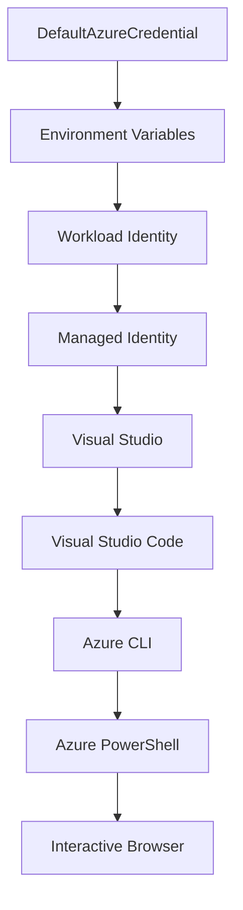

<!--
CO_OP_TRANSLATOR_METADATA:
{
  "original_hash": "fb0687bd0b166ecb0430dfeeed83487e",
  "translation_date": "2025-10-24T18:20:35+00:00",
  "source_file": "docs/getting-started/azd-basics.md",
  "language_code": "uk"
}
-->
# Основи AZD - Розуміння Azure Developer CLI

# Основи AZD - Основні концепції та принципи

**Навігація по розділу:**
- **📚 Домашня сторінка курсу**: [AZD для початківців](../../README.md)
- **📖 Поточний розділ**: Розділ 1 - Основи та швидкий старт
- **⬅️ Попередній**: [Огляд курсу](../../README.md#-chapter-1-foundation--quick-start)
- **➡️ Наступний**: [Встановлення та налаштування](installation.md)
- **🚀 Наступний розділ**: [Розділ 2: Розробка з акцентом на AI](../ai-foundry/azure-ai-foundry-integration.md)

## Вступ

У цьому уроці ви познайомитеся з Azure Developer CLI (azd) — потужним інструментом командного рядка, який прискорює ваш шлях від локальної розробки до розгортання в Azure. Ви дізнаєтеся про основні концепції, ключові функції та зрозумієте, як azd спрощує розгортання хмарних додатків.

## Цілі навчання

До кінця цього уроку ви:
- Зрозумієте, що таке Azure Developer CLI і його основне призначення
- Вивчите основні концепції шаблонів, середовищ і сервісів
- Ознайомитеся з ключовими функціями, включаючи розробку на основі шаблонів та інфраструктуру як код
- Зрозумієте структуру проекту azd та робочий процес
- Будете готові встановити та налаштувати azd для вашого середовища розробки

## Результати навчання

Після завершення цього уроку ви зможете:
- Пояснити роль azd у сучасних робочих процесах хмарної розробки
- Визначити компоненти структури проекту azd
- Описати, як шаблони, середовища та сервіси працюють разом
- Зрозуміти переваги інфраструктури як код з azd
- Розпізнавати різні команди azd та їх призначення

## Що таке Azure Developer CLI (azd)?

Azure Developer CLI (azd) — це інструмент командного рядка, створений для прискорення вашого шляху від локальної розробки до розгортання в Azure. Він спрощує процес створення, розгортання та управління хмарними додатками на платформі Azure.

## Основні концепції

### Шаблони
Шаблони є основою azd. Вони містять:
- **Код додатків** - Ваш вихідний код і залежності
- **Визначення інфраструктури** - Ресурси Azure, визначені в Bicep або Terraform
- **Файли конфігурації** - Налаштування та змінні середовища
- **Скрипти розгортання** - Автоматизовані робочі процеси розгортання

### Середовища
Середовища представляють різні цілі розгортання:
- **Розробка** - Для тестування та розробки
- **Стадія** - Передпродуктивне середовище
- **Продукція** - Робоче середовище

Кожне середовище має власні:
- Групу ресурсів Azure
- Налаштування конфігурації
- Стан розгортання

### Сервіси
Сервіси є будівельними блоками вашого додатка:
- **Фронтенд** - Веб-додатки, SPA
- **Бекенд** - API, мікросервіси
- **База даних** - Рішення для зберігання даних
- **Сховище** - Файлове та блобове сховище

## Ключові функції

### 1. Розробка на основі шаблонів
```bash
# Browse available templates
azd template list

# Initialize from a template
azd init --template <template-name>
```

### 2. Інфраструктура як код
- **Bicep** - Спеціалізована мова Azure
- **Terraform** - Інструмент для багатохмарної інфраструктури
- **ARM Templates** - Шаблони Azure Resource Manager

### 3. Інтегровані робочі процеси
```bash
# Complete deployment workflow
azd up            # Provision + Deploy this is hands off for first time setup

# 🧪 NEW: Preview infrastructure changes before deployment (SAFE)
azd provision --preview    # Simulate infrastructure deployment without making changes

azd provision     # Create Azure resources if you update the infrastructure use this
azd deploy        # Deploy application code or redeploy application code once update
azd down          # Clean up resources
```

#### 🛡️ Безпечне планування інфраструктури з попереднім переглядом
Команда `azd provision --preview` є революційною для безпечного розгортання:
- **Аналіз без виконання** - Показує, що буде створено, змінено або видалено
- **Нульовий ризик** - Жодних реальних змін у вашому середовищі Azure
- **Співпраця команди** - Обмін результатами попереднього перегляду перед розгортанням
- **Оцінка витрат** - Розуміння витрат на ресурси перед зобов'язанням

```bash
# Example preview workflow
azd provision --preview           # See what will change
# Review the output, discuss with team
azd provision                     # Apply changes with confidence
```

### 4. Управління середовищами
```bash
# Create and manage environments
azd env new <environment-name>
azd env select <environment-name>
azd env list
```

## 📁 Структура проекту

Типова структура проекту azd:
```
my-app/
├── .azd/                    # azd configuration
│   └── config.json
├── .azure/                  # Azure deployment artifacts
├── .devcontainer/          # Development container config
├── .github/workflows/      # GitHub Actions
├── .vscode/               # VS Code settings
├── infra/                 # Infrastructure code
│   ├── main.bicep        # Main infrastructure template
│   ├── main.parameters.json
│   └── modules/          # Reusable modules
├── src/                  # Application source code
│   ├── api/             # Backend services
│   └── web/             # Frontend application
├── azure.yaml           # azd project configuration
└── README.md
```

## 🔧 Файли конфігурації

### azure.yaml
Основний файл конфігурації проекту:
```yaml
name: my-awesome-app
metadata:
  template: my-template@1.0.0

services:
  web:
    project: ./src/web
    language: js
    host: appservice
  api:
    project: ./src/api
    language: js
    host: appservice

hooks:
  preprovision:
    shell: pwsh
    run: echo "Preparing to provision..."
```

### .azure/config.json
Конфігурація для конкретного середовища:
```json
{
  "version": 1,
  "defaultEnvironment": "dev",
  "environments": {
    "dev": {
      "subscriptionId": "your-subscription-id",
      "location": "eastus"
    }
  }
}
```

## 🎪 Загальні робочі процеси

### Початок нового проекту
```bash
# Method 1: Use existing template
azd init --template todo-nodejs-mongo

# Method 2: Start from scratch
azd init

# Method 3: Use current directory
azd init .
```

### Цикл розробки
```bash
# Set up development environment
azd auth login
azd env new dev
azd env select dev

# Deploy everything
azd up

# Make changes and redeploy
azd deploy

# Clean up when done
azd down --force --purge # command in the Azure Developer CLI is a **hard reset** for your environment—especially useful when you're troubleshooting failed deployments, cleaning up orphaned resources, or prepping for a fresh redeploy.
```

## Розуміння `azd down --force --purge`
Команда `azd down --force --purge` є потужним способом повного видалення вашого середовища azd та всіх пов'язаних ресурсів. Ось розбір того, що робить кожен прапорець:
```
--force
```
- Пропускає запити на підтвердження.
- Корисно для автоматизації або скриптів, де ручний ввід неможливий.
- Забезпечує безперервне видалення, навіть якщо CLI виявляє невідповідності.

```
--purge
```
Видаляє **всі пов'язані метадані**, включаючи:
Стан середовища
Локальну папку `.azure`
Кешовану інформацію про розгортання
Запобігає "запам'ятовуванню" попередніх розгортань azd, що може викликати проблеми, такі як невідповідність груп ресурсів або застарілі посилання на реєстр.


### Чому використовувати обидва?
Коли ви зіткнулися з проблемами `azd up` через залишковий стан або часткові розгортання, ця комбінація забезпечує **чистий аркуш**.

Це особливо корисно після ручного видалення ресурсів у порталі Azure або при зміні шаблонів, середовищ чи конвенцій іменування груп ресурсів.


### Управління кількома середовищами
```bash
# Create staging environment
azd env new staging
azd env select staging
azd up

# Switch back to dev
azd env select dev

# Compare environments
azd env list
```

## 🔐 Аутентифікація та облікові дані

Розуміння аутентифікації є ключовим для успішного розгортання azd. Azure використовує кілька методів аутентифікації, і azd використовує той самий ланцюжок облікових даних, що й інші інструменти Azure.

### Аутентифікація через Azure CLI (`az login`)

Перед використанням azd вам потрібно пройти аутентифікацію в Azure. Найпоширеніший метод — використання Azure CLI:

```bash
# Interactive login (opens browser)
az login

# Login with specific tenant
az login --tenant <tenant-id>

# Login with service principal
az login --service-principal -u <app-id> -p <password> --tenant <tenant-id>

# Check current login status
az account show

# List available subscriptions
az account list --output table

# Set default subscription
az account set --subscription <subscription-id>
```

### Потік аутентифікації
1. **Інтерактивний вхід**: Відкриває ваш браузер за замовчуванням для аутентифікації
2. **Потік коду пристрою**: Для середовищ без доступу до браузера
3. **Службовий обліковий запис**: Для автоматизації та сценаріїв CI/CD
4. **Керована ідентичність**: Для додатків, розміщених в Azure

### Ланцюжок облікових даних DefaultAzureCredential

`DefaultAzureCredential` — це тип облікових даних, який забезпечує спрощений досвід аутентифікації, автоматично перевіряючи кілька джерел облікових даних у певному порядку:

#### Порядок ланцюжка облікових даних


#### 1. Змінні середовища
```bash
# Set environment variables for service principal
export AZURE_CLIENT_ID="<app-id>"
export AZURE_CLIENT_SECRET="<password>"
export AZURE_TENANT_ID="<tenant-id>"
```

#### 2. Ідентичність робочого навантаження (Kubernetes/GitHub Actions)
Використовується автоматично в:
- Azure Kubernetes Service (AKS) з Workload Identity
- GitHub Actions з OIDC федерацією
- Інші сценарії федеративної ідентичності

#### 3. Керована ідентичність
Для ресурсів Azure, таких як:
- Віртуальні машини
- App Service
- Azure Functions
- Container Instances

```bash
# Check if running on Azure resource with managed identity
az account show --query "user.type" --output tsv
# Returns: "servicePrincipal" if using managed identity
```

#### 4. Інтеграція з інструментами розробки
- **Visual Studio**: Автоматично використовує обліковий запис, у якому виконано вхід
- **VS Code**: Використовує облікові дані розширення Azure Account
- **Azure CLI**: Використовує облікові дані `az login` (найпоширеніший для локальної розробки)

### Налаштування аутентифікації AZD

```bash
# Method 1: Use Azure CLI (Recommended for development)
az login
azd auth login  # Uses existing Azure CLI credentials

# Method 2: Direct azd authentication
azd auth login --use-device-code  # For headless environments

# Method 3: Check authentication status
azd auth login --check-status

# Method 4: Logout and re-authenticate
azd auth logout
azd auth login
```

### Найкращі практики аутентифікації

#### Для локальної розробки
```bash
# 1. Login with Azure CLI
az login

# 2. Verify correct subscription
az account show
az account set --subscription "Your Subscription Name"

# 3. Use azd with existing credentials
azd auth login
```

#### Для конвеєрів CI/CD
```yaml
# GitHub Actions example
- name: Azure Login
  uses: azure/login@v1
  with:
    creds: ${{ secrets.AZURE_CREDENTIALS }}

- name: Deploy with azd
  run: |
    azd auth login --client-id ${{ secrets.AZURE_CLIENT_ID }} \
                    --client-secret ${{ secrets.AZURE_CLIENT_SECRET }} \
                    --tenant-id ${{ secrets.AZURE_TENANT_ID }}
    azd up --no-prompt
```

#### Для робочих середовищ
- Використовуйте **керовану ідентичність** для ресурсів Azure
- Використовуйте **службовий обліковий запис** для сценаріїв автоматизації
- Уникайте зберігання облікових даних у коді або файлах конфігурації
- Використовуйте **Azure Key Vault** для конфіденційної конфігурації

### Поширені проблеми з аутентифікацією та їх вирішення

#### Проблема: "Не знайдено підписки"
```bash
# Solution: Set default subscription
az account list --output table
az account set --subscription "<subscription-id>"
azd env set AZURE_SUBSCRIPTION_ID "<subscription-id>"
```

#### Проблема: "Недостатньо дозволів"
```bash
# Solution: Check and assign required roles
az role assignment list --assignee $(az account show --query user.name --output tsv)

# Common required roles:
# - Contributor (for resource management)
# - User Access Administrator (for role assignments)
```

#### Проблема: "Токен закінчився"
```bash
# Solution: Re-authenticate
az logout
az login
azd auth logout
azd auth login
```

### Аутентифікація в різних сценаріях

#### Локальна розробка
```bash
# Personal development account
az login
azd auth login
```

#### Розробка в команді
```bash
# Use specific tenant for organization
az login --tenant contoso.onmicrosoft.com
azd auth login
```

#### Сценарії з кількома орендарями
```bash
# Switch between tenants
az login --tenant tenant1.onmicrosoft.com
# Deploy to tenant 1
azd up

az login --tenant tenant2.onmicrosoft.com  
# Deploy to tenant 2
azd up
```

### Міркування щодо безпеки

1. **Зберігання облікових даних**: Ніколи не зберігайте облікові дані в вихідному коді
2. **Обмеження доступу**: Використовуйте принцип найменших привілеїв для службових облікових записів
3. **Ротація токенів**: Регулярно оновлюйте секрети службових облікових записів
4. **Журнал аудиту**: Моніторинг аутентифікації та активностей розгортання
5. **Мережева безпека**: Використовуйте приватні кінцеві точки, коли це можливо

### Виправлення проблем з аутентифікацією

```bash
# Debug authentication issues
azd auth login --check-status
az account show
az account get-access-token

# Common diagnostic commands
whoami                          # Current user context
az ad signed-in-user show      # Azure AD user details
az group list                  # Test resource access
```

## Розуміння `azd down --force --purge`

### Відкриття
```bash
azd template list              # Browse templates
azd template show <template>   # Template details
azd init --help               # Initialization options
```

### Управління проектом
```bash
azd show                     # Project overview
azd env show                 # Current environment
azd config list             # Configuration settings
```

### Моніторинг
```bash
azd monitor                  # Open Azure portal
azd pipeline config          # Set up CI/CD
azd logs                     # View application logs
```

## Найкращі практики

### 1. Використовуйте значущі назви
```bash
# Good
azd env new production-east
azd init --template web-app-secure

# Avoid
azd env new env1
azd init --template template1
```

### 2. Використовуйте шаблони
- Починайте з існуючих шаблонів
- Налаштовуйте під свої потреби
- Створюйте багаторазові шаблони для вашої організації

### 3. Ізоляція середовищ
- Використовуйте окремі середовища для розробки/стадії/продукції
- Ніколи не розгортайте безпосередньо в продукцію з локальної машини
- Використовуйте конвеєри CI/CD для розгортання в продукцію

### 4. Управління конфігурацією
- Використовуйте змінні середовища для конфіденційних даних
- Зберігайте конфігурацію у системі контролю версій
- Документуйте налаштування для кожного середовища

## Прогрес навчання

### Початківець (1-2 тижні)
1. Встановіть azd та пройдіть аутентифікацію
2. Розгорніть простий шаблон
3. Зрозумійте структуру проекту
4. Вивчіть основні команди (up, down, deploy)

### Середній рівень (3-4 тижні)
1. Налаштуйте шаблони
2. Управляйте кількома середовищами
3. Зрозумійте код інфраструктури
4. Налаштуйте конвеєри CI/CD

### Просунутий рівень (5+ тижнів)
1. Створюйте власні шаблони
2. Складні інфраструктурні патерни
3. Розгортання в кількох регіонах
4. Конфігурації корпоративного рівня

## Наступні кроки

**📖 Продовжуйте навчання в Розділі 1:**
- [Встановлення та налаштування](installation.md) - Встановіть та налаштуйте azd
- [Ваш перший проект](first-project.md) - Завершіть практичний урок
- [Посібник з конфігурації](configuration.md) - Розширені параметри конфігурації

**🎯 Готові до наступного розділу?**
- [Розділ 2: Розробка з акцентом на AI](../ai-foundry/azure-ai-foundry-integration.md) - Почніть створювати AI-додатки

## Додаткові ресурси

- [Огляд Azure Developer CLI](https://learn.microsoft.com/en-us/azure/developer/azure-developer-cli/)
- [Галерея шаблонів](https://azure.github.io/awesome-azd/)
- [Зразки спільноти](https://github.com/Azure-Samples)

---

**Навігація по розділу:**
- **📚 Домашня сторінка курсу**: [AZD для початківців](../../README.md)
- **📖 Поточний розділ**: Розділ 1 - Основи та швидкий старт  
- **⬅️ Попередній**: [Огляд курсу](../../README.md#-chapter-1-foundation--quick-start)
- **➡️ Наступний**: [Встановлення та налаштування](installation.md)
- **🚀 Наступний розділ**: [Розділ 2: Розробка з акцентом на AI](../ai-foundry/azure-ai-foundry-integration.md)

---

**Відмова від відповідальності**:  
Цей документ був перекладений за допомогою сервісу автоматичного перекладу [Co-op Translator](https://github.com/Azure/co-op-translator). Хоча ми прагнемо до точності, будь ласка, майте на увазі, що автоматичні переклади можуть містити помилки або неточності. Оригінальний документ на його рідній мові слід вважати авторитетним джерелом. Для критичної інформації рекомендується професійний людський переклад. Ми не несемо відповідальності за будь-які непорозуміння або неправильні тлумачення, що виникають внаслідок використання цього перекладу.