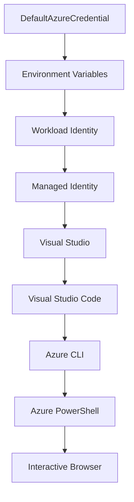

<!--
CO_OP_TRANSLATOR_METADATA:
{
  "original_hash": "fb0687bd0b166ecb0430dfeeed83487e",
  "translation_date": "2025-10-24T17:41:34+00:00",
  "source_file": "docs/getting-started/azd-basics.md",
  "language_code": "vi"
}
-->
# AZD Cơ Bản - Hiểu về Azure Developer CLI

# AZD Cơ Bản - Các Khái Niệm và Nền Tảng Cốt Lõi

**Điều Hướng Chương:**
- **📚 Trang Chủ Khóa Học**: [AZD Dành Cho Người Mới Bắt Đầu](../../README.md)
- **📖 Chương Hiện Tại**: Chương 1 - Nền Tảng & Bắt Đầu Nhanh
- **⬅️ Trước**: [Tổng Quan Khóa Học](../../README.md#-chapter-1-foundation--quick-start)
- **➡️ Tiếp Theo**: [Cài Đặt & Thiết Lập](installation.md)
- **🚀 Chương Tiếp Theo**: [Chương 2: Phát Triển Ưu Tiên AI](../ai-foundry/azure-ai-foundry-integration.md)

## Giới Thiệu

Bài học này sẽ giới thiệu bạn về Azure Developer CLI (azd), một công cụ dòng lệnh mạnh mẽ giúp tăng tốc hành trình từ phát triển cục bộ đến triển khai trên Azure. Bạn sẽ học các khái niệm cơ bản, các tính năng cốt lõi và hiểu cách azd đơn giản hóa việc triển khai ứng dụng cloud-native.

## Mục Tiêu Học Tập

Sau khi hoàn thành bài học này, bạn sẽ:
- Hiểu Azure Developer CLI là gì và mục đích chính của nó
- Tìm hiểu các khái niệm cốt lõi về mẫu, môi trường và dịch vụ
- Khám phá các tính năng chính bao gồm phát triển dựa trên mẫu và Infrastructure as Code
- Hiểu cấu trúc dự án azd và quy trình làm việc
- Sẵn sàng cài đặt và cấu hình azd cho môi trường phát triển của bạn

## Kết Quả Học Tập

Sau khi hoàn thành bài học này, bạn sẽ có thể:
- Giải thích vai trò của azd trong quy trình phát triển đám mây hiện đại
- Nhận diện các thành phần của cấu trúc dự án azd
- Mô tả cách các mẫu, môi trường và dịch vụ hoạt động cùng nhau
- Hiểu lợi ích của Infrastructure as Code với azd
- Nhận biết các lệnh azd khác nhau và mục đích của chúng

## Azure Developer CLI (azd) là gì?

Azure Developer CLI (azd) là một công cụ dòng lệnh được thiết kế để tăng tốc hành trình từ phát triển cục bộ đến triển khai trên Azure. Nó đơn giản hóa quy trình xây dựng, triển khai và quản lý các ứng dụng cloud-native trên Azure.

## Các Khái Niệm Cốt Lõi

### Mẫu
Mẫu là nền tảng của azd. Chúng bao gồm:
- **Mã ứng dụng** - Mã nguồn và các phụ thuộc của bạn
- **Định nghĩa hạ tầng** - Các tài nguyên Azure được định nghĩa bằng Bicep hoặc Terraform
- **Tệp cấu hình** - Các cài đặt và biến môi trường
- **Kịch bản triển khai** - Quy trình triển khai tự động

### Môi Trường
Môi trường đại diện cho các mục tiêu triển khai khác nhau:
- **Phát triển** - Dành cho thử nghiệm và phát triển
- **Staging** - Môi trường tiền sản xuất
- **Sản xuất** - Môi trường sản xuất trực tiếp

Mỗi môi trường duy trì riêng:
- Nhóm tài nguyên Azure
- Cài đặt cấu hình
- Trạng thái triển khai

### Dịch Vụ
Dịch vụ là các khối xây dựng của ứng dụng của bạn:
- **Frontend** - Ứng dụng web, SPA
- **Backend** - API, microservices
- **Cơ sở dữ liệu** - Giải pháp lưu trữ dữ liệu
- **Lưu trữ** - Lưu trữ tệp và blob

## Các Tính Năng Chính

### 1. Phát Triển Dựa Trên Mẫu
```bash
# Browse available templates
azd template list

# Initialize from a template
azd init --template <template-name>
```

### 2. Infrastructure as Code
- **Bicep** - Ngôn ngữ đặc thù của Azure
- **Terraform** - Công cụ hạ tầng đa đám mây
- **ARM Templates** - Mẫu Azure Resource Manager

### 3. Quy Trình Tích Hợp
```bash
# Complete deployment workflow
azd up            # Provision + Deploy this is hands off for first time setup

# 🧪 NEW: Preview infrastructure changes before deployment (SAFE)
azd provision --preview    # Simulate infrastructure deployment without making changes

azd provision     # Create Azure resources if you update the infrastructure use this
azd deploy        # Deploy application code or redeploy application code once update
azd down          # Clean up resources
```

#### 🛡️ Lập Kế Hoạch Hạ Tầng An Toàn Với Preview
Lệnh `azd provision --preview` là một bước đột phá cho các triển khai an toàn:
- **Phân tích thử nghiệm** - Hiển thị những gì sẽ được tạo, sửa đổi hoặc xóa
- **Không rủi ro** - Không có thay đổi thực tế nào được thực hiện trên môi trường Azure của bạn
- **Hợp tác nhóm** - Chia sẻ kết quả preview trước khi triển khai
- **Ước tính chi phí** - Hiểu chi phí tài nguyên trước khi cam kết

```bash
# Example preview workflow
azd provision --preview           # See what will change
# Review the output, discuss with team
azd provision                     # Apply changes with confidence
```

### 4. Quản Lý Môi Trường
```bash
# Create and manage environments
azd env new <environment-name>
azd env select <environment-name>
azd env list
```

## 📁 Cấu Trúc Dự Án

Một cấu trúc dự án azd điển hình:
```
my-app/
├── .azd/                    # azd configuration
│   └── config.json
├── .azure/                  # Azure deployment artifacts
├── .devcontainer/          # Development container config
├── .github/workflows/      # GitHub Actions
├── .vscode/               # VS Code settings
├── infra/                 # Infrastructure code
│   ├── main.bicep        # Main infrastructure template
│   ├── main.parameters.json
│   └── modules/          # Reusable modules
├── src/                  # Application source code
│   ├── api/             # Backend services
│   └── web/             # Frontend application
├── azure.yaml           # azd project configuration
└── README.md
```

## 🔧 Tệp Cấu Hình

### azure.yaml
Tệp cấu hình chính của dự án:
```yaml
name: my-awesome-app
metadata:
  template: my-template@1.0.0

services:
  web:
    project: ./src/web
    language: js
    host: appservice
  api:
    project: ./src/api
    language: js
    host: appservice

hooks:
  preprovision:
    shell: pwsh
    run: echo "Preparing to provision..."
```

### .azure/config.json
Cấu hình dành riêng cho môi trường:
```json
{
  "version": 1,
  "defaultEnvironment": "dev",
  "environments": {
    "dev": {
      "subscriptionId": "your-subscription-id",
      "location": "eastus"
    }
  }
}
```

## 🎪 Quy Trình Thông Thường

### Bắt Đầu Một Dự Án Mới
```bash
# Method 1: Use existing template
azd init --template todo-nodejs-mongo

# Method 2: Start from scratch
azd init

# Method 3: Use current directory
azd init .
```

### Chu Kỳ Phát Triển
```bash
# Set up development environment
azd auth login
azd env new dev
azd env select dev

# Deploy everything
azd up

# Make changes and redeploy
azd deploy

# Clean up when done
azd down --force --purge # command in the Azure Developer CLI is a **hard reset** for your environment—especially useful when you're troubleshooting failed deployments, cleaning up orphaned resources, or prepping for a fresh redeploy.
```

## Hiểu `azd down --force --purge`
Lệnh `azd down --force --purge` là cách mạnh mẽ để hoàn toàn gỡ bỏ môi trường azd và tất cả các tài nguyên liên quan. Đây là phân tích về từng cờ:
```
--force
```
- Bỏ qua các lời nhắc xác nhận.
- Hữu ích cho tự động hóa hoặc kịch bản nơi không thể nhập thủ công.
- Đảm bảo quá trình gỡ bỏ diễn ra mà không bị gián đoạn, ngay cả khi CLI phát hiện sự không nhất quán.

```
--purge
```
Xóa **tất cả siêu dữ liệu liên quan**, bao gồm:
Trạng thái môi trường
Thư mục `.azure` cục bộ
Thông tin triển khai được lưu trữ
Ngăn azd "nhớ" các triển khai trước đó, điều này có thể gây ra các vấn đề như nhóm tài nguyên không khớp hoặc tham chiếu registry cũ.

### Tại Sao Sử Dụng Cả Hai?
Khi bạn gặp khó khăn với `azd up` do trạng thái còn sót lại hoặc triển khai một phần, sự kết hợp này đảm bảo một **khởi đầu mới hoàn toàn**.

Điều này đặc biệt hữu ích sau khi xóa thủ công các tài nguyên trong cổng Azure hoặc khi chuyển đổi mẫu, môi trường hoặc quy ước đặt tên nhóm tài nguyên.

### Quản Lý Nhiều Môi Trường
```bash
# Create staging environment
azd env new staging
azd env select staging
azd up

# Switch back to dev
azd env select dev

# Compare environments
azd env list
```

## 🔐 Xác Thực và Thông Tin Đăng Nhập

Hiểu về xác thực là rất quan trọng để triển khai azd thành công. Azure sử dụng nhiều phương pháp xác thực, và azd tận dụng cùng chuỗi thông tin đăng nhập được sử dụng bởi các công cụ Azure khác.

### Xác Thực Azure CLI (`az login`)

Trước khi sử dụng azd, bạn cần xác thực với Azure. Phương pháp phổ biến nhất là sử dụng Azure CLI:

```bash
# Interactive login (opens browser)
az login

# Login with specific tenant
az login --tenant <tenant-id>

# Login with service principal
az login --service-principal -u <app-id> -p <password> --tenant <tenant-id>

# Check current login status
az account show

# List available subscriptions
az account list --output table

# Set default subscription
az account set --subscription <subscription-id>
```

### Quy Trình Xác Thực
1. **Đăng Nhập Tương Tác**: Mở trình duyệt mặc định của bạn để xác thực
2. **Luồng Mã Thiết Bị**: Dành cho môi trường không có quyền truy cập trình duyệt
3. **Service Principal**: Dành cho tự động hóa và kịch bản CI/CD
4. **Managed Identity**: Dành cho các ứng dụng được lưu trữ trên Azure

### Chuỗi DefaultAzureCredential

`DefaultAzureCredential` là một loại thông tin đăng nhập cung cấp trải nghiệm xác thực đơn giản bằng cách tự động thử nhiều nguồn thông tin đăng nhập theo thứ tự cụ thể:

#### Thứ Tự Chuỗi Thông Tin Đăng Nhập


#### 1. Biến Môi Trường
```bash
# Set environment variables for service principal
export AZURE_CLIENT_ID="<app-id>"
export AZURE_CLIENT_SECRET="<password>"
export AZURE_TENANT_ID="<tenant-id>"
```

#### 2. Workload Identity (Kubernetes/GitHub Actions)
Được sử dụng tự động trong:
- Azure Kubernetes Service (AKS) với Workload Identity
- GitHub Actions với liên kết OIDC
- Các kịch bản liên kết danh tính khác

#### 3. Managed Identity
Dành cho các tài nguyên Azure như:
- Máy Ảo
- App Service
- Azure Functions
- Container Instances

```bash
# Check if running on Azure resource with managed identity
az account show --query "user.type" --output tsv
# Returns: "servicePrincipal" if using managed identity
```

#### 4. Tích Hợp Công Cụ Phát Triển
- **Visual Studio**: Tự động sử dụng tài khoản đã đăng nhập
- **VS Code**: Sử dụng thông tin đăng nhập từ tiện ích Azure Account
- **Azure CLI**: Sử dụng thông tin đăng nhập từ `az login` (phổ biến nhất cho phát triển cục bộ)

### Thiết Lập Xác Thực AZD

```bash
# Method 1: Use Azure CLI (Recommended for development)
az login
azd auth login  # Uses existing Azure CLI credentials

# Method 2: Direct azd authentication
azd auth login --use-device-code  # For headless environments

# Method 3: Check authentication status
azd auth login --check-status

# Method 4: Logout and re-authenticate
azd auth logout
azd auth login
```

### Thực Hành Tốt Nhất Về Xác Thực

#### Đối Với Phát Triển Cục Bộ
```bash
# 1. Login with Azure CLI
az login

# 2. Verify correct subscription
az account show
az account set --subscription "Your Subscription Name"

# 3. Use azd with existing credentials
azd auth login
```

#### Đối Với Pipelines CI/CD
```yaml
# GitHub Actions example
- name: Azure Login
  uses: azure/login@v1
  with:
    creds: ${{ secrets.AZURE_CREDENTIALS }}

- name: Deploy with azd
  run: |
    azd auth login --client-id ${{ secrets.AZURE_CLIENT_ID }} \
                    --client-secret ${{ secrets.AZURE_CLIENT_SECRET }} \
                    --tenant-id ${{ secrets.AZURE_TENANT_ID }}
    azd up --no-prompt
```

#### Đối Với Môi Trường Sản Xuất
- Sử dụng **Managed Identity** khi chạy trên các tài nguyên Azure
- Sử dụng **Service Principal** cho các kịch bản tự động hóa
- Tránh lưu trữ thông tin đăng nhập trong mã hoặc tệp cấu hình
- Sử dụng **Azure Key Vault** cho các cấu hình nhạy cảm

### Các Vấn Đề Xác Thực Thường Gặp và Giải Pháp

#### Vấn Đề: "Không tìm thấy subscription"
```bash
# Solution: Set default subscription
az account list --output table
az account set --subscription "<subscription-id>"
azd env set AZURE_SUBSCRIPTION_ID "<subscription-id>"
```

#### Vấn Đề: "Không đủ quyền"
```bash
# Solution: Check and assign required roles
az role assignment list --assignee $(az account show --query user.name --output tsv)

# Common required roles:
# - Contributor (for resource management)
# - User Access Administrator (for role assignments)
```

#### Vấn Đề: "Token đã hết hạn"
```bash
# Solution: Re-authenticate
az logout
az login
azd auth logout
azd auth login
```

### Xác Thực Trong Các Kịch Bản Khác Nhau

#### Phát Triển Cục Bộ
```bash
# Personal development account
az login
azd auth login
```

#### Phát Triển Nhóm
```bash
# Use specific tenant for organization
az login --tenant contoso.onmicrosoft.com
azd auth login
```

#### Kịch Bản Nhiều Tenant
```bash
# Switch between tenants
az login --tenant tenant1.onmicrosoft.com
# Deploy to tenant 1
azd up

az login --tenant tenant2.onmicrosoft.com  
# Deploy to tenant 2
azd up
```

### Cân Nhắc Về Bảo Mật

1. **Lưu Trữ Thông Tin Đăng Nhập**: Không bao giờ lưu trữ thông tin đăng nhập trong mã nguồn
2. **Giới Hạn Phạm Vi**: Sử dụng nguyên tắc quyền tối thiểu cho service principal
3. **Xoay Vòng Token**: Thường xuyên xoay vòng các bí mật của service principal
4. **Dấu Vết Kiểm Toán**: Theo dõi các hoạt động xác thực và triển khai
5. **Bảo Mật Mạng**: Sử dụng các điểm cuối riêng tư khi có thể

### Xử Lý Sự Cố Xác Thực

```bash
# Debug authentication issues
azd auth login --check-status
az account show
az account get-access-token

# Common diagnostic commands
whoami                          # Current user context
az ad signed-in-user show      # Azure AD user details
az group list                  # Test resource access
```

## Hiểu `azd down --force --purge`

### Khám Phá
```bash
azd template list              # Browse templates
azd template show <template>   # Template details
azd init --help               # Initialization options
```

### Quản Lý Dự Án
```bash
azd show                     # Project overview
azd env show                 # Current environment
azd config list             # Configuration settings
```

### Giám Sát
```bash
azd monitor                  # Open Azure portal
azd pipeline config          # Set up CI/CD
azd logs                     # View application logs
```

## Thực Hành Tốt Nhất

### 1. Sử Dụng Tên Có Ý Nghĩa
```bash
# Good
azd env new production-east
azd init --template web-app-secure

# Avoid
azd env new env1
azd init --template template1
```

### 2. Tận Dụng Mẫu
- Bắt đầu với các mẫu có sẵn
- Tùy chỉnh theo nhu cầu của bạn
- Tạo các mẫu có thể tái sử dụng cho tổ chức của bạn

### 3. Cách Ly Môi Trường
- Sử dụng các môi trường riêng biệt cho dev/staging/prod
- Không bao giờ triển khai trực tiếp lên production từ máy cục bộ
- Sử dụng pipelines CI/CD cho các triển khai production

### 4. Quản Lý Cấu Hình
- Sử dụng biến môi trường cho dữ liệu nhạy cảm
- Lưu cấu hình trong hệ thống kiểm soát phiên bản
- Ghi chú các cài đặt dành riêng cho môi trường

## Lộ Trình Học Tập

### Người Mới Bắt Đầu (Tuần 1-2)
1. Cài đặt azd và xác thực
2. Triển khai một mẫu đơn giản
3. Hiểu cấu trúc dự án
4. Học các lệnh cơ bản (up, down, deploy)

### Trung Cấp (Tuần 3-4)
1. Tùy chỉnh mẫu
2. Quản lý nhiều môi trường
3. Hiểu mã hạ tầng
4. Thiết lập pipelines CI/CD

### Nâng Cao (Tuần 5+)
1. Tạo mẫu tùy chỉnh
2. Các mẫu hạ tầng nâng cao
3. Triển khai đa vùng
4. Cấu hình cấp doanh nghiệp

## Bước Tiếp Theo

**📖 Tiếp Tục Học Chương 1:**
- [Cài Đặt & Thiết Lập](installation.md) - Cài đặt và cấu hình azd
- [Dự Án Đầu Tiên Của Bạn](first-project.md) - Hoàn thành hướng dẫn thực hành
- [Hướng Dẫn Cấu Hình](configuration.md) - Các tùy chọn cấu hình nâng cao

**🎯 Sẵn Sàng Cho Chương Tiếp Theo?**
- [Chương 2: Phát Triển Ưu Tiên AI](../ai-foundry/azure-ai-foundry-integration.md) - Bắt đầu xây dựng các ứng dụng AI

## Tài Nguyên Bổ Sung

- [Tổng Quan Azure Developer CLI](https://learn.microsoft.com/en-us/azure/developer/azure-developer-cli/)
- [Thư Viện Mẫu](https://azure.github.io/awesome-azd/)
- [Mẫu Cộng Đồng](https://github.com/Azure-Samples)

---

**Điều Hướng Chương:**
- **📚 Trang Chủ Khóa Học**: [AZD Dành Cho Người Mới Bắt Đầu](../../README.md)
- **📖 Chương Hiện Tại**: Chương 1 - Nền Tảng & Bắt Đầu Nhanh  
- **⬅️ Trước**: [Tổng Quan Khóa Học](../../README.md#-chapter-1-foundation--quick-start)
- **➡️ Tiếp Theo**: [Cài Đặt & Thiết Lập](installation.md)
- **🚀 Chương Tiếp Theo**: [Chương 2: Phát Triển Ưu Tiên AI](../ai-foundry/azure-ai-foundry-integration.md)

---

**Tuyên bố miễn trừ trách nhiệm**:  
Tài liệu này đã được dịch bằng dịch vụ dịch thuật AI [Co-op Translator](https://github.com/Azure/co-op-translator). Mặc dù chúng tôi cố gắng đảm bảo độ chính xác, xin lưu ý rằng các bản dịch tự động có thể chứa lỗi hoặc không chính xác. Tài liệu gốc bằng ngôn ngữ bản địa nên được coi là nguồn thông tin chính thức. Đối với thông tin quan trọng, nên sử dụng dịch vụ dịch thuật chuyên nghiệp bởi con người. Chúng tôi không chịu trách nhiệm về bất kỳ sự hiểu lầm hoặc diễn giải sai nào phát sinh từ việc sử dụng bản dịch này.