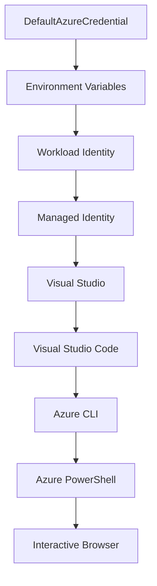

<!--
CO_OP_TRANSLATOR_METADATA:
{
  "original_hash": "fb0687bd0b166ecb0430dfeeed83487e",
  "translation_date": "2025-10-24T16:41:14+00:00",
  "source_file": "docs/getting-started/azd-basics.md",
  "language_code": "zh"
}
-->
# AZD 基础知识 - 了解 Azure Developer CLI

# AZD 基础知识 - 核心概念和基本原理

**章节导航：**
- **📚 课程主页**: [AZD 初学者指南](../../README.md)
- **📖 当前章节**: 第1章 - 基础与快速入门
- **⬅️ 上一章**: [课程概览](../../README.md#-chapter-1-foundation--quick-start)
- **➡️ 下一章**: [安装与设置](installation.md)
- **🚀 下一章节**: [第2章：以AI为核心的开发](../ai-foundry/azure-ai-foundry-integration.md)

## 简介

本课程将向您介绍 Azure Developer CLI (azd)，这是一款强大的命令行工具，可加速从本地开发到 Azure 部署的过程。您将学习 azd 的基本概念、核心功能，并了解它如何简化云原生应用的部署。

## 学习目标

完成本课程后，您将能够：
- 了解 Azure Developer CLI 的定义及其主要用途
- 学习模板、环境和服务的核心概念
- 探索关键功能，包括基于模板的开发和基础设施即代码
- 理解 azd 项目结构和工作流程
- 为您的开发环境安装和配置 azd 做好准备

## 学习成果

完成本课程后，您将能够：
- 解释 azd 在现代云开发工作流程中的角色
- 识别 azd 项目结构的组成部分
- 描述模板、环境和服务如何协同工作
- 理解使用 azd 实现基础设施即代码的优势
- 了解不同的 azd 命令及其用途

## 什么是 Azure Developer CLI (azd)?

Azure Developer CLI (azd) 是一个命令行工具，旨在加速从本地开发到 Azure 部署的过程。它简化了在 Azure 上构建、部署和管理云原生应用的流程。

## 核心概念

### 模板
模板是 azd 的基础，它包含：
- **应用代码** - 您的源代码和依赖项
- **基础设施定义** - 使用 Bicep 或 Terraform 定义的 Azure 资源
- **配置文件** - 设置和环境变量
- **部署脚本** - 自动化部署工作流

### 环境
环境代表不同的部署目标：
- **开发环境** - 用于测试和开发
- **预生产环境** - 准生产环境
- **生产环境** - 实时生产环境

每个环境都有自己的：
- Azure 资源组
- 配置设置
- 部署状态

### 服务
服务是构建应用的基本模块：
- **前端** - Web 应用程序、单页应用
- **后端** - API、微服务
- **数据库** - 数据存储解决方案
- **存储** - 文件和 Blob 存储

## 关键功能

### 1. 基于模板的开发
```bash
# Browse available templates
azd template list

# Initialize from a template
azd init --template <template-name>
```

### 2. 基础设施即代码
- **Bicep** - Azure 的领域专用语言
- **Terraform** - 多云基础设施工具
- **ARM 模板** - Azure 资源管理器模板

### 3. 集成工作流
```bash
# Complete deployment workflow
azd up            # Provision + Deploy this is hands off for first time setup

# 🧪 NEW: Preview infrastructure changes before deployment (SAFE)
azd provision --preview    # Simulate infrastructure deployment without making changes

azd provision     # Create Azure resources if you update the infrastructure use this
azd deploy        # Deploy application code or redeploy application code once update
azd down          # Clean up resources
```

#### 🛡️ 使用预览进行安全的基础设施规划
`azd provision --preview` 命令是安全部署的关键：
- **干运行分析** - 显示将创建、修改或删除的内容
- **零风险** - 不会对 Azure 环境进行实际更改
- **团队协作** - 在部署前共享预览结果
- **成本估算** - 在承诺之前了解资源成本

```bash
# Example preview workflow
azd provision --preview           # See what will change
# Review the output, discuss with team
azd provision                     # Apply changes with confidence
```

### 4. 环境管理
```bash
# Create and manage environments
azd env new <environment-name>
azd env select <environment-name>
azd env list
```

## 📁 项目结构

一个典型的 azd 项目结构：
```
my-app/
├── .azd/                    # azd configuration
│   └── config.json
├── .azure/                  # Azure deployment artifacts
├── .devcontainer/          # Development container config
├── .github/workflows/      # GitHub Actions
├── .vscode/               # VS Code settings
├── infra/                 # Infrastructure code
│   ├── main.bicep        # Main infrastructure template
│   ├── main.parameters.json
│   └── modules/          # Reusable modules
├── src/                  # Application source code
│   ├── api/             # Backend services
│   └── web/             # Frontend application
├── azure.yaml           # azd project configuration
└── README.md
```

## 🔧 配置文件

### azure.yaml
主要项目配置文件：
```yaml
name: my-awesome-app
metadata:
  template: my-template@1.0.0

services:
  web:
    project: ./src/web
    language: js
    host: appservice
  api:
    project: ./src/api
    language: js
    host: appservice

hooks:
  preprovision:
    shell: pwsh
    run: echo "Preparing to provision..."
```

### .azure/config.json
特定环境的配置：
```json
{
  "version": 1,
  "defaultEnvironment": "dev",
  "environments": {
    "dev": {
      "subscriptionId": "your-subscription-id",
      "location": "eastus"
    }
  }
}
```

## 🎪 常见工作流

### 开始一个新项目
```bash
# Method 1: Use existing template
azd init --template todo-nodejs-mongo

# Method 2: Start from scratch
azd init

# Method 3: Use current directory
azd init .
```

### 开发周期
```bash
# Set up development environment
azd auth login
azd env new dev
azd env select dev

# Deploy everything
azd up

# Make changes and redeploy
azd deploy

# Clean up when done
azd down --force --purge # command in the Azure Developer CLI is a **hard reset** for your environment—especially useful when you're troubleshooting failed deployments, cleaning up orphaned resources, or prepping for a fresh redeploy.
```

## 了解 `azd down --force --purge`
`azd down --force --purge` 命令是一种完全拆除 azd 环境及所有相关资源的强大方式。以下是每个标志的功能：
```
--force
```
- 跳过确认提示。
- 适用于无法进行手动输入的自动化或脚本。
- 即使 CLI 检测到不一致，也能确保拆除过程不受干扰。

```
--purge
```
删除 **所有相关元数据**，包括：
环境状态  
本地 `.azure` 文件夹  
缓存的部署信息  
防止 azd "记住" 之前的部署，这可能导致资源组不匹配或过时的注册表引用问题。

### 为什么同时使用这两个选项？
当您因遗留状态或部分部署问题而无法使用 `azd up` 时，这种组合可以确保一个 **干净的起点**。

特别是在 Azure 门户中手动删除资源后，或切换模板、环境或资源组命名约定时非常有用。

### 管理多个环境
```bash
# Create staging environment
azd env new staging
azd env select staging
azd up

# Switch back to dev
azd env select dev

# Compare environments
azd env list
```

## 🔐 身份验证和凭据

理解身份验证对于成功的 azd 部署至关重要。Azure 使用多种身份验证方法，而 azd 利用与其他 Azure 工具相同的凭据链。

### Azure CLI 身份验证 (`az login`)

在使用 azd 之前，您需要通过 Azure CLI 进行身份验证：

```bash
# Interactive login (opens browser)
az login

# Login with specific tenant
az login --tenant <tenant-id>

# Login with service principal
az login --service-principal -u <app-id> -p <password> --tenant <tenant-id>

# Check current login status
az account show

# List available subscriptions
az account list --output table

# Set default subscription
az account set --subscription <subscription-id>
```

### 身份验证流程
1. **交互式登录**: 打开默认浏览器进行身份验证
2. **设备代码流程**: 用于没有浏览器访问的环境
3. **服务主体**: 用于自动化和 CI/CD 场景
4. **托管身份**: 用于 Azure 托管的应用程序

### DefaultAzureCredential 凭据链

`DefaultAzureCredential` 是一种凭据类型，通过自动尝试特定顺序的多个凭据来源提供简化的身份验证体验：

#### 凭据链顺序


#### 1. 环境变量
```bash
# Set environment variables for service principal
export AZURE_CLIENT_ID="<app-id>"
export AZURE_CLIENT_SECRET="<password>"
export AZURE_TENANT_ID="<tenant-id>"
```

#### 2. 工作负载身份 (Kubernetes/GitHub Actions)
自动用于：
- Azure Kubernetes Service (AKS) 的工作负载身份
- GitHub Actions 的 OIDC 联合身份验证
- 其他联合身份验证场景

#### 3. 托管身份
适用于以下 Azure 资源：
- 虚拟机
- 应用服务
- Azure Functions
- 容器实例

```bash
# Check if running on Azure resource with managed identity
az account show --query "user.type" --output tsv
# Returns: "servicePrincipal" if using managed identity
```

#### 4. 开发工具集成
- **Visual Studio**: 自动使用登录账户
- **VS Code**: 使用 Azure Account 扩展的凭据
- **Azure CLI**: 使用 `az login` 的凭据（本地开发最常用）

### AZD 身份验证设置

```bash
# Method 1: Use Azure CLI (Recommended for development)
az login
azd auth login  # Uses existing Azure CLI credentials

# Method 2: Direct azd authentication
azd auth login --use-device-code  # For headless environments

# Method 3: Check authentication status
azd auth login --check-status

# Method 4: Logout and re-authenticate
azd auth logout
azd auth login
```

### 身份验证最佳实践

#### 对于本地开发
```bash
# 1. Login with Azure CLI
az login

# 2. Verify correct subscription
az account show
az account set --subscription "Your Subscription Name"

# 3. Use azd with existing credentials
azd auth login
```

#### 对于 CI/CD 管道
```yaml
# GitHub Actions example
- name: Azure Login
  uses: azure/login@v1
  with:
    creds: ${{ secrets.AZURE_CREDENTIALS }}

- name: Deploy with azd
  run: |
    azd auth login --client-id ${{ secrets.AZURE_CLIENT_ID }} \
                    --client-secret ${{ secrets.AZURE_CLIENT_SECRET }} \
                    --tenant-id ${{ secrets.AZURE_TENANT_ID }}
    azd up --no-prompt
```

#### 对于生产环境
- 在 Azure 资源上运行时使用 **托管身份**
- 自动化场景使用 **服务主体**
- 避免在代码或配置文件中存储凭据
- 使用 **Azure Key Vault** 存储敏感配置

### 常见身份验证问题及解决方案

#### 问题: "未找到订阅"
```bash
# Solution: Set default subscription
az account list --output table
az account set --subscription "<subscription-id>"
azd env set AZURE_SUBSCRIPTION_ID "<subscription-id>"
```

#### 问题: "权限不足"
```bash
# Solution: Check and assign required roles
az role assignment list --assignee $(az account show --query user.name --output tsv)

# Common required roles:
# - Contributor (for resource management)
# - User Access Administrator (for role assignments)
```

#### 问题: "令牌过期"
```bash
# Solution: Re-authenticate
az logout
az login
azd auth logout
azd auth login
```

### 不同场景下的身份验证

#### 本地开发
```bash
# Personal development account
az login
azd auth login
```

#### 团队开发
```bash
# Use specific tenant for organization
az login --tenant contoso.onmicrosoft.com
azd auth login
```

#### 多租户场景
```bash
# Switch between tenants
az login --tenant tenant1.onmicrosoft.com
# Deploy to tenant 1
azd up

az login --tenant tenant2.onmicrosoft.com  
# Deploy to tenant 2
azd up
```

### 安全注意事项

1. **凭据存储**: 切勿将凭据存储在源代码中
2. **范围限制**: 对服务主体使用最小权限原则
3. **令牌轮换**: 定期轮换服务主体密钥
4. **审计跟踪**: 监控身份验证和部署活动
5. **网络安全**: 尽可能使用私有端点

### 身份验证故障排除

```bash
# Debug authentication issues
azd auth login --check-status
az account show
az account get-access-token

# Common diagnostic commands
whoami                          # Current user context
az ad signed-in-user show      # Azure AD user details
az group list                  # Test resource access
```

## 了解 `azd down --force --purge`

### 发现
```bash
azd template list              # Browse templates
azd template show <template>   # Template details
azd init --help               # Initialization options
```

### 项目管理
```bash
azd show                     # Project overview
azd env show                 # Current environment
azd config list             # Configuration settings
```

### 监控
```bash
azd monitor                  # Open Azure portal
azd pipeline config          # Set up CI/CD
azd logs                     # View application logs
```

## 最佳实践

### 1. 使用有意义的命名
```bash
# Good
azd env new production-east
azd init --template web-app-secure

# Avoid
azd env new env1
azd init --template template1
```

### 2. 利用模板
- 从现有模板开始
- 根据需求进行定制
- 为您的组织创建可重用的模板

### 3. 环境隔离
- 为开发/预生产/生产使用单独的环境
- 切勿直接从本地机器部署到生产环境
- 使用 CI/CD 管道进行生产部署

### 4. 配置管理
- 使用环境变量存储敏感数据
- 将配置保存在版本控制中
- 记录环境特定的设置

## 学习进度

### 初学者 (第1-2周)
1. 安装 azd 并进行身份验证
2. 部署一个简单的模板
3. 理解项目结构
4. 学习基本命令 (up, down, deploy)

### 中级 (第3-4周)
1. 定制模板
2. 管理多个环境
3. 理解基础设施代码
4. 设置 CI/CD 管道

### 高级 (第5周及以后)
1. 创建自定义模板
2. 高级基础设施模式
3. 多区域部署
4. 企业级配置

## 下一步

**📖 继续学习第1章：**
- [安装与设置](installation.md) - 安装和配置 azd
- [您的第一个项目](first-project.md) - 完成动手教程
- [配置指南](configuration.md) - 高级配置选项

**🎯 准备好进入下一章？**
- [第2章：以AI为核心的开发](../ai-foundry/azure-ai-foundry-integration.md) - 开始构建 AI 应用

## 其他资源

- [Azure Developer CLI 概览](https://learn.microsoft.com/en-us/azure/developer/azure-developer-cli/)
- [模板库](https://azure.github.io/awesome-azd/)
- [社区示例](https://github.com/Azure-Samples)

---

**章节导航：**
- **📚 课程主页**: [AZD 初学者指南](../../README.md)
- **📖 当前章节**: 第1章 - 基础与快速入门  
- **⬅️ 上一章**: [课程概览](../../README.md#-chapter-1-foundation--quick-start)
- **➡️ 下一章**: [安装与设置](installation.md)
- **🚀 下一章节**: [第2章：以AI为核心的开发](../ai-foundry/azure-ai-foundry-integration.md)

---

**免责声明**：  
本文档使用AI翻译服务[Co-op Translator](https://github.com/Azure/co-op-translator)进行翻译。尽管我们努力确保翻译的准确性，但请注意，自动翻译可能包含错误或不准确之处。应以原始语言的文档作为权威来源。对于重要信息，建议使用专业人工翻译。我们不对因使用此翻译而产生的任何误解或误读承担责任。