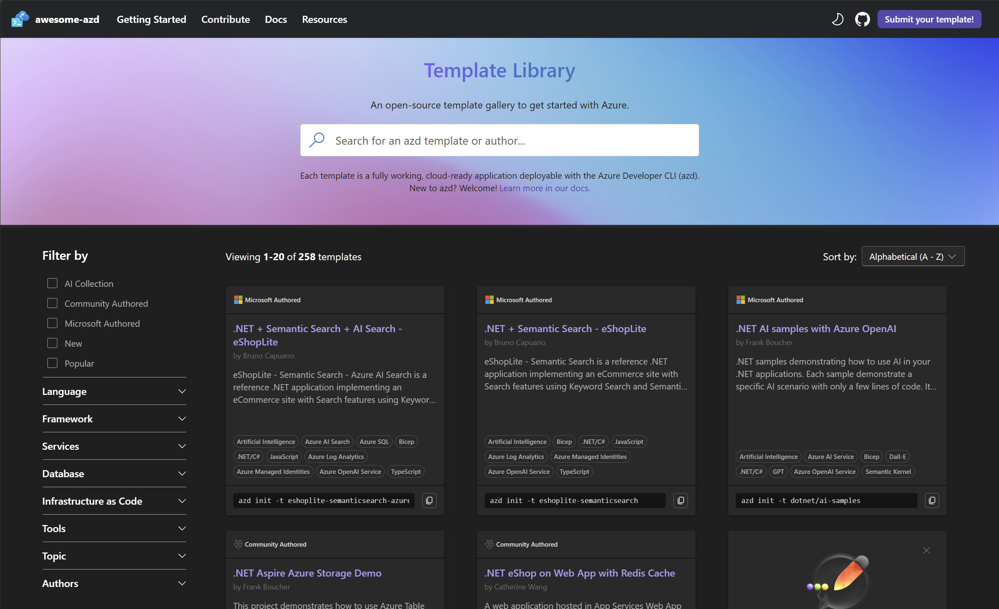
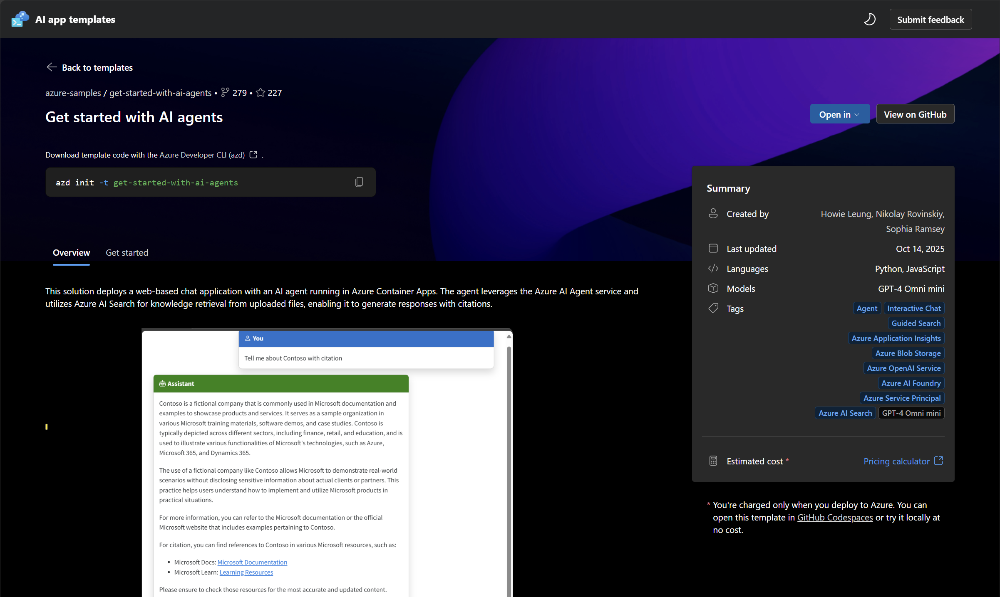

# 3. Discover: Galleries 

!!! quote ""

    **Objective:** Discover AZD template collections that you can explore interactively <br/>
    **Estimate:** 5 mins <br/>
    **Analogy:** [See Blueprint Galleries](0-Welcome.md#2-the-home-builder-analogy)

    - [Template Galleries](#template-galleries)
    - [Awesome-AZD Gallery](#awesome-azd-gallery)
    - [AI Templates Collection](#ai-templates-collection)
    - [Exercise: Browse Galleries](#exercise-browse-galleries)

---

## Template Galleries

We saw that the `azd template list` command has two limitations. By default it only shows templates from the _awesome-azd_ source which is community-created. And, it only gives us a brief text description that does not intuitively show us the architecture or capabilities.Template galleries provide a richer discovery experience that cam alleviate these issues. 

!!! quote ""

    Visit the [Awesome-azd](https://aka.ms/awesome-azd) gallery shown in the screenshot below and experience it for yourself.
    
Note the comprehensive set of filters for discovery - and the visual cards with tags and descriptions that provide more detailed context. Clicking on a card takes you to a details page that provides screenshots, quickstart instructions and more.




## AI Apps Templates

But it doesn't have the AI Agents Starter template we were thinking of! That's because AZD also allows _custom_ galleries to be maintained for curated sets of templates built and maintained by product teams or organizations. In our case, we want to use the AI Apps gallery from the Azure AI Foundry team - so let's visit that.

!!! quote ""

    Visit the [AI Apps Templates](https://ai.azure.com/templates) page in the Azure AI Foundry portal to see the collection in the screenshot below. You will need an Azure account to log in and view it.

You should see something like this - including that starter template we were looking for. Let's dive in and try to see how we can discover and use it!


 

## Exercise: Find AI Starter 

!!! lab "These exercises will use your web browser. Open a new tab and copy/paste URLs to navigate there"

### 1. Frpm Azure AI Foundry

1. If you are currently logged into Azure, visit the link below in your browser to see the same screenshot above.

    ```bash title="" linenums="0"
    https://ai.azure.com/templates
    ```

1. You can now see the "Get Started With AI Agents Template" with a **Basic** tag indicating it is a beginner-friendly starter template.

    - It describes the architecture that matches our requirements
    - It lists the features we want - OpenAI (models), Azure AI Search (RAG), Azure Container Apps (hosting), Azure AI Agent Service (agents).
    - It has a link to the GitHub repo for the template!

### 2. From AI Apps Gallery

If you are not logged into Azure, you can also use the AI Apps Gallery option maintained by the azd team.

1. Visit this URL in your browser:

    ```bash title="" linenums="0"
    https://aka.ms/ai-apps
    ```

1. You should see a gallery page like this with the same kind of filters that _awesome-azd_ provides. You can also search by name (e.g. "Getting Started With AI Agents") - but in this case we can already see it as a featured template.

    


1. Click the tile to view the details page. It should look something like this. You can now see both the architecture details and the initialization commands right - along with details on the services used and last-updated timestamp.

    

### 3. Using The Template

We need to visit the template repository and initialize it for use. We'll do this, next.

### 4. Ask Copilot For Help

This is an optional exercise. Ask Copilot to give you more insight into template galleries. Here are some seed prompts to try.

!!! prompt "ASK COPILOT"

    1. What's the difference between Awesome-AZD and the AI Template Gallery?
    1. How can I contribute my own template to the Awesome-AZD gallery?
    1. Are there templates for specific frameworks like LangChain or Semantic Kernel?

---

**Next:** Let's initialize that AI Agent template and prepare your project for deployment!

---