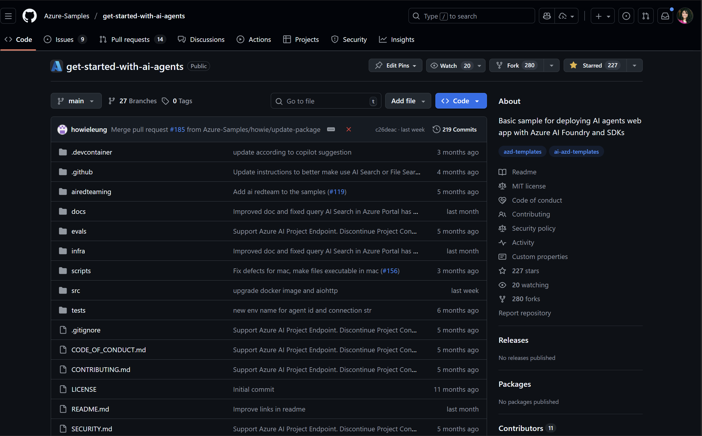

# 4. Discover: AI Starter 

!!! quote ""

    **Objective:** Select and initialize the AI Agent template for your project <br/>
    **Estimate:** 10 mins <br/>
    **Analogy:** [Select a PreFab Design](0-Welcome.md#2-the-home-builder-analogy)

    - [The AI Agent Template](#the-ai-agent-template)    - [The AI Agent Template](#the-ai-agent-template)
    - [What's Included](#whats-included)
    - [Architecture Overview](#architecture-overview)
    - [Exercise: Initialize Project](#exercise-initialize-project)

---

## The AI Agent Template

You browser the gallery and found the GitHub link to the desired template. Now it's time to _select our pre-fab home blueprint and get started on construction_. 

!!! quote ""
       Template name: `get-started-with-ai-agents`  
       Repository: [Azure-Samples/get-started-with-ai-agents](https://github.com/Azure-Samples/get-started-with-ai-agents)

Click the repo link - you should see something like this. The **Get Started with AI Agents** template is specifically designed for building production-ready AI agent applications on Azure AI Foundry, with all the essential features pre-wired and ready to customize.



## The Template README

Think of this as your homeowner's manual - it lists all the "utiltiies" you have available in the home, along with instructions on how to configure or activate various features as needed.


!!! quote ""

       Here are the features supported by this template - note that they check off most of our requirements for the customer support chat bot by default.

       - **Azure AI Foundry** - The foundation and framework (your lot and base structure)  
       - **Model Deployments** - GPT-4 and embeddings models (the smart appliances)  
       - **Sample Agent** - Pre-configured customer service agent (your home assistant system)  
       - **Web UI** - React-based chat interface (the touchscreen control panel)  
       - **RAG Setup** - Retrieval Augmented Generation with Azure AI Search (the knowledge library)  
       - **Container Apps** - Scalable hosting for your web app (the utilities and services)  
       - **Monitoring** - Application Insights for tracing (the security cameras and sensors)  
       - **Evaluation Tools** - Built-in quality assessment (the inspection checklist)  

## The Solution Architecture

Think of this as the blueprint or floor plan for the home, telling you what rooms (services) are available and how those pieces connect.


These are the resources that get provisioned for you when you run `azd up`. Let's see this in action in the following exercise!

## Exercise: Initialize Project

It's time to put your pre-fab home construction order in, and have the contractor take over!


!!! lab "In this exercise, you'll use `azd init` to initialize the AI Agent template in this repository and explore the project structure that gets created."


### 1. Create Template Folder

Open the VS Code terminal to the root of your repository and setup space to work:

```bash title="" linenums="0"
# Change directory
cd workshop

# Create a folder to host the template
mkdir .azd-setup

# Change directory to this location
cd .azd-setup
```

### 2. Initialize Template Here

Put the order in to have the pre-fab home built by calling the contractor and giving them the name of the design blueprint you want used.

```bash title="" linenums="0"
azd init --template get-started-with-ai-agents
```

### 3. Provide Environment Name

You will be prompted to provide an _environment name_. Think of this as the home address that identifies your specific home (solution deployment) within the bigger subdivision (Azure subscription). Use a name that has only lowercase letters and numbers.

The environment name maps into the resource group name on Azure. So the name below will result in the creation of a resource group called `rg-azd-for-beginners`

```bash title="" linenums="0"
? Enter a new environment name: azd-for-beginners
```

Within a few minutes you should see:

```bash title="" linenums="0"
SUCCESS: New project initialized!
```


### 5. What Just Happened?

List the files created (inspect your blueprint package):

```bash title="" linenums="0"
ls -la
```

You should see a project structure like this:

```
.azd-setup/
├── azure.yaml              # AZD configuration - tells azd what to build and deploy
├── infra/                  # Infrastructure code - defines your Azure resources (Bicep files)
├── src/                    # Your application code - the AI agent and web interface
├── .azure/                 # Environment settings - stores your configuration and secrets
├── evals/                  # Evaluation tools - tests to check your AI agent's quality
├── airedteaming/          # Red teaming tools - security and safety testing
├── docs/                   # Additional documentation - guides for customization
├── .devcontainer/         # Dev container setup - consistent development environment
├── README.md              # Project documentation - your getting started guide
└── docker-compose.yaml    # Local development setup - run everything locally
```

!!! tip "Understanding the Structure"
    
    Each folder serves a specific purpose in your AI agent project:

    • **azure.yaml**: This is your project's "master plan" that tells Azure Developer CLI which services to deploy and how they connect together.

    • **infra/**: Contains Bicep files that define all your Azure resources (AI Foundry, Container Apps, Storage, etc.) - like your building's architectural blueprints.

    • **src/**: Your actual Python application code lives here - the AI agent logic, web interface, and business logic.

    • **.azure/**: Stores your environment-specific settings and credentials - created when you initialized with your environment name.

    • **evals/**: Pre-built evaluation scripts to test your AI agent's responses for quality, accuracy, and safety.

    • **docs/**: Helpful guides for customization, deployment options, and troubleshooting - your extended manual.

### 6. Review the README

Open and read the README (familiarize yourself with your new home):

```bash title="" linenums="0"
cat README.md
```

It explains the architecture, prerequisites, and deployment steps - everything your "contractor" (azd) needs to know.

### 7. Ask Copilot For Help

Want to explore more? Try asking Copilot:

1. What does the `--template` flag do in `azd init`?
2. Can I rename my environment after initialization?
3. How do I customize the AI Agent template before deployment?

---

**Next:** Deploy this template to Azure and watch your contractor build your smart home!

---